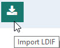

#  Chapter 2: OpenDJ, SunOne/Oracle ODSEE, Novell eDirectory, and RadiantOne v6 ACI Migration

This chapter describes the process of migrating OpenDJ, SunOne/Oracle ODSEE and RadiantOne v6 ACI to a format that is compatible with RadiantOne v7. The migration tool that performs these functions, aciUtils.bat (.sh on Unix systems), is located at <RLI_HOME>\bin\advanced. Parameters are written in a command line.

## RadiantOne v6 ACI Migration

With the expvds option, the utility searches RadiantOne for old ACI format and translates them into a format that is compatible with RadiantOne v7. Next, it creates the following LDIF files in the drive path indicated in the command. This option is recommended for scenarios where the server that contained the old-format ACI and the server that will contain the new-format ACI are different machines; however, this option can also be executed in scenarios where the server that contained the old-format ACI and the server that will contain the new-format ACI can be the same machine.

>**NOTE – To run this command, the RadiantOne service must be running.**

| LDIF File Name | Description
|---|----|
VdsAci | Describes the entries that store the translated ACI.
VdsBranch | Contains details of the ou=aggregate,ou=globalaci,cn=config branch in RadiantOne FID.
VdsDefaultRead | Contains a default ACI that grants read rights to anyone.

### Command Syntax

```
aciUtils.bat expvds <path>
```
### Example

In the following example, the utility generates the files described above in the folder “C://genldif”.

```
aciUtils.bat expvds C://genldif
```
## OpenDJ, SunOne/Oracle ODSEE ACI Migration

With the expod option, the utility searches an OpenDJ or SunOne/Oracle ODSEE server for ACIand exports them to LDIF. They are then directly added to RadiantOne (stored under ou=aggregate,ou=globalaci,cn=config).

In OpenDJ there are two types of ACI: classic and unique global ACI. This option generates the following LDIF files.

- openDJClassic.ldif – for classic ACI that are added as an attribute of the entry they
target.
- openDJGlobal.ldif – for global ACI which can target any entry on the server.

    >**NOTE – The RadiantOne service is NOT required to be running when this command is run.**

### Parameters

The expod option requires the following parameters, even if the values for some of those parameters are null. The utility expects to receive the parameters in the following order; verify the order of the parameters in your command when using this utility. To view sample aciUtils.bat commands using the expod option, refer to the [Examples of Use](#examples) section.

#### URL

This parameter indicates the URL of the targeted LDAP server. Examples:

```
ldap://localhost:
ldap://10.11.9.15:
```
#### Bind DN

This parameter indicates the bind DN used for authentication to the LDAP server.

#### Password

This parameter indicates the admin password used for authentication to LDAP Server.

#### Specific Base DN

This parameter specifies a base DN under which to look for ACI. Example:

```
dc=myCompany,dc=com
```
Only one Base DN value is allowed per command. If you want to specify multiple base DNs, the
aciUtil.bat command must be run multiple times.

If you are not otherwise specifying a value for this parameter, a value of null must be entered
for this parameter. If “Specific base DN” is set to null, the utility looks for ACI under every root
naming context.

#### Search for Global ACI

This parameter indicates whether the utility searches for global ACI. Options for this parameter include y and n.

#### Global ACI CN

This parameter indicates the CN used when adding the global ACI under ou=aggregate,ou=globalaci,cn=config. “Example:

```
cn=globalOpenDJ
```
Global Aci CN can be set to null if “Look for global Aci” was set to “n”, which means that no global ACI is retrieved from OpenDJ. Only one CN value is allowed per command. If you want to specify multiple base CNs, the aciUtil.bat command must be run multiple times. If you are not otherwise specifying a value for this parameter, a value of null must be used when passing the command.

#### Re-Mapping

This parameter indicates the mapping to use for transforming the ACI. If you are not otherwise specifying a value for this parameter, a value of null must be entered for this parameter when passing the command. If this parameter is set to null, no mapping is performed on the LDIF.

Multiple re-mapping values can be passed in a single command. Values in this parameter are separated by the hash character (#). For this reason, it is recommended that the # character not be used in ACI rule names.

In the following example, two re-mappings are performed. References to “myCompany” are replaced with “RadiantLogic”, and rules that were set to “allow” are re-mapped to “deny”.

```
myCompany-->RadiantLogic#allow-->deny
```
#### LDIF File Path

This parameter indicates the path to the folder where to write LDIF files. The value entered must be on the local machine. Example:

```
C://genldif
```
If running the expod command multiple times, the value entered for this parameter must vary for each execution of the command to avoid over-writing LDIF files previously created.

### Examples

This section contains examples of the expod command.

#### Example 1

In the following example, a local OpenDJ server is accessed, no “Specific base DN” is specified, the global ACI is not retrieved and so the “Global Aci CN” is not specified. No mapping is specified. It generates the files “openDJClassic.ldif” and “openDJGlobal.ldif” in the folder “C://genldif”.

```
aciUtils.bat expod ldap://localhost:389 "cn=directory manager" password null n null null C://genldif
```

#### Example 2

In the following example, a local OpenDJ server is accessed, the “Specific base DN” is ou=
myCompany,dc=example,dc=com, the utility retrieves the global ACI with “Global ACI CN”
equal to “global”. A mapping is used where all instances of “myCompany” are replaced by
“RadiantLogic”. It generates the files “openDJClassic.ldif” and “openDJGlobal.ldif” in the folder
“C://genldif”.

```
aciUtils.bat expod ldap://localhost:389 "cn=directory manager" password "ou=myCompany,dc=example,dc=com" y global myCompany-->RadiantLogic C://genldif
```
#### Example 3

In the following example, a remote OpenDJ server is accessed, the “Specific base DN” is myCompany,dc=example,dc=com, the utility retrieves the global ACI with “Global ACI CN” equal to “global”. Finally two mappings are specified; one replaces all instances of “myCompany” with “RadiantLogic”. The other mapping replaces all instances of “allow” with “deny”. It generates the files “openDJClassic.ldif” and “openDJGlobal.ldif” in the folder “C://genldif”.

```
aciUtils.bat expod ldap://10.1.2.3:389 "cn=directory manager" password "ou=myCompany,dc=example,dc=com" y global myCompany-->RadiantLogic#allow-->deny C://genldif
```
## Novell eDirectory ACI Migration

With the expedir option, the utility searches a Novell eDirectory server for ACI, converts them to RadiantOne format and stores them into an LDIF file. The LDIF file should be reviewed for accuracy to ensure the automatic translation is as expected. Finally, the LDIF file can be imported into RadiantOne.

### Parameters

The expedir option requires the following parameters.

**- b**
<br> This parameter specifies a base DN under which to look for ACI.

Only one Base DN value is allowed per command. If you want to specify multiple base DNs, the aciUtil.bat command must be run multiple times.

**- d**
<br> This parameter indicates the bind DN used for authentication to the LDAP server.

**- u**
<br> This parameter indicates the URL of the targeted LDAP server. Examples:

```
ldap://localhost:
ldap://10.11.9.15:
```
**- w**
<br> This parameter indicates the admin password used for authentication to LDAP Server.

### File Location

The output LDIF file location is <RLI_HOME>\vds_server\ldif\export. The file name is a concatenation of the value passed in the -b parameter (“=” are translated to “_”) and a date stamp. An example is o_radiant_2017- 04 - 18.ldif where o=radiant was the value passed for -b.

### Example

In the following example, a Novell eDirectory server (10.11.13.64) listening on port 2389 is accessed. O=radiant is the Base DN. The user and password used to connect to eDirectory are “cn=admin,ou=users,o=radiant” and “secret” respectively. This command generates <RLI_HOME>\vds_server\ldif\export\o_radiant_2017-04018.ldif.

```
aciUtils.bat expedir -b "o=radiant" -d "cn=admin,ou=users,o=radiant" -u "ldap://10.11.13.64:2389"
```
- w "secret"

After review, this file can be imported into RadiantOne. LDIF files can be imported from the Main Control Panel > Directory Browser tab using the option.
