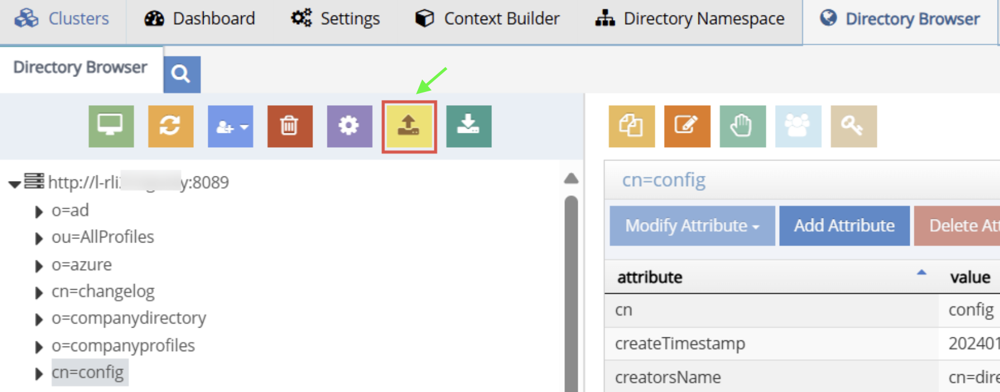
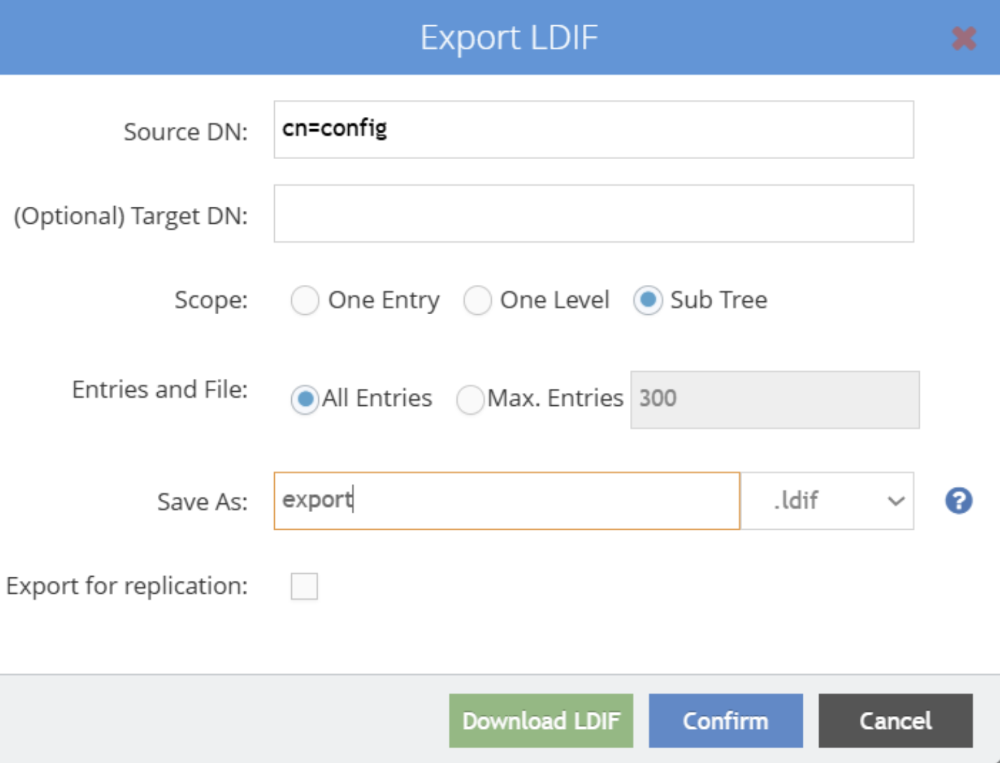
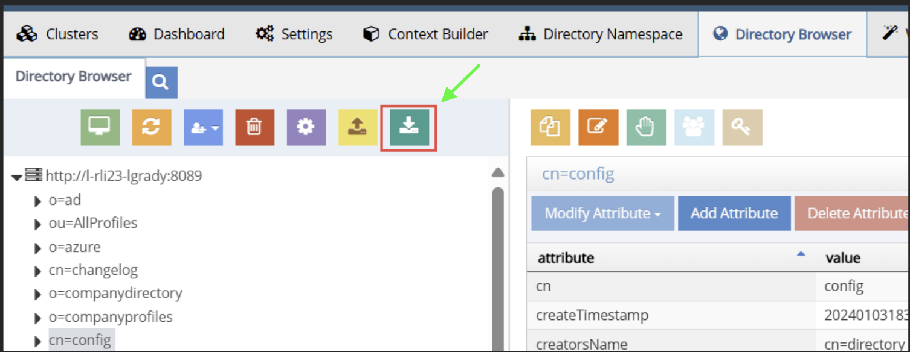
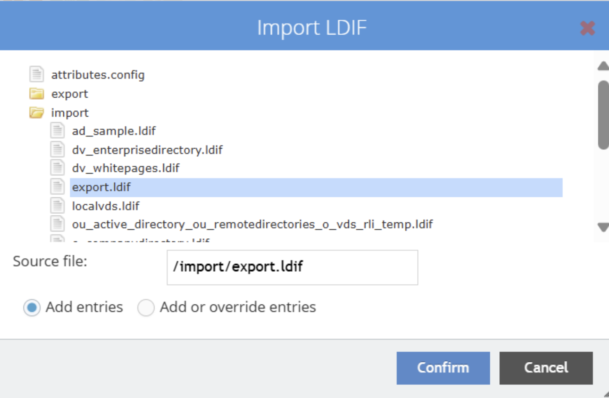

# Migrate Access Control Instructions (ACIs) in Bulk

This guide explains how to bulk export and import ACIs between two RadiantOne environments running version 7.4.

## Using the Control Panel

### Export ACIs from the Source Environment

1. Log in to your **source Identity Data Management** environment, where the ACIs you want to export are located.
2. Open **Directory Browser** and select the branch:  
   `cn=config,ou=globalaci`

   > **Tip:** To export only a subset, select a specific sub-branch under  
   > `ou=aggregate,ou=globalaci,cn=config`

3. Click **Export LDIF** (above the Namespace tree).
   
   

#### In the *Export LDIF* dialog:

- Leave **Target DN** blank.  
- Select **Sub Tree** for *Scope*.  
- Choose **All entries** under *Entries in file*.  
- Provide a file name in the **Save as** field.  
- Leave **Export for replication** unchecked.

  

4. Click **Download LDIF** to export the file.  
   The LDIF file is downloaded to the default location defined by your web browser.

5. Copy the exported file to the target environment directory:  
   `<RLI_HOME>\vds_server\ldif\import`

### Import ACIs into the Target Environment

1. Log in to your **target Identity Data Management** environment where you want to import the LDIF file.
2. Open **Directory Browser** and select the same branch used during export:  
   `ou=globalaci,cn=config`

3. Click **Import LDIF**.

   

#### In the *Import LDIF* dialog:

- Click **Import** to display the list of available LDIF files located in:  
  `<RLI_HOME>\vds_server\ldif\import`
- Select the exported LDIF file.
- Choose one of the following options:
  - **Add or override entries** (to update all ACIs)
  - **Add entries** (to only add new ACIs)

    

4. Click **Confirm** to start the import.  
   A task will run and display a confirmation once completed.

5. **Refresh the DIT** to view the updated ACI entries.
