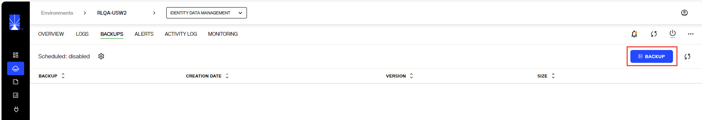

## Overview

This document describes how to apply a patch for RadiantOne v8.0.X.  
Although patches are applied in a rolling fashion and the RadiantOne service is continuously available, the recommendation is to apply updates during non-peak/off-hours.

## Preparing for the Patch

Prior to updating RadiantOne Identity Data Management, ensure you have a recent environment backup.

1. In Environment Operations Center, navigate to Environments > [EnviromentName] > BACKUPS tab.
1. If you do not have any recent backups, click **Backup**.
   
  

1. Enter a backup file name (there is a default auto-prefix) and click **SAVE**. This process takes a few minutes. Ensure the backup file shows in the list of backups before applying the RadiantOne Identity Data Management patch.

Scheduled backups can be enabled and configured by clicking the cog icon next to: Sheduled: [enabled/disabled]

## Applying the Patch 

1. In Environment Operations Center, navigate to Environments > [EnviromentName] > OVERVIEW tab.
1. In the Application Details section, click **UPDATE** next to the *VERSION*.
   
  

1. Select the version to update to from the drop-down list and click **UPDATE**. This version must be greater than the version currently installed.
1. Click **UPDATE** again to confirm. This is a rolling update of all RadiantOne Identity Data Management nodes which can take around 10 minutes to finish. 

## Release Notes

For the list of improvements and bug fixes related to the release, see: [Release Notes](../release-notes/iddm-8-0-0)

## Known Issues 

For known issues reported after the release, please see the Radiant Logic Knowledge Base: 

https://support.radiantlogic.com/hc/en-us/categories/4412501931540-Known-Issues  

## How to Report Problems and Provide Feedback 

Feedback and problems can be reported from the Support Center/Knowledge Base accessible from: https://support.radiantlogic.com  

If you do not have a user ID and password to access the site, please contact support@radiantlogic.com. 
