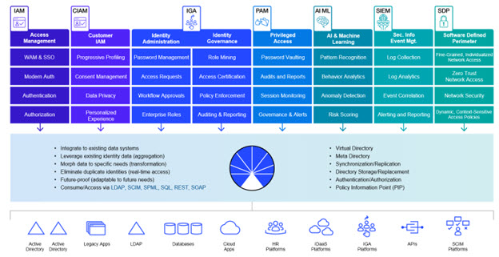
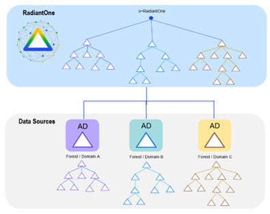

# Common Use Cases

RadiantOne is the platform for all identity-driven projects. Powering identity-driven projects with the right identity information introduces several critical integration hurdles that must be overcome prior to deployment. These hurdles have been discussed throughout this guide and are summarized below.

- Aggregating Identities: Authenticating users requires a set of usernames and passwords. Many organizations find that there is no single directory that has all that information, forcing companies to waste time recreating that information all over again, which means duplicated administrative effort or painful synchronization requirements.
- Integrating and Unifying Identities: Authorization services are based on policy, which evaluates a set of conditions and rules tied to the user's profile or group memberships. Not having complete profile or membership data means that administrators need to recreate that data in order for the policy to work.

The RadiantOne platform solves these challenges by leveraging data where it exists and provides services as needed, all without disrupting the existing data infrastructure.

Many enterprises face similar technical complexities that can be solved seamlessly with the RadiantOne platform. It comes equipped with a complete tool set making it easy for administrators to configure and solve many of the most common use cases. RadiantOne was designed to address identity integration challenges that range from mapping disparate systems to a common schema, to streamlining identities in fragmented data silos by consolidating them into one central access point for Identity and Access Management (IAM), Identity Governance and Administration (IGA), and other solutions that require an identity integration platform. A diagram depicting common use cases is shown below.

Figure 1: RadiantOne Platform and Use Cases

## Mergers and Acquisitions

One of the most common use cases for the RadiantOne platform is related to mergers and acquisitions.

Most enterprises have made large investments in their Active Directory infrastructures. More and more identity and security initiatives can benefit from the significant user and group information stored in Active Directory. However, many identity and security applications that have been written and/or customized to work specifically with LDAP directories like Oracle Directory (old Sun Java Directory) have a difficult time integrating with Active Directory. This is primarily due to the differences in schemas. These challenges are compounded when dealing with mergers and acquisitions where the number of Active Directory and LDAP Directory servers that applications must integrate with expands dramatically.

The RadiantOne platform allows applications that expect a specific LDAP Directory schema to leverage existing Active Directory identity and group information. Applications can query RadiantOne with the schema they expect and RadiantOne properly translates the requests to make them compatible with Active Directory. With this approach, applications can leverage Active Directory information without requiring time-consuming changes and customizations.

Figure 2: Object Class and Attribute Mapping Example

### Active Directory Integration

The RadiantOne platform helps you solve your authentication and security challenges while keeping your existing Active Directory (AD) infrastructure. Like most enterprises with Windows desktops, there is a good probability that your organization has made a significant investment in Active Directory. Now your users are asking why they can't use their AD ids and credentials to log in to all their applications within the enterprise. Your security team wants to take advantage of the group definitions that already exist in AD, and your Identity and Access Management (IAM) and Identity Governance and Administration (IGA) projects would like a single identity store while your existing infrastructure is comprised of multiple AD domains and forests, and legacy LDAP directories.

On the one hand, it would make sense to try and consolidate everything into a single Active Directory instance but there are valid historical and logistical reasons for having multiple forests and domains. The need to store additional attributes for application specific entitlements and profiles should also not be ignored. On some levels it makes sense to put all attributes into AD.

However, AD administrators will always remind you that Active Directory is first and foremost a NOS-based system, and extending the schema can have serious consequences on the core functionality that AD is designed to address. In addition, there is the issue of who owns the data and that certain requirements are better served through the functionality of an RDBMS, not AD.

With RadiantOne, you can leverage what you already have in AD without having to stretch AD into areas it wasn't designed for. The three most common scenarios for Active Directory integration are:

- Logically consolidating multiple AD Forests and Domains
- Schema Extensions
- Delegated Authentication

These scenarios are detailed below.

#### Consolidating multiple AD Forests and Domains

With RadiantOne, you can keep your existing AD forests and domains while still logically consolidating them into a single directory.

Figure 3: High Level Architecture Depicting Logical Consolidation of Multiple AD Forests and Domains

#### Schema extensions to Active Directory

RadiantOne allows application-specific objects and attributes to reside in other sources while
still providing a unified profile of the user.

Figure 4: Example Depicting a way to Avoid Schema Extensions in AD

#### Delegated Authentication to Active Directory

RadiantOne allows applications to leverage the existing ids and credentials by delegating the authentication requests to Active Directory.

Figure 5: Example Depicting Delegated Authentication to Active Directory