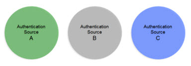
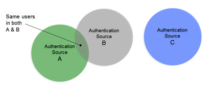
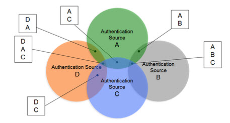
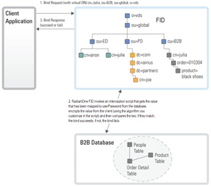
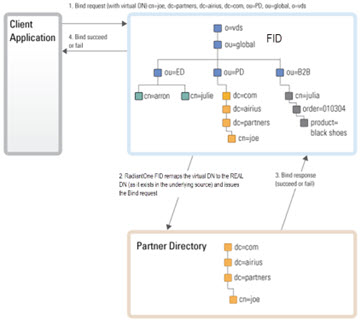
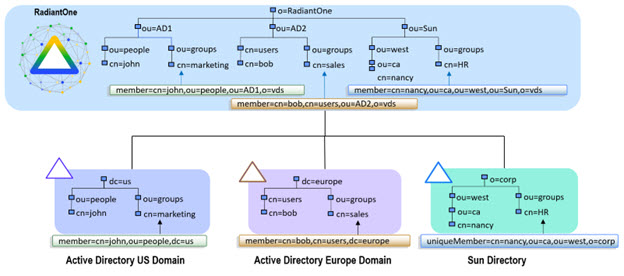

# Concepts

Three main concepts are developed in this section: Union, Authentication and Authorization. An understanding of these concepts is critical for designing a federated identity service.

## Union

Union is a well-known term in the RDBMS-world and the value of the union operation is key for any solid identity service. Union is essentially the ability to create a list where every user is listed once and only once, even if they appear multiple times in the data stores across the enterprise. User overlap can occur for several different reasons. There could be one user listed numerous times, or multiple users with the same name spread across disparate data silos. The result of a union is a unique list of users that is indexed for each system which enables fast and easy lookups. The reason this capability is critical for an identity service is because it makes the identification of a user more accurate and efficient.

For example, if you don’t have a single source of users, an application would have to look in all the different data stores across the enterprise to find a particular user. Even if a user is listed in only one store (unless that exact store is already known), an application still needs to locate them, resulting in multiple queries issued (at least one to each source the user could potentially be in). However, if you have a master index, the application only needs to query this list to locate a user, which will result in queries to only the backend stores where the user is located. The more sources involved, the more valuable this global index is. It is this global list that is created and maintained by RadiantOne. More details on the identification operation can be found in the [Authentication](#authentication) section.

In cases where the data stores contain user overlap, the RadiantOne Federated Identity (FID) performs aggregation and correlation, creating a common key to identify users across disparate systems. However, the union operation is still important for data sources that may or may not have identity intersection. If they do not have identity overlap there is no need for correlation, but the function of union is still crucial for building your identity service.

The diagrams below provide a summary/review of data sources containing duplicate/intersecting identities.

In the first scenario, the data sources have no overlap of identities. In this scenario the benefits of union would still be important for identity management since a single unique index/list is still required for applications to identify a user for authentication. However, the design effort is a bit easier as no correlation logic is required. An aggregation of sources A, B, and C is sufficient, so the primary design consideration in this case is what hierarchy applications are expecting and to build this namespace accordingly.

Figure 1: Data Sources with no overlapping identities

In cases where there starts to be user overlap (as seen in Sources A and B in the diagram below), the configuration requires correlation. In this scenario, an aggregation of users from sources A, B and C is required in addition to correlation for the overlapping users in sources A and B. The design considerations now involve correlation logic in addition to where you want the unique list of users to appear in the virtual tree.

Figure 2: Data Sources with some overlap of identities

In scenarios where the number of data sources increases, and the number of overlapping identities varies (as depicted in the diagram below), and the logic required to correlate identities becomes complex with the need for cascading rules to determine correlation. The union of identities is the basis for supporting authentication and authorization and is one of the most important capabilities of the RadiantOne Platform.

Figure 3: Complex Identity Unification Scenario

Now that the need for a union of identities has been addressed, it is time to dive into the role the master index list plays in authentication and authorization.

## Authentication

Organizations often have a variety of data sources housing identity information. These sources include directories, such as Microsoft Active Directory, Microsoft LDS, Novell eDirectory, and Oracle Directory (former Sun Java System Directory Server), along with some relational databases like Microsoft SQL Server and Oracle. Not only do the types of data sources vary, each represents identities differently. There are different access points, multiple protocols, diverse name spaces, and a variety of authentication protocols.

However, these same organizations have either deployed or are in the process of deploying many applications that expect a single authoritative directory for authentication. This leaves many enterprises to face complex synchronization efforts to bring all that data into a single directory. For most organizations this represents the first challenge of providing a centralized identity service. When identities are distributed, aggregation of the users becomes a challenge. Applications must be able to search for accounts and authenticate users across multiple directories & databases, as if it was a single logical directory service. RadiantOne makes it easy to federate access to these different, existing identity repositories, all centrally accessible but distributed to the security domains that own the identity information.

To fully understand the complexity of authentication, we need to examine the two internal stages of it, (1) identification and (2) credentials checking. By breaking authentication into these two parts, it is easier to examine the different integration problems and the solutions needed to solve them in a distributed environment.

### Identification

During authentication, the user provides an account name (login ID) and password. The application first must locate that account which requires a search against the directory (based on the unique login ID the user provided). This is known as the identification step. As mentioned, this presents a challenge because data structures each have their own way of
representing data, locating and addressing a record, and structuring it in a schema. Identities are described differently in each source (e.g. FirstName vs. fname vs. givenName) and often different object classes are present (e.g. InetOrgPerson vs. User).

RadiantOne makes multiple underlying data sources appear as a single logical directory service. This simplifies operations such as searching for entries and makes it possible to access all the identity information under a single namespace. See diagram below.

Figure 4: Identity Aggregation

By virtualizing the data sources, each identity profile can be aggregated into a common namespace and mapped to a common object class such as InetOrgPerson, or any other object class needed.

The type and structure of the underlying source is now irrelevant. RadiantOne FID handles all the data transformations and re-mapping necessary. Applications now have a single data source to search for all users across the organization.

In conclusion, the first step in the authentication process is identification of the user entry. After the identification phase, next comes the credential checking. This topic is discussed next.

### Credentials Checking

Once the user is located, the actual bind request can be addressed. This is known as credentials checking and it is the second step in the authentication process. Credentials checking is the process of verifying the presented credentials. Just as different repositories support different schemas and naming which posed a challenge during the identification phase, they also support different authentication mechanisms which are the challenge of the credentials checking step.

See diagram below.

Figure 5: Credentials Checking

Passwords may be hashed or encrypted and different schema elements may be used to store the user’s credentials (userPassword vs. unicodePwd). Internal user passwords may be in Active Directory, where external user credentials may be stored elsewhere (i.e. Sun Java Directory, Oracle Internet Directory, etc.).

Once a union is created and a search for the user is successful (see identification step in previous section), the credentials must be verified. Passwords (or other credentials) must also be translated and mapped to the correct underlying resource, taking in account differences in encryption methods. Depending on where the user identity resides, RadiantOne can either validate the credential itself (compare a hash) or redirect and translate the authentication request to other protocols and data sources. See diagram below.

Figure 6: Handling Credentials Checking

RadiantOne uses one of the following methods to perform the credentials checking:

**Performing the authentication locally:**
  This option can be implemented if the existing data uses a well-known operation to validate the password. For instance, if a password is stored in a Unix crypt hash function, or if the password field is in plain text, then RadiantOne can be customized to perform authentication by comparing the password received in the bind request against the virtual entry’s password attribute. Before the comparison is performed, a customized interception script can be invoked to hash or encrypt the password using the desired encryption mechanism and then RadiantOne FID will compare the encrypted value to what is stored in the password field in the virtual entry. See the diagram below depicting this example.

Figure 7: Authentication Process Example

>[!note]
>RadiantOne includes an interception/hook scripting mechanism that allows for defining custom logic needed to evaluate passwords.

**Delegating authentication:**
 The authentication request is rephrased into a bind request compatible with the underlying directory, properly routed to that directory for processing, and the authentication response is returned to RadiantOne which in turn responds with a bind pass or fail message to the application. This is the default functionality if the underlying data source is an LDAP directory. See the diagram below depicting this example.

Figure 8: Authentication Process Example

Whether RadiantOne performs a password comparison to check the credentials, or delegates the bind operation to an underlying LDAP directory, this all happens transparently to the client application. The comparison and/or mapping and rerouting of the bind request occurs behind-the-scenes. This makes it simple to consolidate multiple directory and database sources and accommodate many different types of authentication mechanism on the backend while offering a universal authentication mechanism for client applications.

**Summary**

To integrate identity data for authentication, you must examine both steps of the authentication process: identification and credential checking. Translation and mapping of the identities and credentials must be handled differently depending on the underlying data sources. This is the value of RadiantOne.

Since authentication is required by multiple applications, having a single identity service to authenticate against, (accessing multiple repositories), simplifies any new identity management initiative by reducing deployment time and costs. Applications only need to issue standard requests to RadiantOne, and receive the appropriate authentication response. This completes the discussion on the authentication process. The next topic is authorization.

## Authorization

There are essentially two main methods for an application to enforce authorization: checking group membership for a user and/or checking the value(s) of specific user attributes. Each
method is described in more details below.

### Groups-based Authorization

Groups are a way to manage and simplify administration and authorization policies. For applications that base their authorization policies on group membership, a single aggregation point can pose a bit of a challenge. This is because traditional LDAP groups are dependent upon the existing directory system in which they reside. Within each underlying directory server, group objects include an attribute containing a list of DN’s, that represent the members of that group. These are real DN’s that reference users based on the DIT, making them valid only within the data silo itself. Therefore, when creating a single aggregated directory namespace from multiple different existing directory structures, the automatic re-mapping of group memberships becomes critical. The diagram below depicts an example of group member re-mapping. Sample member DNs are shown for each underlying directory. In this example, the backend directories are aggregated in RadiantOne and the member DNs are automatically re-mapped to match the new namespace.

Figure 9: Example of Auto Re-mapping of Group Member DNs

In addition, sometimes the existing groups are not sufficient. A need to add new members into existing groups is required. However, since most LDAP directories enforce referential integrity for group members (the user DN must exist in the directory) it is difficult and often impossible to extend groups with new members. With RadiantOne, existing groups can be turned into virtual groups and therefore the members can be users from any other source integrated into the
virtual namespace. An example is depicted in the diagram below. Virtual groups are created, and the members are populated from different backend data stores.

Figure 10: Dynamic Group Example

### Attribute-based Authorization

As discussed in the previous section, some applications base their authorization policies on group memberships whereas others may implement authorization rules based on specific attribute values. If all the attributes an application needs to base authorization decisions on were contained in one data source, there is typically no problem of reaching this information. However, a more common scenario enterprises face is that the same identity exists in several directories and databases. This means that the attributes applications need are not neatly contained within one data source but spread across multiple sources. Herein lies the challenge that RadiantOne solves. Identity information from many different data sources must be merged/joined to present one complete enterprise entry for an individual so that proper policy decisions can be made by the application.

In more complex scenarios where a common identifier doesn’t exist, correlation logic can be defined. RadiantOne creates the global identifier and the unique list of identities and then leverages this index to join the common user accounts to build a complete global profile that applications can then base authorization on. More details on this capability can be found in the [Design Considerations](virtual-view-design.md#design-considerations) section.

### Related Material

[RadiantOne System Administration Guide](/documentation/sys-admin-guide/02-concepts) (following sections)

- [Joins](/documentation/sys-admin-guide/02-concepts)
- [Groups](/documentation/sys-admin-guide/02-concepts)