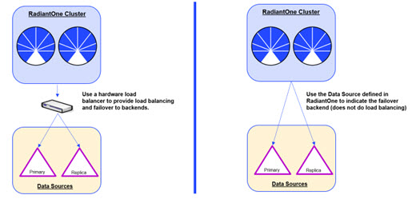

# High Availability and Performance

## High Availability and Fault Tolerance

The recommended approach to achieve high availability and fault tolerance is to deploy multiple RadiantOne nodes running in a cluster. Once the desired architecture is put in place, two additional layers must be addressed. These layers were introduced in the [Product Overview](radiantone-federated-identity-engine.md#overview) section in this guide and are known as the Application Layer and the Data Source Access Layer.

The sections below provide a brief introduction to the different architecture components and vocabulary for cluster architectures. For complete configuration details on deploying these architectures, please see the RadiantOne Deployment and Tuning Guide.

## Cluster Architectures

There are many advantages to deploying RadiantOne in a cluster, and different types of nodes are used. These are discussed in this section.

### Site

A site is defined by a local area network where connectivity is very good and runs at speeds of 1 gigabit or better. You can have one or more clusters deployed on a site.

## Architecture

A cluster must have at least two RadiantOne nodes and a ZooKeeper ensemble of at least three nodes. Best practice recommendation is to deploy an external ZooKeeper ensemble, however, for test environments, you can use ZooKeeper on the same servers as the RadiantOne nodes.

Within a multi-node cluster, there is always only one RadiantOne leader node at any given time and the rest are either follower (potential leader) nodes or follower-only nodes (installed on the same network as the core nodes for better throughput, but will never become leader).

A hardware load balancer is recommended to be placed in front of the RadiantOne nodes to distribute the client load and provide failover should one of the RadiantOne nodes become unavailable. These components are depicted in the diagram below.

Figure 1: Cluster Architecture

## ZooKeeper

One of the biggest advantages of deploying multiple RadiantOne nodes in a cluster is the sharing of configuration files. The cluster is managed by ZooKeeper which is a centralized service for maintaining configuration information. A configuration change made on any of the RadiantOne nodes in the cluster is automatically shared across all nodes. In addition, ZooKeeper manages the RadiantOne nodes in regards to which is the leader and which are the follower nodes. Should the RadiantOne leader node fail, one of the other core nodes will take over and register in ZooKeeper as the new leader. There is no “failback” in this process meaning that when the node that failed comes back online, it becomes a follower node (and is not automatically assigned the leader again).

The ZooKeeper service is deployed in an ensemble. The ZooKeeper ensemble cannot continue to work properly if half or more of its nodes are down or not reachable. This is the reason for a ZooKeeper ensemble to have a minimum of three nodes. This minimum architecture allows for the failure of one node without compromising the cluster. See the table below for more details.

Figure 2: ZooKeeper Nodes

When ZooKeeper loses contact with over half of the other ZooKeeper servers in the ensemble, it enters into a read-only mode. This allows RadiantOne to continue to process search operations even when the ZooKeeper quorum is lost. However, RadiantOne will deny any write operations by returning LDAP error code 53: Unwilling to Perform to the client. Also, no configuration changes can be made while ZooKeeper is in read-only mode. Administrators cannot login to the Control Panel during this time. If an administrator is logged into the Control Panel when ZooKeeper enters into read-only mode, a warning message appears at the top and no configuration changes are allowed.

Figure 3: Warning Indicating ZooKeeper Entered Read-only Mode

To recover from ZooKeeper read-only mode, make sure ZooKeeper is restarted on over half of the cluster nodes. Once the quorum is reestablished, the RadiantOne cluster recovers automatically.

## Universal Directory

The Universal Directory component in RadiantOne is the highly scalable, performant storage. This storage can be used as a replacement for existing directories (e.g. for identity integration/virtualization projects that also require an element of directory consolidation or migration) and is leveraged by RadiantOne Federated Identity (FID) as the default persistent cache storage and the default store for housing attribute-specific (“extension” attributes)/shadow accounts. Each RadiantOne node in a cluster contains a replica of the Universal Directory (HDAP) store and the advantage of clustering here is that block/physical replication is handled automatically across them and is much faster than traditional LDAP multi-master replication.

## Intra Cluster Block Replication

Within a cluster, block replication flows from the RadiantOne leader node to follower nodes. However, each node that may become the RadiantOne leader node can replicate Universal Directory (HDAP) store changes out to other nodes. If the node that receives a write request is not designated as the RadiantOne leader, it forwards the request to the designated leader node and then it becomes the responsibility of this node to replicate the change out to all follower nodes. This is depicted in the diagram below. For more details on this approach, see the
RadiantOne Deployment and Tuning Guide.

Figure 4: Intra-Cluster Replication

## Inter Cluster Logical Replication

Universal Directory (HDAP) stores deployed across more than one site/data center can participate in inter cluster logical replication. This supports multi-master replication where the current leader node in each cluster is responsible for accepting changes from other clusters. These changes will then be pushed out to other nodes within the cluster (block replication) as depicted in the diagram below. For more details on this approach, see the RadiantOne Deployment and Tuning Guide.

Figure 5: Inter Cluster Logical Replication

## Leader Node

Within a cluster, only one core node is designated by ZooKeeper to be the RadiantOne leader. All other nodes are either core follower nodes or follower-only nodes. If the leader node fails, one of the other core follower nodes will take over and register in ZooKeeper as the new RadiantOne leader.

## Follower Node

Within a cluster, follower nodes are core nodes that are available to become leaders should the currently designated RadiantOne leader node fails. One node, from the pool of core follower nodes, will register in ZooKeeper as the new leader. Follower nodes do not process write requests. If the node that receives a write request is not designated as the RadiantOne leader, it forwards the request to the designated leader node and then it becomes the responsibility of this node to replicate the change out to all follower nodes if applicable (e.g. if the Universal Directory stores are deployed).

## Follower-only Nodes

Within a cluster, follower-only nodes are not core nodes. They are special nodes that can never become a leader. They are a “lightweight” node that does not require the additional functions/features of a leader or follower node. These types of nodes are added to a cluster to handle client load and improve throughput and should be installed on the same network/data center as the core cluster nodes.

Follower-only nodes do not process write requests. If the follower-only node receives a write request, they forward the request to the designated RadiantOne leader node and then it becomes the responsibility of this node to replicate the change out to all follower nodes if applicable (e.g. if the Universal Directory stores are deployed).

Configuration changes affecting the cluster nodes are not allowed to be made from follower-only nodes. Also, if follower-only nodes lose the connection to the ZooKeeper leader they automatically shut down.

## Highly Scalable

Another advantage of deploying a cluster is that additional RadiantOne nodes can be added extremely fast (within minutes). Once you install RadiantOne on a new machine and indicate you want the server to join an existing cluster, the current configuration files and Universal Directory (HDAP) store data are applied to the new node and it quickly becomes operational.

### High Availability at the Application Layer

The Application Layer is the layer between the clients and the RadiantOne service. This layer is depicted below. Although only three nodes are represented in the cluster architecture below, additional nodes can be deployed with the load distributed accordingly to achieve high availability and desired throughput.

Figure 6: High Availability at the Application Layer

At the Application Layer, use an LDAP-aware hardware load balancer to distribute the requests to the cluster nodes.

>[!note]
>Some clients have the built-in capability to failover to multiple LDAP servers. This may remove the requirement to have a hardware load balancer.

### High Availability at the Data Source Access Layer

The Data Source Access Layer is the layer between the RadiantOne service and the backend
directories. This layer is depicted in the diagrams below.

Figure 7: Load Balancing/Failover to Backend Servers

If you require either load balancing and/or failover to the underlying directories, you can use a hardware load balancer between RadiantOne and the underlying directories (as depicted above). The data source configured in RadiantOne would point to the hardware load balancer and this middle layer would be configured with access to the required backend servers.

>[!note]
>If you only require failover to the back-end LDAP servers (no load balancing required), then you can use the built-in mechanism of the RadiantOne service for this. When configuring the LDAP data source, you can list the failover server for that specific back-end in the Failover Servers parameter. Multiple failover servers may be listed (if they are exact replicas of the primary server). In this scenario, a hardware load balancer is not required.

## Related Material

- RadiantOne System Administration Guide
- RadiantOne Deployment and Tuning Guide

## Performance

In addition to being able to quickly add another node to a cluster (to increase throughput), RadiantOne provides a number of performance-enhancing configurations that enable it to respond to operations quickly. Each is configurable so that it can be deployed with the best balance of performance, scalability, and data relevance. The secret of directory performance revolves around caching and RadiantOne offers two forms of caching to meet all deployment needs.

- Memory Cache
- Persistent Cache

Each form of caching is best suited for certain deployment scenarios. These scenarios are
briefly described in the diagram below.

Figure 8: Cache Criteria

Both forms of caching are easily configurable from the Main Control Panel and offer their own refresh mechanisms. Each type is described in more details below. The [Related Reading Material](#related-material) reference at the end of the section refers you to detailed documentation on how to configure and tune the different cache options.

## Memory Cache

In this approach, cached entries are stored solely in the RadiantOne service’s memory. In terms of implementation, this approach has the advantage of simplicity. However, in practice, this solution may present some potential issues depending on the use case. In most cases, memory cache works fine when the volume of entries and the complexity of the queries are modest. The greatest risks with a memory cache are seen when the query pattern is not predictable and the data set volume exceeds the size of memory. If the volatility of the underlying data store is high, and the volume of data is significant, then a memory cache with a time-to-live refresh strategy alone will be very difficult to put in place and will not guarantee an accurate “image” or will generate excessive refresh volume negating the advantages of the cache. As a result, providing guaranteed performance is difficult if not impossible. Moreover, as volume increases or when queries needed to build the virtual image are more complex, the latency incurred by accessing the underlying sources just to rebuild the memory cache after a cold restart becomes more and more problematic. As a consequence, memory cache provides performance improvements only in very specific cases as shown in the scenario diagrams above.

**Advantages**

- Simple to deploy.

**Disadvantages**

- Difficult to know what is in cache and not in cache at any specific time.
- Difficult to know what to pre-load/prime the cache with which causes many initial cache misses making it impossible to guarantee a certain level of performance.
- Time-to-Live Cache Refresh can generate a lot of un-needed refreshes (when no data has actually changed on the underlying sources).

- If the RadiantOne service crashes, memory cache is lost and must be populated again (either with a pre-load script or as the RadiantOne service processes requests) before required performance can be met.

Refresh Mechanisms

There are two refresh mechanisms available for memory caching.

- Time-to-live.
- Flush entire cache.

**Time-to-Live Refresh** – The time-to-live value is the amount of time that entries should remain in cache. After the time has been reached, the entry is removed from the cache. The next request for the entry will be sent to the underlying data store(s). The result of the request will then be stored in the memory cache again.

**Flush Entire Cache** – From the Main Control Panel -> Settings tab -> Server Front End section, Memory Cache section, you have the option to flush the entire memory cache. After flushing the entire cache, all queries sent to the RadiantOne service require the underlying data source(s) to be accessed. The RadiantOne service begins to populate the memory cache as it receives queries and retrieves data from the underlying source(s).

Since a memory cache is insufficient for some deployment scenarios, the RadiantOne service also offers a persistent caching mechanism. Details on this option are below.

## Persistent Cache

In this approach, the virtual entries are stored in the local RadiantOne Universal Directory. This approach doesn't make the cache dependent on memory size anymore and allows for fast recovery in case of failure. The whole virtual view could be cached and a large volume of entries can be supported (hundreds of millions of entries - essentially no practical limit if combined with partitioning/sharding and clusters). The persistent cache provides performance levels comparable to the fastest “traditional” LDAP directory and even better performance when it comes to modify operations.

Advantages

- The RadiantOne service can consistently offer a guaranteed level of performance even after failure/restart of the server (no memory to “prime”).
- Easy to know what information is in cache and what is not.
- Only delta changes trigger cache refreshes which eliminates the need for a random time-to-live interval that could generate unnecessary cache refreshes.

**Disadvantages**

- Initial import of all entries into the persistent cache store is required. Depending on the size of the data set, the initial import could take some time.

**Refresh Mechanisms**

There are three refresh mechanisms available for persistent caching.

- Automatic refresh for changes flowing through the RadiantOne service.
- Periodic refresh
- Real-time cache refresh

**Automatic refresh for changes flowing through RadiantOne** – after setting up a persistent cache, if the RadiantOne service receives a modification request, it sends the request to the appropriate underlying source(s) and if the modification is successful, the RadiantOne service automatically refreshes the persistent cache with the change.

**Periodic refresh** – A refresh of the persistent cache can be scheduled on a time-based interval (e.g. every 4 hours) or at specific defined times (e.g. 1:00 AM, 4:00 AM).

**Real-time cache refresh** – if the data in the underlying data sources changes frequently, there is an option of a real-time cache refresh. This option would involve connectors, which are components that pick-up changes that happen on the underlying sources and push them to update the cache image. Below is a high-level diagram of the components and details involved.

Figure 9: Real Time Cache Refresh
 