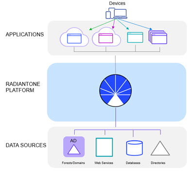

# RadiantOne Integration

## Overview

**Managing a Fragmented Infrastructure**

A widespread problem companies face today is the epidemic of identity information dispersed across a fragmented infrastructure. Mission-critical identity data is now stored across multiple LDAP, Active Directory, database and web applications, making user authentication and authorization increasingly difficult. The complex data architecture, often stored in legacy applications, needs to be updated to provide a central identity access point. These changes must be made slowly, as updating your entire identity infrastructure is costly, time consuming, and can open your infrastructure to security risks.

New identity data acquired through mergers and acquisitions quickly adds to the complex identity mix, intersecting with the existing identity data systems. This leads to identity intersection, where it becomes difficult to disambiguate users from one another. User data is spread across disparate identity systems, inaccessible to applications because they cannot connect to multiple sources or because the data is in a format/accessible through a protocol they cannot handle. You want to be able to extend access to all users in your infrastructure– no matter where, or in what manner, they are stored.

Figure 1: Identity Sources Tightly Coupled to Applications

When identity sources contain overlapping identities, not only does the integration effort become more complex, but the need for joining data from multiple heterogeneous sources is required.

More joining means more queries to underlying data sources, which consumes power and results in slower performance. Situations like this make a persistent cache invaluable for reaching the required performance.

In addition to having many data sources and huge volumes of overlapping entries, large organizations typically deploy many applications to provide services to a variety of users, including employees, customers, partners, and suppliers—both inside and outside of the firewall. Serving the data requirements of these multiple applications and diverse users is often an integration headache for identity architects. The challenge of presenting different views— sometimes hierarchical, and sometimes flat—of the existing data sets/structures to the appropriate applications far surpasses the capabilities of a simple LDAP proxy.

Enterprises must work to preserve their investments in the existing data infrastructure while gathering information from multiple repositories to present a clear, single access point of identity information for requesting applications. They must integrate identity information swiftly and securely, all while translating the information through different languages and protocols. The RadiantOne platform includes all the capabilities necessary to inventory existing data sources, and offer model-driven, unique views to the varying needs of each individual application.

**The RadiantOne Identity Data Platform**

The solution is the RadiantOne Platform that acts as a hub capable of delivering the data from all your identity silos to each application in the way it understands. Building the hub requires a set of features that are complex to manage without a guided process. RadiantOne offers a set of tools which walk the user through implementing best practice of these advanced features.

Figure 2: RadiantOne Federated Identity Hub/Service

RadiantOne Federated Identity aggregates, integrates, and translates data from across the identity infrastructure, into a single access point for applications. Through virtualization and join, RadiantOne seamlessly builds global profiles by extracting the schemas from each local data source and builds the new view (in a flat or hierarchical form) where identities and attributes are remapped and virtualized. The custom views can be created by the use of the tools that are described in [Getting Started with RadiantOne](getting-started-with-radiantone.md).

With a virtualized central access point, authentication and authorization decisions are made simple. Credentials checking can be handled by the RadiantOne directly against a local store or persistent cache, or delegated to the underlying data sources. Fine-grained authorization is achieved by quick access to all user attributes in the data silos. This allows RadiantOne to feed your applications the required user attributes from a variety of identity stores via a standards-based protocol, so they can perform richer, attribute-based authorization based on a more complete identity picture. Also, for applications that leverage groups-based authorization, RadiantOne offers flexible group definitions by aggregating, mapping and migrating existing groups into the RadiantOne platform, or allowing you to dynamically create new groups based on a select set of criteria.

**The Union Challenge**

At the core of RadiantOne Platform is the ability to make a union set of identities, to make identification of users more accurate and efficient. Union is the ability to create a global list where each user is represented once and only once, even if they have multiple accounts spread across the identity infrastructure.

To create a global list without duplicate identities, you need to correlate and disambiguate the identities. Union requires some kind of criteria, one or more attributes, to detect and correlate same-users across systems. This is the common, global identifier. A match based on this attribute(s) allows the RadiantOne service to consolidate duplicates. The result is a “union compatible” operation, where all users are represented exactly once, and only once, in the virtualized global list. Correlating same-users across various data sources enables the creation of a global profile. The global profile maintains links to local accounts, to pull in attributes from them, for a complete 360-degree view of users.

**How RadiantOne Solves the Union Challenge**

The Global Identity Builder makes it easy to create a union of all users in your identity infrastructure, which is used as a reference list for authentication and authorization. The tool guides you through the process of correlating (detecting) same-user accounts across identity silos, so that there are no duplicate identities in the final list.

The profiles in this list have pointers back to the identity’s accounts across data sources. This means that attributes can be pulled from the original identity sources to create a rich global profile to be used for authentication and authorization. You can find more details on the union process in the Concepts section found [here](concepts.md).

## RadiantOne Feature Overview

RadiantOne accepts requests submitted by applications using LDAP or Web Services:
SCIMv2 and REST. These requests are then routed, mapped, transformed by the engine, and forwarded to the underlying data sources. The results are gathered, normalized, filtered, and returned to the requesting application.

RadiantOne is a full-service platform that comes complete with many tools that makes identity integration seamless. You can find additional information on these tools in [Getting Started with RadiantOne](getting-started-with-radiantone.md).

As a bonus, the RadiantOne platform also offers a local storage that can be used for purposes such as:

- Storage of Global Groups
- Create new groups that include members from multiple data sources being aggregated
by the RadiantOne service.
- Storage of application-specific attributes that don’t currently exist when deploying new applications, often they require storage of very specific attributes. Instead of having to extend your existing directory schemas to accommodate these, you can use the RadiantOne Universal Directory store.
- Legacy LDAP Directory Replacement
 If your identity integration/virtualization project involves a need for LDAP directory consolidation/migration, the RadiantOne Universal Directory provides the storage and temporary synchronization mechanisms to provide you with a flexible, scalable alternative that allows you to migrate your applications at your own pace.

### Logical Architecture

Figure 3: RadiantOne Logical Architecture

The logical model is based on three primary layers.

**Application Layer**

The application layer is the interface between applications and the RadiantOne Platform. Applications query RadiantOne using LDAP, SCIMv2 or REST and expect standard directory responses in return. The applications are not aware of the complexity or number of data sources they are receiving data from. To them, RadiantOne represents the single data source where all of the information they require resides. For claims-aware applications, RadiantOne CFS (or any federated identity provider) handles the different authentication methods and the token translation. RadiantOne is used as the information point to identify users and retrieve profile attributes to augment claims. For more details RadiantOne CFS, please see [RadiantOne CFS Guide](/documentation/cfs/01-getting-started).

**RadiantOne Platform**

The second layer of the logical architecture is the RadiantOne Platform. This is the layer that transforms the existing data into the virtual views that match the requests from the applications. Two of the most important aspects of this layer are the mapping/transformation capabilities and
the flexibility of namespace design.

**Organization of the virtual namespace.**

How directory views (a tree) are created out of existing data sources.

How different directory views coming from the same or different data sources can be linked together to form a federated namespace.

Common representation and first level of mapping existing data sources.

How each data source is mapped into a common metadata representation.

The layer provides data handling services and facilitates the flow of data between the application and the data sources.

**Data Sources Layer**

Communication between RadiantOne and the existing data sources is done at the Data Source Layer. Operations driven by the business logic of the virtualization layer are translated to operate natively on the data source.

For example, LDAP cannot be used (natively) to query information in a database. Using RadiantOne, an LDAP query is remapped into a SQL query, a connection is established with the database, and the results are remapped back into LDAP (at the virtualization layer).

When using RadiantOne with other directory services, it routes LDAP requests back to other directory sources, as well as performs translation of the directory request into one suitable for the local directory structure.

Data sources accessible by RadiantOne are:

- Directory services via LDAP/JNDI.
- Databases via JDBC and ODBC.
- Web Service access through REST/SCIM.

Figure 4: Access to Backends
