# Installation

Radiant Logic offers AWS Cloud Formation templates for the following types of RadiantOne architectures:

- Single server
- 2 node cluster
- 3 node cluster
- 5 node cluster

All templates use Amazon Linux 2 (preferred as it is well integrated in the AWS platform and maintained by Amazon), Red Hat Enterprise Linux v7.6+ and v8.2+, CentOS v8 (not available in government data centers), or Windows Server 2016 as the host operating system. The templates can be used for new deployments or adding clusters to an existing deployment. Each option is summarized below.

- [New Deployment](#new-deployment) – A new environment is configured in either an existing VPC or a new VPC can be created.
- [Extend Existing Deployment](#extend-existing-deployment) – Allows you to install additional clusters in an existing environment.

## New Deployment

All templates install and configure one [Amazon Elastic Load Balancer](#elastic-load-balancer) (ELB) per deployment/environment and 1 or 3 [Bastion](#bastion) servers for secure and highly available administrative access. A high-level diagram for a 3 node RadiantOne cluster deployment, with a 3 server ZooKeeper ensemble is shown below.

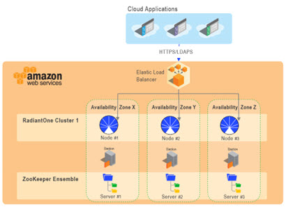

If installing a multi-node RadiantOne cluster, one node is installed per availability zone. This is to ensure High Availability (HA) of the RadiantOne cluster in case of a zone outage. If a 5-node cluster is installed, the nodes are spread across three zones where some will house more than one cluster node.

The templates require 1 VPC per environment (can use an existing one or a new one will be created), 1 or 3 t3.small instances for the bastion/remote desktop gateway servers, up to 5 instances per RadiantOne cluster, and up to 5 m5.large instances for the Zookeeper ensemble.

>[!warning]
>Check your Amazon VPC limits to ensure you have the resources available. Otherwise, the RadiantOne installation will fail.

https://docs.aws.amazon.com/AmazonVPC/latest/UserGuide/amazon-vpc-limits.html

To install RadiantOne in AWS follow the steps below.

1. Log into AWS with your administrator account in the region you want to install RadiantOne. This user should have permission to create instances, configure VPN, subnets, load balancers, logs and access s3.

>[!note]
>At this time, no international regions are supported. The following regions are supported:
us-east- 1
us-east- 2
us-west- 2
eu-central- 1
us-gov-west-1 (CentOS not available in this data center)
us-gov-east-1 (CentOS not available in this data center)

2. Click on the user name in the header and select My Account. Record the Account ID located under Account Settings. Provide this ID to your Radiant Logic account representative. Your Account ID is used to authorize access to the template.

>[!note]
>To obtain your account ID using an alternate method, from the Support menu in the header, select Support Center. The account number is located just below the header.

3. Navigate to EC2 dashboard > Network & Security > Key Pairs section.

4. Click **Create Key Pair**. This process creates a .pem file that will be used later to connect securely to the bastion hosts via SSH.

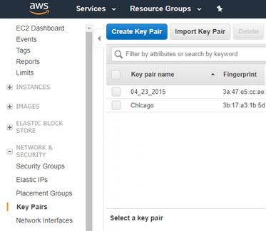

5. Enter in a key pair name and click Create. Download the .pem file and copy it to the client machine where you will be connecting to the bastion hosts from.

6. (Optional) If you plan on installing on CentOS, navigate to
https://aws.amazon.com/marketplace/pp?sku=aw0evgkw8e5c1q413zgy5pjce and click Continue to Suscribe. Otherwise, continue with the steps below.

7. In the AWS Management Console select CloudFormation in the Services menu.

8. Click **Create Stack**.

9.  Select the Amazon S3 URL option.

10.  Enter the Amazon S3 URL matching the architecture you’ve purchased a license for. The options are: 1 RadiantOne server, a 3-node cluster, or a 5-node cluster. For U.S. Government data centers see here.

| No. of Servers | Template URL | 
|------------|------------|
| 1 server | https://s3.amazonaws.com/radiantlogic-us-west-1/fid-3.0/templates/radiantOneFullDeployment1N.yaml^ | 
| 2 - node cluster | https://s3.amazonaws.com/radiantlogic-us-west-1/fid-3.0/templates/radiantOneFullDeployment2N.yaml^ | 
| 3 - node cluster |  https://s3.amazonaws.com/radiantlogic-us-west-1/fid-3.0/templates/radiantOneFullDeployment3N.yaml^ | 
| 5 - node cluster |  https://s3.amazonaws.com/radiantlogic-us-west-1/fid-3.0/templates/radiantOneFullDeployment5N.yaml | 

U.S. Government URLs:

| No. of Servers | Template URL | 
|------------|------------|
| 1 server | https://s3-us-gov-west-1.amazonaws.com/radiantlogic-us-gov-west-1/fid-3.0/templates/radiantOneFullDeployment1N.yaml
| 2 - node cluster | https://s3-us-gov-west-1.amazonaws.com/radiantlogic-us-gov-west-1/fid-3.0/templates/radiantOneFullDeployment2N.yaml
| 3 - node cluster | https://s3-us-gov-west-1.amazonaws.com/radiantlogic-us-gov-west-1/fid-3.0/templates/radiantOneFullDeployment3N.yaml
| 5 - node cluster |  https://s3-us-gov-west-1.amazonaws.com/radiantlogic-us-gov-west-1/fid-3.0/templates/radiantOneFullDeployment5N.yaml | 

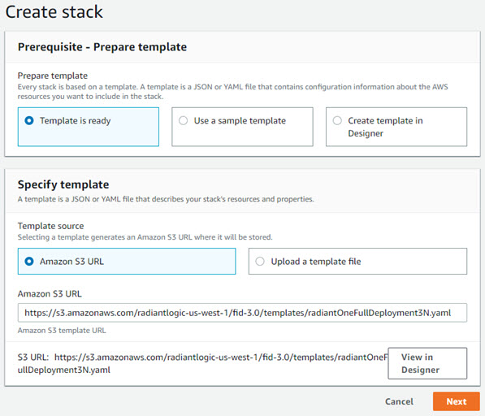

11.  Click **Next**.

12.  Enter a unique Stack Name.

13.  Enter a unique Environment Name. All clusters installed in the same environment share the same ZooKeeper ensemble.

14.  Select the Key Pair you configured above.

15.  Enter an administration location. This is the IP CIDR from which you must connect to the bastion server. The default value is 0.0.0.0/0.

>[!warning]
>The default value allows connection from any IP address. For this reason, it is strongly recommended that you modify this value.

16. Either enter an existing VPC ID or leave this value blank and the template creates a new one. If you use an existing VPC, the template adds security groups and three subnets.

17. Select a VPC IP range. This is the IP address range to be used for the AWS VPC (e.g. 10.0.0.0/16).

18. Select an operating system from the drop-down menu.

19. Select the number of bastion instances you want in your deployment from the drop-down menu (1 or 3). If you select 3, each bastion is deployed in a dedicated Availability Zone.

20. Select the number of nodes you want in your ZooKeeper ensemble from the drop-down menu (1, 3 or 5).

21. Enter the ZooKeeper Administrator password.

22. Enter the name of the RadiantOne cluster.
23. Select a RadiantOne version (e.g. 7.3.5) from the drop-down menu.

24. Select the sizing tier applicable to your RadiantOne deployment. The tier selected corresponds to an AWS instance type and disk volume as outlined in the table below.

| Sizing | Amazon Instance Type | Approximate # of user entries | 
|------------|------------|--------| 
| Tier 1 | m5.xlarge (4 vCPU 16GB RAM), 400 GB storage with Disk Speed^ of 200 MB/s | 1 Million | 
| Tier 2 | m5.2xlarge (8 vCPU 32GB RAM), 500 GB storage with Disk Speed of 250 MB/s | 10 Million | 
| Tier 3 | m5.4xlarge (16 vCPU 64GB RAM), 600 GB storage with Disk Speed of 300 MB/s | 30 Million
| Tier 4 | r5.4xlarge (16 vCPU 128GB RAM), 700 GB storage with Disk Speed of 350 MB/s | 60 Million
| Tier 5 | m5.12xlarge (48 vCPU 192GB RAM), 700 GB storage with 350 MB/s 100 Million

25.  Enter the LDAPS port for the RadiantOne service to accept client requests on. This is also the LDAPS port configured in the Elastic Load Balancer. All client requests go through the Elastic Load Balancer on the LDAPS port (or HTTPS port mentioned in the next step). The non-SSL LDAP port is not configurable in the template and defaults to 2389. There is no external access allowed to the RadiantOne service on the non-SSL LDAP port.

The templates install self-signed SSL/TLS certificates based on the internal server name that AWS assigns to each node. You can update the environment with CA-signed certificates after the install.

26.  Enter the HTTPS port for the RadiantOne service to accept client requests on. This is also the HTTPS port configured in the Elastic Load Balancer. All client requests go through the Elastic Load Balancer on the HTTPS port (or LDAPS port mentioned in the previous step). The non-SSL HTTP port is not configurable in the template and defaults to 8089. There is no external access allowed to the RadiantOne service on the non-SSL HTTP port.
27.  In the Directory Manager field, enter the administrator account name (e.g. cn=directory
    manager).
28.  Enter a password to use for the Directory Manager account. This value can be changed after the install.
29.  Enter your unique RadiantOne license key for each cluster node. Each node must have its own license key unless you received a cluster-based license key. If you have a  cluster-based license key, the same license key can be used for all cluster nodes. Check with your Radiant Logic representative if you are not sure what kind of license you received.

>[!note]
>The license key starts with braces (e.g. {xxxx}xxxx....).

30. Click **Next**.

31. (Optional) Enter Tags (key/value pairs), Permissions (the default permissions are associated with the account used to create the stack), Rollback Triggers (monitoring the state of your application during stack creation) and any advanced items you need.

32. Click **Next**.

33. Review the parameters and check the Acknowledgement at the bottom.

34. Click **Create**.

#### AWS Instances

After the stack is created, you can view information about the instances. The description indicates if it is a RadiantOne instance, a Bastion instance, a ZooKeeper instance, or Elastic Load Balancer (ELB).

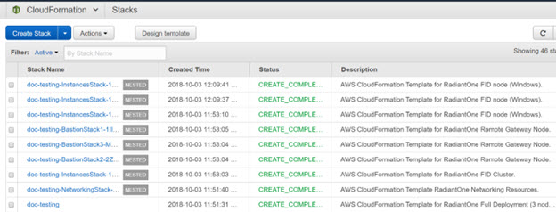

#### Ports Opened By Stack Creation Process

The following ports are opened when the stack is created.

- The Amazon Elastic Load Balancer is externally accessible on ports LDAPS (1636 by default) and HTTPS (8090 by default), the CIDR IP is 0.0.0.0/0. These ports are configurable in the stack parameters.

    >[!warning]
    >You can restrict access to the ELB by updating the applicable inbound rules for your security group.

- Amazon EC2 Instances can communicate in between each other on any port.
- On Linux, the bastion is accessible on port 22 (SSH) from the CIDR IP provided in the parameter Administration Location of the Cloud Formation Stack.
- On Windows, the Remote Desktop Gateway is equivalent to the bastion server and it is accessible on port 443 (HTTPS) from the CIDR IP provided in the parameter Administration Location of the Cloud Formation Stack.

>[!warning]
>There is a temporary port 3389 (RDP) opened but must be removed manually in post deployment.

#### Elastic Load Balancer

Amazon’s Elastic Load Balancing (ELB) automatically scales its request handling capacity to meet the demands of application traffic. Additionally, Elastic Load Balancing offers integration with Auto Scaling to ensure that you have back-end capacity to meet varying levels of traffic levels without requiring manual intervention. The RadiantOne templates install one ELB. Client applications should query the ELB to reach the RadiantOne service. ELB distributes client load across RadiantOne cluster nodes.

>[!warning]
>There can be periods in which your load balancer will return an HTTP 503 error when it cannot handle any more requests. The load balancers do not try to queue all requests, so if they are at capacity, additional requests will fail. If traffic grows over time, then this behavior works well, but in the case of significant spikes in traffic or in certain load testing scenarios, the traffic may be sent to your load balancer at a rate that increases faster than Elastic Load Balancing can scale to meet it. There are two options for addressing this situation: 1) Pre Warming the Load Balancer or using a 2) Controlled Increase in Load Traffic. For more details see: https://aws.amazon.com/articles/best-practices-in-evaluating-elastic-load-balancing/#pre-warming

To view the settings for the ELB configured, from Cloud Formation, click on the Stack Name link. In the Resources section, locate the PublicElasticLoadBalancer Logical ID and click the Physical ID link.

On the Description tab in the Basic Configuration section, you can see the DNS Name for the ELB. This is what client applications should point to, to access the RadiantOne service.

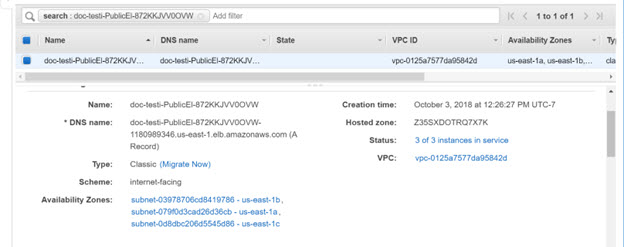

Some of the features of ELB are:

- High Availability - You can distribute incoming traffic across your RadiantOne nodes in a single Availability Zone or multiple Availability Zones. ELB automatically scales its
request handling capacity in response to incoming application traffic.
- Health Checks – ELB can detect the health of the RadiantOne nodes. When it detects unhealthy RadiantOne node, it no longer routes traffic to those nodes and spreads the
load across the remaining healthy nodes.
- Security Features - When using Virtual Private Cloud (VPC), you can create and manage security groups associated with ELB to provide additional networking and security options. You can also create a load balancer without public IP addresses to
serve as an internal (non-internet-facing) load balancer.
- IPv6 Support - ELB supports the use of both the Internet Protocol version 4 and 6 (IPv4 and IPv6). IPv6 support is currently unavailable for use in VPC.
- SSL Passthrough – When installing RadiantOne using the Radiant Logic Cloud Formation template, ELB is configured for SSL pass through. RadiantOne is the certificate endpoint allowing client application requests to pass through the ELB layer untouched. This allows RadiantOne to support mutual authentication and client authentication via certificates/PIV cards.
- Layer 4 or Layer 7 Load Balancing - You can load balance HTTP/HTTPS applications and use layer 7-specific features, such as X-Forwarded and sticky sessions. You can also use strict layer 4 load balancing for applications that rely purely on the TCP
protocol.
- Operational Monitoring - ELB metrics such as request count and request latency are reported by Amazon CloudWatch.
- Logging- Use the Access Logs feature to record all requests sent to your load balancer, and stores the logs in Amazon S3 for later analysis. The logs are useful for diagnosing application failures and analyzing web traffic. You can use AWS CloudTrail to record Elastic Load Balancing API calls for your account and deliver log files. The API call history enables you to perform security analysis, resource change tracking, and compliance auditing.

#### Bastion Server

A bastion is a special purpose server instance that is designed to be the primary access point from the Internet and acts as a proxy to your other EC2 instances. The bastion server runs on a t3.small AWS instance.

When configuring your security groups, it’s a best practice to apply the principle of least privilege, allowing only connections to the SSL port from IP addresses your administrators will be connecting from and denying all others. The default bastion instance is configured with a security group that is configured to listen only on the SSH port (TCP port 22) and allow connections only from known and trusted IP addresses.

To view the settings for the bastion servers configured, go to Instances and select the “...Bastion Node...” instance for your stack.

On the Description tab you can see the Private DNS, Private IP, Public DNS, and Public IP.

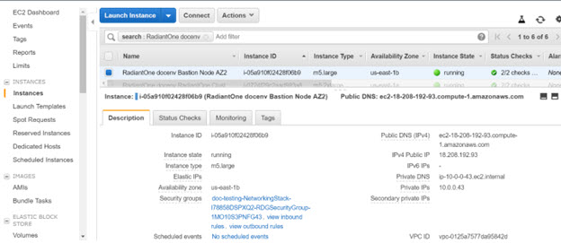

#### Post-Deployment Tasks (Windows Server Only)

Perform the following instructions to complete the configuration of your AWS environment. The steps describe how to retrieve the root certificate from the Remote Desktop Gateway machine to enable a secure connection from a local Windows machine, allowing you to connect to and manage a RadiantOne node.

>[!warning]
>Each RadiantOne instance and each Remote Desktop Gateway has a different Administrator user password. You must know the password of the instance you want to connect to.

1. To get the server certificate, connect to your AWS portal EC2 dashboard and locate the IP address of the Remote Desktop Gateway instance. From the EC2 Dashboard, you can see your running instances. Select the instance ID associated with the bastion (remote desktop gateway) server and click **Connect**.

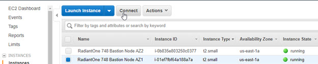

>[!note]
>You can locate the instance ID in the stack details.

2. Take note of the Public DNS (you need this later in step 6) and click **Get Password**. 

3. Choose your private key (.pem file) associated with the security key you established during the [installation](installation.md) and click Decrypt Password to see the password for the Administrator. Take note of this value as you need this later in later in step 6.

4. Repeat steps 1-3 for each RadiantOne instance that you want to connect to. You need this later when you establish a [remote desktop session](radiantone-configuration.md#radiantone-nodes-running-on-windows) to manage RadiantOne.

5. Click **Close**.

6. From your local Windows machine, Remote Desktop to the Remote Desktop Gateway machine with the Administrator account and the password from step 3.

7. The root certificate is stored as c:\servername.cer on the remote desktop gateway. Save this certificate to your local machine.

8. From your local machine, run a command prompt as an administrator.

9. Type mmc and press Enter.

10. Click **Yes** in the User Account Control box.

11. From the menu bar, select File > Add/Remove Snap In. The Add or Remove Snap-ins box opens.

12. In the Available Snap-ins table, choose Certificates, and then click **Add**.

13. In the Certificates snap-in dialog box, choose Computer account, and then choose **Next**.

14. In the Select Computer dialog box, keep the defaults and click **Finish**.

15. In the Add Standalone Snap-in dialog box, click **OK**.

16. In the Console Root window, expand Certificates (Local Computer).

17. Under Certificates (Local Computer), expand Trusted Root Certification Authorities.

18. Under Trusted Root Certification Authorities, right-click Certificates, and choose All Tasks > Import.

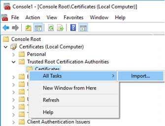

19. Click **Next**.

20. Click **Browse**.

21. Navigate to the root certificate that you downloaded from the Remote Desktop Gateway and click **Open**.

22. Click **Next**.

23. Verify that the Place all certificates in the following store option is select, and that the value in the Certificate store is Trusted Root Certification Authorities.

24. Click **Next**, and then click **Finish**.

25. Now that you have the certificate, connect to your AWS portal EC2 dashboard and go to Network & Security > Security Groups. Select the Group ID associated with the “...RDGSecurityGroup...” and delete the inbound rule allowing TCP port 3389.

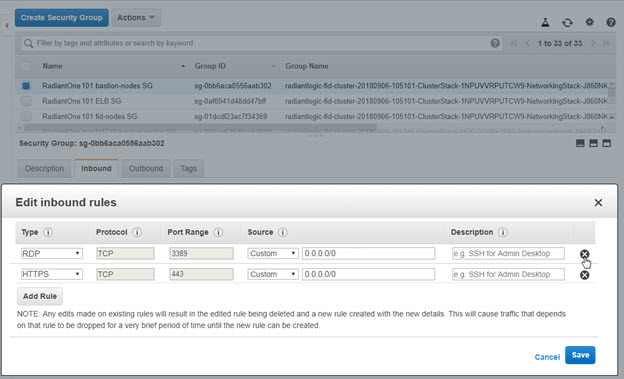

26. Configure the [Remote Desktop connection](radiantone-configuration.md#radiantone-nodes-running-on-windows) to connect to a RadiantOne node to configure it as needed. You will need the Administrator password you took note of in step 4 above.

### Extend Existing Deployment

You can install multiple clusters in the same environment. This allows for a blue-green deployment where one cluster is actively serving clients (ELB directs traffic to it) while the other is available for patching/upgrading/testing. This makes patching and upgrading RadiantOne easier. Once the “blue” cluster has been patched/upgraded and tested, switch the ELB to direct client load to it while the other cluster is taken offline and updated.

The templates that install additional servers and/or clusters use the same OS as the existing environment and the same RadiantOne LDAPS and HTTPS ports. Therefore, during the
configuration, you do not select the OS or LDAPS and HTTPS ports. These templates do not install bastion servers, ZooKeeper servers, or an ELB since these components already exist in the environment. The high-level diagram below depicts two RadiantOne 3-node clusters in a single environment.

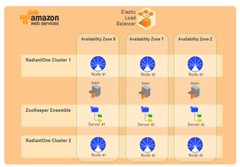

1. In the AWS Management Console select CloudFormation in the Services menu.

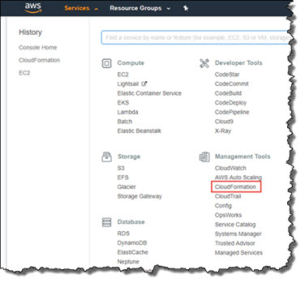

2. Click **Create Stack**.

3. Select the option to Specify an Amazon S3 template URL.

4. Enter the Amazon S3 URL matching the architecture you’ve purchased a license for. For U.S. Government data centers see below.

| No. of Servers | Template URL | 
|--------------|---------------------|
| 1 server | https://s3.amazonaws.com/radiantlogic-us-west-1/fid-3.0/templates/radiantOneFIDClusterOnly1N.yaml^
| 2 - node cluster | https://s3.amazonaws.com/radiantlogic-us-west-1/fid-3.0/templates/radiantOneFIDClusterOnly2N.yaml
| 3 - node cluster | https://s3.amazonaws.com/radiantlogic-us-west-1/fid-3.0/templates/radiantOneFIDClusterOnly3N.yaml
| 5 - node cluster | https://s3.amazonaws.com/radiantlogic-us-west-1/fid-3.0/templates/radiantOneFIDClusterOnly5N.yaml

U.S. Government URLs:

| No. of Servers | Template URL
|---------------|------------------------|
| 1 server | https://s3-us-gov-west-1.amazonaws.com/radiantlogic-us-gov-west-1/fid-3.0/templates/radiantOneFIDClusterOnly1N.yaml
| 2 - node cluster | https://s3-us-gov-west-1.amazonaws.com/radiantlogic-us-gov-west-1/fid-3.0/templates/radiantOneFIDClusterOnly2N.yaml
3 - node cluster | https://s3-us-gov-west-1.amazonaws.com/radiantlogic-us-gov-west-1/fid-3.0/templates/radiantOneFIDClusterOnly3N.yaml
| 5 - node cluster | https://s3-us-gov-west-1.amazonaws.com/radiantlogic-us-gov-west-1/fid-3.0/templates/radiantOneFIDClusterOnly5N.yaml

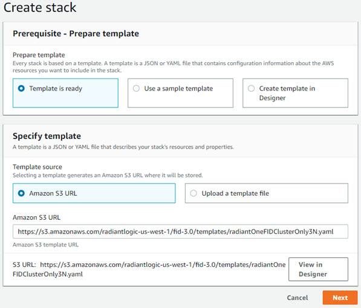

5. Click **Next**.

6. Enter a unique Stack Name.

7. Enter an existing Environment Name that matches the one currently hosting the RadiantOne server(s). All clusters share the existing environment.

8. Enter the ZooKeeper Administrator password to connect to the existing ZooKeeper ensemble.

9. Enter the name of the RadiantOne cluster. This cluster name must be different than other clusters in the same environment.

10. Select a RadiantOne version (e.g. 7.3.5) from the drop-down menu.

11. Select the sizing tier applicable to your RadiantOne deployment. The tier selected corresponds to an AWS instance type and disk volume as outlined in the table below.

| Sizing | Amazon Instance Type | Approximate # of user entries | 
|------------|------------|--------|
| Tier 1 | m5.xlarge^ (4 vCPU 16GB RAM), 400 GB storage with Disk Speed of 200 MB/s | 1 Million
| Tier 2 | m5.2xlarge (8 vCPU 32GB RAM), 500 GB storage with Disk Speed of 250 MB/s | 10 Million
| Tier 3 | m5.4xlarge (16 vCPU 64GB RAM), 600 GB storage with Disk Speed of 300 MB/s | 30 Million
| Tier 4 | r5.4xlarge (16 vCPU 128GB RAM), 700 GB storage with Disk Speed of 350 MB/s | 60 Million
| Tier 5 | m5.12xlarge (48 vCPU 192GB RAM), 700 GB storage with 350 MB/s | 100 Million

12. In the Directory Manager field, enter the administrator account name (e.g. cn=directory manager).

13. Enter a password to use for the Directory Manager account. This value can be changed after the install.

14. Enter your unique RadiantOne license key for each cluster node. Each node must have its own license key unless you received a cluster-based license key. If you have a cluster-based license key, the same license key can be used for all cluster nodes. Check with your Radiant Logic representative if you are not sure what kind of license you received.

>[!note]
>The license key s tarts with braces (e.g. {xxxx}xxxx....).

15. Click **Next**.

16. (Optional) Enter Tags (key/value pairs), Permissions (the default permissions are associated with the account used to create the stack), Rollback Triggers (monitoring the state of your application during stack creation) and any advanced items you need.

17. Click **Next**.

18. Review the parameters and check the Acknowledgement at the bottom.

19. Click **Create**.

### AWS Instances

After the stack is created, you can view information about the RadiantOne instances.

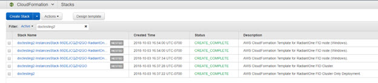

### Post-Deployment Tasks

You can migrate the configuration from the existing server/cluster to the new server/cluster to have a backup/test environment to try new configurations and/or new versions. Switch the ELB as needed to point to the applicable RadiantOne instances.

1. From the EC2 Dashboard, go to Load Balancing > Load Balancers.

2. Select the Load Balancer for your environment.

3. On the Instances tab, click **Edit Instances**.

4. Select the instances the ELB should direct traffic to.

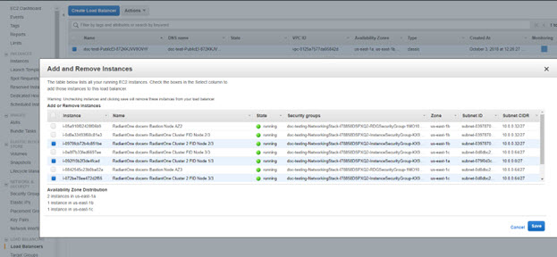
