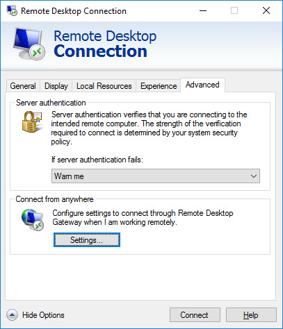
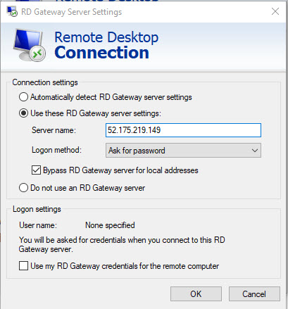
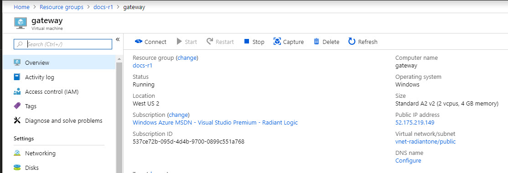

# RadiantOne Configuration

## RadiantOne Nodes Running on Linux

Through the jumpbox, you can connect to and manage any RadiantOne node.

>**Note – the RadiantOne service and the Jetty web server hosting the Main Control Panel are configured to automatically startup as services.**

1. Use the [SSH key](installation.md) you provided during the configuration to establish a tunnel connection to the RadiantOne node that you want to manage through the jumpbox server.

    E.g. (on a Windows client, using Putty):

```
    Run C:\"Program Files"\PuTTY\plink.exe -l <username> -N -L 7070:rli-server-0:7070 -L`
    8089:rli-server-0:8089 <jumpbox_IP_address>
```

2. From your local machine, access the control panel on the RadiantOne node. E.g. [http://localhost:7070/main/login](http://localhost:7070/main/login)

## RadiantOne Nodes Running on Windows

The steps in this section describe how to configure a Remote Desktop Connection to the Remote Desktop Gateway.

>**Note – the RadiantOne service and the Jetty web server hosting the Main Control Panel are configured to automatically startup as services.**

1. Make sure the certificate installed on the remote desktop gateway is trusted on your administrative client.

2. On your client, open Remote Desktop Connection. It should be installed by default on any Windows computer.

3. Click **Show Options**.

4. On the Advanced tab, click **Settings**.



5. Click **Use these RD Gateway server settings**.



6. For Server Name, enter the address of the gateway instance. You can view the IP address in the resource group for the “gateway” server. An example is shown below.



7. Select the Logon method Ask for password.

8. Check Bypass RD Gateway server for local addresses.

9. Uncheck the Use my RD Gateway credentials for the remote computer.

10. Click **OK**.

11. In General tab, provide the RadiantOne server local IP address or server name and User name (entered in the template during configuration).

12. Click **Connect**.

13. Enter the credentials for the user name and click **OK**.

14. After the remote desktop connection is established, launch a web browser and navigate to [http://localhost:7070](http://localhost:7070) to launch the Main Control Panel.

## Connecting to Data Sources On-Premises

The network configuration required for connectivity to your on-premises network is not handled by the templates. Contact your Network Administrator to configure the network between the Azure VPC and your on-premises network to ensure it complies with your corporate security policy. For guidance, see:

https://docs.microsoft.com/en-us/azure/vpn-gateway/vpn-gateway-tutorial-create-gateway-powershell
