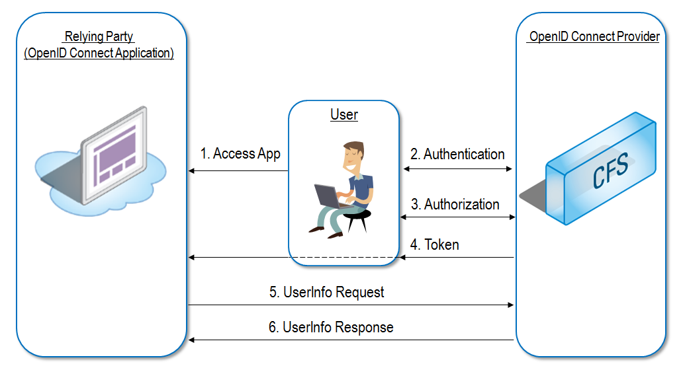
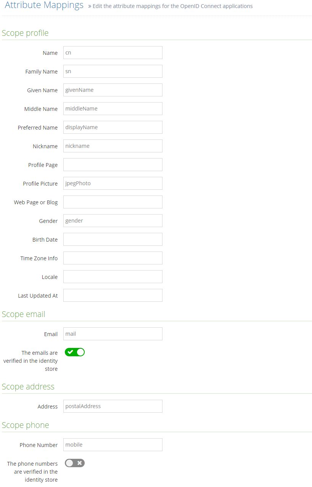
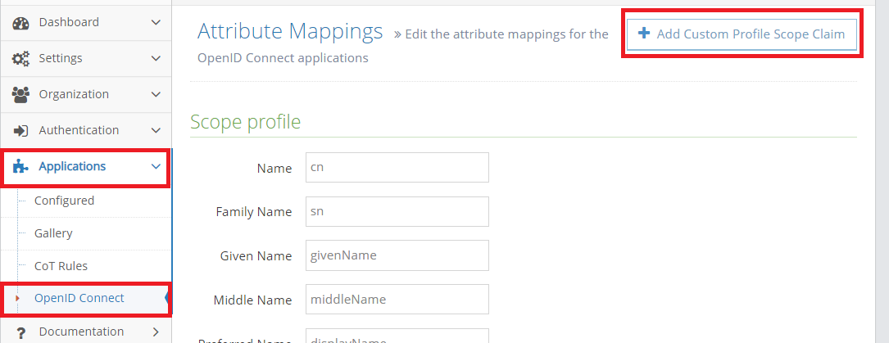
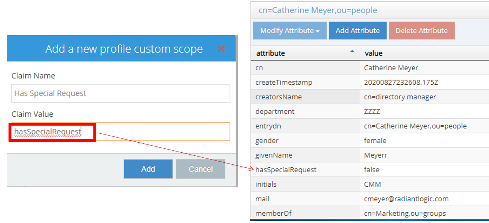
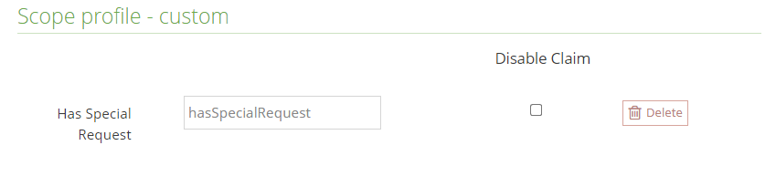
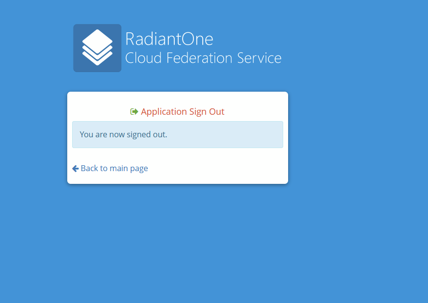
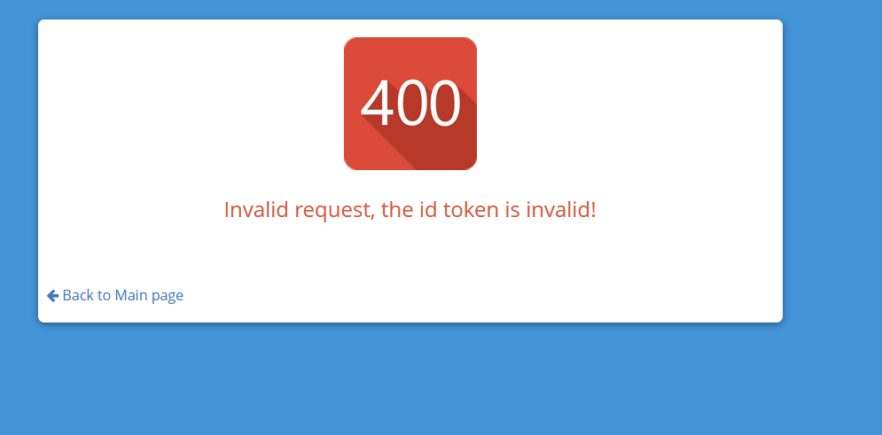
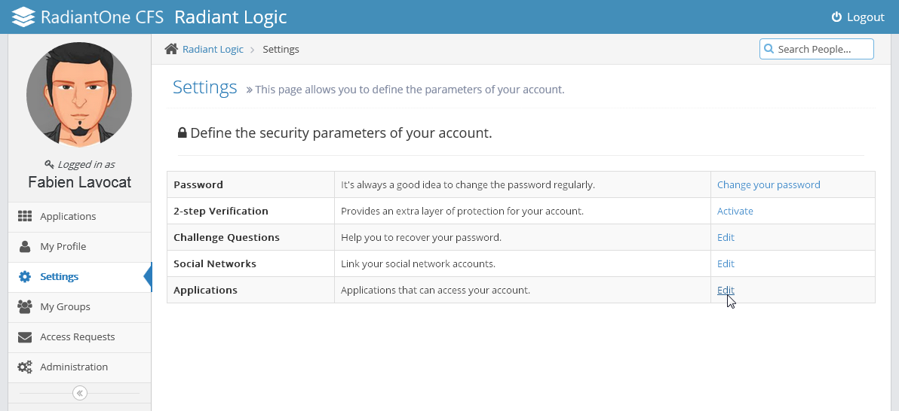

# Identity Providers

Identity Provider is the term used to describe any mechanism or system that handles authentication of users, and provides claims about those users to CFS. There are five types of identity providers / authentication systems supported in CFS:

*   [Login / Password Authentication](../../idps/fba.html) (Forms Based Authentication)
*   [Certificate/PIV card Authentication](../../idps/certificate.html)
*   Social Networks
    *   [Facebook](../../idps/facebook.html)
    *   [GitHub](../../idps/github.html)
    *   [Google](../../idps/google.html)
    *   [Instagram](../../idps/instagram.html)
    *   [LinkedIn](../../idps/linkedin.html)
    *   [Microsoft(Azure Active Directory)](../../idps/microsoft-account.html)
    *   [PayPal](../../idps/paypal.html)
    *   [Twitter](../../idps/twitter.html)
    *   [WordPress](../../idps/wordpress.html)
    *   [Yahoo](../../idps/yahoo.html)
*   [Active Directory](../../idps/rtc.html) (RadiantOne Trust Connectors)
*   External Trusted Identity Providers
    *   [Microsoft AD FS](../../idps/adfs.html)
    *   [OpenAM](../../idps/openam.html)
    *   [RSA SecurID](../../idps/rsa-securid.html) _(deprecated)_
    *   Other Ws-Federation Identity Providers...

Below is a high-level diagram depicting the flow when CFS leverages a Trusted Identity Provider for authentication. In scenarios like this, CFS acts as a relying party to the Trusted Identity Provider. This is known as Inbound Federation. CFS is receiving assertions from a trusted IDP to provide access to identities outside of CFS's security boundary to relying parties that trust CFS as their Identity Provider.

>[!warning] Only the WS-Federation standard is supported between CFS and external trusted identity providers.

In environments where an existing identity provider is deployed and needs to trust CFS as an identity/claims provider, the existing identity provider is then considered a relying party for CFS. This is known as Outbound Federation. CFS produces the assertions to be consumed by a trusted IDP. This allows identities managed by CFS to access applications outside of its security boundary. This is depicted in the diagram below.

>[!warning] WS-Federation, SAML, and OAuth/OIDC are supported between CFS and external trusted identity providers **as long as the external identity provider supports it**.

# Applications

Name | Description | Link
-|-|-
   [Amazon AWS](../../applications/amazonaws.md)|Amazon Web Services (AWS) is a collection of remote computing services (also called web services) that together make up a cloud computing platform, offered over the Internet by Amazon.com. | [Amazon](https://aws.amazon.com)
   [Amazon Single Sign-On](../../applications/awssso.md)| AWS Single Sign-On (AWS SSO) is a cloud service that allows you to grant your users access to AWS resources, such as Amazon EC2 instances, across multiple AWS accounts. | [Amazon](https://docs.aws.amazon.com/singlesignon/latest/userguide/what-is.html)
   [Box](../../applications/box.md) | Box is the single, secure solution for content access, sharing and collaboration. Connect Box to other business applications using preexisting integrations, add functionality by adding Box Apps to your deployment or incorporate Box into your infrastructure through SSO integrations.| [Box](https://www.box.com)
   [Cisco WebEx](../../applications/ciscowebex.md) | Collaborate with colleagues across your organization, or halfway across the planet. Meet online and share files, information, and expertise. WebEx solutions increase productivity and keep you connected. | [Citrix](https://www.webex.com) 
    [DocuSign - Demo](../../applications/docusigndemo.md) | DocuSign helps your world work better with the easiest, fastest, most secure way to send, sign, track and store documents in the cloud. | [DocuSign](https://www.docusign.com)
   [DocuSign - Preview](../../applications/docusignpreview.md) | DocuSign helps your world work better with the easiest, fastest, most secure way to send, sign, track and store documents in the cloud. | [DocuSign](https://www.docusign.com)
 [DocuSign - Production](../../applications/docusignproduction.md) | DocuSign helps your world work better with the easiest, fastest, most secure way to send, sign, track and store documents in the cloud. | [DocuSign](https://www.docusign.com)
 [DocuSign - QA](../../applications/docusignqa.md) | DocuSign helps your world work better with the easiest, fastest, most secure way to send, sign, track and store documents in the cloud. | [DocuSign](https://www.docusign.com)
   [Dropbox for Business](../../applications/dropbox.md) | Dropbox is a home for all your photos, docs, videos, and files. Anything you add to Dropbox will automatically show up on all your computers, phones and even the Dropbox website - so you can access your stuff from anywhere. | [Dropbox](https://www.dropbox.com)
 [GitLab](../../applications/gitlab.md) | Code, test, and deploy together with GitLab open source git repo management software. | [GitLab](https://www.gitlab.com)
  [Google Apps](../../applications/googleapps.md) | Google Apps is a suite of Google applications that brings together essential services to help your business. This is a hosted service that lets businesses, schools, and institutions use a variety of Google products -- including Email, Google Docs, Google Calendar, and Google Talk -- on a unique domain (e.g., www.yourcompany.com). | [Google](https://www.google.com/enterprise/apps/business)
    [Citrix GoToMeeting](../../applications/gotomeeting.md) | Citrix GoToMeeting HD video conferencing software makes it simple and cost-effective to hold online meetings with colleagues and customers. | [Citrix](https://www.gotomeeting.com)
  [Citrix GoToTraining](../../applications/gototraining.md) | Citrix GoToTraining online training software enables individuals and enterprises to provide interactive training sessions to customers and employees in any location. | [Citrix](https://www.gototraining.com)
  [Citrix GoToWebinar](../../applications/gotowebinar.md) | Citrix GoToWebinar is the online conference software that makes it possible for anyone to host a professional webinar from the comfort of their own office. | [Citrix](https://www.gotowebinar.com)
   [Jive](../../applications/jive.md) | Jive is the proven social provider, helping many of the world's most successful companies achieve breakthrough results, slash operating costs and drive $billions in revenue. | [Jive](https://www.jivesoftware.com)
   [Microsoft AD FS as SAML 2](../../applications/msadfssaml2.md) | Microsoft Active Directory Federation Services (AD FS) helps simplify access to applications and other systems with an open and interoperable claims-based model. The AD FS platform provides a fully redesigned Windows-based Federation Service that supports the WS-Trust, WS-Federation, and Security Assertion Markup Language (SAML) protocols. | [Microsoft](https://technet.microsoft.com/en-us/library/hh831502.aspx)
   [Microsoft AD FS as WS-Federation](../../applications/msadfswsfed.md) | Microsoft Active Directory Federation Services (AD FS) helps simplify access to applications and other systems with an open and interoperable claims-based model. The AD FS platform provides a fully redesigned Windows-based Federation Service that supports the WS-Trust, WS-Federation, and Security Assertion Markup Language (SAML) protocols. | [Microsoft](https://technet.microsoft.com/en-us/library/hh831502.aspx)
   [Microsoft Azure AD](../../applications/msazuread.md) | Microsoft Azure Active Directory is a comprehensive identity and access management cloud solution that provides a robust set of capabilities to manage users and groups and help secure access to applications including Microsoft online services like Office 365 and a world of non-Microsoft SaaS applications. | [Microsoft](https://azure.microsoft.com/en-us/services/active-directory/)
   [NetScaler](../../applications/netscaler.md) | Citrix NetScaler is the world's most advanced application delivery controller for mobile and web. | [Citrix](https://www.netscaler.com)
   [NetSuite](../../applications/netsuite.md) | NetSuite Inc. is a leading vendor of cloud computing business management software suites. NetSuite enables companies of all sizes to manage all key business operations in a single, integrated system, which includes customer relationship management; order management and fulfillment; inventory management; finance; ecommerce and Web site management; and employee productivity. | [NetSuite](https://www.netsuite.com)
   [OpenAM](../../applications/openam.md) | OpenAM is an open source access management, entitlements and federation server platform. | [NetSuite](https://www.forgerock.com/openam.html)
   [Salesforce](../../applications/salesforce.md) | Salesforce's main web-based CRM software is available for management of sales projections and orders, marketing plans, knowledge management, service and support, partner relationships, analytics and customer application development. Each is designed for the unique needs of different industries. | [Salesforce](https://www.salesforce.com)
   [Salesforce with Provisioning](../../applications/salesforceprovisioning.md) | Salesforce's main web-based CRM software is available for management of sales projections and orders, marketing plans, knowledge management, service and support, partner relationships, analytics and customer application development. Each is designed for the unique needs of different industries. | [Salesforce](https://www.salesforce.com)
  [SAML 2 Generic](../../applications/saml2generic.md) | SAML 2 Generic application. | [Radiant Logic](https://www.radiantlogic.com)
   [ServiceNow](../../applications/servicenow.md) | ServiceNow is a platform-as-a-service provider of enterprise service management software. | [ServiceNow](https://www.servicenow.com)
  [ShareFile](../../applications/sharefile.md) | Citrix ShareFile is an enterprise follow-me data solution that enables IT to deliver a robust data sharing and sync service that meets the mobility and collaboration needs of users and the data security requirements of the enterprise. By making follow-me data a seamless and intuitive part of every user's day, ShareFile enables optimal productivity for today's highly mobile, anywhere, any-device workforce. | [Citrix](https://www.sharefile.com)
   [Microsoft SharePoint 2010](../../applications/sharepoint2010.md) | Microsoft SharePoint 2010 makes it easier for people to work together. Using SharePoint 2010, your people can set up Web sites to share information with others, manage documents from start to finish, and publish reports to help everyone make better decisions. | [Microsoft](https://sharepoint.microsoft.com)
   [Microsoft SharePoint 2013](../../applications/sharepoint2013.md) | Microsoft SharePoint 2013 makes it easier for people to work together. Using SharePoint 2013, your people can set up Web sites to share information with others, manage documents from start to finish, and publish reports to help everyone make better decisions. | [Microsoft](https://sharepoint.microsoft.com)
   [Slack](../../applications/slack.md) | All your team communication in one place, instantly searchable, available wherever you go. That's Slack. | [Slack](https://slack.com)
   [Syncplicity](../../applications/syncplicity.md) | Syncplicity provides file synchronization, back-up, and sharing. The service allows users to protect files with real-time backups and to share their files with others. Syncplicity offers unlimited storage and offers one click syncing and sharing. | [Syncplicity](https://www.syncplicity.com)
   [Workplace by Facebook](../../applications/workplacebyfacebook.md) | Workplace by Facebook allows you to communicate and collaborate quickly, easily and effectively with your entire organization using tools your colleagues are already familiar with. | [Facebook](https://workplace.fb.com/)
  [WsFederation Generic](../../applications/wsfed-generic.md) | WsFederation Generic application. | [Radiant Logic](https://www.radiantlogic.com)

# Smart links

## Overview

For RP-initiated SSO (when a user navigates directly to a site/application) the Identity Provider (IDP) knows exactly where to redirect the user back to after they authenticate. However, for IDP-initiated SSO (when the user navigates directly to the IDP to login first), the exact desired application/sub-service may not be known so CFS will would redirect the user back to a general/main page of the service instead of directly to the sub-service.

Smart Links provide users with an improved login experience when accessing any browser based site that offers many services/sub-sites. An example is Office 365 which offers many services, including SharePoint Online. Even SharePoint 2010 (on-premise) offers many different sites/web applications. Another example is Google Apps which offers many services like email, calendar...etc.

Smart Links offer an improved IDP-initiated user experience because once logged in, with just a single click, the user is automatically redirected to the specific service without any additional clicks required.

On the CFS configuration side, only 1 application is required to be configured. Then each sub-service is configured for this application as a smart link.

This page explains the Smart Link generation and deployment process in detail and is based on a use case of Office 365 (SharePoint Online) deployed trusting ADFS as the Identity Provider and extending access to users in CFS (ADFS configured with a claims provider trust for CFS).

## Generating Smart Links

-   Install Fiddler.
-   Open Fiddler and enable HTTPS decryption.
-   Open Internet Explorer, clear the cookies and restart the browser.
-   Using Internet Explorer, navigate to an Office 365 SharePoint site.
-   At the Office 365 Login Prompt, enter your username, check the boxes ‘Remember me’ and Keep me signed in’ and then click "Sign in at <yourdomain>".
-   Return to Fiddler and locate the 302 redirection session. Right-click on the 302 session, click "Copy and click "Just Url".
-   Open Notepad and paste the string copied in step 6. It should look something like:

`[https://federation.domain.com/adfs/ls/?cbcxt=mai&vv=&username=david.ross%40domain.com.au&mkt=&lc=3081&wa=wsignin1.0&amp](https://federation.domain.com/adfs/ls/?cbcxt=mai&vv=&username=david.ross%40domain.com.au&mkt=&lc=3081&wa=wsignin1.0&amp); wtrealm=urn:federation:MicrosoftOnline&wctx=MEST%3D0%26LoginOptions%3D1%26wa%3D wsignin1%252E0%26rpsnv%3D2%26ct%3D1348618157%26rver%3D6%252E1%252E6206%252 E0%26wp%3DMBI%26wreply%3Dhttps%253A%252F%252Fdomain%252Esharepoint%252Ecom %252F%255Fforms%252Fdefault%252Easpx%26lc%3D3081%26id%3D500046%26cbcxt%3Dmai %26wlidp%3D1%26guest%3D1%26bk%3D1348618158`

-   Remove everything between ".../adfs/ls/?" and "wa=wsignin...", and everything after "...wreply%3D". The string now looks like:

`[https://federation.domain.com/adfs/ls/?wa=wsignin1.0&wtrealm=urn:federation:Microsoft](https://federation.domain.com/adfs/ls/?wa=wsignin1.0&wtrealm=urn:federation:Microsoft) Online&wctx=MEST%3D0%26LoginOptions%3D1%26wa%3Dwsignin1%252E0%26rpsnv%3D2 %26ct%3D1348618157%26rver%3D6%252E1%252E6206%252E0%26wp%3DMBI%26wreply%3D`

This is the base URL that will be used to create the Smart Links.

Next, convert the SharePoint site URLs to double encoded URLs. We need to do this for all SharePoint sites that you would like to create Smart Links for. Use the following table as a reference:

ASCII Character Double-Encoded Value  
: %253A  
. %252E  
/ %252F

The following are some examples of URLs and their double-encoded URL equivalent:

URL -- > Double-Encoded URL [https://company.sharepoint.com](https://company.sharepoint.com) -- > https%253A%252F%252Fcompany%252Esharepoint%252Ecom [https://company.sharepoint.com/search](https://company.sharepoint.com/search) -- > https%253A%252F%252Fcompany%252Esharepoint%252Ecom%252Fsearch [https://company-10.sharepoint.com/sites/finance](https://company-10.sharepoint.com/sites/finance) -- > https%253A%252F%252Fcompany-10%252Esharepoint%252Ecom%252Fsites%252Ffinance

-   To complete the Smart Link, simply append the double encoded string to the base URL that was previously created. The end result will be a Smart Link that looks something like:

`[https://federation.domain.com/adfs/ls/?wa=wsignin1.0&wtrealm=urn:federation:Microsoft](https://federation.domain.com/adfs/ls/?wa=wsignin1.0&wtrealm=urn:federation:Microsoft) Online&wctx=MEST%3D0%26LoginOptions%3D1%26wa%3Dwsignin1%252E0%26rpsnv%3D2% 26ct%3D1348618157%26rver%3D6%252E1%252E6206%252E0%26wp%3DMBI%26wreply%3D https%253A%252F%252Fcompany%252Esharepoint%252Ecom`

## Deploying Smart Links

The URL generated in the previous section will be used during the CFS configuration described below.

-   From the Tenant Administration Dashboard, navigate to the Applications sections.
-   Click on Gallery and click Configure next to the application you want to configure with Smart Links. (This example will use ADFS as WS-Federation).
-   Enter the needed parameters (if you need assistance, see [Applications](../applications/index.md) ).
-   Click on Smart Links at the bottom of the page.
-   Click on the New Smart Links button.
-   Paste in the final smart link result calculated in the previous section. E.g. `[https://federation.domain.com/adfs/ls/?wa=wsignin1.0&wtrealm=urn:federation:Microsoft](https://federation.domain.com/adfs/ls/?wa=wsignin1.0&wtrealm=urn:federation:Microsoft) Online&wctx=MEST%3D0%26LoginOptions%3D1%26wa%3Dwsignin1%252E0%26rpsnv%3D2% 26ct%3D1348618157%26rver%3D6%252E1%252E6206%252E0%26wp%3DMBI%26wreply%3D https%253A%252F%252Fcompany%252Esharepoint%252Ecom`
-   Toggle the "Is Enabled" option so that is shows a green check mark.
-   Enter any other desired parameters on the General, Access Rules and Filter tabs and then click Save. For details on parameters available on these tabs, please see the [Applications Configuration guide](../user-roles/tenant-admin.html#applications).

# OpenID Connect

## Overview
--------

CFS supports OAuth 2.0 and is an OpenID Connect provider. It supports the role of "Authorization Server" (to authenticate users) and "Resource Server" (to deliver user attributes requested by the application).

When a user accesses the OpenID Connect application (relying party), they will be redirected to the "authorization endpoint" of CFS to authenticate (step 2 in the diagram below). If the user has an active session with the CFS, authentication may be skipped.

After the user authenticates to CFS, they will be prompted to authorize the application to access certain profile information (unless they've already given permission to the application previously, in which case they won't be prompted). This is shown in step 3 in the diagram below.

The user browser is sent back to the client application (indicated by the Callback URL in the configuration) with the authentication/authorization result (shown in step 4 in the diagram below). The application can contact CFS (DIRECTLY) at the UserInfo endpoint (shown in step 5 in the diagram below). The application has a maximum of 2 minutes to contact CFS for the user's information. After 2 minutes, the access token is no longer valid and steps 2-4 shown in the diagram must be done again. Note here that even if steps 2-4 will be executed again, the user will not see any of this because they will already have been authenticated by CFS (and not prompted again) and already authorized the application to access their information (so they won't have to consent again - as long as they have not manually [revoked access](#revoking-access-to-an-application) to this application in the meantime). The UserInfo endpoint (CFS) returns consented profile information to the client application (shown in step 6 in the diagram below). This can contain ONLY attributes indicated in the "scope" (indicated in the Mappings).

A tenant's OIDC discovery document is located at:

    https://cfs-server.domain.com/cfs/oauth/[tenant-identifier]/.well-known/openid-configuration

This discovery document provides general information about the OpenID connect configuration such as:

-   The OAuth issuer (CFS tenant)
-   Authorization endpoint
-   Token endpoint
-   User Information endpoint
-   Response types and response modes supported
-   ID token Signing algorthims supported
-   The JSON Web Keys URI
-   Supported scopes
-   End session endpoint and check session iframe

A few things to keep in mind for OpenID Connect Applications are:

-   There are no certificates required.
-   The application can communicate directly to CFS to get information about a user (not just indirectly through the client browser with redirects).
-   Only RP-initiated SSO is supported (no IDP-initiated, which means OpenID Connect applications will not appear in the CFS portal).

### Supported Flows in CFS

The following OIDC flows are supported:

-   Authorization Code
-   Authorization Code (with PKCE)
-   Hybrid
    -   code token
    -   code id\_token
    -   code id\_token token
-   Implicit
    -   id\_token token
    -   token
    -   id\_token

>[!warning] the implicit flow is less secure since access token and/or ID tokens are returned directly from CFS to the browser. As a result, the code flow is encouraged and the most secure.

## Tokens

Tokens in CFS are returned in the form of [Json Web Tokens (JWTs)](https://jwt.io/introduction).

### Access Tokens

An access token body returned from CFS looks similar to:

    {
        "name": "Jane Doe",
        "sub": "Jane Doe",
        "scope": "openid profile address phone email",
        "token_type": "bearer",
        "client_id": "h5Ik8ep4nFMu433hUI55g",
        "nbf": 1610573741,
        "exp": 1610573861,
        "iat": 1610573741,
        "iss": "https://cfs.server/cfs/oauth/[tenantIdentifier]",
        "aud": "https://cfs.server/cfs/oauth/[tenantIdentifier]"
    }

These access tokens have a **two minute expiration time**, unless changed in the tenant admin console.

Important things to note:

-   The "aud" (Audience) claim is the resource the access token is intended for. In this case, it's CFS which, as mentioned above, is also the resource server.
-   The "iss" (Issuer) claim is who issued the access token (the authorization server), which is also CFS.
-   The "scope" claim are those user claims that the OIDC client is requesting from the backend datastore (FID).

### ID Tokens

An ID token body returned from CFS looks similar to:

    {
        "name": "Jane Doe",
        "sub": "Jane Doe",
        "family_name": "Doe",
        "given_name": "Jane",
        "nickname": "jen",
        "gender": "female",
        "address": "123 East Brussels Lane, Novato, CA 95213",
        "email": "jdoe@company.com",
        "email_verified": "True",
        "phone_number": "555-639-1234",
        "phone_number_verified": "False",
        "nonce": "63746170493LWE2NzQtNTdkMGQ3Zjc5NjU2",
        "at_hash": "UBugsfdT1PWxJ6wqpw",
        "c_hash": "Upb8pdndf30UQ4-g",
        "nbf": 1610573742,
        "exp": 1610574942,
        "iat": 1610573742,
        "iss": "https://cfs.server/cfs/oauth/[tenantIdentifier]",
        "aud": "h5Ik8ep4nFMu433hUI55g"
    }

These ID tokens have a **twenty minute expiration time**, unless changed in the tenant admin console..

Important things to note:

-   The "aud" (Audience) claim is the OIDC client the token is intented
-   The "iss" (Issuer) claim is the authorization server that issued the ID token, which is CFS.
-   The ["c\_hash"](https://openid.net/specs/openid-connect-core-1_0.html#HybridIDToken) (Code Hash) value is included in the ID token if the `response_type` includes a code (i.e `code`, `code id_token`, `code token id_token`).
-   The ["at\_hash"](https://openid.net/specs/openid-connect-core-1_0.html#HybridIDToken) (Acess Token Hash) value is included in the ID token if the `response_type` also includes an access token (i.e `code id_token token`).
-   Requests to the `authorize` endpoint that contain _any_ of the below response types will return user claims **only** from the `/userinfo` endpoint:
    -   `token`
    -   `code token`
    -   `token id_token`
    -   `code id_token token`

## JSON Web Keys

These tokens are signed using [JSON Web Keys (JWKs)](https://tools.ietf.org/html/rfc7517). The key ID (kid) used to sign the token can be found in the JSON Web Token's header

    {
        "alg": "RS256",
        "kid": "9ac7441d-1c47-49ad-9bb9-740d0f6a1702",
        "typ": "JWT"
    }

The JWKs can be accessed from `https://cfs-server.domain.com/cfs/oauth/[tenant-identifier]/.well-known/keys`. This endpoint can be discovered from tenant's OIDC discovery document.

Keys are automatically rotated every 180 days.

**Important Note -** if there are existing OIDC applications in your tenant prior to CFS 3.15.0 you will have to reconfigure them, as the JWKs won't be created if there are existing OIDC applications in the tenant.

## Configuration

There are two parts to the configuration in CFS. One is the configuration of the application. The other is configuring which identity store attributes are associated with the scopes (mappings). These configurations are described below.

>[!warning] the configuration of the actual OpenID Connect application is not covered in this guide. However, take note of the Key and Secret set when you configure the application in CFS as these values will be needed when you configure your actual application.

### Application

In the Tenant Administration Dashboard, navigate to the Applications section and select OpenID Connect. Click on the New OpenID Connect Application button.

1.  Enter a unique name for the OpenID Connect application.
2.  Enter a description.
3.  Enter a website associated with the application.
4.  Enter a Callback URL. The address where CFS will redirect the user to after authentication.
5.  Enter the organization name and website. This information will be displayed to the user (along with the logo you configure in the next step) when requesting consent for the application to access the user's information.
6.  Select a logo to display to the user when requesting consent for the application to access the user's information.
7.  Check "Is Enabled" until it shows green.
8.  Take note of the Application Key and Secret as this information will be used in the configuration of the application (when you set it up to be able to connect to CFS).

### Mappings (Scopes)

OpenID Connect "scopes" can be thought of as predefined sets of claims/assertions. To define the attributes associated with the scopes, from the Tenant Administration Dashboard, navigate to Applications and select OpenID Connect. Click the Mappings button.

**Note -** all OpenID Connect Applications share the same mappings but may request different scopes. For example, some applications my request the profile scope whereas other may only request the email scope.

#### Profile Scope

The “profile” scope is equivalent to requesting the following claims/assertion:

-   name
-   family\_name (Last Name)
-   given\_name (First Name)
-   middle\_name, Nickname
-   peferred\_username
-   profile
-   picture
-   website
-   gender
-   birthdate
-   zoneinfo
-   locale
-   update\_at

You can indicate which attribute from the identity store (FID) should populate each claim.

#### Email Scope

The "email" scope is equivalent to requesting the Email claim/assertion. You can indicate which attribute from the identity store (FID) should populate this claim (e.g. mail). There is an option to indicate that emails are verified in the identity store. Neither CFS nor FID perform any verification of this value. When the identity store (FID) is configured, this attribute can be deemed "verified" by the administrator (when configuring FID, you can indicate which data source is authoritative for this information). If the attribute is considered verified, toggle the switch to green/on next to "The emails are verified in the identity store".

#### Address Scope

The "address" scope is equivalent to requesting the Address claim/assertion. You can indicate which attribute from the identity store (FID) should populate this claim (e.g. postalAddress).

#### Phone Scope

The "phone" scope is equivalent to requesting the Phone Number claim/assertion. You can indicate which attribute from the identity store (FID) should populate this claim (e.g. mobile). There is an option to indicate that telephone numbers are verified in the identity store. Neither CFS nor FID perform any verification of this value. When the identity store (FID) is configured, this attribute can be deemed "verified" by the administrator (when configuring FID, you can indicate which data source is authoritative for this information). If the attribute is considered verified, toggle the switch to green/on next to "The phone numbers are verified in the identity store".

#### Groups Gcope

The "groups" scope is the equivalent to requesting a special groups assertion, which retrieves the groups a user is a part of. The group attribute is determined based on the tenant's group schema as seen below.

#### Custom Claims

CFS supports configuring custom claims. These custom claims are returned as part of the **profile** scope. If a custom claim is **disabled**, it will **not** be returned in either the `id_token` or from the `/userinfo` endpoint. Custom claims, like all other scopes, can only be managed by tenant administrators. To add a custom claim:

1.  From the _Administration_ tab navigate to _Applications > OpenID Connect_
2.  In the top right, click on _\+ Add Custom Profile Scope Claim_
    
    
    
3.  In the popup that appears, enter a _Claim name_ and _Claim Value_. The _Claim Name_ is just a user-friendly string to identify the custom claim. The _Claim Value_ is the attribute in FID
    
    
    
4.  The mappings page should then display the custom claim with the option to _disable_ or _delete_ it
    
    

### Change Token Expiration Time

Certain situations may require that an OIDC application's token expiration be changed. To do so:

1.  Log in as a tenant administrator.
2.  Navigate to Administration > Applications > OpenID Connect.
3.  Choose _Edit_ next to the application in which the token expiration should be changed.
4.  Scroll to the bottom of the page to the _Token Expiration Settings_ section.
5.  Modify the values accordingly.
6.  Click Save.

## PKCE Flow

CFS supports the PKCE flow, a **secure** alternative to the implicit flow. PKCE is used mainly for Single-Page Applications (SPAs) in which the client secret cannot be securely stored. These SPAs tend to store information in the browser, and therefore it is recommended to use this flow since it's more secure than the implicit flow.

Since this flow builds off the **standard authorization code** flow, the steps are very simliar:

1.  The user clicks on **Login** from the OIDC client application
2.  The OIDC client application creates a `code_verifier`
3.  The OIDC client application also creates a `code_challenge` and a `code_challenge_method` which is either `plain` or `S256`
    -   If the `code_challenge_method` is `plain`, then the `code_challenge` is just the `code_verifier`
    -   If the `code_challenge_method` is `S256`, then the `code_challenge` is the _Base64 URL-encoded SHA256 hashed_ value of the `code_verifier`
4.  The client sends the `code_challenge` and `code_challenge_method` along in the authorization request to CFS
5.  CFS stores the `code_challenge` and responds with an `authorization code`
6.  The client then sends a request containing it's `code_verifier` and `authorization code` to CFS' `/token` endpoint
7.  CFS verifies the `authorization code` and then verifies the `code_verifier` using the `code_challenge` and `code_challenge_method` received in the `/authorzie` request
    -   If the validation is successful, CFS responds with an `access token`, `id_token`, and `refresh_token`
8.  The OIDC client the requests, user data to the `/userinfo` endpoint with the `access token` issued from step 7
9.  CFS verifies the `access token, and if correct, responds with the user's information based on the`scopes`requested from the`access token\`

When using the PKCE flow, the `client_secret` is **not** needed. The `code_challenge` essentially replaces the `client_secret`.

A sample authorization request using the PKCE flow is as follows (line breaks included for readability):

    GET https://[cfs-server]/cfs/oauth/[tenant-identifier]/authorize?  
    client_id=g1hokpYGybxFMw98Hm2GEx  
    &redirect_uri=https%3A%2F%2Fwin-cit95mqedh1.luckylemurs.com%2Fsignin-oidc  
    &response_type=code  
    &scope=openid%20profile%20groups  
    &code_challenge=48OXGnJ6mmia6TWwEaVYfm02laegbqABMDGR_20NN98  
    &code_challenge_method=S256  
    &response_mode=form_post  
    &nonce=63762669242...jODg3  
    &state=CfDJ...7kV1SZQ8Oj_

>[!note] If, for some reason, a `client_secret` is passed in the _authorization_ request when using the PKCE flow, CFS will also verify it in addition to verifying the `code` and `code_verifier`.

## Session Management

Session management in OIDC allows for clients to monitor users' session state in CFS, and act accordingly. It also enables clients to allow users to logout of CFS. OIDC session management can be used to:

-   Log users out of all applications they're signed into from an IdP (single-logout)
-   End a user's current CFS session (simple logout)

>[!note] As of CFS version **3.15.1**, only **simple logout** is supported.

### Check Session Management

Clients (Relying Parties (RPs)) can check for users' session status by using CFS' (OpenID Connect Provider's (OP)) `/checksession` endpoint, which can be found from the OIDC discovery endpoint for the tenant. In order for clients to correctly use the `/checksession` endpoint, two `iframes` must be loaded into the client:

-   An OP iframe -- an iframe loaded into the RP pointing to the OP's `checksession` endpoint found in the OIDC discovery document
    -   The RP _must_ assign an `id` attribute to the iframe so that it can identify it in the OP iframe
    -   The RP's postMessage from the iframe sends the following string concatenation as data: `client_id` + " " + `session_state`
-   An RP iframe -- an iframe loaded into the RP used to handle the response from the OP's `checksession` endpoint
    -   This iframe must know the `id` of the OP iframe and the origin URL of the OP iframe (i.e. `https://cfs-server.domain.com`) to ensure that requests are sent to and received _only_ from the originating OP (i.e. CFS)

A response from the OP's `checksession` endpoint will be either `changed`, `unchanged`, or `error`

-   If the response is `changed`, the RP must send a request to the OPs' `authorize` endpoint with `prompt=none` with the RP iframe to request a new ID token, sending the old ID token as the `id_token_hint`
-   If the response is `unchanged`, the RP need not do anything, as the user's session has not changed
-   If the response is `error`, the RP must **not** perform re-authentication to the `authorize` endpoint

### End Session Mangement

If an OIDC client chooses to allow users to logout of CFS (i.e. _simple_ logout), it can do so from the tenant's `endsession` endpoint found in the OIDC discovey document. The client must know the ID token for the user, and must pass it in the `id_token_hint` parameter.

If the ID token is valid, CFS will logout the user and the following page will be displayed:

If the ID token is invalid, CFS will display the following page.

The the `id_token_hint` parameter is not passed, CFS will display the following page:

An example end session request is as follows.

    https://cfs-server.domain.com/cfs/oauth/[tenant-identifier]/endsession?id_token_hint=ey8Ujmnr43dC...PZ

### Revoking Access to an Application

Once a user authenticates to an OpenID application and gives consent for the application to access their profile attributes, they can login to the CFS portal and "revoke access" to these applications meaning that the application is no longer allowed to get the user's attributes without consent.

1.  Log in to the CFS Portal and click on Security.
2.  Click Edit next to Applications. You will see a list of applications and the scope they are currently using.
3.  Click the Revoke button next to the applications you no longer want to be able to access your profile.

# PowerShell Commandlets

The Microsoft PowerShell commandlets are available starting CFS version 3.3. 145 of them are available in CFS 3.16.2.

Run the PowerShell prompt and use the following command in order to connect to FID: `Connect-CfsService -Address <FID ADDRESS> -Port <SSL PORT> -Root "cn=cfs,cn=config"`. You will be prompted for your FID credentials. After the authentication is successful, you will be able to manage your CFS using the following cmdlets.

If the CFS PowerShell cmdlets are not available after installing CFS, enter the command `Import-Module RLI.CFS.Management` in order to import the CFS commandlets. Also, make sure you have PowerShell 4.0 (or later) installed.

## General

### Schema

Name | Description  | Since Version
-|-|-
**Get-CfsSchema** | Retrieves the version of the CFS configuration schema in FID. | 3.3.0.0
**Update-CfsSchema** | Updates the CFS configuration schema in FID. | 3.3.0.0

### Service

Name | Description | Since Version
-|-|-
**Connect-CfsService** | Initiates the connection to FID. | 3.3.0.0
**Get-CfsService** | Retrieves the connection object. | 3.3.0.0
**Install-CfsService** | Initializes the CFS configuration in FID. | 3.3.0.0

### Tools

Name | Description | Since Version
-|-|-
**Get-CfsVersion** | Retrieves the version of the CFS PowerShell Commandlets. | 3.3.0.0
**New-Certificate** | Generates a new X509Certificate2. | 3.3.0.0

## System

### Global Login Page

Name | Description | Since Version
-|-|-
**Get-CfsGlobalLoginPage** | Retrieves the Global Login Page parameters. | 3.6.0.0
**Set-CfsGlobalLoginPage** | Updates the Global Login Page parameters. | 3.6.0.0

### Bypass Redirection

Name | Description | Since Version
-|-|-
**Get-CfsBypassRedirection** | Retrieves the bypass User Agent rules. | 3.9.0.0
**Set-CfsBypassRedirection** | Updates the bypass User Agent rules. | 3.9.0.0
**Enable-CfsBypassRedirection** | Enables the bypass redirection. | 3.9.0.0
**Disable-CfsBypassRedirection** | Disables the bypass redirection. | 3.9.0.0

### Packages

Name | Description | Since Version
-|-|-
**Get-CfsApplicationPackage** | Retrieves an Application Package. | 3.7.0.0
**Get-CfsPackages** | Retrieves the Web Gallery Application or Theme packages. | 3.7.0.0
**Get-CfsTheme** | Retrieves a Theme. | 3.7.0.0
**Import-CfsPackage** | Imports an Application or Theme package from a local folder. | 3.7.0.0
**Import-CfsPackages** | Imports all application or theme packages from a local folder. | 3.7.0.0
**Install-CfsPackages** | Installs the packages from the Web Gallery. | 3.7.0.0
**Remove-CfsPackage** | Removes a Package. | 3.7.0.0
**Update-CfsPackages** | Updates the package from the Web Gallery. | 3.7.0.0

### Servers

Name | Description  | Since Version
-|-|-
**Get-CfsServer** | Retrieves a Server. | 3.3.0.0
**Get-CfsServerSecretKey** | Retrieves the Secret Key from a Proxy Server. | 3.3.0.0
**New-CfsServer** | Creates a new Proxy Server. | 3.3.0.0
**Remove-CfsServer** | Removes a server from the system. | 3.3.0.0

### SMTP

Name | Description | Since Version
-|-|-
**Disable-CfsSmtp** | Disables the SMTP. | 3.3.0.0
**Enable-CfsSmtp** | Enables the SMTP. | 3.3.0.0
**Get-CfsSmtp** | Retrieves the SMTP parameters. | 3.3.0.0
**Send-TestEmail** | Sends a Test Email. | 3.3.0.0
**Set-CfsSmtp** | Updates the SMTP parameters. | 3.3.0.0

### Tenants

Name | Description | Since Version
-|-|-
**Disable-CfsTenant** | Disables a Tenant. | 3.3.0.0
**Enable-CfsTenant** | Enables a Tenant. | 3.3.0.0
**Get-CfsTenant** | Retrieves a Tenant. | 3.3.0.0
**New-CfsTenant** | Creates a new Tenant. | 3.3.0.0
**Remove-CfsTenant** | Removes a Tenant. | 3.3.0.0
**Set-CfsTenant** | Updates a Tenant. | 3.3.0.0

### Themes

Name | Description | Since Version
-|-|-
**Get-CfsTheme** | Retrieves a Theme. | 3.3.0.0
**Remove-CfsTheme** | Removes a Theme. | 3.3.0.0
**Update-CfsTheme** | Updates the Themes from the Web Gallery. | 3.3.0.0

### Web Gallery

Name | Description | Since Version
-|-|-
**Get-CfsWebGallery** | Retrieves the Web Gallery Application or Theme packages. | 3.3.0.0
**Install-WebGallery** | Installs the packages from the Web Gallery. | 3.3.0.0
**Get-CfsWebGalleryAddress** | Retrieves the Web Gallery URL. | 3.3.0.0
**Set-CfsWebGalleryAddress** | Updates the Web Gallery URL. | 3.3.0.0

### Web Proxy

Name | Description | Since Version
-|-|-
**Disable-CfsWebProxy** | Disables the Web Proxy. | 3.3.0.0
**Enable-CfsWebProxy** | Enables the Web Proxy. | 3.3.0.0
**Get-CfsWebProxy** | Retrieves the Web Proxy parameters. | 3.3.0.0
**Set-CfsWebProxy** | Updates the Web Proxy parameters. | 3.3.0.0

### Tenant

Use command `Set-CfsCurrentTenant` (Available since CFS 3.4) in order to set the Tenant to use for the current session.

Name | Description | Since Version
-|-|-
**Get-CfsCurrentTenant** | Get the Tenant used for the current PowerShell session. | 3.6.0.0
**Set-CfsCurrentTenant** | Set the Tenant to use for the current PowerShell session. | 3.4.0.0

### Application

Name | Description | Since Version
-|-|-
**Disable-CfsApplication** | Disables an application. | 3.3.0.0
**Enable-CfsApplication** | Enables an application. | 3.3.0.0
**Get-CfsApplication** | Retrieves an Application for the tenant. | 3.3.0.0
**Get-CfsApplicationUpdate** | Retrieves if an Application has a template update available. | 3.6.0.0
**Get-CfsAppParameter** | Retrieves an application Parameter. | 3.6.0.0
**Import-CfsApplication** | Imports an Application package. | 3.6.0.0
**Move-CfsApplication** | Changes the identifier of an Application. | 3.3.0.0
**New-CfsApplication** | Creates a new Application. | 3.3.0.0
**Remove-CfsApplication** | Removes an application. | 3.3.0.0
**Set-CfsApplication** | Updates the Application. | 3.6.0.0
**Set-CfsAppParameter** | Updates the Parameter of an Application. | 3.6.0.0
**Update-CfsApplication** | Updates an Application from a template. | 3.6.0.0

### Applications and SmartLinks

Name | Description | Since Version
-|-|-
**Add-CfsAppGroups** | Adds a Group to an Application or SmartLink. | 3.6.0.0
**Get-CfsAppGroup** | Retrieves the principal Group of an Application or SmartLink. | 3.6.0.0
**Get-CfsAppGroups** | Retrieves the list of Groups of an Application or SmartLink. | 3.6.0.0
**Get-CfsGroupOwner** | Retrieves the Group Owner of an Application or SmartLink. | 3.6.0.0
**Get-CfsGroupSet** | Retrieves the GroupSet of an Application or SmartLink. | 3.6.0.0
**Get-CfsLdapFilter** | Retrieves the LDAP Filter of an Application or SmartLink. | 3.6.0.0
**Get-CfsLevelOfAssurance** | Retrieves the Level Of Assurance of an Application or SmartLink. | 3.6.0.0
**Remove-CfsAppGroups** | Removes a group from an Application or SmartLink. | 3.6.0.0
**Set-CfsAppGroup** | Updates the principal Group of an Application or SmartLink. | 3.6.0.0
**Set-CfsGroupOwner** | Updates the Group Owner of an Application or SmartLink. | 3.6.0.0
**Set-CfsGroupSet** | Updates the GroupSet of an Application or SmartLink. | 3.6.0.0
**Set-CfsLdapFilter** | Updates the LDAP Filter of an Application or SmartLink. | 3.6.0.0
**Set-CfsLevelOfAssurance** | Updates the Level Of Assurance of an Application or SmartLink. | 3.6.0.0

### Tenant Certificate

Name | Description | Since Version
-|-|-
**Get-CfsCertificate** | Retrieves an X509Certificate2 used by a tenant. | 3.3.0.0
**Set-CfsCertificate** | Updates an X509Certificate2 used by a tenant. | 3.3.0.0

### Challenge Questions

Name | Description | Since Version
-|-|-
**Add-CfsChallengeQuestion** | Adds a Challenge Question for the tenant. | 3.3.0.0
**Get-CfsChallengeQuestion** | Retrieves the Challenge Questions for the tenant. | 3.3.0.0
**Remove-CfsChallengeQuestion** | Removes a Challenge Question for the tenant. | 3.3.0.0

### Emails

Name | Description | Since Version
-|-|-
**Get-CfsEmail** | Retrieves an Email configuration for the tenant. | 3.3.0.0
**Get-CfsEmailTemplateBase** | Retrieves the Email Template Base for the tenant. | 3.3.0.0
**Set-CfsEmail** | Updates an Email configuration. | 3.3.0.0
**Set-CfsEmailTemplateBase** | Updates the Email Template Base for the tenant. | 3.3.0.0

### Identity Providers

#### Certificate

Name | Description | Since Version
-|-|-
**Disable-IdpCertificate** | Disables Certificate Authentication for the tenant. | 3.6.0.0
**Enable-IdpCertificate** | Enables Certificate Authentication for the tenant. | 3.6.0.0
**Get-IdpCertificate** | Retrieves the Certificate Authentication configuration for the tenant. | 3.6.0.0 | **Set-IdpCertificate** | Updates the Certificate Authentication configuration for the tenant. | 3.6.0.0

#### Form-Based

Name | Description | Since Version
-|-|-
**Disable-IdpFba** | Disables Login / Password Authentication for the tenant. | 3.6.0.0
**Enable-IdpFba** | Enables Login / Password Authentication for the tenant. | 3.6.0.0
**Get-IdpFba** | Retrieves the Login / Password Authentication configuration for the tenant. | 3.6.0.0
**Set-IdpFba** | Updates the Login / Password Authentication configuration for the tenant. | 3.6.0.0

#### RSA SecurID

Name | Description | Since Version
-|-|-
**Disable-IdpRsa** | Disables RSA SecurID Authentication for the tenant. | 3.6.0.0
**Enable-IdpRsa** | Enables RSA SecurID Authentication for the tenant. | 3.6.0.0
**Get-IdpRsa** | Retrieves the RSA SecurID Authentication configuration for the tenant. | 3.6.0.0
**Set-IdpRsa** | Updates the RSA SecurID Authentication configuration for the tenant. | 3.6.0.0

#### Yubico

Name | Description | Since Version
-|-|-
**Disable-IdpYubico** | Disables Yubico Authentication for the tenant. | 3.8.0.0
**Enable-IdpYubico** | Enables Yubico Authentication for the tenant. | 3.8.0.0
**Get-IdpYubico** | Retrieves the Yubico Authentication configuration for the tenant. | 3.8.0.0
**Set-IdpYubico** | Updates the Yubico Authentication configuration for the tenant. | 3.8.0.0

#### RTC

Name | Description | Since Version
-|-|-
**Disable-IdpRtc** | Disables an RTC. | 3.6.0.0
**Enable-IdpRtc** | Enables an RTC. | 3.6.0.0
**Get-IdpRtc** | Retrieves an RTC for the tenant. | 3.6.0.0
**New-IdpRtc** | Create a new RTC. | 3.6.0.0
**Remove-IdpRtc** | Removes a RTC. | 3.6.0.0

#### Trusted

Name | Description | Since Version
-|-|-
**Disable-IdpTrusted** | Disables a Trusted Identity Provider | 3.6.0.0
**Enable-IdpTrusted** | Enables a Trusted Identity Provider. | 3.6.0.0
**Get-IdpTrusted** | Retrieves a Trusted Identity Provider for the tenant. | 3.6.0.0
**New-IdpTrusted** | Create a new Trusted Identity Provider. | 3.6.0.0
**Remove-IdpTrusted** | Removes a Trusted Identity Provider. | 3.6.0.0

#### Two-Step

Name | Description | Since Version
-|-|-
**Get-IdpTwoStep** | Retrieves the Two-Step Verification configuration for the tenant. | 3.6.0.0
**Set-IdpTwoStep** | Updates the Two-Step Verification configuration for the tenant. | 3.6.0.0

### Identity Store

Name | Description | Since Version
-|-|-
**Get-CfsIdentityStore** | Retrieves the ObjectClass and Attribute configuration for the tenant. | 3.3.0.0
**Set-CfsIdentityStore** | Updates the ObjectClass and Attribute configuration for the tenant. | 3.3.0.0

### Mappings

Name | Description | Since Version
-|-|-
**Add-CfsMapping** | Adds an application Mapping. | 3.6.0.0
**Get-CfsMapping** | Retrieves an application Mapping. | 3.6.0.0
**Get-CfsNameIdentifier** | Retrieves an application Name Identifier definition. | 3.6.0.0
**Remove-CfsMapping** | Removes an application Mapping. | 3.6.0.0
**Set-CfsMapping** | Updates an application Mapping. | 3.6.0.0
**Set-CfsNameIdentifier** | Updates an application Naming Identifier definition. | 3.6.0.0

### Messaging Service

Name | Description | Since Version
-|-|-
**Disable-CfsMessagingService** | Disables the Messaging Service. | 3.3.0.0
**Enable-CfsMessagingService** | Enables the Messaging Service. | 3.3.0.0
**Get-CfsMessagingService** | Retrieves the Messaging Service configuration. | 3.3.0.0
**Set-CfsMessagingService** | Updates the Messaging Service configuration. | 3.3.0.0

### OpenID Connect

Name | Description | Since Version
-|-|-
**Disable-CfsOpenIDConnect** | Disables the OpenID Connect Application. | 3.3.0.0
**Enable-CfsOpenIDConnect** | Enables the OpenID Connect Application. | 3.3.0.0
**Get-CfsOpenIDConnect** | Retrieves an OpenID Connect Application. | 3.3.0.0
**New-CfsOpenIDConnect** | Creates a new OpenID Connect Application. | 3.3.0.0
**Redo-CfsOpenIDConnect** | Generates new keys for the OpenID Connect Application. | 3.3.0.0
**Set-CfsOpenIDConnect** | Updates the OpenID Connect Application. | 3.3.0.0

### Settings

Name | Description | Since Version
-|-|-
**Get-CfsSettings** | Retrieves the tenant settings. | 3.3.0.0
**Set-CfsSettings** | Updates the tenant settings. | 3.3.0.0

### Smart Links

Name | Description | Since Version
-|-|-
**Disable-CfsSmartLink** | Disables a Smart Link. | 3.3.0.0
**Enable-CfsSmartLink** | Enables a Smart Link. | 3.3.0.0
**Get-CfsSmartLink** | Retrieves a Smart Link. | 3.3.0.0
**New-CfsSmartLink** | Creates a new Smart Link for an Application. | 3.3.0.0
**Remove-CfsSmartLink** | Removes a Smart Link. | 3.3.0.0
**Set-CfsSmartLink** | pdates a Smart Link | 3.3.0.0

### Social Networks

Name | Description | Since Version
-|-|-
**Get-CfsSocialNetwork** | Retrieves all the Social Network configurations. | 3.3.1.0
**Get-Facebook** | Retrieves the configuration of the Social Network Facebook. | 3.3.1.0
**Set-Facebook** | Updates the configuration of the Social Network Facebook. | 3.3.1.0
**Get-GitHub** | Retrieves the configuration of the Social Network GitHub. | 3.4.0.0
**Set-GitHub** | Updates the configuration of the Social Network GitHub. | 3.4.0.0
**Get-Google** | Retrieves the configuration of the Social Network Google. | 3.3.1.0
**Set-Google** | Updates the configuration of the Social Network Google. | 3.3.1.0
**Get-Instagram** | Retrieves the configuration of the Social Network Instagram. | 3.3.1.0
**Set-Instagram** | Updates the configuration of the Social Network Instagram. | 3.3.1.0
**Get-LinkedIn** | Retrieves the configuration of the Social Network LinkedIn. | 3.4.0.0
**Set-LinkedIn** | Updates the configuration of the Social Network LinkedIn. | 3.4.0.0
**Get-Microsoft** | Retrieves the configuration of the Social Network Microsoft. | 3.3.1.0
**Set-Microsoft** | Updates the configuration of the Social Network Microsoft. | 3.3.1.0
**Get-PayPal** | Retrieves the configuration of the Social Network PayPal. | 3.3.1.0
**Set-PayPal** | Updates the configuration of the Social Network PayPal. | 3.3.1.0
**Get-Twitter** | Retrieves the configuration of the Social Network Twitter. | 3.3.1.0
**Set-Twitter** | Updates the configuration of the Social Network Twitter. | 3.3.1.0
**Get-WordPress** | Retrieves the configuration of the Social Network WordPress. | 3.4.0.0
**Set-WordPress** | Updates the configuration of the Social Network WordPress. | 3.4.0.0
**Get-Yahoo** | Retrieves the configuration of the Social Network Yahoo. | 3.4.0.0
**Set-Yahoo** | Updates the configuration of the Social Network Yahoo. | 3.4.0.0
