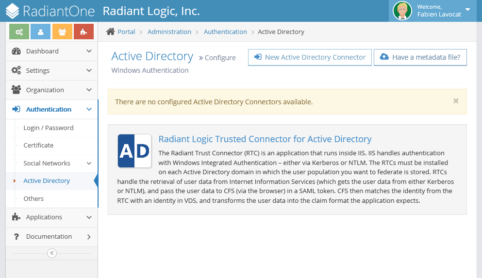
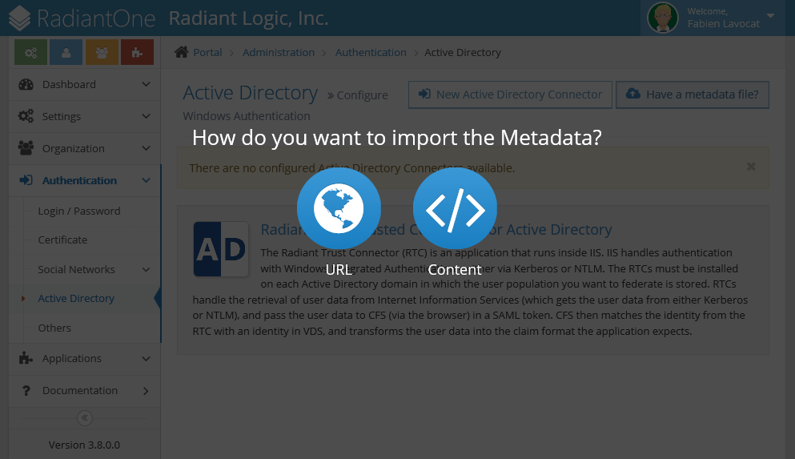
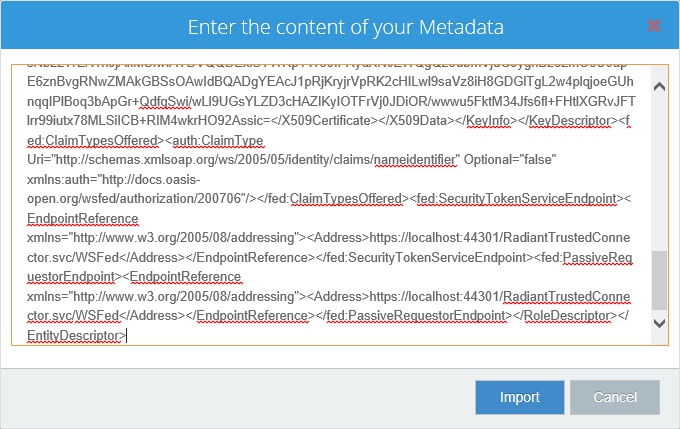
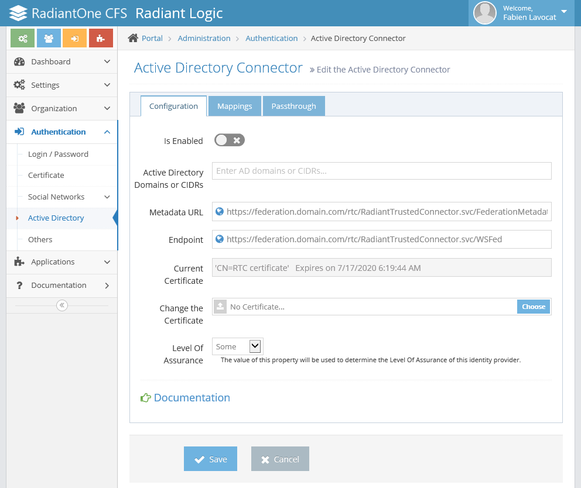

# Getting Started

This guide is meant to help you achieve a simple installation of the Cloud Federation Service (CFS) for the first time. It assumes that you have RadiantOne Federated Identity Service (FID) already installed and configured on another server. If not, you should start by using the documentation that comes with the FID to complete your installation and configuration.

In this guide, you will install CFS and configure your first tenant. A tenant in CFS is like a store in the mall. CFS can be configured to host many tenants, each with their own base of users and groups. Each tenant is independent of the others. As an example, you may have certain applications that your sales team needs access to, but your engineering team does not, and vice versa. In CFS, your sales team can have its own tenancy, with unique applications available for those that access the sales tenant. The engineering tenant would be accessed by other users and grant access to different applications.

If you have done a basic installation of FID on your other server, you have some sample data already populated in the directory tree. We use that sample data as our basis to get started and explain the CFS concepts.

## Next Steps

Now you know what this guide is about, follow the folling steps to get started.

-   [Prerequisites](#prerequisites) for RadiantOne CFS and how to prepare FID.
-   Learn about the [Concepts](#concepts) of federation.
-   Install and configure [RadiantOne CFS Master](#radiantone-cfs-master).
-   Create the [first tenant](#first-tenant).

# Prerequisites 

This section describes the prerequisites for installing the Cloud Federation Service (CFS) and Radiant Trust Connectors (RTCs). CFS does not have to be installed on a FID server; however, the FID server must be accessible to the server that CFS is installed on.

## CFS Requirements

Windows users without administrator privileges may launch the CFS installer; however, administrator credentials are required to complete the CFS installation. You are prompted to enter the administrator credentials during installation. SSL must be enabled on the FID prior to installing CFS.

Supported Operating Systems:

-   Windows Server 2016
-   Windows Server 2019

Minimum Hardware Requirements:

-   Memory: 4 GB minimum
-   Disk Space: 750 MB
-   CPU: Intel Pentium 2.4 GHz or equivalent, 2-4 cores

Supported Applications:

A list of supported applications is available in the CFS System Administrator dashboard. Refer to Applications > Web Gallery Node in the [system dashboard](04-user-roles#applications) for more information.

Firewall Ports:

_CFS Master_ and _CFS Proxy API_ must access RadiantOne FID on the configured LDAP SSL port which by default is 636. This port must be opened between the CFS and FID machines. Client browsers must access _CFS Master_ or _CFS Proxy_ on HTTPS port 443. _CFS Proxy_ must be able to communicate with the _CFS Proxy API_ on HTTPS port 443. SMTP is used to send automated emails from CFS. Please make sure the CFS machine can access your SMTP server through the configured port.

Identity Store (FID) Version:

CFS v3.16.2 supports FID v7.1.14 and later, with the exception of:

-   v7.2.20
-   v7.2.21
-   v7.2.22

## Other Microsoft Requirements

-   Web Server IIS 7.5 or higher. (Server Manager > Roles > Web Server (IIS))
-   CFS Version **3.16.2** requires .NET Framework 4.8
    -   If your server doesn't have access to the Internet, you can download the [.NET Framework 4.8 (Offline Installer)](https://go.microsoft.com/fwlink/?linkid=2088631).
    -   If your server does have access to the Internet, you can download the .NET Framework 4.8 (Web Installer)
-   Older versions of CFS only require .NET Framework 4.6.2
    -   If you server doesn't have access to the Internet, you can download the [.NET Framework 4.6.2 (Offline Installer)](https://dotnet.microsoft.com/en-us/download/dotnet-framework/thank-you/net48-web-installer).
    -   This version of the .NET Framework requires to have the Windows Update KB2919355. Make sure your Windows Server is up to date on the Windows Update.
-   ASP.NET v4.6 (Server Manager > Roles > Web Server (IIS) > Web Server > Web Server > Application Development > ASP.NET 4.6)
-   HTTP Activation (Server Manager > Features > .NET Framework 4.6 Features > WCF Services > HTTP Activation)
-   PowerShell 4.0
    -   [What's New in Windows PowerShell](https://technet.microsoft.com/library/hh857339.aspx)
    -   [Download Windows Management Framework 4.0](https://www.microsoft.com/en-us/download/details.aspx?id=40855)
-   RTC only:
    -   Windows Authentication (Server Manager > Roles > Web Server (IIS) > Web Server > Security > Windows Authentication)

## Preparing the Identity Store

The identity store used by CFS is the RadiantOne FID. The FID provides the identity integration layer and the storage for self-registered users.

FID is configured outside of CFS and must be installed/configured prior to installing CFS. When you configure FID, keep the following requirements in mind. The CFS default configuration expects the following (although, you can customize the expected object classes and attributes in the schema settings when you configure the tenant):

-   User entries in FID have the object Class: _inetOrgPerson_
-   User entries in FID have the attributes: _uid_, _mail_, _sn_, _givenName_ and _displayName_
-   Group entries in FID have the object Class: _groupOfUniqueNames_
-   Group entries in FID have the attribute: _uniqueMember_
-   Prior to creating your identity store, all user accounts that are to assume the role of CFS tenant administrator must have an entry in FID in the directory branch of users configured for the tenant. The email address associated with the user account is required when selecting a tenant administrator in CFS.

Depending on the CFS features you plan to use, you must have some attributes available in FID:

-   If you are planning on allowing users to log in (or register) to CFS with a social network account, then the user entries in FID must support the following writable (and searchable) attributes: _SocialFacebookLink_, _SocialGitHubLink_, _SocialGoogleLink_, _SocialInstagramLink_, _SocialLinkedInLink_, _SocialMicrosoftAccountLink_, _SocialPayPalLink_, _SocialTwitterLink_, _SocialWordPressLink_, and _SocialYahooLink_.
-   If you are planning on allowing users to self-register on your CFS portal, then the user entries in FID must support the writable attribute: _IsSelfRegistered_
-   If you are planning on allowing users to reset their passwords by answering challenge questions, then the user entries in FID must support the following writable attributes: _challengeQuestion1_ - _challengeQuestion10_ (e.g. _challengeQuestion1_, _challengeQuestion2_, _challengeQuestion3_ etc...), _challengeAnswer1_ - _challengeAnswer10_ (e.g. _challengeAnswer1_, _challengeAnswer2_, _challengeAnswer3_ etc...)
-   If you are planning on allowing users to reset their passwords, then the user entries in FID must support the writable attribute: _userPassword_.
-   If you are planning to allow users to log in to CFS with two-step verification, then the user entries in FID must support the following writable attributes: _totpSecret_ and _totpSecretNotValidated_
-   A CFS HelpDesk User or Tenant Administrator can lock and lockout user accounts, therefore, the user entries in FID must support a writable attribute: _nsAccountLock_

If the user or group entries integrated by FID originate from a backend store other than the local HDAP storage in FID, the easiest way to extend these entries with the writable attributes mentioned above is by configuring an Extended External Join on your FID virtual view (be sure to mark these attributes as **UPDATEABLE** and **SEARCHABLE** ). For details on configuring extended joins, please see the FID System Admin Guide. Extended joins alleviate the need to extend the schemas of the backend sources in order to support the writable attributes required by CFS. The lifecycle of these extension attributes is managed by and maintained in FID and FID joins this information to the relevant user/group entries when needed.

## Next Steps

Now you know what are the prerequisites for RadiantOne CFS follow the steps.

-   Learn about the [Concepts](#concepts) of federation.
-   Install and configure [RadiantOne CFS Master](#radiantone-cfs-master).
-   Create the [first tenant](#first-tenant).

# Concepts

## Identity Providers

Identity Provider is the term used to describe any mechanism or system that handles authentication of users, and provides claims about those users to CFS. There are five types of identity providers/authentication systems supported in CFS:

-   Password/Login (Forms Based Authentication)
-   Certificate/PIV card Authentication
-   Social Networks (e.g. Facebook, Twitter...)
-   Trusted Identity Providers (e.g. AD FS, OpenAM...)
-   Active Directory (Radiant Trust Connectors)

## Applications

Application is the term used for relying parties/service providers that trust CFS as the identity provider. The CFS System Administrator must enable the applications that tenants can make available through their portals.

The term "Application" can also refer to other Security Token Service's (STS) such as AD FS or OpenAM, which act as Relying Parties to the CFS, accepting claims from CFS and in turn relaying them to service providers which accept them as true statements about an authenticated user. With this approach, enterprises with pre-existing STS's such as OpenAM or AD FS can integrate with CFS to expand their supported applications and extend access to new user populations.

## Identity Store

An identity store is the user repository used to uniquely identify people for authentication and retrieving profile attributes and groups to package inside tokens. The identity store used by CFS is FID. For more details, please see [Preparing the Identity Store](#preparing-the-identity-store).

## Tenant

CFS supports a multitenancy architecture allowing each configured tenant to manage their own groups, users, identity providers (authentication systems), applications and portal. Each tenant is totally independent and cannot access resources managed by other tenants.

The CFS system administrator configures all tenants and then the designated tenant administrator can configure the groups, users, identity providers and applications applicable for their portal. See the [Tenant Administrator Guide](04-user-roles#tenant-administrator) for configuration details.

## Web Gallery

The web gallery contains all applications that CFS provides a configuration template for. The CFS system administrator must retrieve any applications they want to allow tenants to use in their portal from the web gallery. After an application is installed, it is displayed in the Applications, Available section.

## Comparable Federation Terms

Some federation terms have different names across the industry. The chart below is a quick reference guide to various terminology used across prominent federation technologies.

## IDP-Initiated SSO

Once CFS has been configured by the CFS system Administrator and the Tenant Administrator has configured their portal, users can log in to the portal and access applications.

When a user accesses the tenant portal, they choose the method with which they want to be authenticated. If they are logged into an Active Directory domain that has been configured by the tenant administrator as supported by the portal, the user is automatically be logged in (no login screen appears). For all other users, the configured login methods are shown.

Once logged in, the user is shown a list of applications they are authorized by CFS to access. By clicking on the icon representing the application, the user is automatically signed in.

For more details, please see the portal user guide.

## RP-Initiated SSO

A user can navigate directly to an application, rather than first going to the portal site. If the user has been previously authenticated by CFS, the user gains access to the application without having to re-authenticate.

If the user has not been authenticated by CFS, they are redirected to the portal login page to authenticate. (If the user is logged in to their AD domain, they are automatically authenticated by CFS, and are redirected to their chosen application, not the CFS login page). Once the user authenticates using one of the enabled methods for the site, they are automatically redirected to the application they were attempting to access. This flow is depicted in the diagram below.

Step(s) Flow description:

1.  Browser sends a GET request to application. Because the user has not been authenticated, browser is redirected to the CFS login page.
2.  Browser sends a GET request to CFS to connect to the server.
3.  CFS Portal site
    1.  User chooses to be authenticated using Form Based Authentication, and enters their credentials, which are sent to CFS in a POST. The POST also tells CFS which Application the user wants to access.
    2.  CFS delegates the user authentication to FID, using a "super" filter which combines the filters for FID, for the FBA, and for the application the user is attempting to access.
    3.  If the user can be authenticated, CFS generates and sends an application-specific token to the browser.
4.  The browser sends a POST containing the token to the application, application redirects the browser to the default access page defined in CFS.
5.  The browser requests the page, the Application sends back the page.

## Circle of Trust

Circle of Trust (COT) is one of the methods available for CFS to authorize access to relying parties. The criteria that qualifies a user to be a member of the circle of trust is based on IP Address or DNS. Each IP Address/DNS is associated with a "location" (e.g. Headquarters, BuildingA, BuildingB) and this rule is evaluated when the user logs into CFS. The user can be authorized to access a relying party if their IP address or DNS is indicated in the Circle of Trust rule associated with the relying party.

## Level of Assurance

Level of Assurance (LOA) is one of the methods available for CFS to authorize access to relying parties and is modeled on the FICAM Trust Framework leveraged by the United States Government. A Level of Assurance is assigned to each identity provider/authentication method (e.g. Forms-Based, Certificate authentication, Active Directory) and describes the degree of certainty and confidence that the user has presented a valid identifier that refers to his or her identity. CFS offers four levels of assurance: **Little**, **Some**, **High** and **Very High**.

Levels of Assurance are also assigned to relying parties. A user can be authorized to access a relying party if the Level of Assurance (LOA) associated with the identity provider/authentication method they authenticated with is equivalent to or more secure than the level assigned to the relying party.

## Next Steps

Now you know the basic concepts of federation, follow the steps.

# RadiantOne CFS Master

The RadiantOne CFS and Radiant Trust Connector (RTC) install files are available via an FTP site.

> **Contact** support@radiantlogic.com for access information.

## FID LDAPs Certificate

Installing the FID Certificate on the CFS Server allows CFS to communicate with the FID over an SSL connection. CFS requires an SSL connection.

1.  On the **FID Server**, navigate to `%RLI_HOME%/vds_server/conf` and copy the file `rli.cer` on the desktop of the **CFS Master** machine. 
   
   

1.  Right click that certificate and select "Install Certificate".
1.  Change the Store Location to the "Local Machine" radio button and select "Next". (You need Administrator credentials to complete this step.)
1.  Select the "Place all certificates in the following store" radio button and then select "Browse...". 
   
    

1.  Select "Trusted Root Certificate Authorities" and then select "OK", then "Next" and on the "Completing the Certificate Import Wizard" select Finish. You will see a successful import, as below. 
   

## Installing CFS Master

The CFS installer automatically installs all the required components (including the monitoring console), makes the necessary configurations, and creates a new web site in IIS. Please follow the following steps to install CFS Master.

1.  Log in to the Windows Server machine where you want to install CFS. You do not require Administrator privileges, but Administrator credentials are required to complete the installation CFS process.
1.  Double click the executable `Radiant Logic, Inc. - Cloud Federation Service - <version #>.exe` downloaded from the FTP site. The CFS installer launches.
1.  Click the **I agree to the license terms and conditions** check box and click Install. 
   
   

1.  When asked if you want to allow CFS to make changes to the computer, click Yes. If prompted, enter an administrator password. 
   
   

1.  The setup then configures your machine with all the required features and components (Microsoft IIS, ASP.NET...). 

1.  On the **Welcome to Cloud Federation Service** screen, click Next. 

1.  On the **Select the features you want to install** screen, you can choose the CFS features (or components) to install or not.
    1.  The System Dashboard web site allows you to configure the tenants, packages (applications and themes) and other CFS features. You should install this feature at least once in your IIS Web Farm. 
    2.  If you do not want to install this feature, click on the name and select **Entire feature will be unavailable**.
    3.  The CFS Proxy Web API is the web site that CFS Proxy use as a backend. You can either install all the components on the same machine or install this CFS Proxy Web API on a separate machine for better performance. 
1.  On the **Federated Identity Service Configuration** you have to enter the information to use to connect to FID. 
    1.  This is the connection to the FID that CFS points to for authenticating users, retrieving attributes and store its configuration. Since CFS only connects to FID over SSL (and the FQDN of the FID machine is the subject in the self-generated certificate), you must enter the FQDN for the host. To make sure you have the correct address for your FID, open the SSL certificate and use the issuer property for the host.
    2.  The FID SSL certificate must be trusted on the CFS machine (in the Computer certificate store, Trusted Root Certificates).
    3.  If the certificate is not trusted on your server, it should open itself for you to put it in your certificate store. 
    4.  To update the FID Certificate used for the SSL communications, please refer to the FID documentation.
1.  On the **Ready to install Cloud Federation Service** click Install. 
1.   The install should take a few minutes. 
1.   Once the install is complete, click Finish. 
10.  If an error happened during the installation, a link should display on the next screen to see the logs. 

## Uninstalling CFS Master

1.  To uninstall CFS Master, go to the Windows Control Panel, select Programs, Uninstall a program. In the list of applications installed, select Cloud Federation Service and click Uninstall.

2.  Click Uninstall.
   
    
    
3.  Let the setup uninstall the RTC. 
   
    
    
4.  The setup has successfuly uninstalled the RTC. 
   
    
    

## Next Steps

Now you have installed and configure RadiantOne CFS, follow the steps.

-   Create the [first tenant](#first-tenant).

# First Tenant

After your installation has completed, open your web browser. In the address bar enter the address of your CFS: `[https://<CFS_SERVER>/system/](https://<CFS_SERVER>/system/)`

>[!note] Select "Continue to this website (not recommended)". The reason this appears is because CFS is hosted on Microsoft's IIS Web Server and installs a self-signed certificate during installation that is not trusted by your machine. There are instructions on how to correct this in the [Microsoft IIS](05-deployment#change-the-ssl-certificate) section.

# Installation Wizard

The Global Administration Page takes some time to load for the first time, but when it does, it should look something like this.

Log into the console using the super user information you identified in both the installation of FID and the installation of CFS. This is cn=directory manager by default, and a password that you created. Click "Start the configuration".

For this guide, we accept the defaults on Step 1 of the Configuration Page. If you later want to install a CFS Proxy, you can do so by following the steps at [CFS Proxy](#radiantone-cfs-proxy).

For this guide, we decline setting up the SMTP server on Step 2 of the Configuration Page. If you later want to set up the SMTP server, you can do so by following the steps in the [System Administrator Guide](04-user-roles#smtp).

To understand what applications and options are available to us during the configuration of CFS, we download the themes and applications during Step 3 of the Configuration.

Once this process has completed, you are at the end of the configuration process and can navigate to the CFS System Dashboard.

## System Dashboard

At this point, you are logged in as the Directory Manager and able to configure CFS at the Global Level. That means that you won't be able to directly give users access to applications, but you can create Tenants and give Tenant Administrators the ability to make Applications available to the users. Click **Tenants** on the left hand side of the page and select "New Tenant". In the name field, you are asked for a name. This is arbitrary. For our tenant, we call it "Accounting". The Identifier is automatically generated.

Switch over to the Locations Tab. These fields deal with entries in the FID. Since we are configuring the Accounting Tenant right now, we indicate the naming context that holds our accounting division, both groups and users in FID. Also, we create two new groups in FID to be our Helpdesk and Administrators group for this tenant. To do this, bring up your FID Control Panel and navigate to the Directory Browser.

Expand ou=Accounting,o=companydirectory. Right click on ou=Accounting then select "Add"" and "New Group". In the resulting pop up window, enter CFS Admins in the Group Name field. In my example, I have selected object classe groupOfUniqueNames.

Repeat this process for another group and call it CFS Helpdesk. When complete, your namespace should look similar to this.

Before we leave the FID Control Panel, we need to ensure that we know the password for the user that we designate as the Tenant Administrator. To do this, select uid=Aaron\_Medler in the Directory Browser. In the attributes pane on the right, double click **userPassword**. Erase what is there and enter a password of your choice. While there, also take note of Aaron Medler's email address. You need it in a later step.

Now that your Admin and Helpdesk groups are created, you can go back to your CFS Administration Console. We left off at the locations tab. Under the fields on this tab now, you can fill them in to match the namespace that you were just working with on the FID. For this example, it would look like what is shown below:

Lastly, select the Schema tab. This defines what the users, groups, and some attributes are that CFS should look for in this tenant when requesting information from the FID. By default, it uses a traditional LDAP schema with inetOrgPerson as the User Object Class and groupOfUniqueNames as the Group Object Class. Our users in our People DN do not have a displayName attribute populated, though, so we will change the value in the Display Name field to cn. When this tab is completed, select **Save** at the bottom of the pane.

The first time you configure a Tenant and click Save, you are asked for the email address of the Tenant Administrator. Enter Aaron Medler's email address and click "Check!" to make sure that you have entered it correctly. Then click Save.

Once complete, you are taken to the Registered Tenants Tab and you will see the Tenant that you just added.

Now, log out of the control panel by clicking the arrow in the top right next to the Welcome, Directory Manager message and select "Logout". You are taken back to the login screen. This, however, is the login screen for global administrators, not for tenant administrators.

## Tenant Portal

Use the address bar in your browser to navigate to `[https://<CFS_SERVER>/cfs/](https://<CFS_SERVER>/cfs/)`

The login page looks near identical to the one for global administration, except it is now asking for an email address instead of a login and has the option to recover your password if you have forgotten it. Log in here with Aaron Medler's email address and the password that you created for his account.

The screen that you are taken to is the default portal for all the users of that Tenant. However, since Aaron Medler is an administrator, he has an additional option on the left side. Select Administration on the bottom of the left option pane.

Here, you are able to administer your Tenant, as described in the [Tenant Administration](04-user-roles#tenant-administrator) portion of this documentation.

## Next Steps

Now you have installed and configure RadiantOne CFS and created your first tenant you can follow the guide.

-   Install and configure [CFS Proxy](#radiantone-cfs-proxy).
-   Install and configure [RTC](#radiant-trust-connectors-rtc).
-   Configure the different [Certificates](#certificates).

# RadiantOne CFS Proxy

The CFS Proxy allows external users to access CFS while protecting the identities stored in FID from external attacks by removing the direct link between CFS (in the DMZ) and FID. A CFS proxy may connect to only one master CFS Proxy Web API. The CFS Proxy could also point to a load balancer which distributes traffic to multiple CFS Proxy Web API if needed.

Internal users still use the CFS Master directly to access applications. Only internal users have access to CFS's administration panels. External users exchange information with the CFS Proxy. This server contacts a CFS Proxy Web API server located inside the corporate network through REST calls over HTTPS. Then, the CFS Proxy Web API server contacts FID to get the information needed.

## Create a CFS Proxy

You must have installed a CFS Master with the System Dashboard in order to add a CFS Proxy in the system.

Log in as **cn=Directory Manager** into the System Dashboard at the address `[https://<CFS_ADDRESS>/system/](https://<CFS_ADDRESS>/system/)`

Navigate to **Dashboard | Servers** and click **new Proxy server**.

Keep the next screen on hand; you need to get the **id** and **secret** keys for the next step.

>[!note] Make sure you have installed a CFS Proxy Web API in your network in order for the CFS Proxy to communicate with FID. Follow the steps of the [RadiantOne CFS Master](#radiantone-cfs-master) to install the CFS Proxy Web API.

## Installing CFS Proxy

The CFS Proxy installer automatically installs all the required components (including the monitoring console), makes the necessary configurations, and creates a new web site in IIS. Please follow the following steps to install CFS Proxy.

Log in to the Windows Server machine where you want to install CFS Proxy. You do not require Administrator privileges, but Administrator credentials are required to complete the installation CFS process.

Double click the executable `Radiant Logic, Inc. - Cloud Federation Service Proxy - <version#>.exe` downloaded from the FTP site. The CFS installer launches.

Click the **I agree to the license terms and conditions** check box and click Install.

When asked if you want to allow CFS to make changes to the computer, click Yes. If prompted, enter an administrator password. The setup then configures your machine with all the required features and components (Microsoft IIS, ASP.NET...).

On the **Welcome to Cloud Federation Service Proxy** screen, click Next.

On the **Cloud Federation Service - Proxy Configuration** you have to enter the information to use to connect to CFS Proxy Web API.

-   The URL must be something like: `[https://<CFS_SERVER>/api/](https://<CFS_SERVER>/api/)`
-   Use the keys you have created at the previous step in the System Dashboard.
-   Make sure the HTTPS connection has a valid SSL certificate otherwise the connection does not work.

On the **Ready to install Cloud Federation Service Proxy** click Install.

The install should take a few minutes.

Once the install is complete, click Finish.

>[!note] If an error happened during the installation, a link should display on the next screen to see the logs.

## Uninstalling CFS Proxy

1.  To uninstall CFS Proxy, go to the Windows Control Panel, select Programs, Uninstall a program. In the list of applications installed, select Cloud Federation Service Proxy and click Uninstall.
2.  Click Uninstall. 
   
   
    
3.  Let the setup uninstall the CFS Proxy. 
    
4.  The setup has successfuly uninstalled the CFS Proxy. 
    
## Next Steps

Now you have installed and configure RadiantOne CFS Proxy, you can follow the guide.

-   Install and configure [RTC](#radiantone-trust-connector).
-   Configure the different [Certificates](#certificates).

# RadiantOne Trust Connector

Install an RTC for each Active Directory forest you want to use as an Authentication System within CFS. If you do not want to support Active Directory (NTLM/Kerberos) authentication, then you do not need to install an RTC. It is advised that the default self-signed certificate for each RTC be replaced with a certificate designated exclusively for use by that RTC. Also, make sure the name you are using to access this RTC through the web browser is the FQDN of the machine, otherwise the kerberos token is not be sent to the server and the end user is prompted for his/her credentials. The same is true if the SSL certificate is not valid.

## Installing the RTC

1.  Double click `Radiant Logic, Inc. CFS Radiant Trust Connector - <version#>.exe`.
2.  Check the **I agree to the license terms and conditions** check box and click Install.
3.  When asked if you want to allow the installer to make changes to the computer, click Yes. If prompted, enter an administrator password.
4.  Follow the installer instructions. The installer automatically configures the RTC in IIS.
5.  Click Finish to exit the installer.

## Verifying the RTC Configuration

Verify that the RTC is configured correctly. Check if you can access the RTC site:

1.  Open the IIS Manager.
2.  Expand the CFS Website application and select the Web Application **rtc**. 
3.  In the right panel, click **browse \*:443 (https)**. 
4.  If there is a Certificate Error warning, select "Continue to this website". 
    
    >[!note] This warning is displayed if you have not yet installed a trusted SSL certificate in IIS. You should replace the default certificate installed by the CFS installer with a new one designated specifically for use by CFS. This certificate should be issued by a Certificate Authority. For instructions on how to change the certificate in IIS, refer to [Adding a Certificate](02-getting-started#adding-a-certificate-to-use-with-an-rtc) to use with an RTC.
    
5.  You should now be at the Radiant Trust Connector site.

## Adding A Certificate To Use With An RTC

When deploying in a production environment, you should replace the certificate with a certificate issued by a Certificate Authority. This section describes the method for replacing the certificate to use with the RTC.

To add a certificate to use with an RTC:

1.  Open the IIS Manager.
2.  Expand the CFS Website application and select the Web Application **rtc**.
3.  In the list of features, click **Radiant Trust Connector**. 
4.  The default (self-generated) certificate is displayed. 
5.  In the Actions panel, click **Change the certificate**.
6.  Click the browse ("...") button next to the Certificate file (.pfx) field. 
7.  Select a .pfx file and click OK.
8.  Enter the password of your pfx file.
9.  Click OK to close the Change the certificate window.

## Uninstalling an RTC

1.  To uninstall an RTC, go to the Windows Control Panel, select Programs, Uninstall a program. In the list of applications installed, select RadiantOne Trust Connector and click Uninstall.
2.  Click Uninstall. 
    
3.  Let the setup uninstall the RTC. 
    
4.  The setup has successfuly uninstalled the RTC. 
    
## Next Steps

Now you have installed and configure RadiantOne RTC, you can follow the guide.

-   Configure the different [Certificates](02-gettingstarted#certificates).

# Certificates

There are five areas where certificates are involved in the CFS architecture to handle SSL/TLS server security, token signing and verification of SSO. These areas are described below.

Best practices for certificates suggest that you should use a certificate for one, and only one usage (no sharing).

-   At least one for each IIS website endpoint (or use a wildcard certificate) as they are accessed over HTTPS. These certificates must be setup in IIS and the subject of the certificate must be the fully qualified domain name of the endpoint:
-   For example you can have one for CFS: [https://cfs.radiantlogic.com](https://cfs.radiantlogic.com) and you can have one for the RTC on the local domain: [https://rtc.radiantlogic.com](https://rtc.radiantlogic.com). In this case you need two SSL certificate, one for each URL, or a wildcard certificate ( [https://\*.radiantlogic.com](https://*.radiantlogic.com) ) which is a little bit more expensive, but easier to use for more complex scenarios.
-   For applications/relying parties there are two options. For each tenant created in CFS, a certificate is auto-generated. This certificate can be used by all applications configured for the tenant (they would all share this same one). Or you can decide to not use this general default one and have one dedicated certificate for each trusted application/relying party (e.g. SharePoint, Salesforce…etc.). Whether you use the default, shared certificate or apply your own dedicated certificate, CFS uses the full certificate to build the signature of the token. CFS sends the signed token to the application (via a re-direct through the browser) and because the application has the same certificate (but only the public key) it can validate the incoming message has really come from CFS.
-   One for each trusted authentication system/identity provider (e.g. Azure, RSA, ADFS…etc.). CFS needs only the public key certificate because it simply checks the signature of the token that is sent by the Identity Provider.
-   One for each application RTC (you need one RTC per Active Directory domain/forest). RTC uses the full certificate to build the signature of the token. RTC sends the signed token to CFS (via a re-direct through the client browser) and because CFS has the same certificate (but only the public key) it can validate the incoming message has really come from the RTC.
-   If you are deploying CFS Proxy, the IIS server (where the CFS proxy is installed) has an SSL certificate. Also, the CFS proxy machine must trust the SSL certificates used by all the CFS sites that it is sitting in front of.

>[!note] If you need to load balance multiple CFS servers, you need to have the SSL certificate on every machine plus all the certificates used by CFS must be available and trusted on every machine.

## Applications / Relying Parties

CFS uses a certificate to build the signature of the tokens it generates for applications. CFS sends a signed token to the application (through the browser) and because the application has the same certificate (but only the public key) it can validate the incoming message has come from CFS. There are two options for the certificate that is used by applications:

-   Use the default tenant certificate generated by CFS
-   Use your own dedicated certificate

A mix of both could also be used meaning some applications could use the default while others have a dedicated one. These options are depicted in the diagram below.

By default, CFS generates a unique full certificate for each tenant. This certificate is stored in the FID at: ou=<tenant\_name>,ou=tenants,ou=cfs,cn=config and the certificate contains both the private and public keys. Every application configured for a given tenant can share this same certificate. This is the default behavior. If you choose to use the default certificate generated by CFS, the certificate containing the public key can be retrieved from the Dashboard section -> “Certificates” node in the Tenant Administration Dashboard. This certificate must be installed in all applications that should trust CFS as the identity provider. The installation of the certificate one the application is not handled in the CFS configuration dashboard (see example in screen shot below).

Generally it is best practice to have a dedicated certificate for each application as opposed to sharing one certificate across all applications for a given tenant. In this case, CFS uses the dedicated certificate to build the signature, and when the application receives the token, it can validate that it really came from CFS because it has the corresponding public key. If you choose to use a dedicated certificate for the application, you have two options:

-   Upload a certificate that contains both the private and public keys. This certificate is stored in the FID entry associated with the application located at: ou=<application\_uniqueID>,ou=applications,ou=<tenant\_name>,ou=tenants,ou=cfs,cn=config. This option is less secure than #2 (below) because the whole certificate (containing the private and public keys) must travel between CFS and FID (even though this communication would flow over SSL).
-   Upload a certificate that contains the public key only. This certificate is stored in the FID entry associated with the application located at: ou=<application\_uniqueID>,ou=applications,ou=<tenant\_name>,ou=tenants,ou=cfs,cn=config. This option is more secure than #1 (above) because only the public key is stored in FID. However, if you choose this option, you must also install and trust the full certificate in all CFS instances. This certificate (public and private keys) must be stored in the Windows vault where the CFS in running. This is additional configuration that you must manually setup.

## Authentication Systems

The identity providers (AKA: Authentication Systems) configured in CFS need only the public key configured because CFS simply checks the signature of the token that is sent by the Identity Provider.

# Radiant Trust Connectors (RTC)

When you install a RTC, because it is installed on IIS Web Server, and because we use https to communicate with the RTC, the installer generates a self-signed certificate and installs it in IIS. This certificate should be replaced with a “legit” CA-issued certificate. This certificate contains the private key. When you request a certificate from a CA, it is important to note that the subject of the certificate should be the FQDN of the machine where the it is used (e.g. s-se14-ad.seradiant.com). To check the certificate used by IIS where the RTC is installed, go into IIS Manager, select the root of IIS and on the right, double-click "Server Certificates" (screen shots below based on Windows Server 2012 OS).

All certificates to be used by the web sites/applications hosted on this IIS should be imported here. In the screen shot below, you can see the default “auto-generated” one from the RTC installer and another one which represents the “valid”/CA-signed one.

Now, to check the one associated with the CFS website/RTC application, click on CFS Website and on the far right, click on Bindings…

Select https, port 443 in the list and click Edit. In the SSL certificate drop-down list, the certificate shown here is the SSL certificate that is used by IIS. Best practice is to indicate the hostname of the machine. See the example shown below.

The RTC also needs a certificate to communicate with CFS (via a re-direct through the client browser). This certificate is generated by the RTC installer (and generally is replaced with a valid “CA-signed” one for production environments). It must contain the private key of the certificate. The public key for this certificate is used when you configure the RTC in CFS. There are two ways to get this certificate:

1.  If you are on the machine where IIS/RTC are installed, from the IIS Manager go to CFS Website and click the RTC application.

    

2. On the right, double-click the Radiant Trust Connector icon. On the far right, click View the Certificate.

    

3. On the Details tab, click Copy to File.

    

4. Go through the “Certificate Export Wizard” and save the file (.cer or .der are fine) somewhere. This file must be copied over to the CFS machine (you need to access it when configuring the RTC in the CFS tenant dashboard). When you configure a RTC (Active Directory option) as an Authentication System in the Tenant Administration Dashboard, you’ll need to provide a certificate for this RTC (the one you copied from the RTC machine). This certificate (public key) is stored in FID.

    

5.  If you are NOT on the machine where IIS/RTC are installed (can’t access IIS Manager), you can just navigate to the RTC URL: e.g. [`https://<domain>/rtc/`](https://<domain>/rtc/) from a web browser and then click the FederationMetadata.xml link.

    

6. Copy the value for the <X509Certificate> and paste it into a text editor (e.g. Notepad).

    

7. Save the file as a certificate (.cer or .der extension). If using a Notepad editor, be sure to enclose the file name in double-quotes to avoid it having a .txt additional extension.

    

8. This file must be copied over to the CFS machine (you need to access it when configuring the RTC in the CFS tenant dashboard). When you configure a RTC (Active Directory option) as an Authentication System in the Tenant Administration Dashboard, you’ll need to provide a certificate for this RTC (the one you saved from the RTC metadata file). This certificate (public key) is stored in FID.

