# System Administrator

The default CFS system administrator is the FID super user (e.g. cn=directory manager). This user is configured during the RadiantOne FID installation. When the CFS system administrator logs into the administration console, the following menu options are displayed.

## Dashboard

In the Dashboard section, the **Global View** node displays all installed applications packages. Only installed applications are available for tenant administrators to use for their portals.

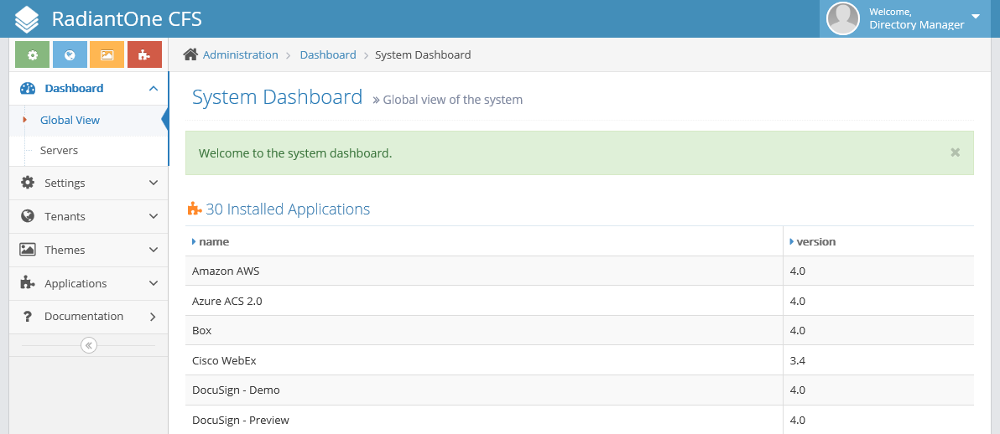

The **Servers** node displays all CFS servers configured in the system and their status. A CFS server can be _Master_, _Proxy_, _Proxy Web API_ or _System_.

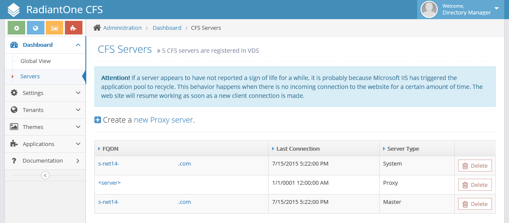

>[!note] The RadiantOne Trust Connectors do not appear in this list because they never contact CFS.

## Settings

### Settings Configuration

In the Settings section, the **Configuration** node contains many settings related to CFS.

-   Package Gallery URL – Since Radiant Logic manages a web gallery for application templates and themes, the location may change over time. This allows the CFS system administrator to change the location of the web gallery if needed.
-   Enable Web Proxy – Enable it in case your company requires a web proxy to access the internet. This parameter is used for downloading packages on the Web Gallery.
-   Web Proxy URL – URL of your company's web proxy.
-   Web Proxy Port – Port of your company's web proxy.

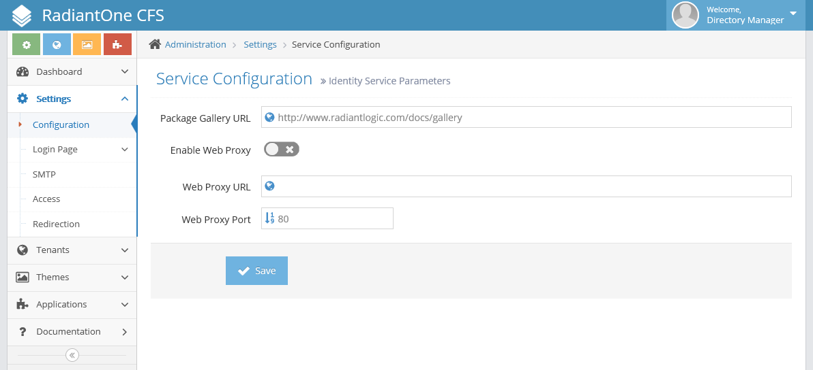

### Login Page

The **Login Page** configuration pages are used to configure the "Global Login Page" for both CFS Master and CFS Proxy. If you have more than one tenant, the global login page can display a login / password form or a custom HTML code. This feature allows to have different Global Login Page if you are on the CFS Master or the Proxy.

-   Enable Login Form - Activate the login / password form on the Global Login Page.
-   Logo - This is the logo displayed on top of the Global Login Page. The recommended size is 425px (w) x 270px (h).
-   Css - Use a custom CSS for this page.
-   HTML - Enter a custome HTML code if you don't want to display the login form

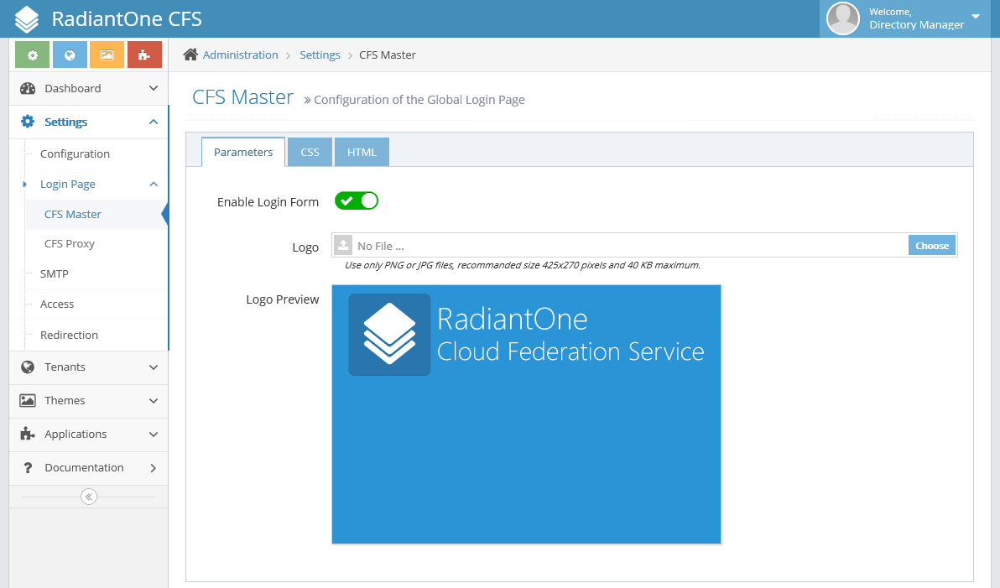

### SMTP

The **SMTP** node contains the settings required to send emails automatically for certain activities like user account creation, user account locked, user password reset, activities related to 2-step verification, and notifications related to certificate changes for CFS.

-   Enable Sending Emails – allows for activating and de-activating support for sending automated emails.
-   SMTP Address – address of the SMTP server.
-   SSL – whether SSL should be used to communicate to the SMTP server.
-   Port – port to connect to the SMTP server.
-   Login – login for the SMTP server (optional: only required if you enter a password).
-   Password – password associated with the login for the SMTP server (optional: only required if you enter a login).
-   From – address the automated emails should come from.

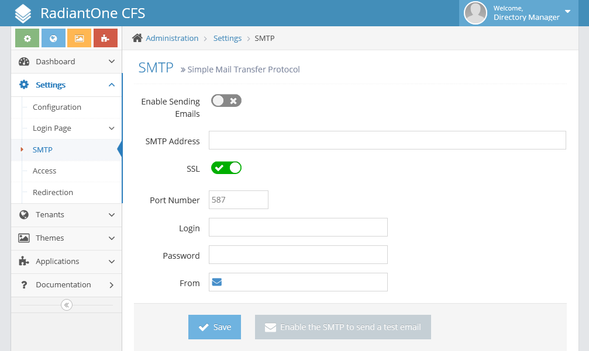

### Access

The **Access** node contains the settings for who can access the System Dashboard.

-   Enter the group that will be use to authorize a user to access the dashboard.
-   Enter the Root DN where to start the search for the user lookup.
-   At last, provide the attribute used to search for the user.

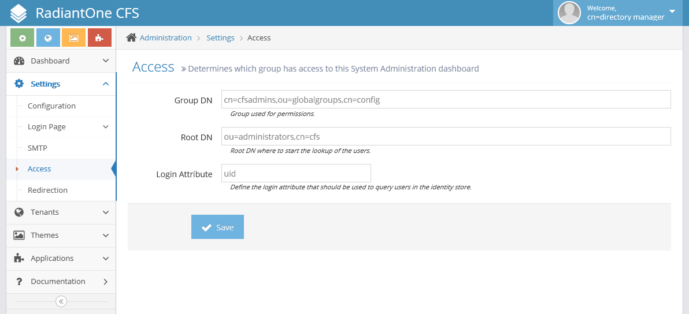

### Redirection

The **Redirection** node contains the settings to bypass the automatic redirection to the RTCs based on the user agent of the web browser. For example, a Linux machine or a smartphone don't have a kerberos token to provide for authentication so we might want to create rules that will prevent some web browser from being redirected to the RTC (if any).

-   Bypass all the following rules - check this option if you want to ignore the rules and let any web browser to access the RTC (if any).
-   Click the "New Rule" button to add a new rule.
-   Each textbox must contain the Regular Expression of the web browser user agent that you want to ignore.

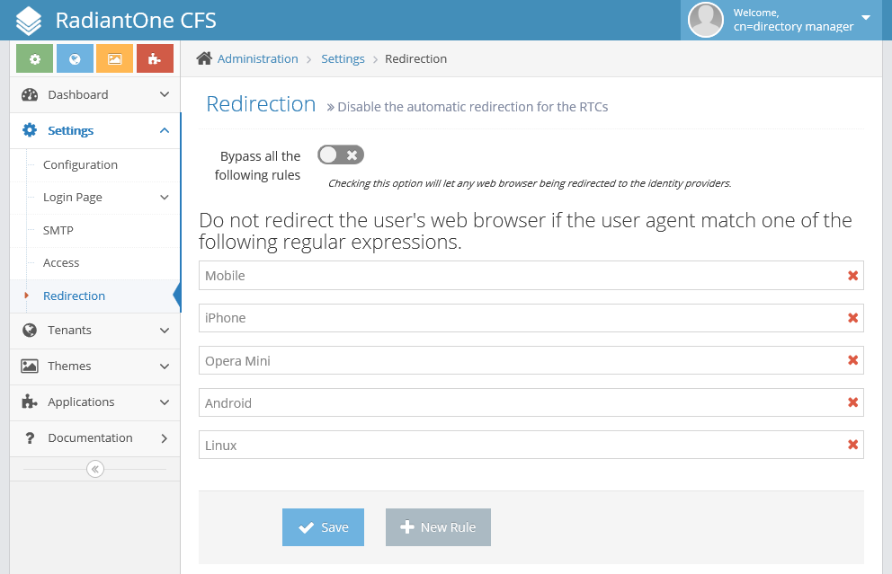

## Tenants

In the Tenants section, the **All Tenants** node displays a list of all configured tenants. You can edit the parameters of the tenant by clicking on the _Edit_ button. If you need to update the FID schema used by this tenant, click on _Schema_ button. To configure the self-registration for the tenant, click the _Registration_ button. You can also delete the tenant by clicking the _Delete_ button. Note that deleting a tenant from this interface does not delete the configuration in FID but only disables the tenant. If you want to definitely remove the tenant from FID, you can use the [PowerShell cmdlet](../configuration/powershell.html#tenants): `Remove-CfsTenant`.

### New Tenant

Tenants can be created from the **New Tenant** node.

On the **General** tab, enter the tenant name and the Login URL (associated with the tenant portal) field populates automatically.

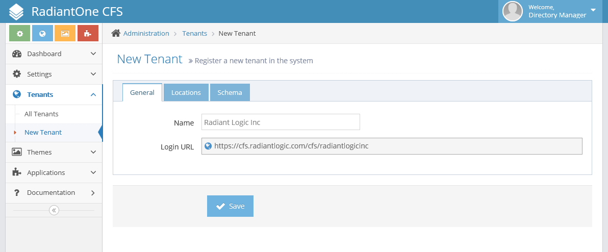

On the **Location** tab, specify the location in the identity store for people, groups and the default system groups used by CFS (HelpDesk and Tenant Administrators). This allows the CFS system groups to be located in a different container/naming context than the groups used for authorization of end/portal users. CFS will not try to create those groups for you. For users, this allows you to point to an existing container where all portal users for this tenant are located. If the tenant allows self-registered users, a container below the _People DN_ in the identity store must allow insertion operations for new user accounts. To enable support for self-registered users, please see the [Tenant Administrator Guide](tenant-admin.html).

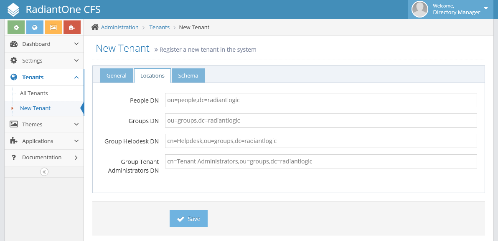

The **Schema** tab allows you to define the following:

-   The attribute that identifies users in the identity store
-   The identity store attribute that contains the "display name" for users
-   The identity store attribute that contains the users' email address
-   The object class associated with groups in the identity store
-   The attribute used to get the members of a group in the identity store

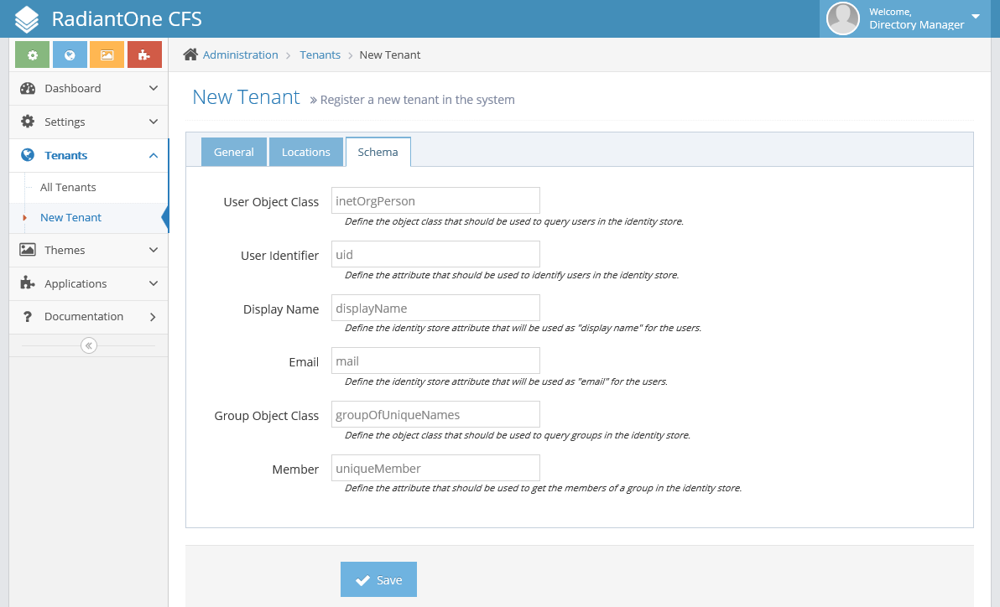

On the following screen, you must enter the email address of the user that will play the role of the Tenant Administrator. This user must exist in the identity store and have a valid email address. This user will be added to the CFS system group _Tenant Administrators_.

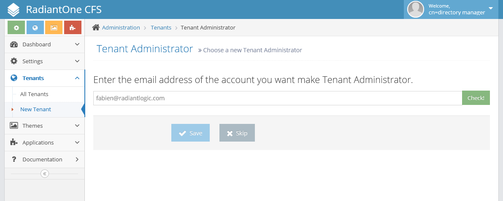

### Password Policy

You can set the password policy you want to use for a tenant in CFS. First of all, login into the FID Control Panel and create a new Password Policy. See the FID Documentation if you need help.

> **Note:** if you enter the value -1 for the _Minimum required special characters_, when CFS will generate a password for a user, no special character will be used.

Navigate back to the System web site for CFS and, in the Tenants section, click the **All Tenants** node. Then choose **Edit** for the tenant you want to apply the new password policy.

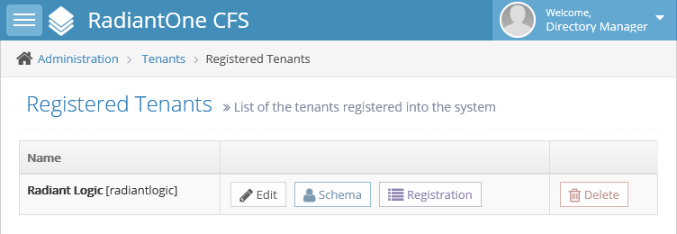

In the dropdown list Password Policy, select the new policy you have just created in your FID. The following field **Password Policy Description** is a text used displayed to indicate password strength requirements. e.g. Length, number of digits, special characters...

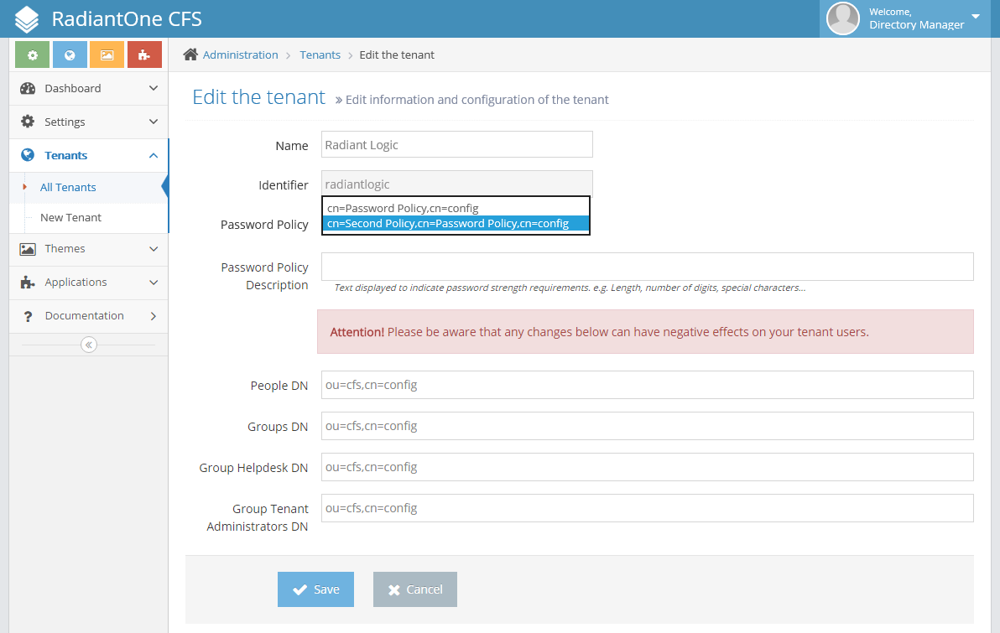

Click Save.

### Self-Registration

To configure the attributes allowed for self-registration (remember the Tenant Administration must also enable support for the self-registration of users):

> To enable support for self-registered users, please see the [Tenant Administrator Guide](tenant-admin.html#general-settings).

1.  Under the Tenants node, click **All Tenants**.
2.  Click the Registration button next to the tenant to be configured. The **Registration Attributes** page is displayed. 
3.  To add a registration attribute, click the red **'+'** sign at the top right corner of the Attributes table. The Add a new Attribute window opens. 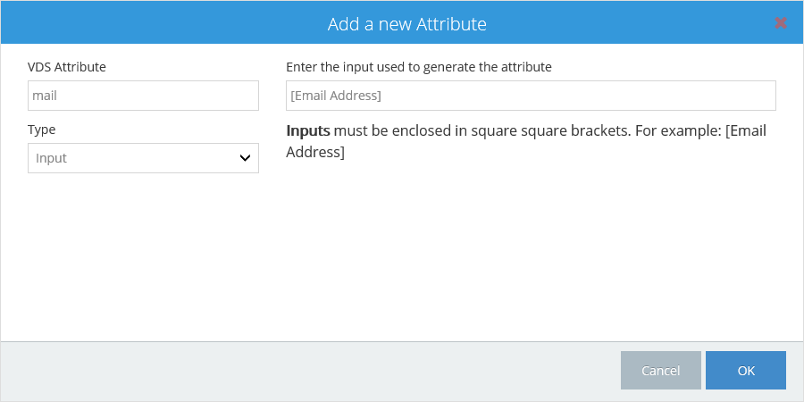
4.  Enter the name of the FID attribute. A list of relevant FID attributes populates as you type.
5.  Select a type from the pull-down menu. Options include _constant_, _input_, and _expression_.
6.  Enter a value in the field that populates when you selected the type. A constant will be a static value applied to all self-registered users. An input will be a value the user must enter during self-registration. An expression indicates how a value will be computed for the self-registered user.
7.  Click OK. The Registration Attributes page displays your new registration attribute.
8.  Click Save.

#### Computation functions

The expressions for the computation of attribute values can use the following functions:

-   **sub** gets a substring of an input.
-   **append** concatenates two or more inputs.
-   **lower** gets the lower case of an input.
-   **upper** gets the upper case of an input.
-   **trim** removes the leading and trailing spaces of an input.
-   **left** gets the left part of an input.
-   **right** gets the right part of an input.

#### Computation script

Computation scripts are written in C# and must contain the function `public string Compute(IDictionary<string, string> inputs)` The variable `inputs` is a dictionary that contains the list of inputs provided by the end user.

    public string Compute(IDictionary<string, string> inputs)
    {
        return "Compute your Value";
    }

Here are a few example you can use to compute your attributes.

    public string Compute(IDictionary<string, string> inputs)
    {
        // Extract a value from the dictionary with the key 'Firstname'
        return inputs["Firstname"];
    }

    public string Compute(IDictionary<string, string> inputs)
    {
        // concatenate multiple values
        return inputs["Firstname"] + " " + inputs["Lastname"];
    }

    public string Compute(IDictionary<string, string> inputs)
    {
        // use an extra variable
        string result = string.Concat(inputs["Firstname"], " ", inputs["Lastname"]);
        return result;
    }

### Themes

Themes determine the portal’s look-and-feel.

In the **Web Gallery** node of the Themes section, the CFS System Administrator can install the themes that they want to make available for tenants to use when designing their portals.

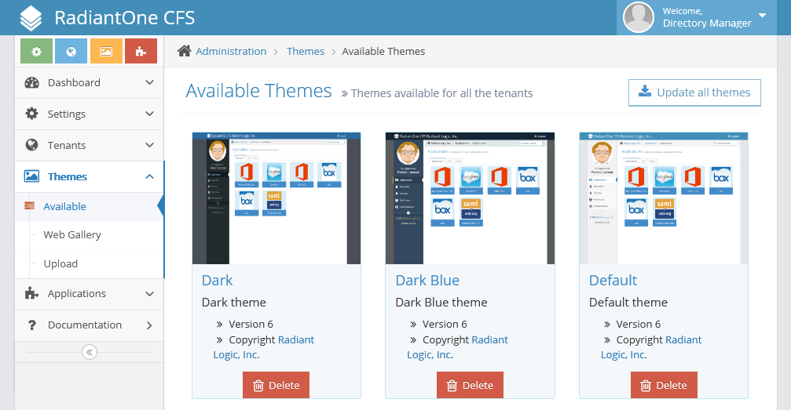

Installed themes are shown on the **Available** node. These themes are available for tenants to use for their portals. The **Update all Themes** button will look on the web gallery if there is any update for the templates installed.

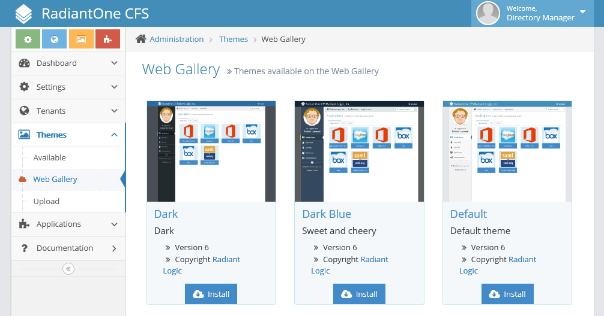

The **Upload** node allows you to upload a .zip theme file. Those files are provided by Radiant Logic.

### Applications

In the Applications section, the **Web Gallery** node contains all possible configuration templates. The **Download all the templates** button will download and install automatically all the templates available on the web gallery.

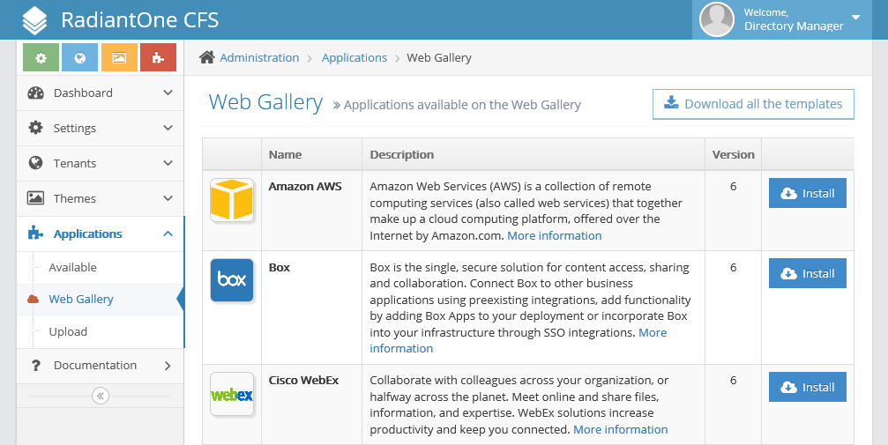

If an application is installed, it appears in the **Available** node and means that tenants are allowed to configure it for use in their portal. If support for an application should be removed, click on the Delete button next to the application in the list shown in the **Available** node. The **Update Templates** button will look on the web gallery if there is any update for the templates installed.

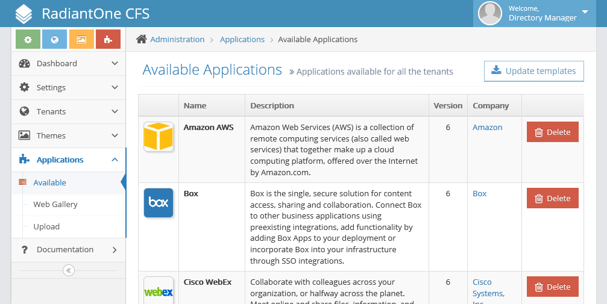

The **Upload** node allows you to upload a .zip application file. Those files are provided by Radiant Logic. Note that if you remove an application template from the list, if a tenant administrator has already configured an application with it, the application will not be removed from the tenant portal.

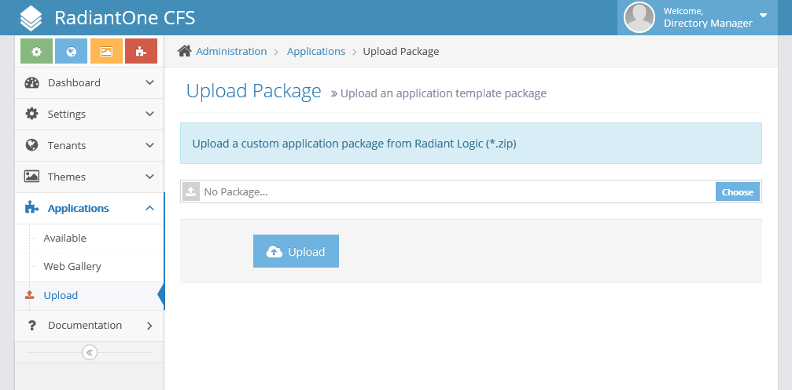

> For information on configuring applications, please see the list of [configurable applications](../configuration/applications.html).

## Tenant Administrator

CFS supports a multitenancy architecture allowing each configured tenant to manage their own groups, users, identity providers (authentication systems), applications and portal.

The CFS tenant administrator can configure the groups, users, identity providers and applications applicable for their portal.

### Dashboard

In the Dashboard, Global View section, the tenant administrator will see a list of all applications configured for the portal and their status: enabled or disabled.

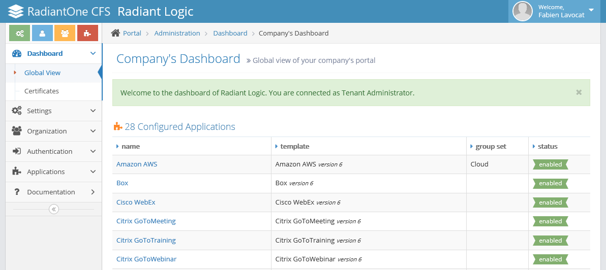

The Certificates section, wil display a list of all certificates used throughout the configuration. From this screen, it is also possible to download the public key of each certificate. For details on certificates and how they are used by CFS, please see [Certificates](01-getting-started#certificates).

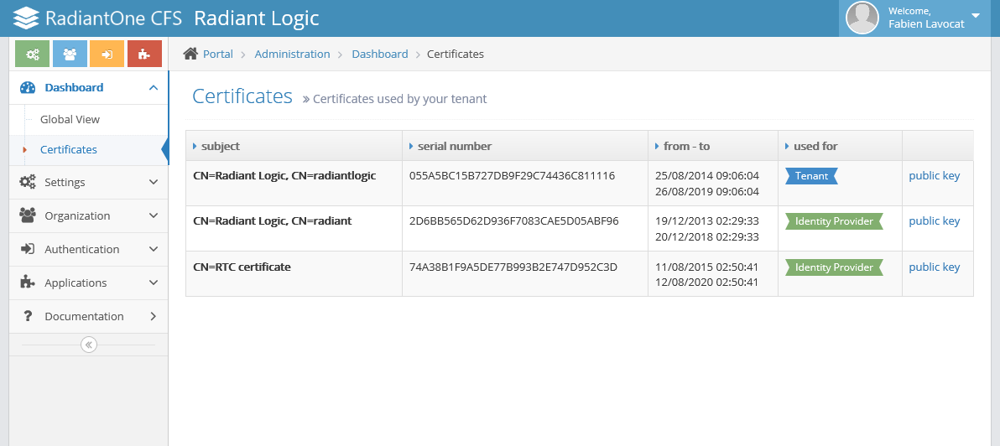

### Settings

#### General Settings

On the **Authentication** tab, you can define the lifespan of the cookie created when a user authenticates (default is 8 hours). You can also define the level of assurance associated with the tenant administration dashboard. The default assurance level is "Some" and can be changed from the "Level of Assurance" drop-down list. If a tenant administrator logs in with an authentication method that doesn't meet this level, they will be denied access to the administration dashboard. If the Level of Assurance is changed and the currently logged in tenant administrator didn't login with an authentication method that meets this level, they will be immediately disconnected from the administration dashboard. The "Auto Login" setting lets you define the behavior you want for the user when they reset their password. In the case they change the password in the CFS UI, allowing the auto login will tell CFS to automatically authenticate the users. They will then be redirected to the CFS portal.

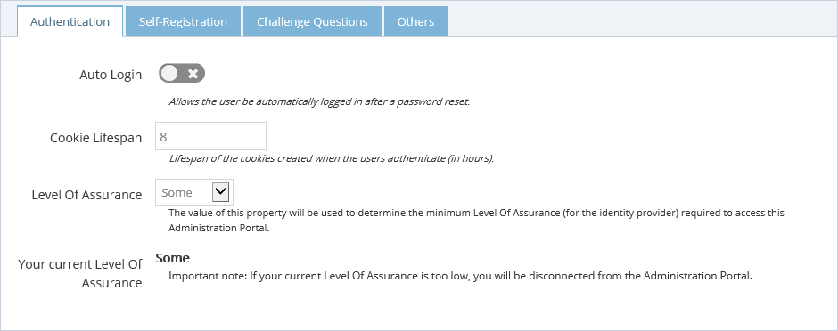

On the **Self-Registration** tab, you can define the policy for allowing new users to register themselves for portal access. If this behavior is desired, click the "Allow" option until a green checkmark is displayed in the User self-registration section. All self-registered users will be stored in the identity store below the indicated "Users Target OU". If a tenant administrator wants to change the location of self-registered users, click the "Change Target OU" button. Locations defined in the Organization Units section of the dashboard are shown to select from. The location for the self-registered users must be a location below the global "People DN" defined for the tenant in the CFS System Admin Dashboard. This location/target OU in the identity store must allow insertions, otherwise creation of user accounts fails. The attributes required for self registration are defined for the tenant by the system administrator. Refer to the [System Administration Guide](system-admin.html#self-registration) for more information.

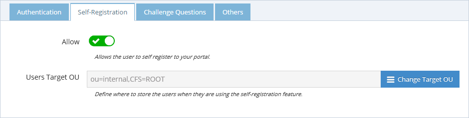

On the **Challenge Questions** tab, a tenant administrator can choose to activate challenge questions forcing a user to define answers to a given set of questions in order to be able to reset their password from the portal login screen. If this behavior is desired, click the "Activate" option until a green checkmark is displayed. Indicate the number of questions required for a user to answer for their account. This is the number of challenge questions that CFS is able to choose from when prompting the user for an answer during password resets. No matter how many number of questions are indicated here, the user must only answer one question correctly to go through the password reset process. However, CFS chooses which question to prompt the user with. The actual questions the user can choose from are defined on the [Challenge Questions](#challenge-questions) node in the Settings section.

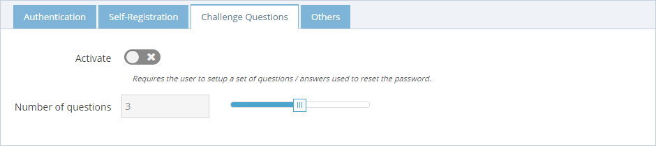

On the **Others** tab, a tenant administrator can choose to disable the access to the "My Groups" page on the end user portal.

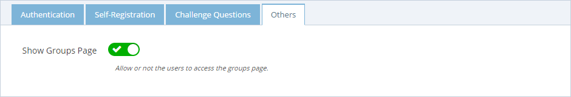

### Messaging Service

CFS supports [Twilio](https://www.twillio.com) as a messaging service for delivering passcodes to users. If this is enabled, users will be able to receive their passcode via text message or phone call. You must have your own Twilio account to configure CFS.

-   Click the "Enable Twilio" option until a green checkmark is displayed.
-   Enter the Account SID and Auth Token associated with your Twilio account.
-   Enter the phone number from which you want the text/phone call to come from.
-   Enter the text message you want to send users in the SMS Message Format property.
-   Enter the identity store attribute containing the phone number for the users.
-   Choose whether or not you want Twilio to be able to call users to give them the passcode.
-   Click Save when you are finished.

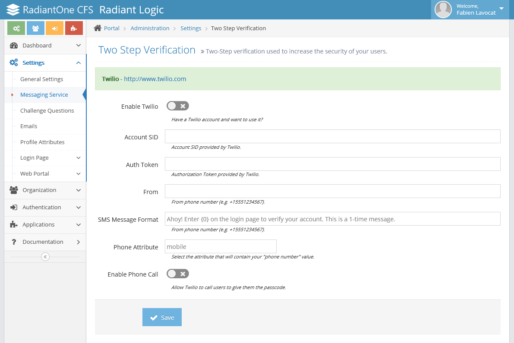

### Challenge Questions

On the "Challenge Questions" node, you can define which questions a user must answer correctly in order to reset their password. Some default questions are listed and if you want to create more, click the "New Challenge Question" button. The number of questions a user must answer correctly is defined on the [General Settings](#general-settings) node. After this is defined, the user must login to their portal account and go to the Security section. Locate the Challenge Questions and click Edit. Click the New Question button to provide answers to the desired challenge questions. This will enable the user to be able to reset their forgotten password from the portal login screen. It is important to note that even if a user is required to answer a certain number of questions, they will only be prompted to answer one question properly in order to reset their password from the portal login screen. CFS will decide which is the one question (from the total number of challenge questions configured) that the user must answer successfully. If a user has not defined answers for the required number of challenge questions, when they choose the "Forgot your Password?" link from the portal login screen, they will be automatically emailed a new password value as opposed to being able to reset the password value themselves.

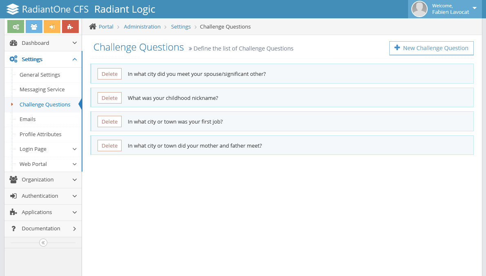

### Emails

Certain activities trigger emails to be sent automatically. The email templates are configured from the "Emails" node.

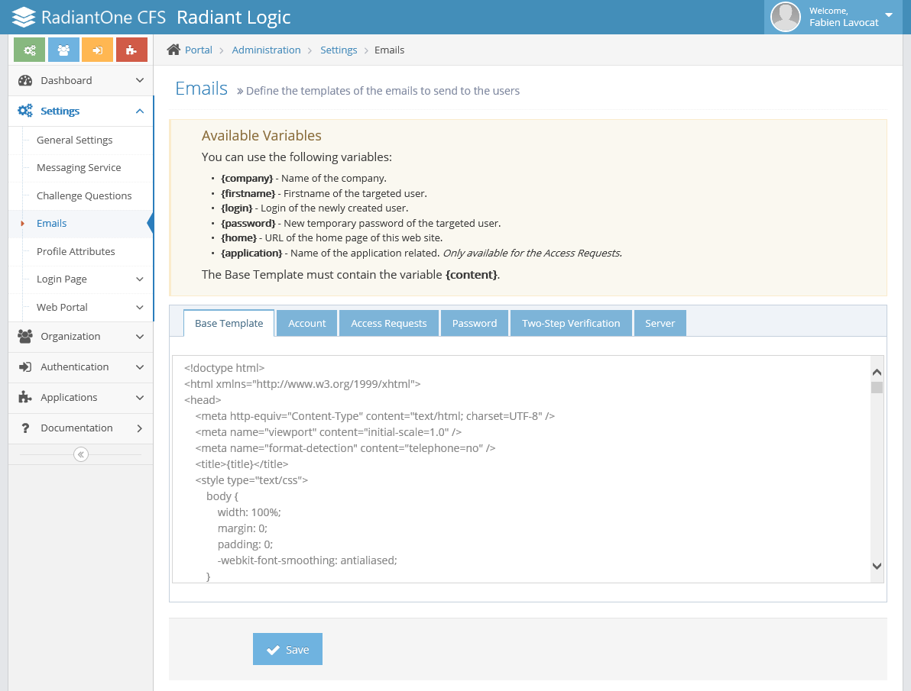

-   **Base Template** is the template that will be used for all emails.
-   **Account** contains the email templates that will be send when an account is created or has been unlocked.
-   **Access Requests** contains the email templates that will be send when someone request access to an application and when the request has been granted or denied.
-   **Password** contains the email templates that will be send when a password has been reset.
-   **Two-Step Verification** contains the email templates that will be send for the two-step verification process.
-   **Server** contains the email templates that will be send when the CFS server trigger an important event.

### Profile Attributes

Profile attributes are what will be shown for portal users when they access their "My Profile".

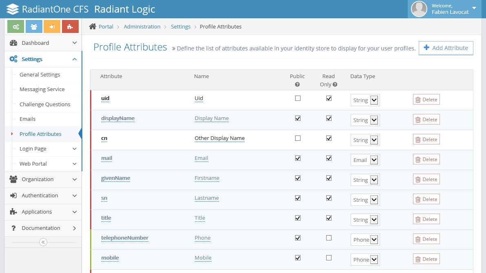

From here you can change the attribute display name shown in the portal ("Name" column) and the corresponding attribute in the identity store ("Attribute" column). You can indicate if the attribute is public (allows users other than the owner to view it when using the search feature), read only (does not allow this attribute to be edited by the user), and define a data type (to assign a syntax for the displayed value). Data types available are string, photo, email and phone.

To add a new profile attribute, click the "Add Attribute" button. Enter the attribute name as it exists in the identity store schema and the display name you want shown in the portal. Indicate if the attribute is public and/or read only and click OK. Select a Data Type from the drop-down list (there is not one set by default).

If you have this attribute `skills` in your FID like on this picture.

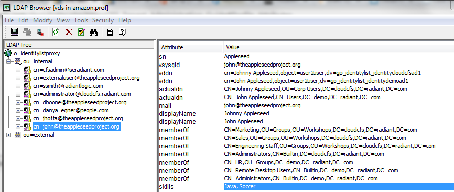

You should see the result on the profile page.

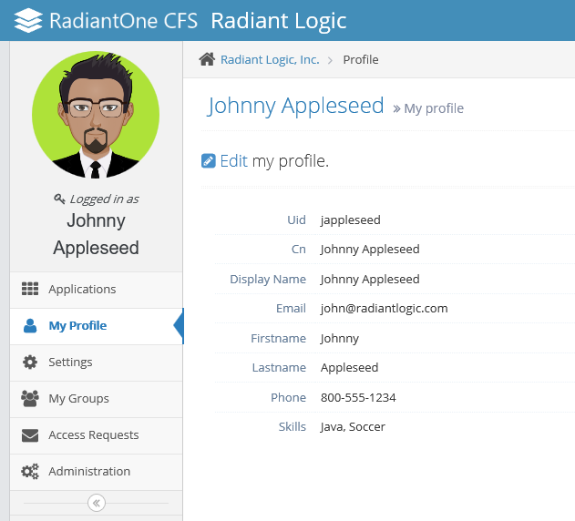

### Login Page

The Customize section allows you to personalize the look and feel of the portal login screen.

-   Portal Logo - Use only PNG or JPG files, recommended size 425x270 pixels and 40 KB maximum.
-   Sign In Text - _Optional_ Use if you need to give helpful information to your users before they sign in. You may include the contact information for your helpdesk.
-   Other IdPs description - _Optional_ You can add a message to explain what are the external identity providers (like ADFS, OpenAM...)
-   Disclaimer - _Optional_ You may want to add a disclaimer at the bottom of the page to inform the guests about your company policies...
-   CSS - The CSS tab allows you to completely customize the look of the login page to fit your company colors.

The Presentation section allows you to organize the position of the different identity providers you might want to use on your login page. Simply drag and drop the different section on the page and press the Save button.

### Web Portal

In the Web Portal section, you can customize the presentation of the end user portal and the tenant administration.

-   Portal Title - Choose the title you want to see on the top of the portal.
-   Portal Logo - Choose the logo you want to see on the top of the portal.
-   CSS - The CSS tab allows you to completely customize the look of the portal by writing your own CSS.

In the Themes section, you can activate the theme you want to help you having a different portal experience very quickly.

>[!note] only themes allowed by the CFS system administrator are available here.

### Organization

In the Organization section, users, groups and organizational units can be managed.

### Users

From the "Users" section, you can search for users in your company, create new users, lock and unlock an account, reset a password and update the user profile.

>[!note] It is not possible to delete a user from this panel. You must do it from the FID Control Panel (or an LDAP Browser).

Possible actions on an account: 

-   **User Details** - Open the profile of the user.
-   **Edit user details** - Edit the profile of the user.
-   **Reset password** - Reset the password for the account and send an email to the user with the new password.
-   **Lock / Unlock account** - Lock or unlock the user's account and send an email.
-   **Set YubiKey** - Set the user's YubiKey.

To create a new user, click the "New User" button. Then, select the desired location/organization unit and provide the required attributes (e.g. email address, first name and last name...). These attributes are defined in the [System Administration Guide](system-admin.html#self-registration). Then click the "Save" button to create the new account. An email will be sent to the user with the password.

### Groups

Groups are leveraged for access permissions. They define the administration permissions assigned to the configuration dashboard and can be used to assign access controls to applications. There are two default groups needed per tenant: Helpdesk and Tenant Administrators.

>[!note] The CFS Sytem groups cannot be deleted but members can be added or removed.

To add members to a group, click the "+" button next to the group you want to manage. Click the "Add Member" button. Enter the name of a user to search for in the top right and click the "Search" button. Check the desired members and click the "Add to the group" button.

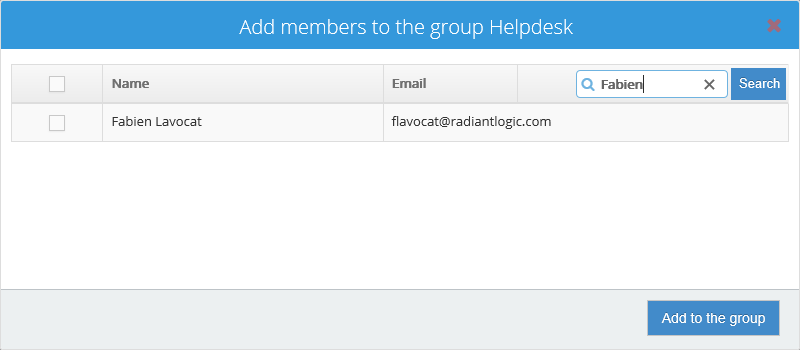

To remove a member from a group, click the red "trash" button next to the member you want to remove.

To create a new group, click the "New Group" button. Provide the group name and description (optional). You can also provide the full DN of the owner of the group. Click the "Save" button to create the group.

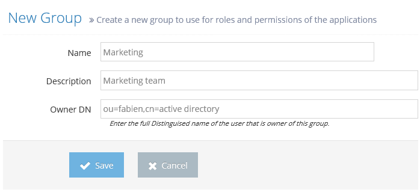

### Organization Units

The portal user accounts are stored in the identity store. The organization units are the locations/containers where the actual accounts are stored. You can add new organization units from the Organization Units section. Select the parent of the new OU and enter a value for the "Name" property and click "Save".

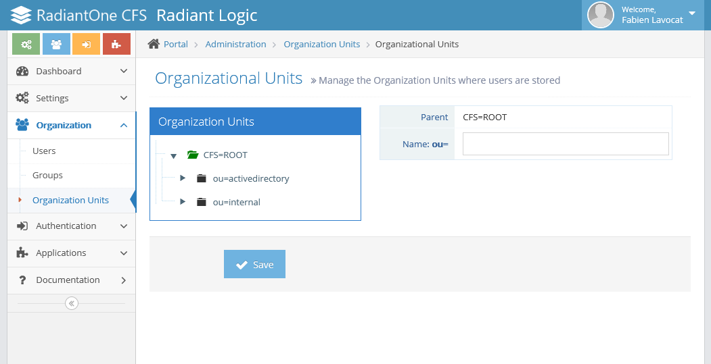

### Authentication

A tenant administrator configures the authentication methods they want to support for their portal in the Authentication section. There are five types of authentication systems available and one or more can be activated. For more details on how to configure each identity provider, please refer the [Identity Providers section](../configuration/identity-providers.html).

### Applications

### Configured

For more details on each application, please refer to the [Applications guide](../configuration/applications.html). You can use the "Gallery" to choose what application you want to configure using a template. If your system administrator has provided you with an application packages (.zip file), you can click the button "Upload the custom package from Radiant Logic" and select the file you have.

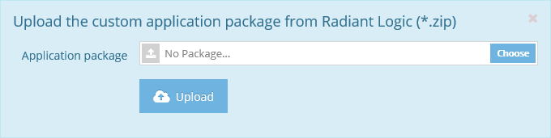

This guide will explain the different feature of the application configuration pages. Anything specific to an application is described in the [Applications section](02-configuration/#applications).

#### Group Sets

Group sets are a way to categorize different applications in your portal. The value of the group set property you define for the application will indicate which "tab" the application icon appears on in the portal.

For example, the default tab in the portal is titled: Applications. This is where all configured/available applications will appear in the portal. If you wanted to categorize some of the applications to appear on a different tab, you can enter a name in the group set property for those applications and a new tab will appear in the portal accordingly.

#### Access Rules

By default, an application has no restriction on the group the user is member of. You can specify the list of group of users who have access to your application by unchecking the option "Allow All Users" and click on the red "+" button and selecting a group. These groups will allow member having access to the application (unless further security layer like LOA or COT or Filter blocks the access).

Also, when creating a new application, CFS will automatically create a group associated and all Access Requests will go in this group. Click the "Application Group" link to manage this group.

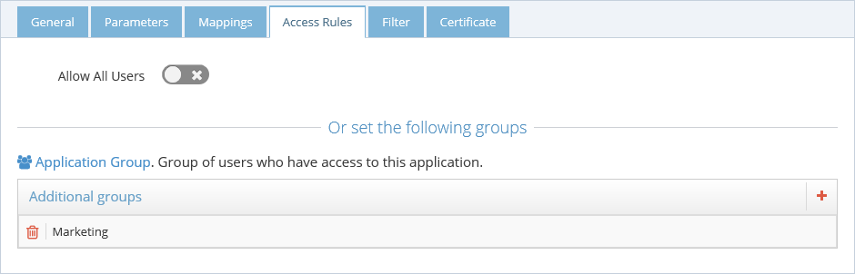

#### Filter

A user can be authorized to access an application based on certain attributes in their profile which are stored in the identity store, come from the pass-through rules in each identity provider or the Circle of Trust rules. This criteria is defined on the Filter tab. Define a filter that dictates which criteria are required for a user to be qualified to access this application. Any user whose profile attributes do not match the indicated criteria will not be authorized to access the application. In the example shown below, only users that have an "l" attribute with a value of "novato" and the attribte "Building" (CoT rules) with the value "buildinga" will be authorized by CFS to access this application.

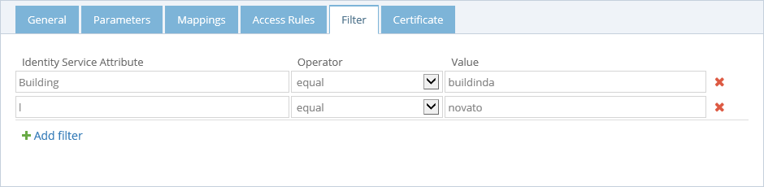

#### Certificate

CFS will generate a certificate for each new tenant. This certificate is used by default for each application of the tenant. It means, all the applications of the same tenant will used the same certificate (unless changed using the following guide). To change the certificate used by application, open the tab "Certificate" in the application configuration and check the option "Use a dedicated certificate".

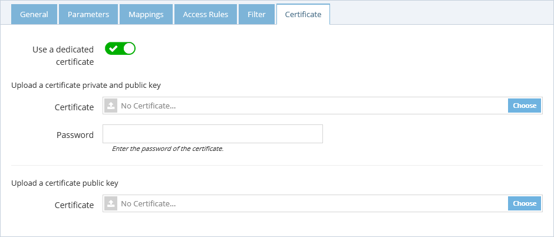

You now have two options offered to you.

-   Upload a certificate private and public key - If you upload a "full" certificate, you must provide the password that will be used to sign the tokens. This option will store the certificate (private and public keys) in the FID.
-   Upload a certificate public key - This option will store only the public key of the certificate in the FID. This is the most secure option because, in order to sign the tokens, each CFS machine will look into the Windows Certificate Vault of the computer in order to get the certificate private key.

### Gallery

The "Gallery" section contains all the application templates made available by the system administrator.

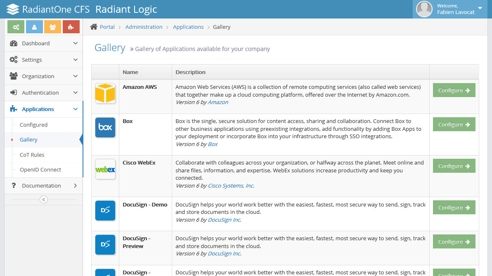

Click "Configure" next to a template to create an application using this template.

### Circle of Trust

For an introduction to Circle of Trust, please see the [Concepts](01-getting-started/#concepts) section of this guide.

Based on the location of the user, CFS will add a new claim to the user session that can be used to restrict access to sensitive applications.

> **Tip:** the location of the user is determined by the IP address and / or the DNS resolution. If your CFS servers are protected by a proxy, you are probably using the [X-Forwarded-For](https://en.wikipedia.org/wiki/X-Forwarded-For) HTTP header field to provide to the server the real address of the user. CFS is now capable of detecting this field to find the Circle Of Trust rule.

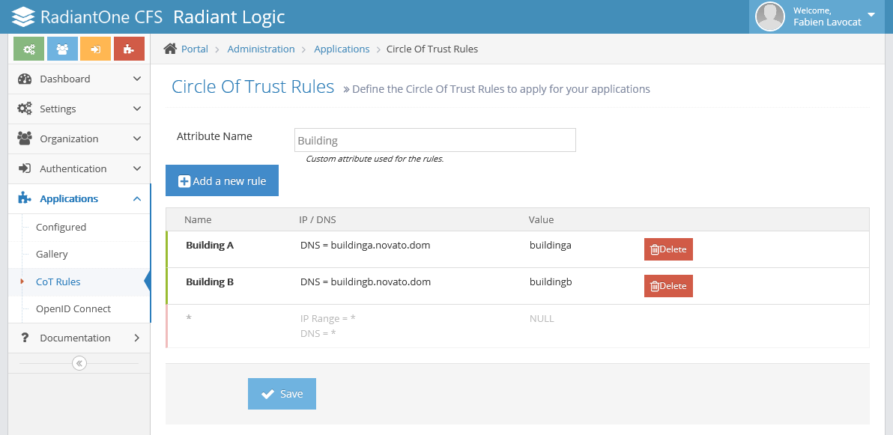

The "Attribute Name" is the name of the claim that is stored in the session. You can use this name as an "attribute" when creating a filter for an application.

To create a new CoT rule, click the "Add a new rule" button.

-   Enter a name for this rule.
-   Enter a set of IP addresses, IP Ranges or DNS.
-   Enter the value that will be used to create the new claim in the user session.
-   Press OK to create the rule.
-   Press Save to save your configuration.

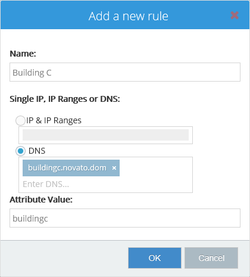

### OpenID Connect

To learn about OpenID Connect, please visit [https://openid.net/connect/](https://openid.net/connect/). CFS can be an identity provider using the protocols OAuth 2 and OpenID Connect.

To create a new OpenID Connect application, click the button "New OpenID Connect Application". Then provide all the information regarding your application.

At the bottom of the page, get the application key and application secret and use them inside your application to authenticate against CFS.

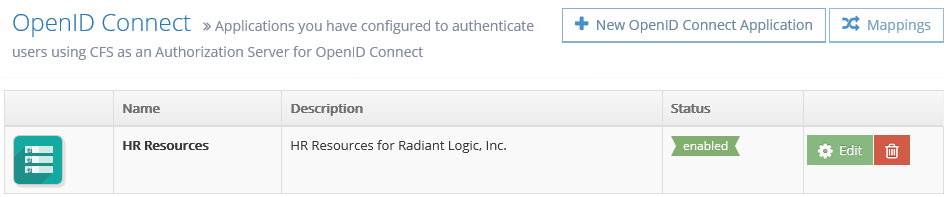

To specify the attribute you want to send to the application when they are requesting user's OAuth tokens, click the button "Mappings" and, for each scope, enter the name of the FID attribute you want to use for the specific attribute.

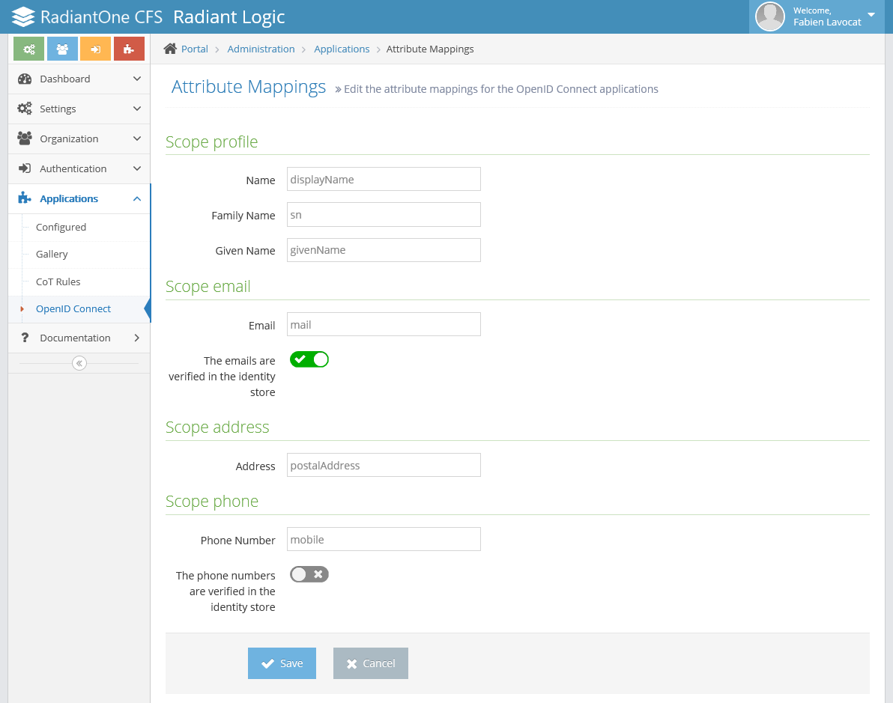

### Helpdesk

A helpdesk user is defined as someone who may perform one or more of the following activities:

*   Manage the [users](tenant-admin.html#users) of the tenant.
*   Manage the [groups](tenant-admin.html#groups) of the tenant.
*   Manage the [organization](tenant-admin.html#organization-units) units of the tenant.

# Portal User

## Self-Registration

A user that does not have an account in the identity store can self-register at the portal login screen (if this function is enabled by the tenant administrator).

On the login page, click the link "Register today".

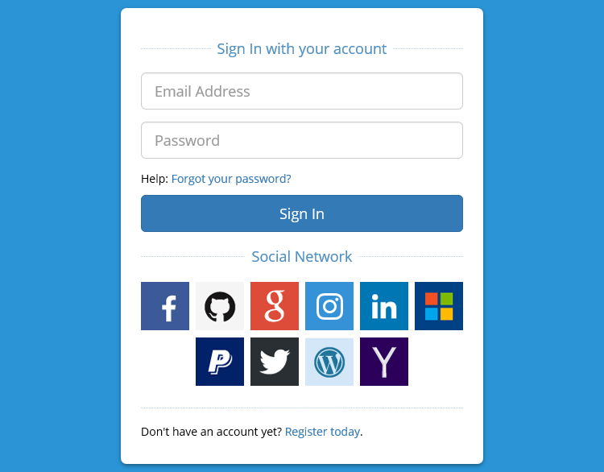

The next page is the registration form. You can use one of the social network to automatically link your CFS account and to pre-populate the available fields. This feature has to be enabled by the tenant administrator.

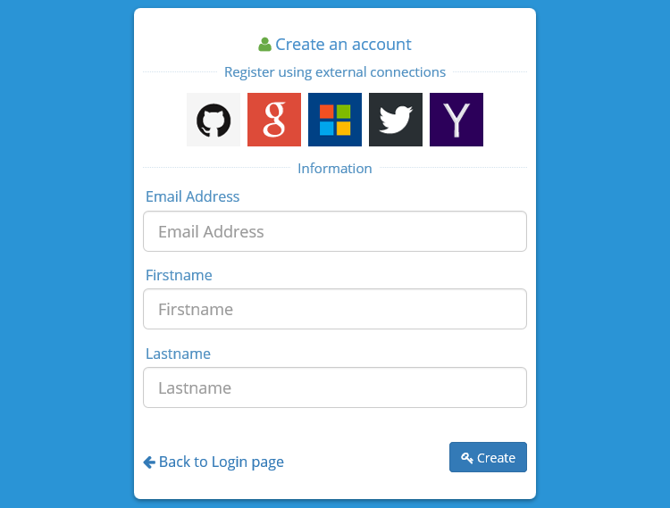

Enter the required information on the form. If required, select your challenge questions and type the answers. You will then, receive an email containing your new password to the email address you have provided.

## Applications

### Applications Portal

To access the **applications portal**, the user must be logged in. Only applications the user is authorized by CFS to access are displayed. Click on the icon corresponding to the application you want to access. The user is automatically logged into the application.

-   If you think you should have access to an application that is not shown, contact your tenant administrator.
-   The application under the title _Application not available at your current level of assurance_ are not available until you log in with a more secure authentication system.

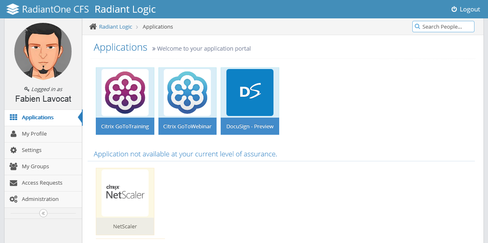

### Request Application Access

During RP-initiated SSO (when a user navigates directly to an application as opposed to going first to the CFS portal page), if the user does not have access to the application (CFS as the enforcer), they will be prompted at this time if they want to request access.

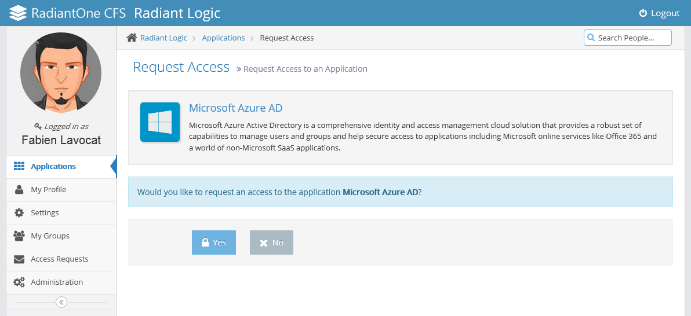

Simply click the button **Yes** and an email will be sent to the application owner to request access to this application. When the owner grants you the access you will receive a confirmation email and then, you'll be able to access this application (as long as you comply the other security levels).

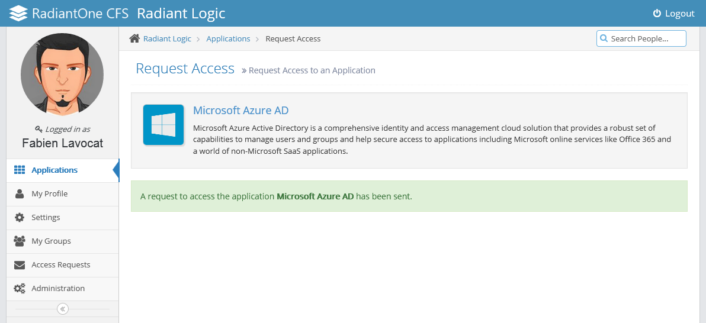

### Grant Application Access

As the owner of an application, when a user request access to it, you will receive an email asking you to confirm (or deny) the request. On your web portal, navigate to **Access Requests** section in the left menu and choose the application you have requests pending.

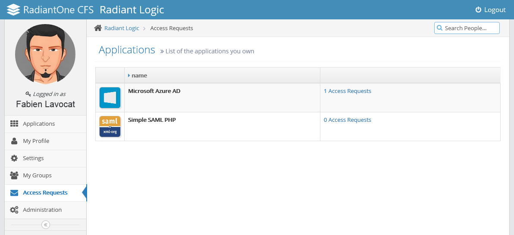

Then, simply click the button **Accept** or **Deny**.

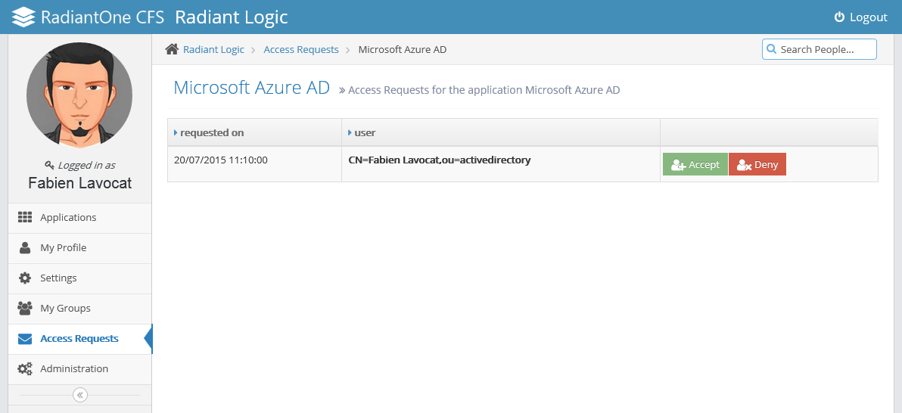

A confirmation email will be sent to the user requesting the access to confirm your decision.

>[!note] The SMTP must be configured for CFS to be able to send emails.

##User Settings

### Password Reset

#### Changing Your Password

Log in on your CFS account and navigate to the **Settings** page and select **Password - Change your password**.

Provide your previous password and the new one twice.

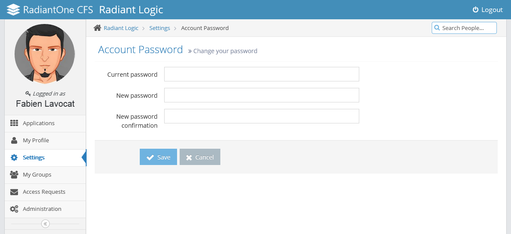

Press **Save** to validate the new password.

#### Resetting a Forgotten Password

On the login screen, click the **Forgot your password?** link.

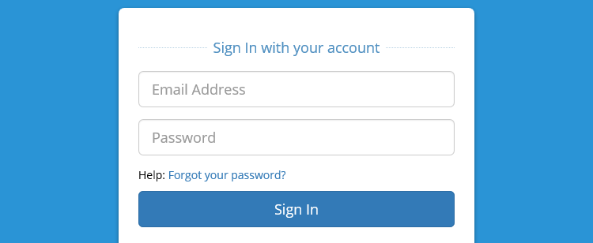

Enter your username and click **Search**.

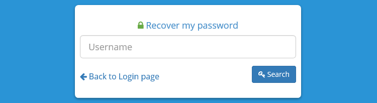

If you have defined challenge questions in your account, you will be prompted for one answer.

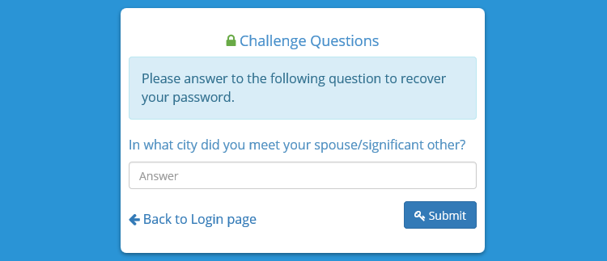

If you do not have challenge question in your CFS account, you will be asked to confirm CFS will reset your password.

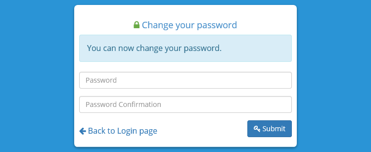

If you answer the challenge question correctly, you will be able to change your password.

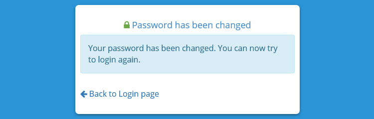

When your password is changed, you will get a confirmation message.

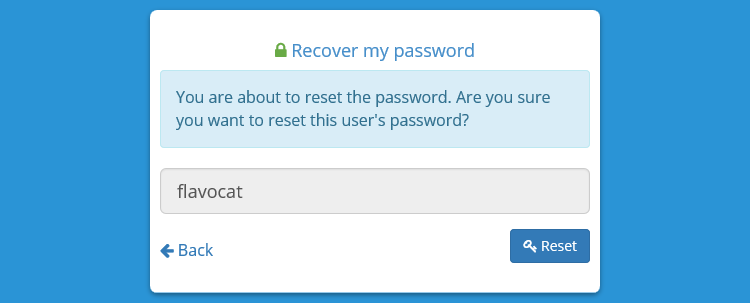

### Challenge Questions

Login on your CFS account and navigate to the **Settings** page and select **Challenge Questions - Edit**.

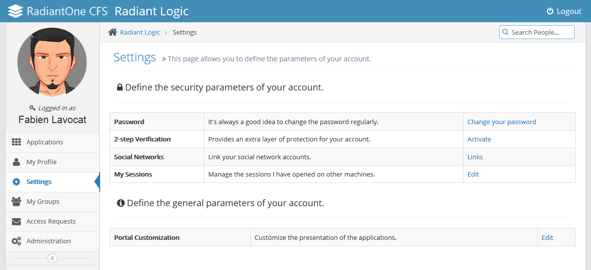

Click the link **Add a new question**. Select your Challenge Question and enter an answer.

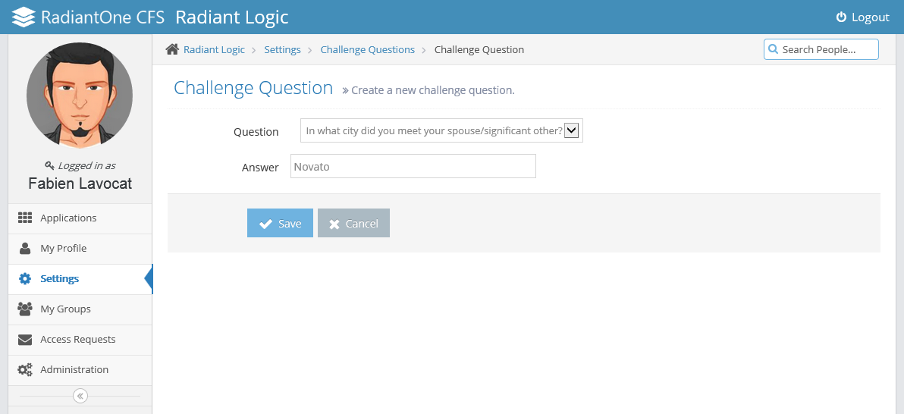

> **Info:** The possible questions are defined by the tenant administrator.

You challenge question should appear on the screen.

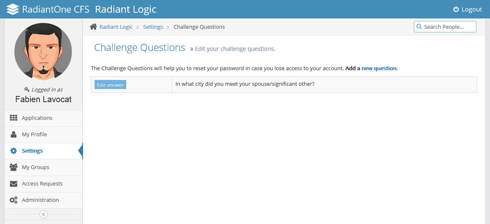

### Link a Social Network account

If the tenant administrator has allowed users to login with their social network accounts, the users may link their portal login with their social network accounts.

Login on your CFS account and navigate to the **Settings** page and select **Social Networks - Links**.

In the list of social networks made available by the tenant administrator, select the one you want to link.

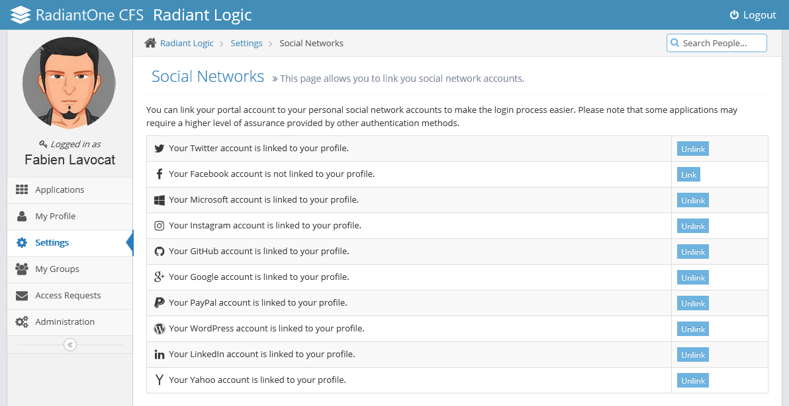

If you select for example _Facebook_, you should be redirected to facebook.com and will be prompted for your credentials.

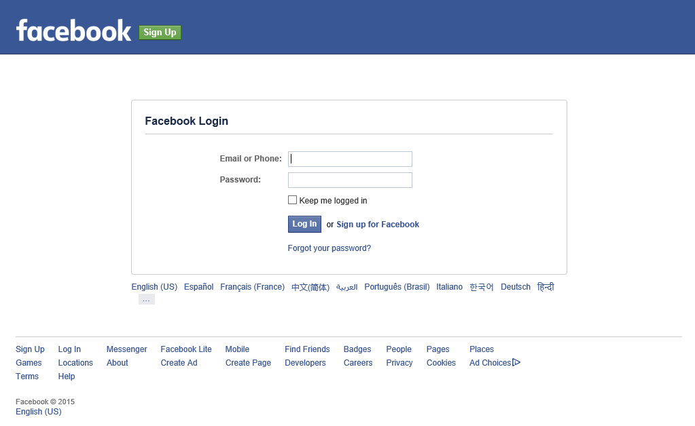

Then you have to accept that CFS will be able to get some information about your profile and your email address.

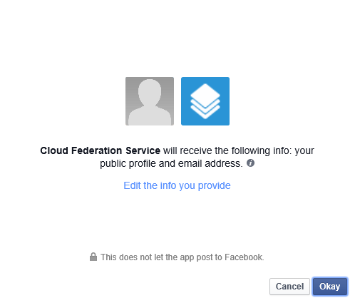

Once it's done, you are redirected to CFS and you can see if you account has been properly linked.

To try if the social network login works, logout from CFS. On the login page, click on the social network you've linked to your account.

You should be redirected to the social network. Then enter your credentials and you will be redirected back to CFS and logged in into CFS.

### User Sessions

Each user can check the session that are currently still opened on their CFS account. This can help to detect fraudulent sessions.

Login on your CFS account and navigate to the **Settings** page and select **My Sessions - Edit**.

On this page you can see all the session you have opened with different computers/mobile devices and the web browser used.

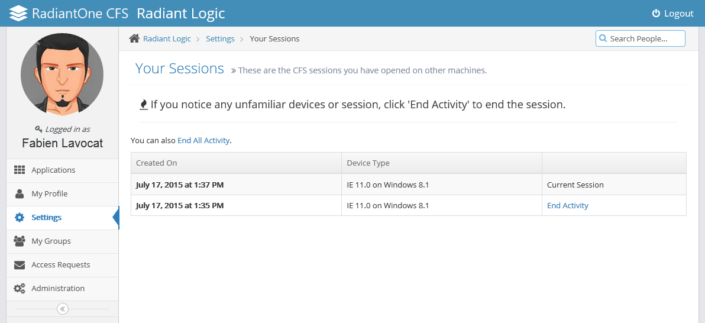

-   Click the **End Activity** link to terminate a specific session.
-   Click the **End All Activity** link to terminate all the sessions except the current one.

### Enable Two-Step Verification

Two-step verification is a method to provide an additional level of security to form-based (login/password) authentication. If this functionality is enabled by the tenant administrator, a user may retrieve the needed passcode via email, text message/phone call (if the tenant administrator has configured [Twilio](https://www.twilio.com) ), or by using an authenticator application on their smartphone (if allowed by the tenant administrator).

In order to use an authenticator application on your cell phone, you must synchronize your CFS account with your Authenticator application.

#### Install the Authenticator application on your smartphone

##### Android devices

**Requirements:** To use Google Authenticator on your Android device, it must be running Android version 2.1 or later.

Downloading the app:

1.  Visit [Google Play](https://play.google.com/).
2.  Search for Google Authenticator or click this [link](https://play.google.com/store/apps/details?id=com.google.android.apps.authenticator2).
3.  Download and install the application.

##### iPhone, iPod Touch, or iPad

**Requirements:** To use Google Authenticator on your iPhone, iPod Touch, or iPad, you must have iOS 5.0 or later. In addition, in order to set up the app on your iPhone using a QR code, you must have a 3G model or later.

Downloading the app:

1.  Visit the App Store.
2.  Search for Google Authenticator or click this [link](https://itunes.apple.com/us/app/google-authenticator/id388497605).
3.  Download and install the application.

##### Windows Mobile devices

**Requirements:** To use Authenticator on your Windows Mobile, you must have Windows Phone > 8.0 or Windows Mobile > 10.

Downloading the app:

1.  Visit the Windows Store.
2.  Search for Authenticator or click this [link](https://www.microsoft.com/en-us/store/apps/authenticator/9wzdncrfj3rj).
3.  Download and install the application.

##### BlackBerry devices

**Requirements:** To use Google Authenticator on your BlackBerry device, you must have OS 4.5-7.0. In addition, make sure your BlackBerry device is configured for US English -- you might not be able to download Google Authenticator if your device is operating in another language.

Downloading the app: You'll need Internet access on your BlackBerry to download Google Authenticator.

1.  Open the web browser on your BlackBerry.
2.  Visit m.google.com/authenticator.
3.  Download and install the application.

#### Activate Two-Step

Login into your CFS Account and navigate to the **Settings** page and select **2-step Verification - Activate**.

With the application Authenticator on your smartphone, scan the displayed QR-Code.

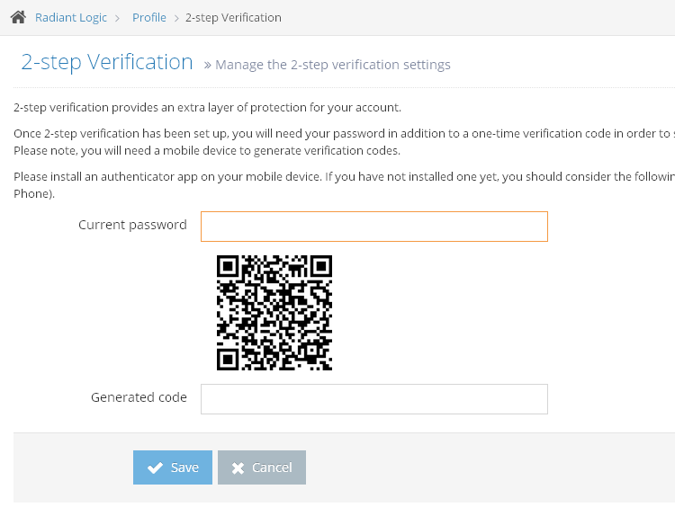

-   The application should display a six digit code. Enter this code in the **Generated Code** textbox.
-   Validate the screen, click on **Save**.

If you want to disable the Two-Step, go back to the **Settings** page and click on **2-step Verification - Remove**. Click **Edit** if you want to re-synchronize your phone.

Once this is setup, when you log into the portal with your login/password, you are prompted to enter the current passcode which you can get by launching the authenticator application on your cell phone. A new passcode is generated every 30 seconds. If you do not have access to your phone, you can choose to email a passcode to you instead. You have 30 minutes to get the passcode from your email and use it to login with. If your tenant administrator has configured the Twilio messaging service, you can have the passcode texted or phoned to you.

## User Profile / Search

### Edit User Profile

Log in to your CFS account and click on the **My Profile** section.

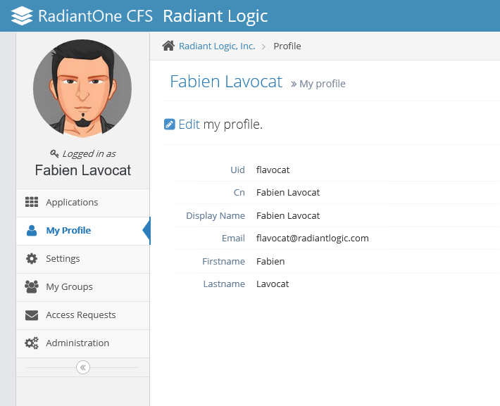

Click **Edit** link to modify your profile information.

>[!note] Only attributes defined as editable by the tenant administrator can be modified.

To add/modify your profile picture, click on **Choose** button next to **Change Photo**.

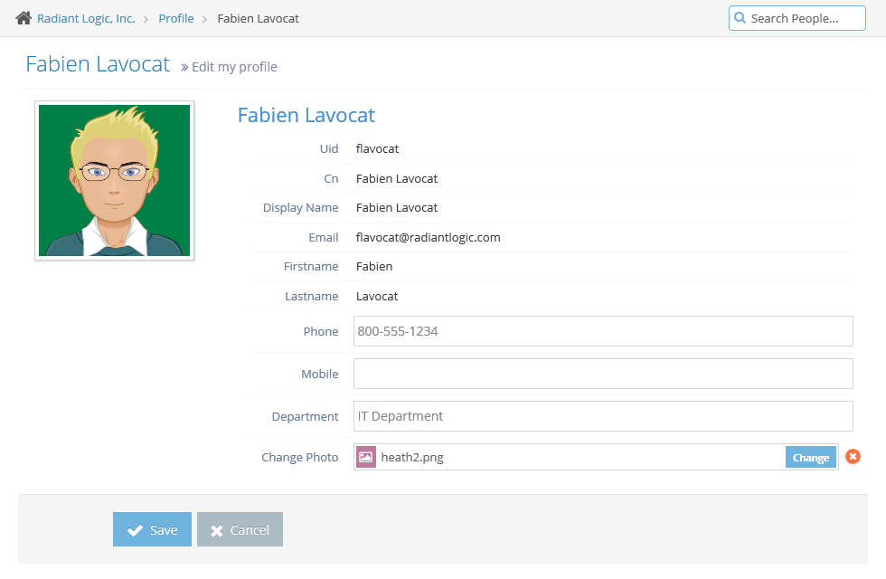

Browse to the photo to upload and click Open. Then, click **Save** button. The next page will show your profile with the new information.

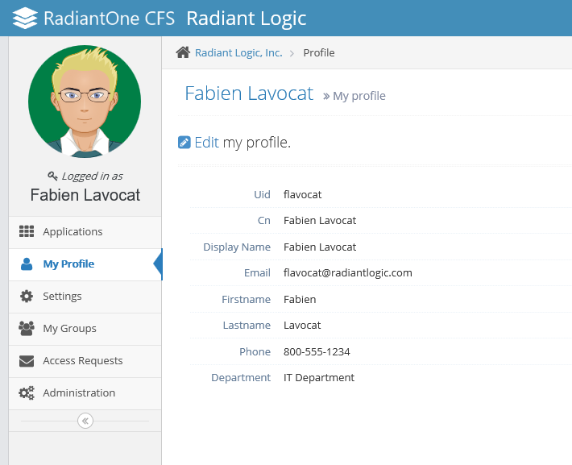

### Searching for Users

From any page of the portal, there is a search box in the upper right corner. You can search for other users that are associated with the same tenant as yourself.

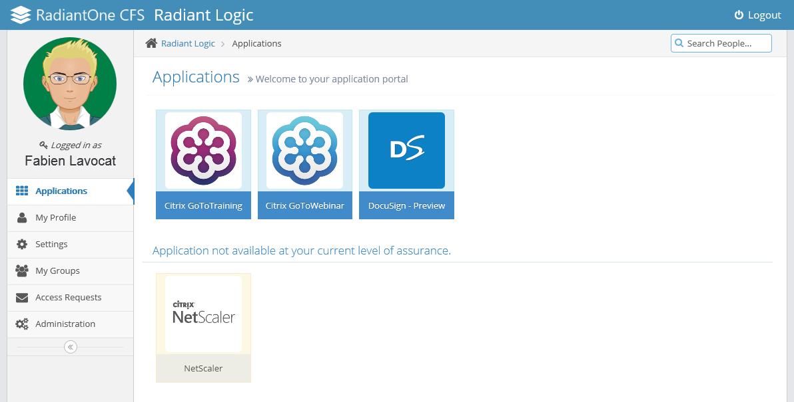

The search result will return the attributes configured by the tenant administrator. In this example, the user’s email, telephone number and photo are returned.

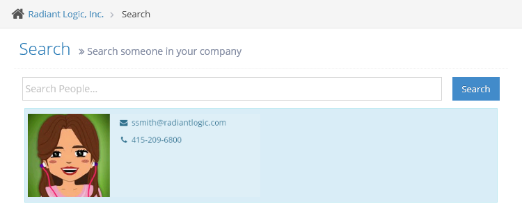

