# Troubleshooting

## CFS Log Analyzer

The CFS Log Analyzer is the tool used for monitoring and troubleshooting the CFS server, as well as for auditing and creating reports. It displays all available information about user activity and log files. It allows you to view logs, and filter the data however you want. All reports can be exported to Excel. The Log Analyzer is installed on the same machine as the CFS server.

The Log Analyzer is installed on the same machine as the CFS server. You can find the tool here: `C:\Program Files\Radiant Logic Inc\Cloud Federation Service\Tools\RLI.CFS.Tools.Admin.exe`

Navigate to `C:\inetpub\wwwroot\CFS Web Site\cfs\Logs` and click OK.

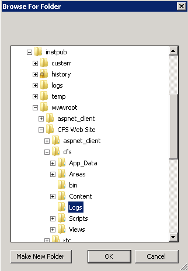

The Log Analyzer has three main sections accessible at the top: Data, Stats, and Logs. Each is described in more details below.

### Data Section

The Data section displays a summary of activity of your server. From here you can get a glimpse of the total amount of log activity per day (shown in the bar chart at the top). If you see any red areas in the chart, this indicates errors have occurred on that particular day. The log details for a selected day are shown below.

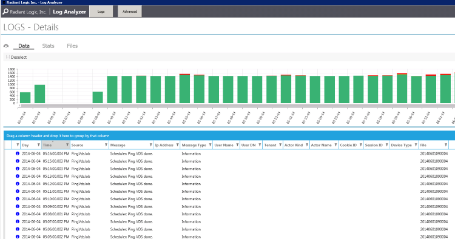

>[!note] If logs are deleted from the Logs directory on the CFS machine, it could compromise the log system.

To change the type of log activity you want to see, click on the "filter" button and mark what you are interested in (Connect, ConnectError, Disconnect, Information, Operation, Warning or Error). Only these types of log activities will be shown.

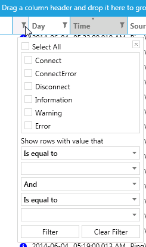

### Stats Section

The Stats section allows you to view more detailed information from the logs. Some of the important information is represented graphically (the hours during which the most users are connected, the average time of a user session on the portal).

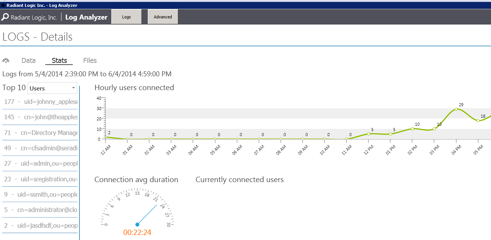

On the left side, the top ten most used applications, the top ten most used Identity providers, and the top ten most connected users can be seen. The default view shows the Top 10 most active users. To view activity for a specific user, select the desired identity from this list.

To view the Top 10 most used applications, click in the drop-down list next to "Top 10" and select Applications.

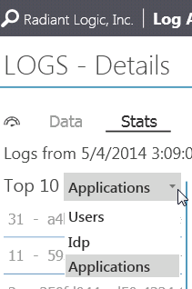

To view the Top 10 most used authentication methods, click in the drop-list next to "Top 10" and select Idp.

On the "Data" section for a selected user, you can see the user’s sessions, cookies, and log content applicable to this user’s actions.

An error related to the user’s activities will be shown with a red "X" button. Click on the "+" next to the error to show details like exact error message and stack trace.

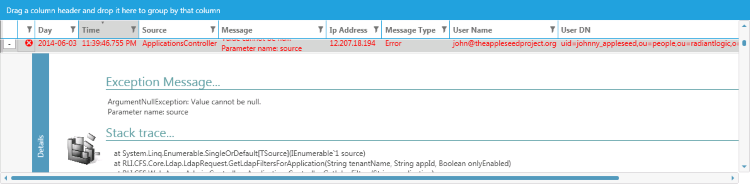

On the "Stats" section for a selected user, you can see a summary of the user’s activities: hourly connections and average duration of the connection.

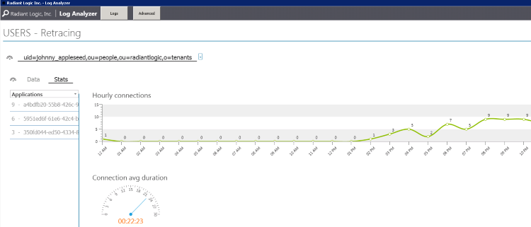

A list of applications (unique GUID) that the user has access will be shown on the left. In the drop-down list, you can select IDP to see a list of authentication methods used by the user.

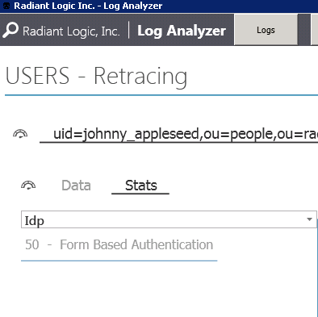

### Files Section

The Files section provides a list of the log files with the number of successful connections, errors, warnings, and so on, for each one.

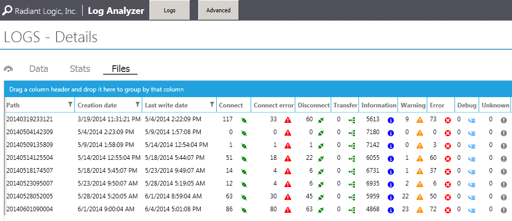

### Refreshing the Log Analysis

To contents of the Log Analyzer are set to update periodically. To refresh the view in the Log Analyzer more frequently than the default interval, click the refresh button in the bottom right corner as often as needed. You can control the auto update and put it on pause/activate it by using the buttons located at the bottom left of the screen.

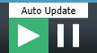

### Advanced Search Page

The log files can be filtered based on a date range. For advanced filtering, click on the Advanced button at the top of the Log Analyzer.

Indicate a Start Date and End Date covering the timeframe of logs you want to analyze. Logs associated with this period of time will display.

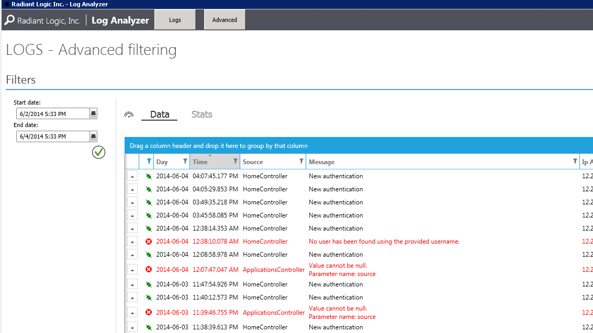

To change the type of log activity you want to see, click the filter button and mark what you are interested in (Connect, ConnectError, Disconnect, Information, Warning or Error). Only these types of log activities will be shown.

## Performance Counters

Performance Counters are used to provide information as to how well the operating system or an application, service, or driver is performing. The counter data can help determine system bottlenecks and fine-tune system and application performance. The operating system, network, and devices provide counter data that an application can consume to provide users with a graphical view of how well the system is performing.

The Performance Counters are available in both CFS Master and CFS Proxy. The counters for CFS Master are monitoring the LDAP connections to FID and the HTTP connections to the RSA server. The counters in CFS Proxy are monitoring the HTTPS connections to the CFS Proxy Web API. By default, the counters are disabled, to enable them, use the following instructions.

### Counters for CFS Master

-   Open the file `C:\inetpub\wwwroot\CFS Web Site\web.config` (or where you have your CFS installed).
-   At the end of the file, look for the code:

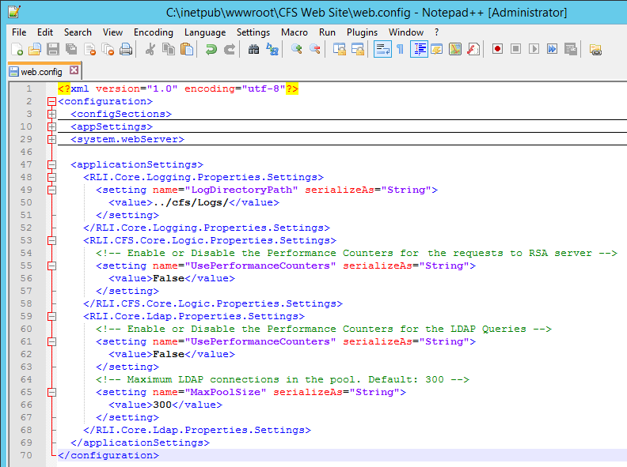

-   Change the value of the properties **UsePerformanceCounters** to **True** to enable the performance counters.
-   The **MaxPoolSize** property is used to define the maximum number of connections that the CFS Connection Pool can create. The default value is 300.
-   Once you save the file, IIS will automatically restart the web application and the changes will be applied automatically.

### Counters for CFS Proxy

-   Open the file `C:\inetpub\wwwroot\CFS Web Site\cfs\web.config` (or where you have your CFS installed).
-   At the end of the file, look for the code:

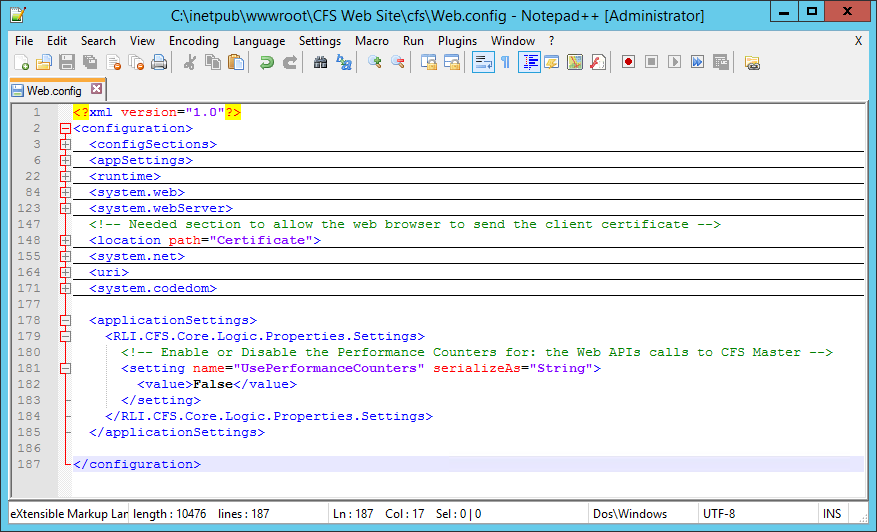

-   Change the value of the properties **UsePerformanceCounters** to **True** to enable the performance counters.
-   Once you save the file, IIS will automatically restart the web application and the changes will be applied automatically.

### Performance Monitor

-   Open the Performance Monitor.

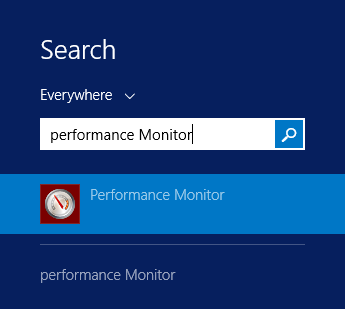

-   Click the green Add button to add a new counter to the monitoring console.

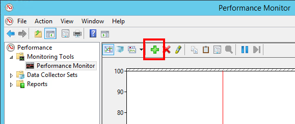

-   Look for the category **RadiantOne CFS** or **RadiantOne CFS Proxy**, select the counters you want to have on your screen, click Add then Ok.

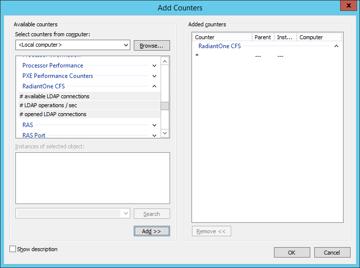

-   You can adjust the scale of your counter by double clicking on the counter.

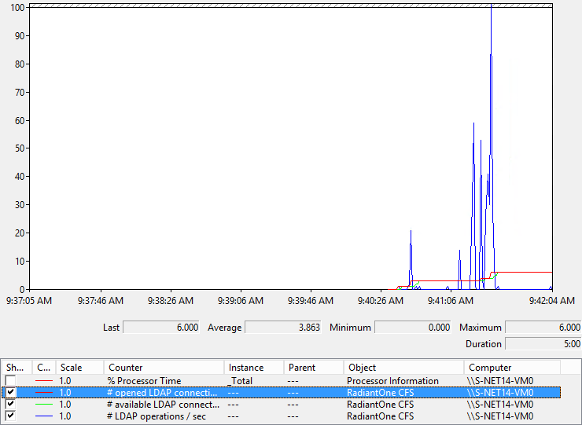

# Upgrade Guide

To upgrade to a newer version of CFS:

-   [Uninstall the current CFS](../getting-started/cfs-master.html#uninstalling-cfs-master)
-   [Install the new version of CFS](../getting-started/cfs-master.html#installing-cfs-master)

>[!note] If upgrading **to 3.16.0**, be sure .NET Framework 4.8 is [installed](../getting-started/prerequisites.html#other-microsoft-requirements) before performing the above steps.

# Microsoft IIS

## Change the SSL Certificate

If no SSL certificate is present prior to installation, the CFS installer generates and installs a self-signed certificate in IIS to enable HTTPS. This certificate should be replaced at least prior to moving to production. If it is not replaced, a web browser warning message will be displayed when users try to access the CFS portal site because the certificate is not valid.

### Server Certificates

First, we have to make sure we have a valid certificate to use in IIS Manager before to assign one to the CFS Website.

-   Open IIS Manager, navigate to the server level and choose _Server Certificates_.

-   The Auto-Generated certificate installed by CFS should be here.
-   Depending on your company policies, you should use the right menu in order to generate or request a new certificate.

### Bindings

-   Open IIS Manager and navigate to the Cfs Web Site.

-   In the Action panel (right of the IIS Manager window), click "Bindings...".

-   Select the _https_ binding and click "Edit...".

-   In the _SSL Certificate_ drop-down list, select the certificate you want to use for CFS.

-   Click OK to close the Edit Site Binding box.
-   Click Close to validate the Site Bindings box.

## High Availability

### General Information

Since CFS is hosted in [Microsoft Internet Information Services](https://www.iis.net/) (IIS version 7.5 or higher), configuring High Availability for CFS is really about HA for IIS.

There are two main ways to configure HA for CFS. FID can be queried by multiple CFS instances, so load balancers are used to distribute the load between multiple CFS’s with identical configurations.

A load balancer can be used to distribute the load between multiple CFS instances, which each point to a FID.

You can also point CFS to an LDAP load balancer which will distribute queries between multiple replicated FID instances. These FID instances must be exact replicas of each other.

You could also do a hybrid of these two approaches, using two load balancers in front of the CFS machines and one in front of the FID machines.

### Machine Key

In order to make many CFS servers to answer any client request, no matter where the previous requests come from. You must make sure the Machine Key of the IIS Web Application is the same on every machines.

-   Install CFS Master on more than one server.

-   On each server, open IIS Manager and navigate to the cfs Web Application.
-   In **Feature View**, right-click **Machine Key**, and then click **Open Feature**.

-   On the **Machine Key** page, select a validation method from the **Validation method** drop-down list. The default validation method is SHA1.
-   Choose an encryption method from the **Encryption method** drop-down list. The default encryption method is Auto.
-   On the first server, for both, **Validation key** and **Decryption key**, uncheck the options **Automatically generate at runtime** and **Generate a unique key for each application**. Copy both keys and apply them into the other CFS servers.
-   In the **Actions** pane, click **Generate Keys**, and then click **Apply**.