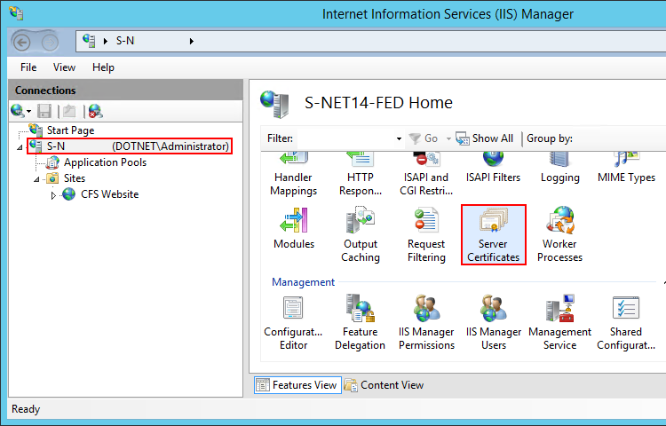
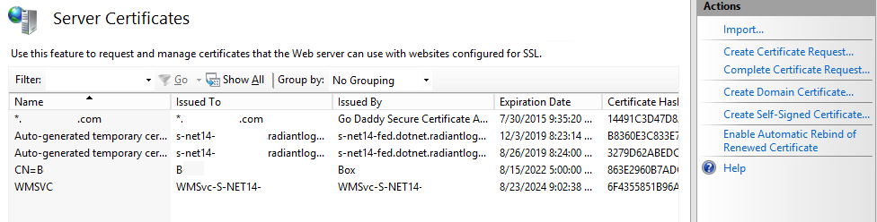
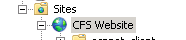
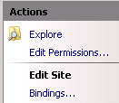
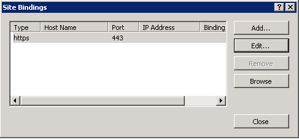
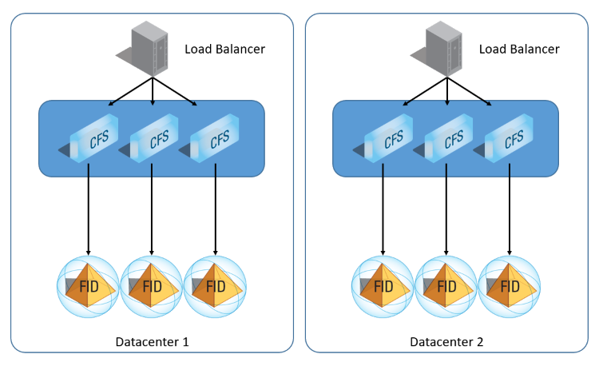
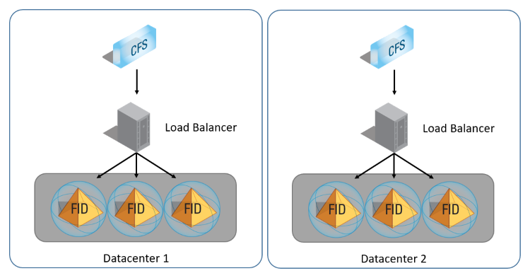
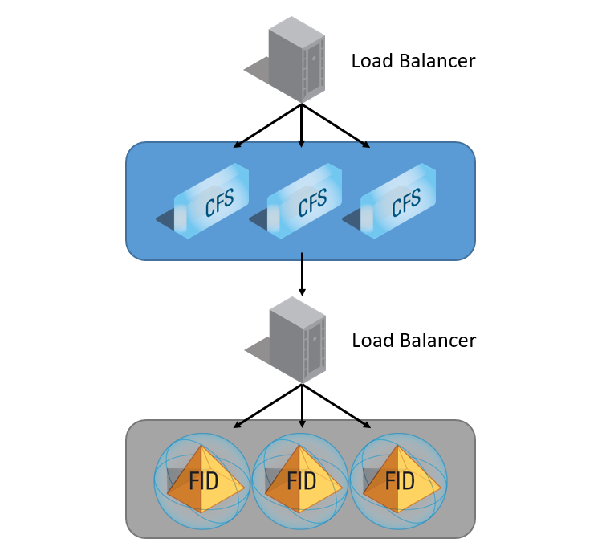
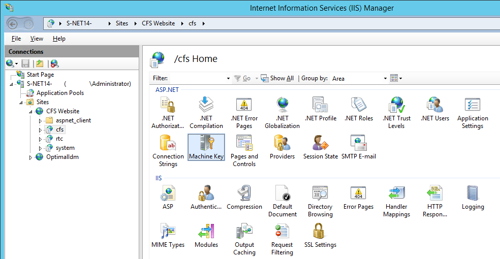
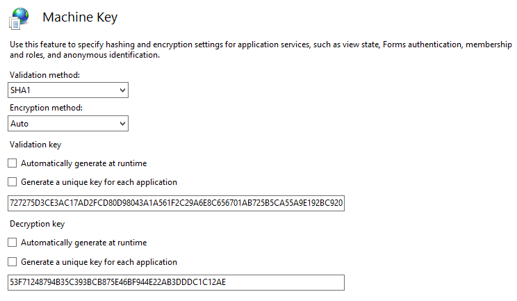

# Microsoft IIS

## Change the SSL Certificate

If no SSL certificate is present prior to installation, the CFS installer generates and installs a self-signed certificate in IIS to enable HTTPS. This certificate should be replaced at least prior to moving to production. If it is not replaced, a web browser warning message displays when users try to access the CFS portal site because the certificate is not valid.

### Server Certificates

First, we have to make sure we have a valid certificate to use in IIS Manager before to assign one to the CFS Website.

-   Open IIS Manager, navigate to the server level and choose _Server Certificates_.

-   The Auto-Generated certificate installed by CFS should be here.
-   Depending on your company policies, you should use the right menu in order to generate or request a new certificate.

### Bindings

-   Open IIS Manager and navigate to the Cfs Web Site.

-   In the Action panel (right of the IIS Manager window), click "Bindings...".

-   Select the _https_ binding and click "Edit...".

-   In the _SSL Certificate_ drop-down list, select the certificate you want to use for CFS.

-   Click OK to close the Edit Site Binding box.
-   Click Close to validate the Site Bindings box.

## High Availability

### General Information

Since CFS is hosted in [Microsoft Internet Information Services](https://www.iis.net/) (IIS version 7.5 or higher), configuring High Availability for CFS is really about HA for IIS.

There are two main ways to configure HA for CFS. FID can be queried by multiple CFS instances, so load balancers are used to distribute the load between multiple CFS’s with identical configurations.

A load balancer can be used to distribute the load between multiple CFS instances, which each point to a FID.

You can also point CFS to an LDAP load balancer which distributes queries between multiple replicated FID instances. These FID instances must be exact replicas of each other.

You could also do a hybrid of these two approaches, using two load balancers in front of the CFS machines and one in front of the FID machines.

### Machine Key

In order to make many CFS servers to answer any client request, no matter where the previous requests come from. You must make sure the Machine Key of the IIS Web Application is the same on every machines.

-   Install CFS Master on more than one server.

-   On each server, open IIS Manager and navigate to the cfs Web Application.
-   In **Feature View**, right-click **Machine Key**, and then click **Open Feature**.

-   On the **Machine Key** page, select a validation method from the **Validation method** drop-down list. The default validation method is SHA1.
-   Choose an encryption method from the **Encryption method** drop-down list. The default encryption method is Auto.
-   On the first server, for both, **Validation key** and **Decryption key**, uncheck the options **Automatically generate at runtime** and **Generate a unique key for each application**. Copy both keys and apply them into the other CFS servers.
-   In the **Actions** pane, click **Generate Keys**, and then click **Apply**.

# Upgrade Guide

To upgrade to a newer version of CFS:

-   [Uninstall the current CFS](02-getting-started#uninstalling-cfs-master)
-   [Install the new version of CFS](02-getting-started#installing-cfs-master)

>[!note] If upgrading **to 3.16.0**, be sure .NET Framework 4.8 is [installed](02-getting-started#other-microsoft-requirements) before performing the above steps.
