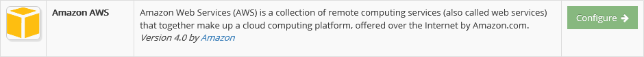
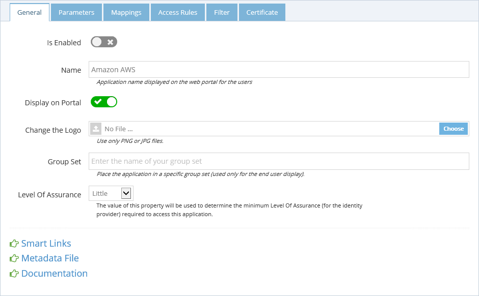
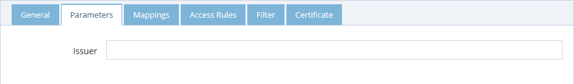
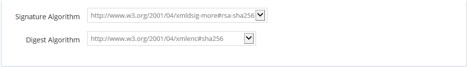
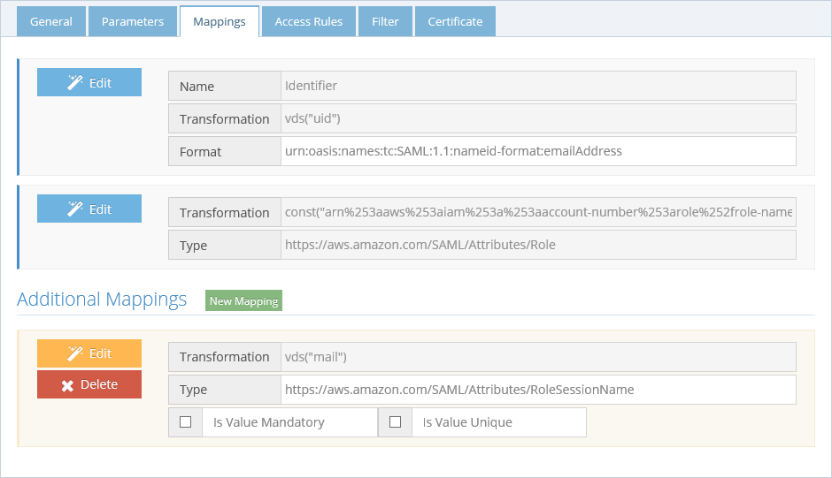
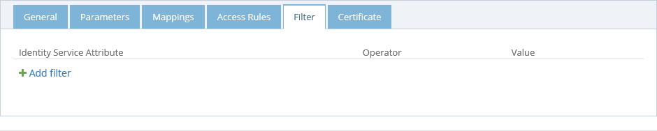
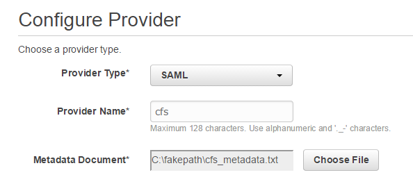
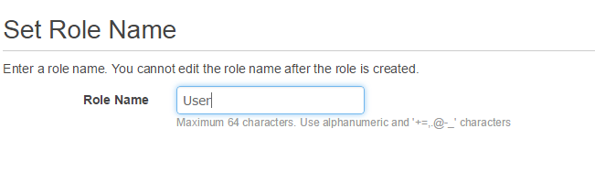
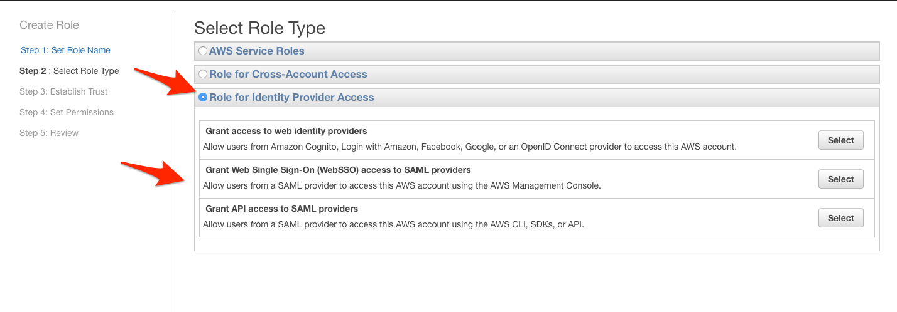
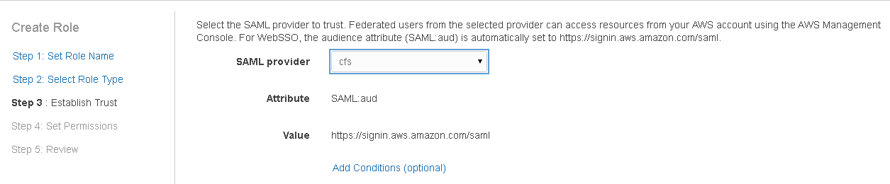

# Amazon AWS

Return to [all applications](02-configuration#application).

## Create the application

-   Log in as Tenant Administrator.
-   Navigate to Applications | Gallery.
-   Look for the application **Amazon AWS**
-   Click the button **Configure**.

## Configuration in CFS

### General

In the **General** tab you can define the general information of the application.

-   Enable the application.
-   Provide a name that will be displayed on the end user portal.
-   You can change the logo of the application.
-   The Group set is used to group the applications on the end user portal.
-   Set the application minimum [Level Of Assurance](../docs/getting-started/concepts.html#level-of-assurance).
-   Use the option Display on Portal to allow this application to appear on the end user portal or not.

The **Smart Links** link is used to configure [Smart Links](../docs/configuration/smartlinks.html) for this application.

You can also access directly the Metadata file by clicking the **Metadata File** link. This file might help you to configure the application (or service) side of this trust relationship.

### Parameters

The **Parameters** tab contains the list of settings required to configure the application.

-   **Issuer** - Enter the identifier you want to use for CFS.

-   **Signature Algorithm** - Algorithm to use to sign the token.
-   **Digest Algorithm** - Algorithm to use to generate the digest of the token.

### Mappings

The **Mappings** tab contains the list of transformation required to generate the output token claims. Since this application supports it, you can send additional claims in your token. Click the "New Mapping" button to add a new mapping.

The **Access Rules** tab helps define the second layer of security (after LOA) to grant access to this application. By default, the access is limited to only the people in the **Application Group** which is a group created automatically by CFS when the application is created. To grant access to this application you have 3 possibilities:

-   **Allow All Users** by checking this option, you will grant access to every user of your tenant (as long as the other security layers, LOA, COT... are accepted for the user).
-   Use the **Application Group** to add users allowed to access this application. The users who are granted access to the application after an access request are automatically added to this group.
-   Add **Additional groups** from the RadiantOne identity store.

### Filters

The **Filter** tab is another security layer that allows to filter the access to the application by using the context of the user. This context is based on the attributes of the user retrieved from the RadiantOne identity store and the attributes generated by CFS like the [Circle of Trust](../docs/getting-started/concepts.html#circle-of-trust).

### Certificate

The **Certificate** tab is used to define the certificate used by CFS to build the signature of the token it generates for the application. When configuring the application (or service), provide the public key of this certificate so the application can ensure that only CFS could have generated and signed the token. There are 3 options to provide this certificate to the application.

-   **Default Tenant Certificate** - CFS generates a certificate for each tenant and stores it the RadiantOne identity store. This is the default certificate that is used for all applications.
-   **Upload a private key** - You can upload your own certificate (private plus public key) and it will be used for this application only. This certificate is stored in the RadiantOne identity store, and can be used from any CFS machine.
-   **Upload a public key** - You can upload your own certificate (public key only). This public key is stored in the RadiantOne identity store, but the private key must be installed in the Windows Vault and made available on each CFS machine that will sign the application tokens. This is the most secure way to sign a token because the private key never travels on your network between the RadiantOne identity store and the CFS machines.

Configure Amazon AWS
--------------------

-   Log into your Amazon AWS console at [https://console.aws.amazon.com/iam/home#providers](https://console.aws.amazon.com/iam/home#providers)
-   In the Identity Providers section, click the button **Create Provider**.
-   Choose the Provider Type **SAML**.

-   In the CFS configuration for the application, click the link **Metadata File** and save the content of the page in a text file on your computer.
-   Click the button **Choose File** and upload the metadata file you've just saved.

-   Click Next Step.
-   Click Create.
-   Click on the identity provider you just created to get the ARN value. Copy the Provider ARN value (you will later combine this value with the role ARN and use it in the AWS application configuration in the CFS Tenant Admin Dashboard).
-   In the Roles section, click the button **Create New Role**.
-   Enter a role name (e.g. User).

-   Click Next Step.
-   On the Select Role Type screen, click the option next to Role for Identity Provider Access, then find the option Grant Web Single Sign-On (WebSSO) access to SAML providers and click Select.

-   From the drop-down list, select the identity provider name associated with CFS and then click Next Step.

-   Click Next Step on the Verify Role Trust screen.
-   The next step is to set up the actual permissions users in this role will have. You will need to select the policy that is appropriate for your users and company. Click Select next to your choice, and then on the next page choose Next Step.
-   Click Create Role.
-   In the Roles section, click on the role you just created.
-   You should see your identity provider as a trusted entity at the bottom of your role summary.
-   In the summary details, copy the Role ARN value (you will combine this value with the identity provider ARN and use it in the AWS application configuration in the CFS Tenant Admin Dashboard).

Change the Mappings
-------------------

In the CFS configuration for the application we need to change the mapping definition to reflect the information provided by Amazon AWS. Open the **Mappings** tab. Edit the claim `https://aws.amazon.com/SAML/Attributes/Role`. Open the Wizard, select `constant` and enter the value `arn:aws:iam::444444444444:role/User,arn:aws:iam::444444444444:saml-provider/cfs` where `444444444444` is the id provided by Amazon AWS for your tenant and `User` is the name of the role you've created.
