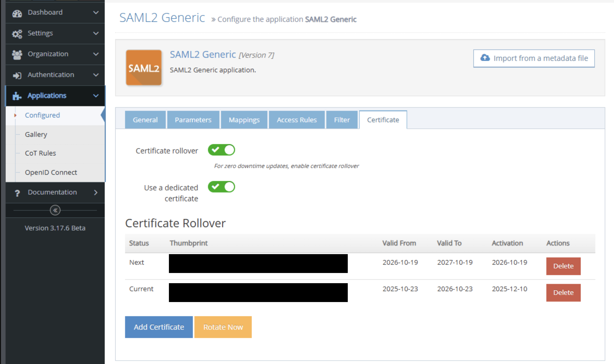

## Overview

Certificate rollover enables zero-downtime certificate updates for SAML 2.0 and WS-Federation SSO applications. 
This guide provides simple, step-by-step instructions for implementing certificate rollover.

### Prerequisites

* PowerShell access to CFS management tools for programmatic enablement
* Tenant and application access permissions
* Certificate files (PFX format) or ability to generate new certificates
* Applications must have UsesCertificateRollover enabled (see Application Setup section below)

### Certificate Requirements for Rollover

| Requirement         | Mandatory                  | Notes                           |
|---------------------|----------------------------|---------------------------------|
| Private Key         | Yes                     | Must be present and exportable   |
| RSA Key             | Yes                     | RSA algorithm required           |
| Key Size            | Recommended: 2048-bit      | System generates 2048-bit keys   |
| Signature Algorithm | Recommended: SHA256WithRSA | SHA256 preferred over SHA1       |
| DIGITAL_SIGNATURE   | Yes                     | Essential for signing operations |
| KEY_CERT_SIGN       | Yes                     | For certificate signing          |
| CRL_SIGN            | Recommended                | For CRL verification             |
| KEY_ENCIPHERMENT    | Optional                   | For key encryption scenarios     |
| NON_REPUDIATION     | Optional                   | For non-repudiation support      |


## Certificate Rollover Management

For enabling rollover, the recommended approach is using the Admin UI. However, there are alternative approaches. All options are documented below.

### Option 1: Using Admin UI (Recommended)

#### Enable Certificate rollover

1. Navigate to the application in the Admin UI.
2. Look for the certificate section.
3. Click "Enable certificate rollover" button. 
5. Confirm the change.

This will enable certificate rollover. Certificates are managed in the following order:

- **Current** – Actively used certificate.
- **Next** – Staged for future use.
- **Previous** – Recently retired and temporarily retained to ensure validation continuity.

#### Perform a rollover

1. Upload a new certificate by clicking the "Add button" in the Certificate page. The certificate is added as **Next**.

   

2. Ensure all service providers trust the **Next** certificate.
3. Click **Start Rollover**.

During rollover:
- **Next** is promoted to **Current** so that the latest valid certificate is used. 
- The former **Current** is moved to **Previous**. 

After rollover is complete and you confirm that no service relies on the retired certificate, you can remove it by:
1. Selecting the certificate under **Previous**.
2. Clicking **Delete** to remove it.


### Option 2: Automatic Enablement using Powershell 

Certificate rollover is automatically enabled when you add certificates using `Add-CfsNextCertificate`. This causes the system to set
`UsesCertificateRollover = true` internally.

## Quick Start with Basic Implementation

If you would like to use option 2 (Automatic enablement) to set up certificate rollover for a tenant and its applications, follow the steps listed below:

1. Set Tenant Context

     ```
     # Set the current tenant context
     Set-CfsCurrentTenant -Name "your-tenant-name"
     ```
     <br>
  
2. Check Current Certificate Status

     ```
     # Check tenant-level certificates
     Get-CfsCertificateStatus -Main
     # Check application-level certificates
     Get-CfsCertificateStatus -Application "your-app-id"
     ```
      <br>
  
3. Add Next Certificate

   You can either use an existing certificate or generate a new one. 
  
  **Option A: Use Existing Certificate**
  
  ```
  # For tenant-level certificate
  Add-CfsNextCertificate -Main -Certificate $yourCertificate -ActivationDate (Get-
  Date).AddDays(7)
  
  # For application-level certificate
  Add-CfsNextCertificate -Application "your-app-id" -Certificate $yourCertificate -
  ActivationDate (Get-Date).AddDays(7)
  ```
  <br>


  **Option B: Generate New Certificate**
  
  ```
  # For tenant-level certificate
  Add-CfsNextCertificate -Main -Generate -ActivationDate (Get-Date).AddDays(7)
  # For application-level certificate
  Add-CfsNextCertificate -Application "your-app-id" -Generate -ActivationDate (Get-
  Date).AddDays(7)
  ```
  <br>

4. Verify Implementation

   After adding the certificate, confirm that the certificates are valid.
  
     ```
     # Check certificate status
     Get-CfsCertificateStatus -Main
     Get-CfsCertificateStatus -Application "your-app-id"
     ```


### Emergency Migration for Expiring Certificates

Use the following script for scenarios when your certificates are expiring in less than 30 Days (CRITICAL). 

  ```
  # Set tenant context
  Set-CfsCurrentTenant -Name "your-tenant-name"
  # Emergency migration with new certificate generation
  Start-CfsCertificateEmergencyMigration -Main -GenerateNewCert -Force
  # OR use existing certificate file
  Start-CfsCertificateEmergencyMigration -Main -NewCertPath "path\to\your\cert.pfx"
  -Force
  ```
  <br>

Use the following script for scenarios when your certificates are expiring in 30-90 Days. 

  ```
  # Set tenant context
  Set-CfsCurrentTenant -Name "your-tenant-name"
  # Urgent migration with staged activation
  Start-CfsCertificateEmergencyMigration -Main -DaysUntilExpiry 60 -GenerateNewCert
  ```
  <br>

### Manual Rotation (Optional)

Trigger Certificate Rotation

  ```
  # Set tenant context
  Set-CfsCurrentTenant -Name "your-tenant-name"
  # Manual rotation for tenant
  Start-CfsCertificateRotation -Main
  
  # Manual rotation for application
  Start-CfsCertificateRotation -Application "your-app-id"
  
  # Force rotation (bypass activation date checks)
  Start-CfsCertificateRotation -Main -Force
  ```
  <br>

## Common Workflows 

**For New Tenant Setup**

1. Set tenant context: `Set-CfsCurrentTenant -Name "tenant-name"`
2. Generate tenant certificate: `Add-CfsNextCertificate -Main -Generate`
3. Verify certificate status: `Get-CfsCertificateStatus -Main`

**For Application Certificate Rollover**

1. Set tenant context: `Set-CfsCurrentTenant -Name "tenant-name"`
2. Add application certificate: `Add-CfsNextCertificate -Application "app-id" -Generate`
3. Verify certificate status: `Get-CfsCertificateStatus -Application "app-id"`

**For Emergency Certificate Replacement**

1. Set tenant context: `Set-CfsCurrentTenant -Name "tenant-name"`
2. Emergency migration: `Start-CfsCertificateEmergencyMigration -Main -GenerateNewCert -Force`
3. Verify certificate status: `Get-CfsCertificateStatus -Main`

### Troubleshooting

1. Check Certificate Status

  ```
  # Always start by checking current status
  Get-CfsCertificateStatus -Main
  Get-CfsCertificateStatus -Application "app-id"
  ```
  <br>

2. Handling Common Issues

1. If no certificates are found, use `Add-CfsNextCertificate` to add certificates.
2. If rotation does not work, check activation dates (note that using -Force parameter will not have any effect as it is not implemented).

  Example:
  
  ```
  # IMPORTANT: -Force parameter is defined but NOT IMPLEMENTED in any certificate
  cmdlets
  # These commands will work but -Force has ZERO effect:
  Start-CfsCertificateRotation -Main -Force
  Start-CfsCertificateEmergencyMigration -Main -GenerateNewCert -Force
  # The -Force parameter is completely ignored in the implementation
  ```
  <br>
  
3. If you get other certificate errors, verify certificate validity and permissions. 


### Key Points to Remember

1. Enable certificate rollover first using Admin UI or Add-CfsNextCertificate. 
2. Always set tenant context first using `Set-CfsCurrentTenant -Name "tenant-name"`.
3. Use the Correct Scope Parameter:
- Use `-Main` for tenant-level operations when managing tenant certificates.  
- Use `-Application "app-id"` for application-level operations when managing application certificates.
5. Check the status of the certificate after running a script using `Get-CfsCertificateStatus`.
6. Emergency migration must be automatic as the system need to handle urgent situations automatically. 

### Parameter Reference

#### Add-CfsNextCertificate

| Parameter | Description |
|-----------|-------------|
| `-Main` | For tenant-level certificates |
| `-Application` | For application-level certificates |
| `-Certificate` | Use an existing certificate |
| `-Generate` | Generate a new certificate |
| `-ActivationDate` | When to activate the certificate (default: 7 days) |

#### Get-CfsCertificateStatus

| Parameter | Description |
|-----------|-------------|
| `-Main` | Check tenant certificates |
| `-Application` | Check application certificates |

#### Start-CfsCertificateRotation

| Parameter | Description |
|-----------|-------------|
| `-Main` | Rotate tenant certificates |
| `-Application` | Rotate application certificates |
| `-Force` | NOT IMPLEMENTED – parameter exists but is completely ignored |

#### Start-CfsCertificateEmergencyMigration

| Parameter | Description |
|-----------|-------------|
| `-Main` | Migrate tenant certificates |
| `-Application` | Migrate application certificates |
| `-GenerateNewCert` | Generate a new certificate |
| `-NewCertPath` | Use an existing certificate file |
| `-Force` | NOT IMPLEMENTED – parameter exists but is completely ignored |
