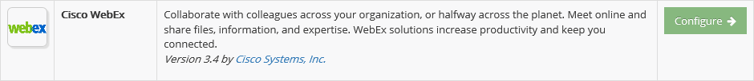
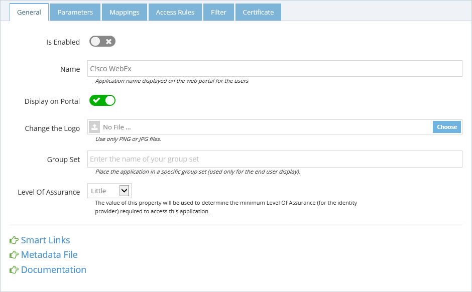
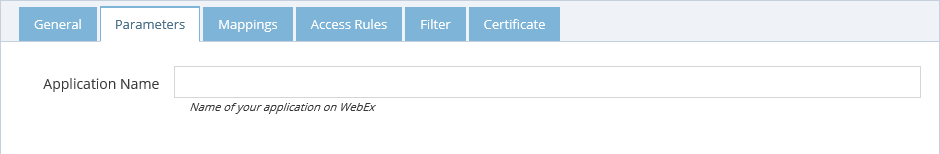
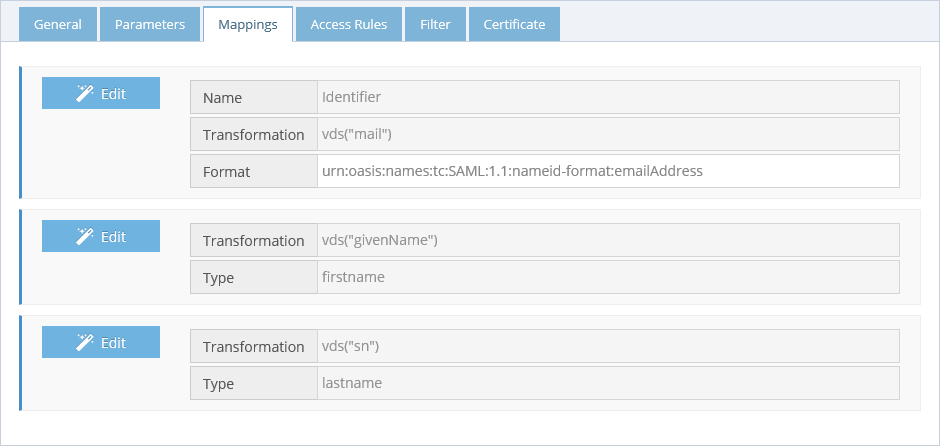
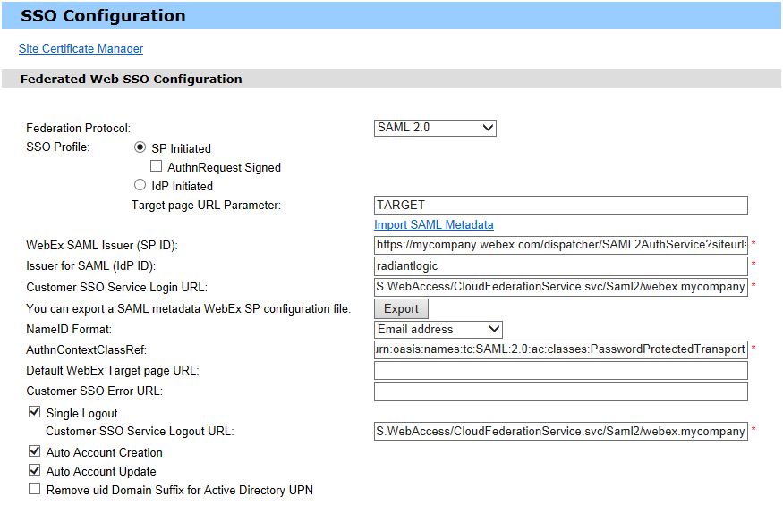

Cisco WebEx
===========

Return to [all applications](03-configuration#applications).

Create the application
----------------------

*   Log in as Tenant Administrator.
*   Navigate to Applications | Gallery.
*   Look for the application **Cisco WebEx**
*   Click **Configure**.

Configuration in CFS
--------------------

### General

In the **General** tab you can define the general information of the application.

*   Enable the application.
*   Provide a name that will be displayed on the end user portal.
*   You can change the logo of the application.
*   The Group set is used to group the applications on the end user portal.
*   Set the application minimum [Level Of Assurance](../docs/getting-started/concepts.html#level-of-assurance).
*   Use the option Display on Portal to allow this application to appear on the end user portal or not.

The **Smart Links** link is used to configure [Smart Links](../docs/configuration/smartlinks.html) for this application.

You can also access directly the Metadata file by clicking the **Metadata File** link. This file might help you to configure the application (or service) side of this trust relationship.

### Parameters

The **Parameters** tab contains the list of settings required to configure the application.

*   **Application Name** - Enter the name of your application on WebEx.

*   **Signature Algorithm** - Algorithm to use to sign the token.
*   **Digest Algorithm** - Algorithm to use to generate the digest of the token.

### Mappings

The **Mappings** tab contains the list of transformation required to generate the output token claims. Since this application supports it, you can send additional claims in your token. Click the "New Mapping" button to add a new mapping.

The **Access Rules** tab helps define the second layer of security (after LOA) to grant access to this application. By default, the access is limited to only the people in the **Application Group** which is a group created automatically by CFS when the application is created. To grant access to this application you have 3 possibilities:

*   **Allow All Users** by checking this option, you will grant access to every user of your tenant (as long as the other security layers, LOA, COT... are accepted for the user).
*   Use the **Application Group** to add users allowed to access this application. The users who are granted access to the application after an access request are automatically added to this group.
*   Add **Additional groups** from the RadiantOne identity store.

### Filters

The **Filter** tab is another security layer that allows to filter the access to the application by using the context of the user. This context is based on the attributes of the user retrieved from the RadiantOne identity store and the attributes generated by CFS like the [Circle of Trust](../docs/getting-started/concepts.html#circle-of-trust).

### Certificate

The **Certificate** tab is used to define the certificate used by CFS to build the signature of the token it generates for the application. When configuring the application (or service), provide the public key of this certificate so the application can ensure that only CFS could have generated and signed the token. There are 3 options to provide this certificate to the application.

*   **Default Tenant Certificate** - CFS generates a certificate for each tenant and stores it the RadiantOne identity store. This is the default certificate that is used for all applications.
*   **Upload a private key** - You can upload your own certificate (private plus public key) and it will be used for this application only. This certificate is stored in the RadiantOne identity store, and can be used from any CFS machine.
*   **Upload a public key** - You can upload your own certificate (public key only). This public key is stored in the RadiantOne identity store, but the private key must be installed in the Windows Vault and made available on each CFS machine that will sign the application tokens. This is the most secure way to sign a token because the private key never travels on your network between the RadiantOne identity store and the CFS machines.

Configure Cisco WebEx
---------------------

Log into your WebEx administrator account and navigate to the Site Administration page. Select SSO Configuration from the menu on the left. On the SSO Configuration page and select the federation protocol **SAML 2.0**. Then, click the **Import SAML Metadata** and import the metadata file from the General tab. All the fields should be automatically populated.

*   You can select Auto Account Creation and Auto Account Update if you want to enable provisioning. If you decide to do so, you will need to use extra claims for the configuration of WebEx application in the [Mappings](#mappings) tab.