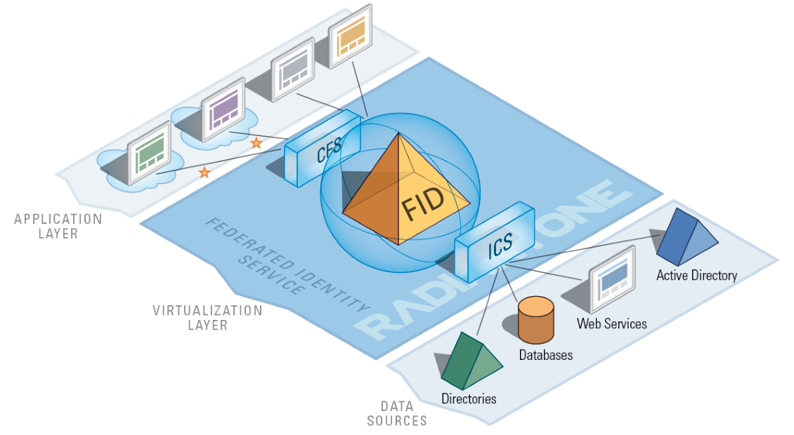
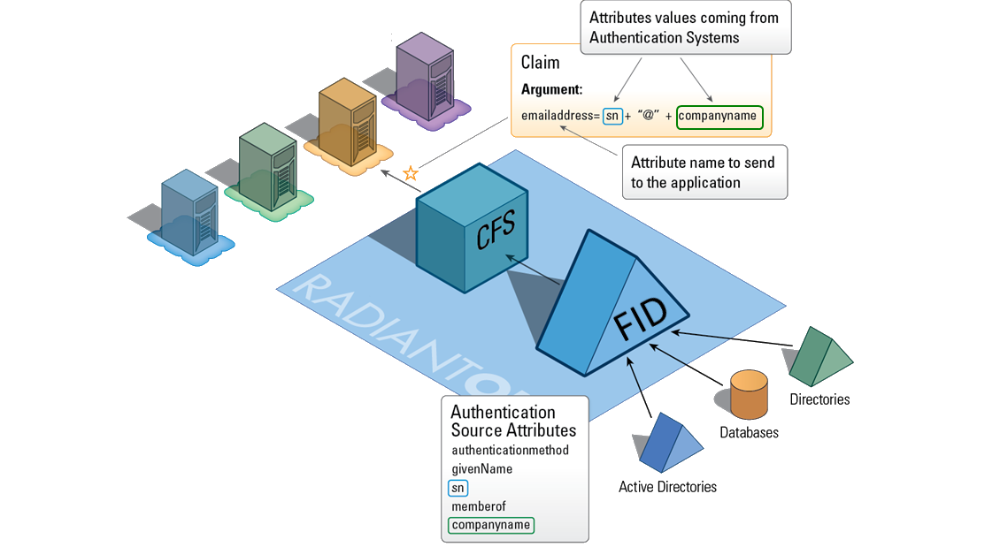

Home
====

RadiantOne Cloud Federation Service (CFS) is a Security Token Service (STS) which leverages the RadiantOne Federated Identity Service (FID) as a single point of access to enterprise data stores, to turn your existing identity infrastructure into an Identity Provider (IdP).

CFS is a gateway between your enterprise identity stores and consuming applications. As an STS, CFS receives, translates, generates, and transmits identity information via digitally signed security tokens containing user attributes (claims), to a set of claims-enabled cloud applications. The claims contained in the security tokens are trusted by applications as proof that a user has been authenticated, and as a set of information about the user which can be used to make authorization decisions. This allows users to be authenticated in their local, authoritative identity stores, and then securely access applications (in any domain), without having to re-enter their credentials.

Some of the benefits of making your infrastructure into an Identity Provider:

*   Increased security
*   User information is sent in digitally signed tokens over SSL
*   Users are authenticated in local data sources (LDAP directories, Active Directories, etc) which are managed by you and not a third party
*   Users don’t have to remember all their various usernames and passwords—they can be authenticated once, and get access to multiple applications
*   Also diminishes password proliferation
*   Ease of use for administrators
*   Applications are relieved of the burden of Identity Management tasks, making future deployments of applications easier and faster
*   No need to migrate identity information to the cloud, and then synchronize yet another “cloud” data silo with your on-premise sources— CFS allows you to re-use your existing identity sources for the cloud
*   Easily and securely extend access to cloud applications to new populations of users
*   Ease of use for end-users
*   Web Single Sign On
*   Both IdP and RP-initiated (users can access applications either from the CFS portal site, or by navigating directly to the application) SSO
*   Access enterprise applications using one set of credentials

Security Token Services such as CFS face the classic problem of needing to connect to multiple identity sources (using multiple access protocols) to find, authenticate, and gather attributes about a user. CFS is uniquely able to address this challenge because it leverages the single access point provided by RadiantOne FID to access all users in your identity infrastructure.

CFS is fully integrated with the RadiantOne platform, a virtualization layer that uses virtualization to integrate heterogeneous data stores. CFS v3 is a fully web-based application and can be accessed by any device. The diagram below provides a high-level overview of the RadiantOne architecture.

RadiantOne addresses the challenges faced by many Identity Management initiatives, especially federation and Single Sign On—how to authenticate, and gather attributes for authorization, from multiple (even hundreds or thousands of) identity stores? Especially when there is user overlap across various data stores—how can you identify, disambiguate, and authenticate users with multiple accounts?

FID federates identity by creating a global profile of each user, which contains links to their accounts in multiple disparate data sources. This global profile gives a 360 degree view of each user which can be accessed from a single location (the FID) no matter where or how in the identity infrastructure the user is actually stored.

FID acts as an Authentication System to which CFS can delegate authentication, and use as a source of attributes. FID in turn delegates authentication to the appropriate data store, and gathers attributes requested by CFS. Each application has a specific set of attributes, or claims, that it requires CFS to send. So when a user requests access to an application, CFS will need to send values from FID to populate the claim expected by that application. CFS packages those attributes into signed tokens, which it sends to applications in the format they expect. In this way, CFS uses FID as an authentication system and attribute server for all identities stored across the enterprise identity sources, essentially turning your infrastructure into a secure Identity Provider.

The RadiantOne FID acts a federated identity hub, integrating all enterprise identity stores, and disambiguating duplicate user accounts that occur across them. Using CFS and FID together means any enterprise user can get access to cloud applications, while being authenticated behind the firewall—and experiencing SSO.
