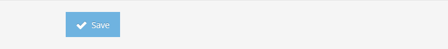

Login / Password
================

Log into CFS with your Tenant Administrator account and navigate to Authentication | Login / Password.

Configuration
-------------

*   Enable the Login / Password authentication on CFS Master and / or CFS Proxy.
*   Enter the name of the attribute that is used to identify the user in the identity store to validate the credentials.
*   Enter the message you want your users see to know what identifier to use when logging in (e.g. Username or Email Address).
*   Every authentication method is associated with a [Level of Assurance (LOA)](02-getting-started#level-of-assurance) This level can be used to enforce access permissions for applications. To indicate the LOA a person is associated with when they log in with a login / password, select the appropriate value from the "Level of Assurance" drop-down list.

This is the login page when you enable Login / Password authentication.

RSA SecurID
-----------

You can configure RSA SecurID to be embedded into the Login / Password form.

*   Enable the feature.
*   Enter the URL of the RSA server, including the port your Authentication API listens on. Please refer to the [RSA documentation](https://community.rsa.com/docs/DOC-76831) to ensure you have the authentication API configured properly.
*   Enter the **Access Key** for the authentication API.
*   Enter the authenticaton agent name that is used with the authentication API. Please refer ot the [RSA documentation](https://community.rsa.com/docs/DOC-76818) linked above for how to configure the agent.
*   Enter the FID attribute that correponds to your users' User ID in RSA.
*   Enter a text to help your users provide the correct information in the form.
*   Every authentication method is associated with a [Level of Assurance (LOA)](02-getting-started#level-of-assurance). This level can be used to enforce access permissions for applications. To indicate the LOA a person is associated with when they login with a login / password, select the appropriate value from the "Level of Assurance" drop-down list.

This is the login page when you enable RSA SecurID in the Login / Password form.

Two-Step Verification
---------------------

RadiantOne CFS has it's own two-step verification system.

*   You can force the two-step verification for every single user trying to log in with Login / Password authentication.
*   Allow the users to Identity verification with a smartphone application to use the two-step verification.
*   Every authentication method is associated with a [Level of Assurance (LOA)](02-getting-started#level-of-assurance). This level can be used to enforce access permissions for applications. To indicate the LOA a person will be associated with when they login with a login / password, select the appropriate value from the "Level of Assurance" drop-down list.

>[!note] This feature cannot be combine with RSA SecurID.

When the user logs in using a login / password, he will be asked to provide a temporary password.

*   If he is using a smartphone application, he can choose "I have a code" and enter the one provided by the application. See how to [enable two-step verification](04-user-roles/#enable-two-step-verification) for the user.
*   He can request an email containing the temporary code.
*   If the external service Twilio is configured, he can request a text message or a phone call.

Yubico
------

RadiantOne CFS supports the external Two-Step Authentication (One Time Password) on a hardware token, [Yubico](https://www.yubico.com). By default, you can use YubiCloud as authentication server, but you can also host your own server and use it by CFS.

*   Enable the support of the YubiKeys.
*   For the **Yubico API Urls**, enter the addresses of your own servers of leave the default YubiCloud URLs:
    *   [https://api.yubico.com/wsapi/2.0/verify](https://api.yubico.com/wsapi/2.0/verify)
    *   [https://api2.yubico.com/wsapi/2.0/verify](https://api2.yubico.com/wsapi/2.0/verify)
    *   [https://api3.yubico.com/wsapi/2.0/verify](https://api3.yubico.com/wsapi/2.0/verify)
    *   [https://api4.yubico.com/wsapi/2.0/verify](https://api4.yubico.com/wsapi/2.0/verify)
    *   [https://api5.yubico.com/wsapi/2.0/verify](https://api5.yubico.com/wsapi/2.0/verify)
    *   **Note:** If you specify more than one server. All the servers are contacted and the reponse from the first server to answer is considered.
*   If you need to use a Web Proxy to contact the Yubico server, click the checkbox **Does CFS needs to use the Web Proxy to call this URL?**
*   The **Text description** is the text that appears on the login page to indicate your end users how to provide the one time password.
*   Get the **Yubico Api Key** and **Yubico Api Secret** on your own Yubico server or on [YubiCloud](https://upgrade.yubico.com/getapikey)
*   Select the **Level of Assurance** associated with that Identity Provider.

Once you enable the YubiKeys for the users, they are prompted on the login page to provide the one time password.

>[!note] To associate the users with a YubiKey, see the [Tenant Administrator](04-user-roles/#users) documentation.

Passthrough
-----------

You can indicate which claims are stored, for later use (these can be passed through and sent to applications/relying parties if needed). These claims can be defined as a constant value or something returned from the specific authentication method. Click the New Passthrough button and then click Edit to define the claim with either the wizard or manually. When using the wizard, the "Input" function/option will indicate the possible claims (if any) that can come from the authentication method. To delete configured passthrough claims, click the delete button.

Click the "Save" button to save your configuration.

Certificate Authentication
==========================

> The Certificate authentication using PIV/CAC cards, or mutual authentication, is one of the most secure authentication system in RadiantOne Cloud Federation Service because it leverages powerful cryptographic algorithms and the trusted certificate authorities of your company.

Log into CFS with your Tenant Administrator account and navigate to Authentication | Certificate.

Configuration
-------------

*   Enable the Certificate authentication on CFS Master and / or CFS Proxy.
*   Enter the name you want to present to the users.
*   Every authentication method is associated with a level of assurance. This level can be used to enforce access permissions for applications. To indicate the level of assurance a person is associated with when they log in with a certificate, select the appropriate value from the "Level of Assurance" drop-down list.

### Steps to Configure CAC Authentication

1.  Verify that the chain of certificates presented by your CAC Card is present in your CFS Master’s Trust store.
    
    
    
    If your certs are managed by PKI/PKE then it should be present, but **please ensure that your Root Certificate and Intermediate Certifcates are present under the Trusted Root Authority and Intermediate Certificate Authority** respectively:
    
    
    
2.  Verify what your requirements are to extract values from your CAC Public Key. See the mappings section below for the 3 default mappings CFS provides
    
3.  Define the attribute that will be searched for in FID. Essentially, CFS sends a search request to FID with the value extracted from the mapping. Something like this:
    *   Searchrequest --> (cn=jappleseed)
4.  Open RegEdit on your CFS Master and add this parameter:
    
         HKEY_LOCAL_MACHINE\SYSTEM\CurrentControlSet\Control\SecurityProviders\SCHANNEL,
         Value name: ClientAuthTrustMode,
         Value type: REG_DWORD, Value data: 2 (HEX)
    
    ![]media/certificates-7.png)
    
5.  Restart IIS once step 4 is completed
    
6.  You should now be able to login to CFS using CAC Authentication
    *   On CFS login page, click _Certificate_
    *   Select your CAC Cert when prompted
    *   Enter your PIN
    *   You should be logged in

Mappings
--------

The first option gives the possibility to check the public key certificate provided by the user against the one stored in the user's entry in FID. This is an extra security measure that is only applicable if the certificate is stored in the identity store. Enter the name of the FID attributes that contains the user certificate. If your FID doesn't have the certificate for each user, uncheck this option.

CFS provides 3 default mappings:

*   [http://schemas.xmlsoap.org/ws/2005/05/identity/claims/nameidentifier](http://schemas.xmlsoap.org/ws/2005/05/identity/claims/nameidentifier)
    *   This will extract the **subject** of the certificate provided by the user, then extract the user identifier, and look in FID for a user with the attribute _cn_ that has the same value. An example of certificate subject is: _cn=jappleseed,ou=radiant logic,l=novato,s=California,c=US_. From this, CFS will extract (using the default transformation) the value _jappleseed_.
*   [http://schemas.xmlsoap.org/ws/2005/05/identity/claims/emailaddress](http://schemas.xmlsoap.org/ws/2005/05/identity/claims/emailaddress)
    *   This will extract the extended attribute **email address** from the certificate.
*   [http://schemas.xmlsoap.org/ws/2005/05/identity/claims/upn](http://schemas.xmlsoap.org/ws/2005/05/identity/claims/upn)
    *   The will extract the extended attribute **UPN** from the certificate.

### Mappings for Complex Extractions from Certificates

In some instances, you may need to create a mapping that involves special regex to parse out data from certificate attributes. Let's take a look at a certificate as an example:

In this certificate we need to extract the value of `Principal Name = 123456789@mil` but we also want to exclude everything after the `@` symbol. So, the mapping that is going to be used will be:

In the above expression, the section highlighted in yellow indicates which value needs to be extracted from the certificate (in this case, SAN). The section highlighted in green trims the value from the `@` symbol and gives everything after the left. Notice that `%40` was used which refers to `@` symbol in URL format.

Therefore, the complete mapping in CFS will look like this:

Notice that the attribute `description` was used here. You can use any attribute you want as long as it holds the exact same value that you extracted from the certificate.

In this case, the entry present in FID has `description` with the value `12345678`

Passthrough
-----------

You can indicate which claims are stored, for later use (these can be passed through and sent to applications/relying parties if needed). These claims can be defined as a constant value or something returned from the specific authentication method. Click **New Passthrough** and then click Edit to define the claim with either the wizard or manually. When using the wizard, the "Input" function/option will indicate the possible claims (if any) that can come from the authentication method. To delete configured passthrough claims, click **Delete**.

Click "Save" to save your configuration. Here is the result on the login page.

RadiantOne Trust Connector
==========================

RadiantOne Trust Connector (RTC) is an authentication system which provides Windows integrated authentication (Active Directory).  

First, you must [install the RTC](02-getting-started#radiant-trust-connectors-rtc).

Configure a RadiantOne Trust Connector
--------------------------------------

Make sure you have installed the RTC in each Active Directory Domains you want to cover for your users. Log into CFS with your Tenant Administrator account and navigate to Authentication | Active Directory.

If you want to create the RTC manually then click **New Active Directory Connector**. Otherwise, click **Have a metadata file?** on top of the screen. If the CFS machine can contact the RTC machine over https (port 443), you can click **URL**. Use the "Content" option if the RTC machine is not accessible from the CFS machine.

Open a new web browser and navigate to the RTC `[https://<SERVER_ADDRESS>/rtc/](https://<SERVER_ADDRESS>/rtc/)`.

If you want to use the "URL option" copy the link `FederationMetadata.xml` and use it in the CFS page. Click the "Import" button.

If you want to use the "Content option", open the link `FederationMetadata.xml`.

And copy the source of the page in the CFS page. Click the "Import" button.

You will get most of the parameters already pre-filled.

First, in the **Configuration** tab, enter the list of Active Directory domains you want to cover with this RTC. You may also enter a list of CIDR IP Blocks (e.g. 10.0.0.0/24).

In the **Mappings** tab, make sure the Attribute corresponds to the attribute available in FID. The incoming claim has a value that looks like `DOMAIN\samAccountName` and the default transformation will extract the `samAccountName`.

Make sure you have enabled the configuration and click "Save".

>[!note] The RadiantOne Trust Connectors are only working from a CFS Master. The CFS Proxy does not try to redirect the users to an RTC.

Update with Metadata
--------------------

If you have configured the RTC with a Metadata URL, you can update the parameters automatically to load a new certificate. If you have not, update your RTC with the address of the Metadata file and save the configuration.

On the Authentication | Active Directory page, select the RTC you want to update with the metadata, click the "Actions" button and select **Update from Metadata**. This action will download the new metadata file and extract the endpoint and certificate.

Confirm you want to update your RTC.

Make sure the configuration is correct.

Troubleshooting
---------------

### Diagnostic

CFS Master has a diagnostic page that allows anyone to make sure the RTC configuration is working.

*   Access the diagnostic page `[https://<CFS_SERVER>/cfs/Diagnostic/<TENANT_ID>/](https://<CFS_SERVER>/cfs/Diagnostic/<TENANT_ID>/)`
*   The following screen shows a client that has not been associated with an RTC.

The following screen shows a client that has been associated with an RTC.

>[!note] If your CFS servers are protected by a proxy, you are probably using the [X-Forwarded-For](https://en.wikipedia.org/wiki/X-Forwarded-For) HTTP header field to provide to the server the real address of the user. CFS is capable of detecting this field to find a matching RTC.

### Windows Integrated Authentication

To leverage Windows Integrated Authentication (WIA) your computer must be a member of an Active Directory.

#### Configure Internet Explorer and Google Chrome

In this section, we will configure the Internet Options of your machine. Since Internet Explorer and Google Chrome share the same configuration we can only do the changes once.

>[!note] Most of the changes can be done using the Group Policy Object (GPO) from Active Directory.

*   First, open Internet Explorer and open the Tools menu.
*   Click Internet options.

*   Then navigate to the **Security** tab and click **Trusted sites**.
*   Click the **Sites** button.

*   Type the address of the RTC website and click **Add**.
*   Click **Close**.

*   Click **Custom level...**.
*   Select the option "Automatic logon with current user name and password" to enable your web browser to send the Kerberos token to the RTC.
*   Click **OK** and **OK** again to close the window.
*   Close and reopen Internet Explorer (or Chrome).

#### Configure Firefox

Now, if you are using Firefox, because Firefox is not using the Internet Options of the computer, you must follow the steps:

*   Open Firefox.

*   Navigate to `about:config`
*   Click **I accept the risk!**

Look for the settings:

*   network.automatic-ntlm-auth.trusted-uris
*   network.negotiate-auth.trusted-uris

*   For both properties, set the name of your RTC machine.
*   Close and reopen Firefox.
