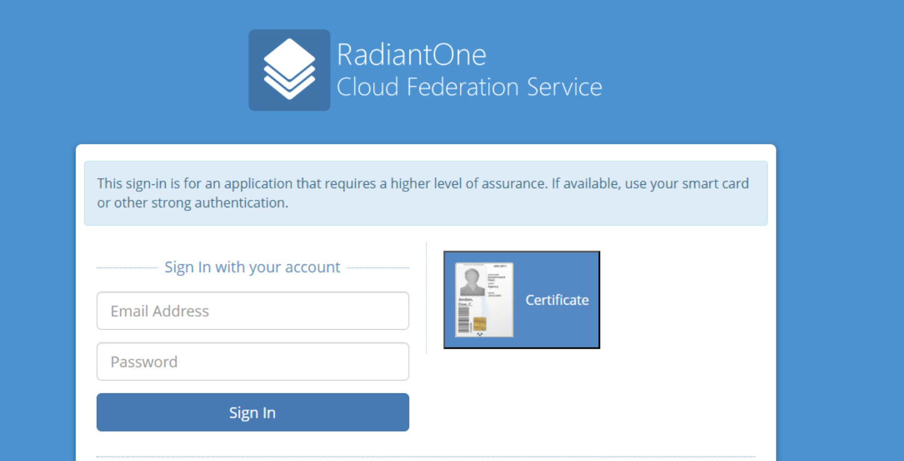
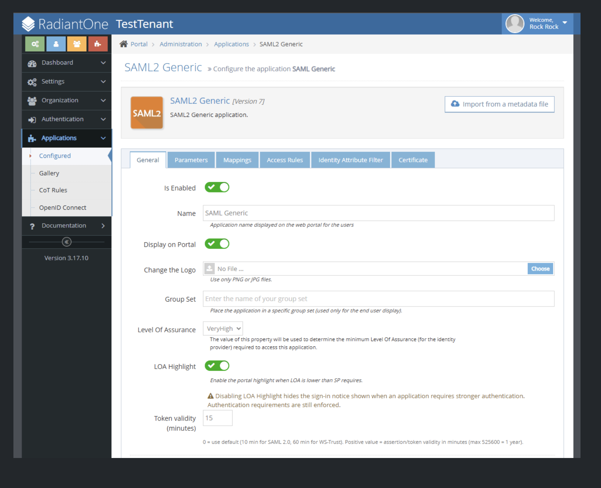
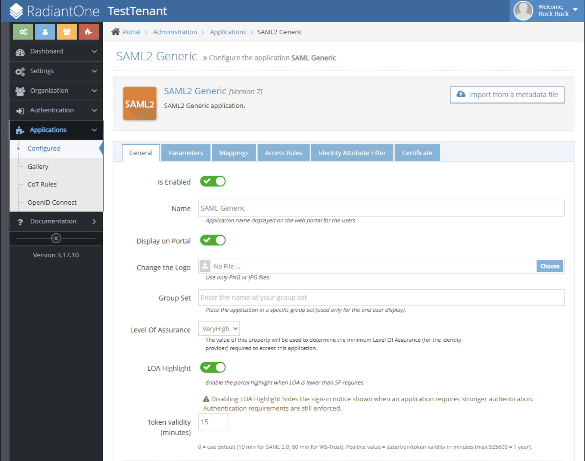
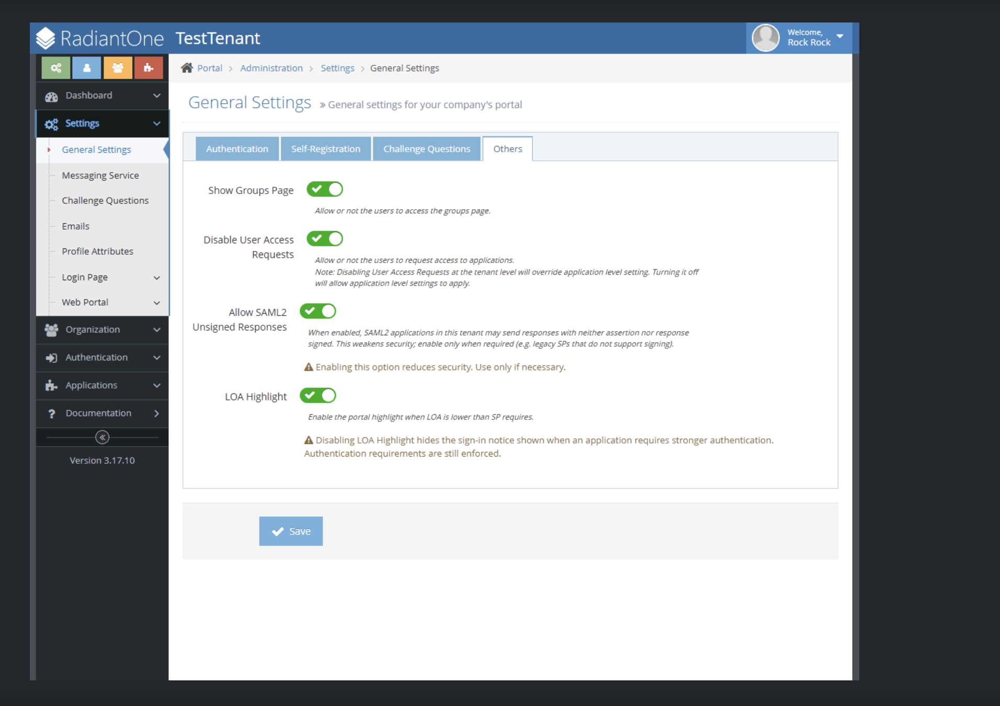
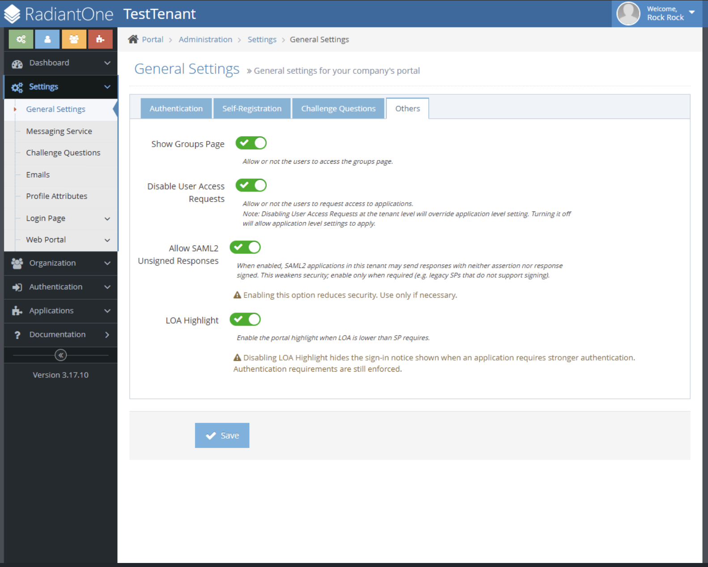

### Configuring SAML Signing Settings
SAML2 applications let you control how responses and assertions are signed, and they support configuring multiple Assertion Consumer Service (ACS) endpoints (recipients) for service providers (SPs) that define more than one ACS URL in their metadata, as permitted by the SAML 2.0 specification.
1. Open the SAML2 application configuration page.
2. Go to the **Parameters** tab and locate the **Recipients** table.
   
3. Click **Add Recipient** to add each ACS endpoint as a separate entry, and configure each row:
   - **Index** — position/order of the endpoint.
   - **Location** — the ACS endpoint URL.
   - **Binding** — the SAML binding (HTTP-POST only).
   - **Default** — marks the fallback endpoint.
4. Alternatively, click **Import from a metadata file** and upload the SP metadata XML. CFS parses any `<AssertionConsumerService>` elements and auto-populates the recipients table. Only SAML 2.0 HTTP-POST endpoints are supported; non-POST endpoints are ignored.
5. When an SP sends a SAML authentication request, CFS chooses the response destination as follows:
   | SP Request Attribute | CFS Behavior |
   |---|---|
   | `AssertionConsumerServiceURL` | Matches the URL against configured recipients and responds to that URL. |
   | `AssertionConsumerServiceIndex` | Uses the recipient at the matching index. |
   | *Neither specified* | Falls back to the recipient marked **Default**. |
6. Upload your **encryption** and **signing** certificates using the import button.
   
7. Use the **Sign Response** toggle to sign the entire SAML response when required.
8. Use the **Sign Assertion** toggle to sign only the assertion when required.
9. Review the chosen options and click **Save**.
10. By default, at least one of these options (response or assertion) must be signed for security purposes. To allow skipping both signatures, navigate to **Settings > General Settings > Others**, enable **Allow SAML2 Unsigned Responses**, and click **Save**.
    
11. Return to the SAML configuration page and ensure neither option requires a signature.

### Configure Token Validity, Level of Assurance, and LOA Highlight

The **General** tab of a SAML 2 or WS-Federation application includes settings that control token lifetime, authentication strength requirements, and the user-facing LOA banner. To configure these:

1. Navigate to **Applications → Configured**.
2. Select the SAML application you want to configure and click **Edit**.
3. Open the **General** tab.

   

**Token validity (minutes)** defines how long tokens generated for this application remain valid. Set this value according to your security policy.

**Level of Assurance** sets the minimum authentication strength required to access the application. When a user's current session does not meet this level, CFS enforces a step-up — prompting the user to re-authenticate at the required strength before access is granted. This value is passed as part of the identity token to the service provider.

**LOA Highlight** (introduced in CFS 3.17.11) is a toggle directly below the Level of Assurance field. When enabled (default), users see an informational banner on the login page when the application's assurance requirement exceeds their current session level, prompting them to use a stronger method such as a smart card or certificate.

> **Important:** Disabling LOA Highlight hides the informational banner only. CFS continues to enforce all level-of-assurance requirements, including step-up authentication, logout, RTC filtering, and related logging.

The banner users see when LOA Highlight is active:

4. Enter the desired value in **Token validity (minutes)**.
5. Set **Level of Assurance** to the minimum required authentication strength for this application.
6. Set **LOA Highlight** to **Enabled** (default) to show the banner when the LOA requirement is not met, or **Disabled** to suppress it.
7. Click **Save** to apply the changes.

**LOA Highlight enabled:**

**LOA Highlight disabled:**

The LOA banner appears only when **both** the application-level and tenant-level LOA Highlight toggles are enabled. To configure the tenant-level toggle, navigate to **Settings → General Settings → Others**, locate the **LOA Highlight** toggle, and set it to **Enabled** or **Disabled**.

**LOA Highlight enabled (tenant level):**

**LOA Highlight disabled (tenant level):**

| Scope | Default | Applies to |
|---|---|---|
| Tenant | Enabled | All federated sign-in flows for the tenant |
| Application | Enabled | SAML 2 and WS-Federation applications only |

### Configuring Group Access Using an LDAP Filter
CFS allows administrators to control application access by filtering groups using LDAP with regex-based patterns. This ensures that only users belonging to specific groups can access the application. The steps below guide you through configuring and validating a group filter.

#### Configuring the Filter
1. Open the SAML2 application configuration page.
2. Select the application to configure and click Edit.
3. Open the Access Rules tab.
    
4. Locate the "Allow groups using filter" field under the group access (allowed groups) section. 
5. Enter an LDAP filter pattern that matches the groups you want to allow. 
    **Examples:**
    - Admins only `admin`
      `(cn=*admin*)`
    - Groups containing `-svn-`  
      `(cn=*-svn-*)`
    - Groups starting with `east-`  
      `(cn=east-*)`
    - Groups ending with `-developers`  
      `(cn=*-developers)`
     
    Any group whose attributes match the filter will be granted access based on the defined access rules.
7. Click **Validate** next to the filter field.
    **Validation results:**
    - **Valid filter:** Displays a list of matching groups for review  
    - **Invalid filter:** Shows an error message; the application cannot be saved until the filter is corrected. Update the filter as needed and revalidate until it succeeds.
8. Once validation is successful and the results are correct, click **Save**. The filter gets applied immediately. Existing matching groups are granted access and newly created groups that match the filter are automatically included.

### Configuring Clock Skew Settings 
In SAML, WS-Fed, and OIDC applications, you can configure clock skew to mitigate differences in system time between your application and external services such as an Identity Provider (IdP), Service Provider (SP), or third-party system/API. The clock skew feature introduces a configurable time tolerance when validating time-based security artifacts, including certificates and access tokens.

To configure clock skew, navigate to Applications > Configured > Parameters. Locate the Clock skew (minutes) setting, enter the appropriate value for certificate and/or token expiration validation, and save your changes.

By default, the maximum permitted clock skew duration is 10 minutes. To modify this limit, follow these steps:
1. Log in to the RadiantOne portal and go to the Directory Browser tab.
2. Navigate from the CFS configuration root (ou=cfs,cn=config) to ou=Parameters,ou={your_tenant},ou=tenants,{configuration_root}, then update the MaxClockSkewMinutes parameter with the desired value.

