SAML2 Generic
=============

Return to [all applications](03-configuration#applications).

Create the application
----------------------

*   Log in as Tenant Administrator.
*   Navigate to Applications | Gallery.
*   Look for the application **SAML2 Generic**
*   Click **Configure**.

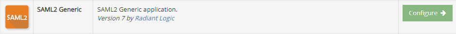

Configuration in CFS
--------------------

### General

In the **General** tab you can define the general information of the application.

*   Enable the application.
*   Provide a name that will be displayed on the end user portal.
*   You can change the logo of the application.
*   The Group set is used to group the applications on the end user portal.
*   Set the application minimum [Level Of Assurance](02-getting-started#level-of-assurance).
*   Use the option Display on Portal to allow this application to appear on the end user portal or not.

The **Smart Links** link is used to configure [Smart Links](03-configuration#smart-links) for this application.

You can also access directly the Metadata file by clicking the **Metadata File** link. This file might help you to configure the application (or service) side of this trust relationship.

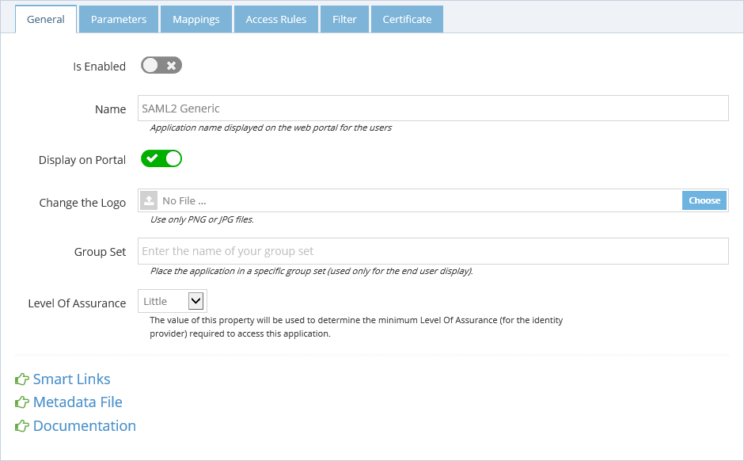

### Parameters

The **Parameters** tab contains the list of settings required to configure the application.

*   **Issuer** - Enter the identifier for CFS that has been defined in the application/relying party.
*   **Audience** - Enter the SAML 2 parameter Audience. This value is a validity condition for an assertion as defined in the application/relying party. It declares that the assertion's semantics are only valid for the relying party named by the URI set in this parameter.
*   **Recipient** - Enter the SAML 2 parameter Recipient. This is the URL on the application/relying party to redirect the user back to (with the token) after they are authenticated by CFS.
*   **Relay State** - Enter the SAML 2 parameter Relay State. This is used to transfer a context between the relying party and CFS and is usually passed dynamically during the authentication process during RP-initiated SSO. This can be left blank.

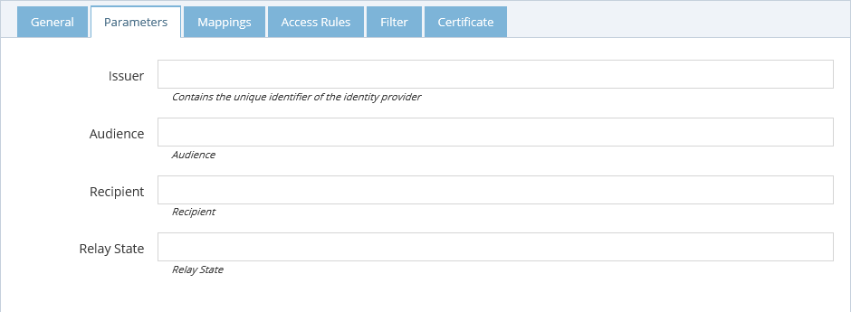

*   **Signature Algorithm** - Algorithm to use to sign the token.
*   **Digest Algorithm** - Algorithm to use to generate the digest of the token.

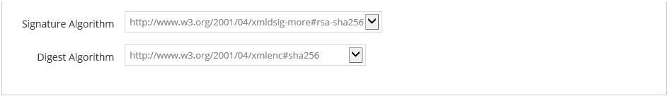

### Import Metadata

Starting in CFS Version 3.16.2, an application's metadata can be imported into CFS using the _Import Metadata_ feature. 

The data can be imported from either an XML file, or from a URL. The data will be parsed, and the appropriate parameters (i.e. issuer, auidence, recipient, relay state) will be filled in. The fields that were not found in the metadata will be removed, but the existing fields will still be modifiable.

The following images show an example Generic SAML 2 application that used the import metadata feature in which the relying party's metadata provided only issuer and ACS values.  
  
Before the import, the parameters tab shows the following:

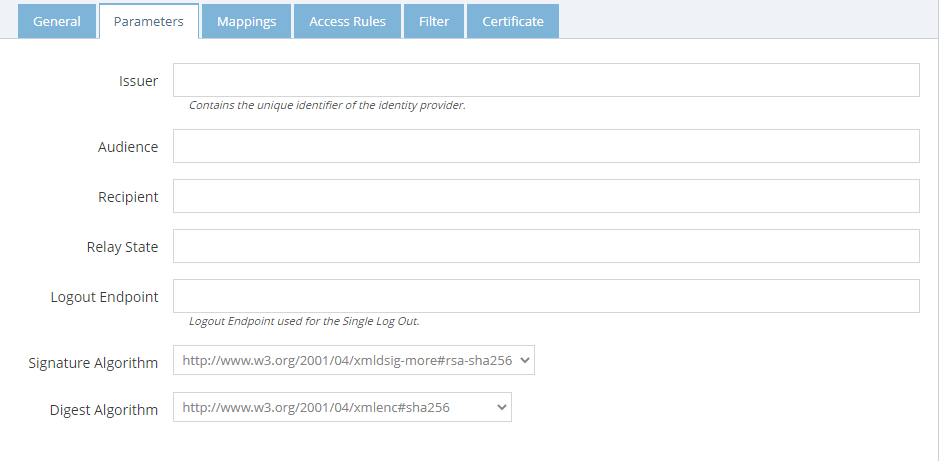

After the import, it shows:

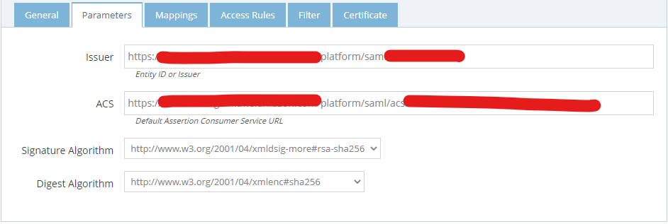

### Mappings

The **Mappings** tab contains the list of transformation required to generate the output token claims. Since this application supports it, you can send additional claims in your token. Click the "New Mapping" button to add a new mapping.

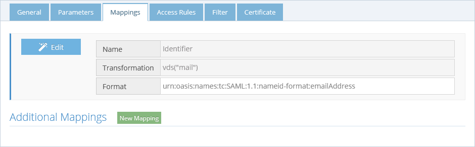


#### Filtering Multi-Valued Attributes

When configuring attribute mappings, you can use regex-based filter functions to control which values from a multi-valued identity store attribute are emitted in SAML assertions. This is particularly useful when users have large group memberships that could result in oversized HTTP responses. 

You can add filtering regex functions to the **Transformation** field in the **Additional mappings** section to limit the assertion to only the groups relevant to the specific application.

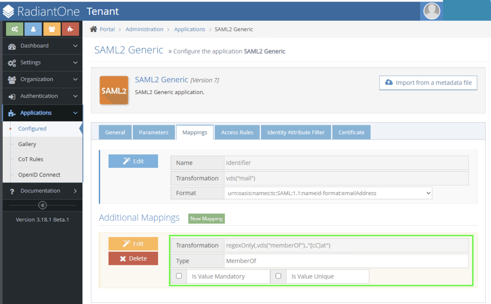


Two functions are available.

#####  `regexOnly`

Emits a value only when the entire value matches the given .NET regular expression pattern.

**Syntax:**

```
regexOnly(.vds("attributeName").,"pattern")
```

**Example:** keep only groups that start with `AppX-`:

```
regexOnly(.vds("memberOf").,"AppX-.*")
```

**Example:** keep only groups containing `cat` (case-insensitive):

```
regexOnly(.vds("memberOf").,".*[cC]at.*")
```

##### `regexNot`

Emits a value only when the entire value does **not** match the given .NET regular expression pattern.

**Syntax:**

```
regexNot(.vds("attributeName").,"pattern")
```

**Example:** exclude groups related to service, test, or deprecated:

```
regexNot(.vds("memberOf").,".*(?:service|test|deprecated).*")
```

## Pattern Matching Behavior

- Matching is full-string — the pattern must match the entire attribute value, not just a substring. Use `.*` anchors to match partial strings (e.g., `.*foo.*`).
- Matching is case-sensitive. To match both `cat` and `Cat`, use a character class like `[cC]at` or the appropriate .NET regex flag syntax.
- Patterns must conform to .NET regular expression syntax.

## Configuring via the Admin UI

`regexOnly` and `regexNot` are available in the Normal transformation wizard when editing attribute/claim mappings:

1. Open the transformation wizard on an attribute or claim mapping.
2. Select **Regex Only** or **Regex Not** from the operations list.
3. Set the **Value** argument (e.g., VDS `memberOf`).
4. Enter the .NET regex pattern.
5. Save the mapping.

The completed mapping appears in the **Additional Mappings** list. In the example below, a `regexOnly` filter on `memberOf` with the pattern `.*fo.*` is applied to the **Groups** claim type:

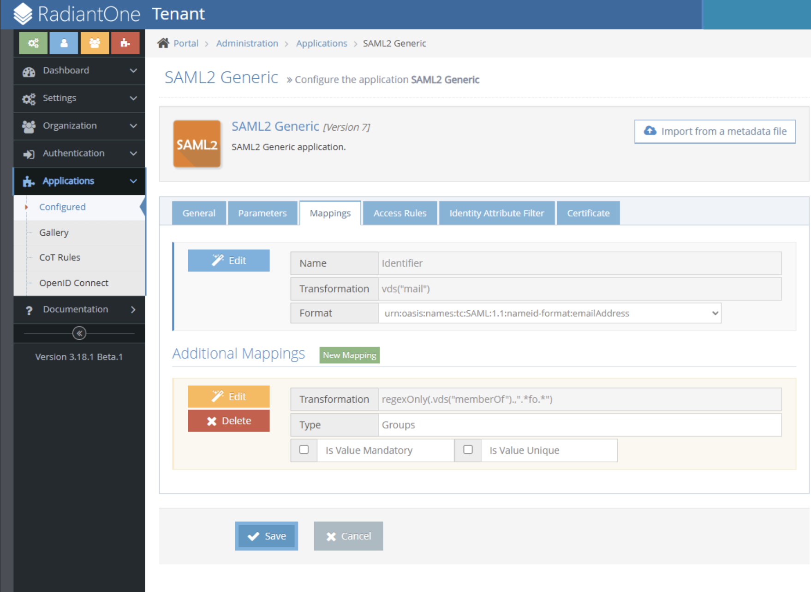

You can also enter the expression directly in Advanced mode.


At assertion time, each value of the multi-valued source attribute is tested against the pattern, and only the matching values are emitted. In the assertion below, the `.*fo.*` filter has reduced a large `memberOf` set to just the group values that contain `fo` (e.g., `fofofo`, `omgfogmo`, `foobar`, `barfoo`):

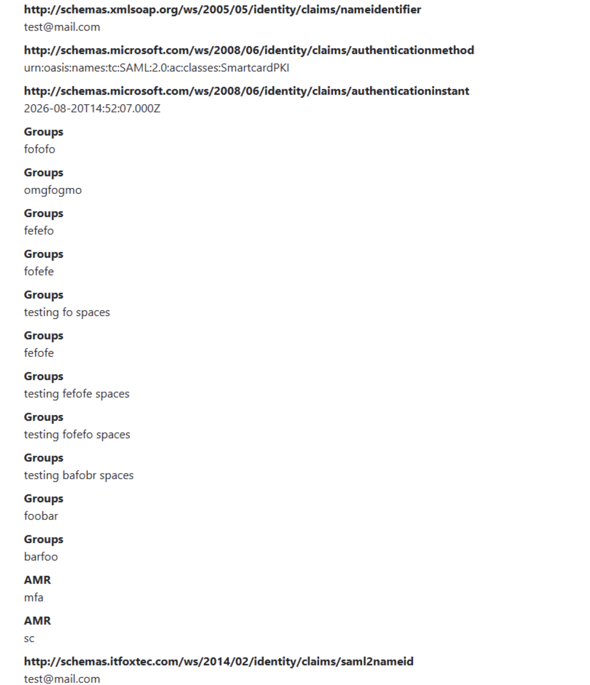

## Composition with Other Functions

The **Value** argument of `regexOnly` / `regexNot` can itself be a nested transformation. For example, to uppercase values before filtering:

```
regexOnly(.upper(.vds("memberOf").).,"APP-.*")
```

However, `regexOnly` and `regexNot` **cannot** be nested as the inner expression of another function. **The following is invalid and will be rejected:**

```
upper(.regexOnly(.vds("memberOf").,"App-.*").)
```

#####  Restrictions

- `regexOnly` and `regexNot` are not available for SAML Name Identifier mappings.
- If the filter results in zero matching values:
  - A non-mandatory claim is omitted from the assertion (no empty `AttributeValue` is emitted).
  - A mandatory claim will cause an evaluation error and SSO will fail.
- If a regex pattern is invalid, the mapping fails  and the unfiltered group list is never emitted.


### Access Rules

The **Access Rules** tab helps define the second layer of security (after LOA) to grant access to this application. By default, the access is limited to only the people in the **Application Group** which is a group created automatically by CFS when the application is created. 

To grant access to this application, you can use one of the following options:

-   Enabling **Allow All Users** option grants access to every user of your tenant (as long as the other security layers, LOA, COT... are accepted for the user).
-   Use the **Application Group** to add users allowed to access this application. The users who are granted access to the application after an access request are automatically added to this group.
-   Add **Additional groups** from the RadiantOne identity store.

There is also an option to disable users from seeing the "Request Access" feature entirely, providing you with more control over who can request access to your application.

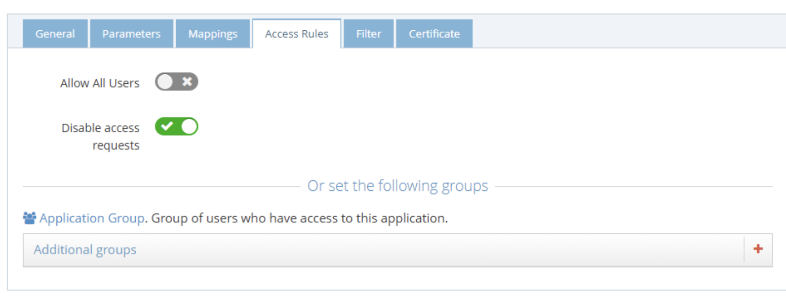

### Filters

The **Filter** tab is another security layer that allows to filter the access to the application by using the context of the user. This context is based on the attributes of the user retrieved from the RadiantOne identity store and the attributes generated by CFS like the [Circle of Trust](02-getting-started#circle-of-trust).

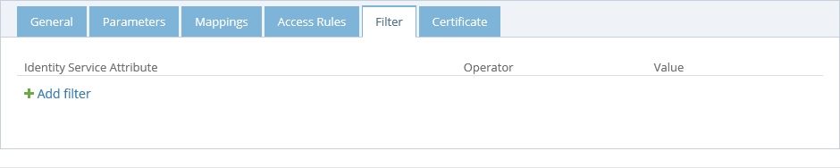

### Certificate

The **Certificate** tab is used to define the certificate used by CFS to build the signature of the token it generates for the application. When configuring the application (or service), provide the public key of this certificate so the application can ensure that only CFS could have generated and signed the token. There are 3 options to provide this certificate to the application.

*   **Default Tenant Certificate** - CFS generates a certificate for each tenant and stores it the RadiantOne identity store. This is the default certificate that is used for all applications.
*   **Upload a private key** - You can upload your own certificate (private plus public key) and it will be used for this application only. This certificate is stored in the RadiantOne identity store, and can be used from any CFS machine.
*   **Upload a public key** - You can upload your own certificate (public key only). This public key is stored in the RadiantOne identity store, but the private key must be installed in the Windows Vault and made available on each CFS machine that will sign the application tokens. This is the most secure way to sign a token because the private key never travels on your network between the RadiantOne identity store and the CFS machines.

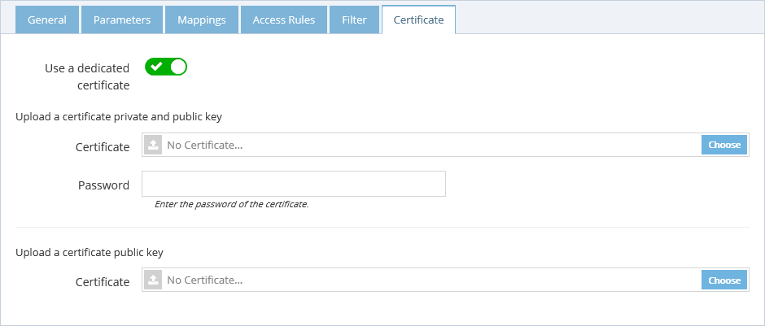
