Facebook
========

Log in at [https://developers.facebook.com/](https://developers.facebook.com/) and click "Create a new application".

Choose **_Consumer_** for the App Type in the page that follows, then click **_Next_**.

For the **Display Name**, enter a value that is easy to recognize (i.e CFS), then click **_Create App_**.

If you get prompted to re-enter your password, do so, then click Submit.

Under **Settings > Basic** on the left navigation pane, enter the App Domain value from CFS in the _App Domain_ form.

*   From CFS: 
    
*   On the Facebook Developer Portal:
    
    
    

In the _Privacy Policy_ form, enter your company's privacy policy url.

Click **_Save Changes_**.

On the top of the page, locate **App Mode**, and toggle it to _Live_.

At the bottom of the page, click _\+ Add Platform_, then choose **Website**.

Click _Next_. In the **Site URL** that appears below, copy the value that appears in CFS, then click _Save Changes_.

*   From CFS: 
    
*   In Facebook Developer Portal: 

Under the **Products** tab on the left, choose **Add Product**.

Look for **Facebook Login** and click _Setup_.

On the left navigation pane, under _Facebook Login_, choose the _Settings_ tab.

Under the _Valid OAuth Redirect URIs_, enter the URI from the CFS Web portal.

*   From CFS: 
    
*   In Facebook Developer Portal: 

Click **Save Changes**

In the left navigaiton pane, navigate back to **Settings > Basic**.

Log into CFS as a Tenant Administrator and navigate to Authentication -> Social Networks -> Facebook.

Copy the App ID and App Secret Parameters, and paste them in the CFS Facebook Configuration page, respectively.

*   From Facebook Developer Portal: 
    
*   In CFS Web Portal: 

Choose whether to enable on Master, Proxy, or both.

Click **Save** in the CFS Web Portal.

 GitHub
======

Log into GitHub at: [https://github.com/settings/developers](https://github.com/settings/developers), and click _Register a New Application_.

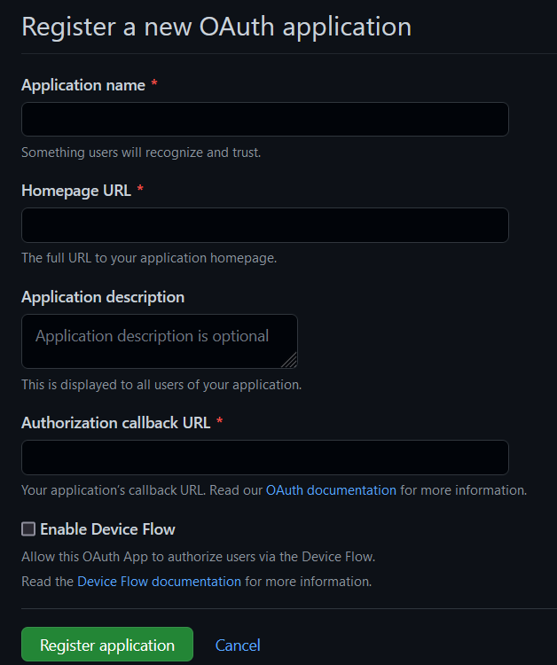

*   Enter a name for the application.
*   Enter the homepage of your CFS (i.e. [https://cfs.domain.com](https://cfs.domain.com) ).
*   Enter a description (optional).
*   Enter the Authorization callback URL for CFS. To get this URL, log into CFS as a Tenant Administrator and navigate to Authentication > Social Networks > GitHub and get the Authorization callback URL value.

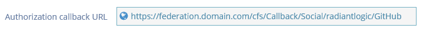

Click **Register Applicaton**.

In the page that appears next, click **Generate a new client secret**. Copy this value in a secure location, as you won't be able to view it again.

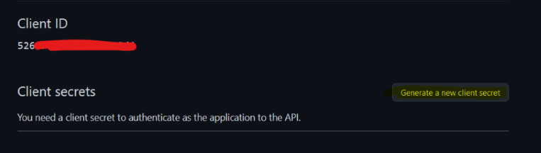

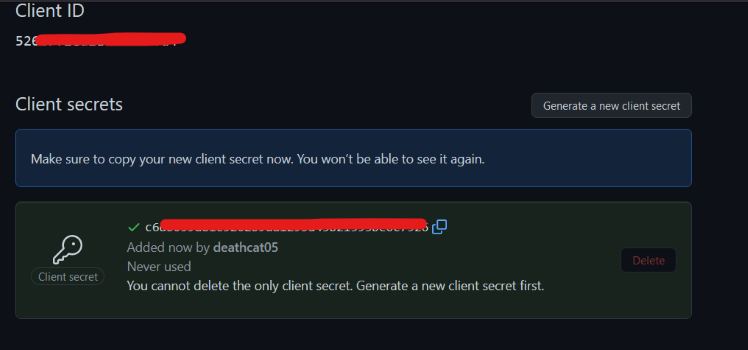

Click **Update Application**.

Log into CFS as a Tenant Administrator and navigate to Authentication > Social Networks > GitHub.

In the CFS Web Portal, enter the Client ID and Client Secret copied from GitHub. Note - the values shown in the screen shot below are only examples and not valid.

Choose whether to enable on CFS Master, CFS Proxy, or both.

Click **Save**.

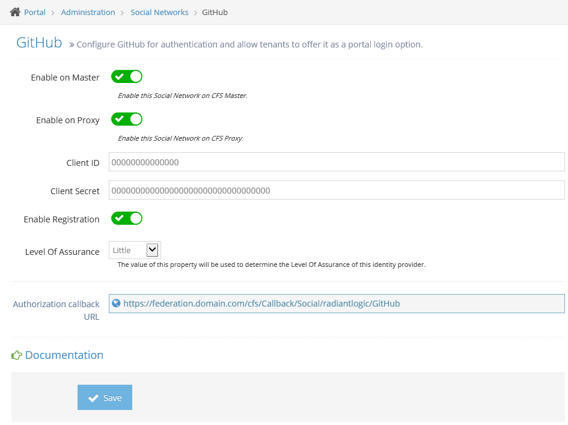

Google
======

Log in to Google Cloud at: [https://console.cloud.google.com/cloud-resource-manager](https://console.cloud.google.com/cloud-resource-manager) and click "Create Project".

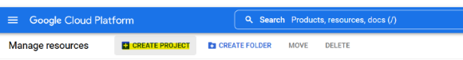

Enter a name for the project, and click **Create**. Once created, the project name cannot be changed.

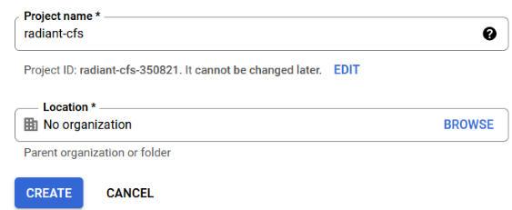

In the notification, page find the notification that states "Create Project: \[CFS project name\]", and choose **Select Project**.

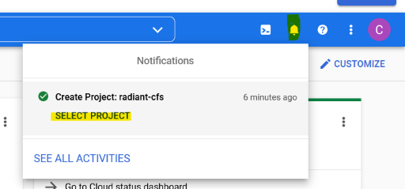

In the top right of the web page, click on the Hamburger Menu and find **API & Services > Credentials**.

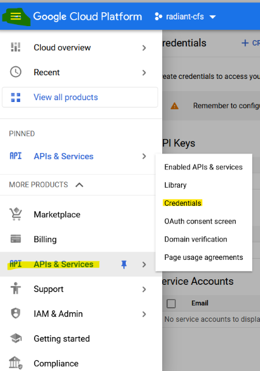

Click **\+ Create Credentials** in the top navigation pane, then choose **OAuth client ID**.

If not done so already, the webpage will display a message saying that a consent screen configuration is needed first. Configure it by clicking on the **CONFIGURE CONSENT SCREEN** button.

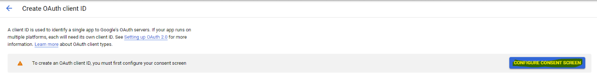

Choose whether to make the consent screen visible to external or internal, then click **Create**.

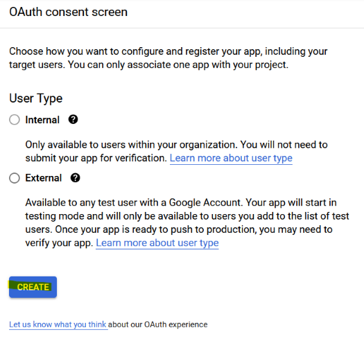

Fill out the consent screen as desired, then click **Save and Continue**. An example looks like this:

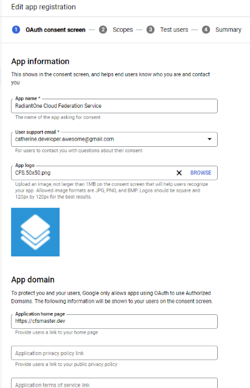

In the _2 - Scopes Section_, click _Add or Remove Scopes_ and choose the following scopes from the list:

*   `../auth/userinfo.email`
*   `../auth/userinfo.profile`

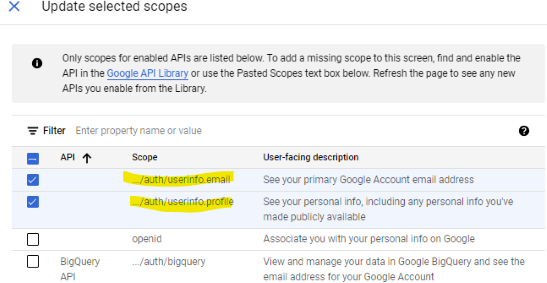

Click **Update** then **Save and Continue**.

Enable test users, if desired. This is helpful if you're just testing. **Note:** to make an app go live, it must be submitted to Google for verification. Follow the steps as required by Google for this.

Back on the **APIs and Services > Credentials** page, click **Create Credentials**, and choose **Oauth Client ID**.

*   This step only applies, if you had to previously go through the steps to create the OAuth Consent Screen.

For Application Type choose **Web Application**.

For the name, enter something to uniquely identify the app (i.e. RadiantOne CFS).

For the _Authorized JavaScript Origins_ option, click "+ ADD URI" and copy the **_Web Origin_** value from the CFS Web Page for configuring Google.

*   This can be found in the Authetication > Social Networks > Google section of the CFS Tenant Admin page.

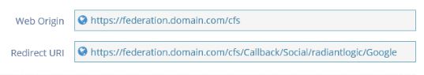

For the Authorized Redirect URIs click **+ADD URI**, and copy the value from the CFS web Portal.

*   This can be found in the Authetication > Social Networks > Google section of the CFS Tenant Admin page.

Click **CREATE**.

In the popup window that is shown after, copy the client ID and client secret values and paste into CFS configuration respectively. Note - the values shown in the screen shot below are only examples and not valid.

Log into CFS as a Tenant Administrator and navigate to Authentication > Social Networks > Google.

Enter the Client ID and Client Secret you copied from the Google configuration in the previous section. Note - the values shown in the screen shot are only examples and not valid.

Choose whether to enable on CFS Master, CFS Proxy, or both.

Click **Save**.

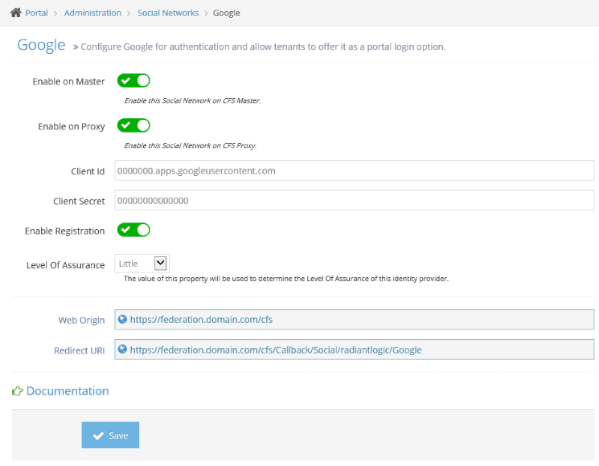

Instagram
=========

>[!note] As of vesion **3.16.2**, using Instagram as a Social Network Identity Provider is no longer supported.

Log in at: [https://instagram.com/developer/](https://instagram.com/developer/) and click "Register Your Application", then click "Register a New Client".

*   Enter a name for the application.
*   Enter a description.
*   Enter the website address.
*   Enter the OAuth redirect\_uri. To get this URL, log into CFS as Tenant Administrator then navigate to Authentication -> Social Networks -> Instagram and get the OAuth redirect\_uri value.

*   Once you have validated the application on Instagram, in the details of your application, copy the parameters Client ID and Client Secret. These values are used to configure Instagram in CFS.

*   Log into the CFS as a Tenant Administration and navigate to Authentication -> Social Networks -> Instagram.
*   Enter the Client ID and Client Secret you copied from the Instagram configuration in the previous section. Note - the values shown in the screen shot below are only examples and not valid.
*   Click Save.

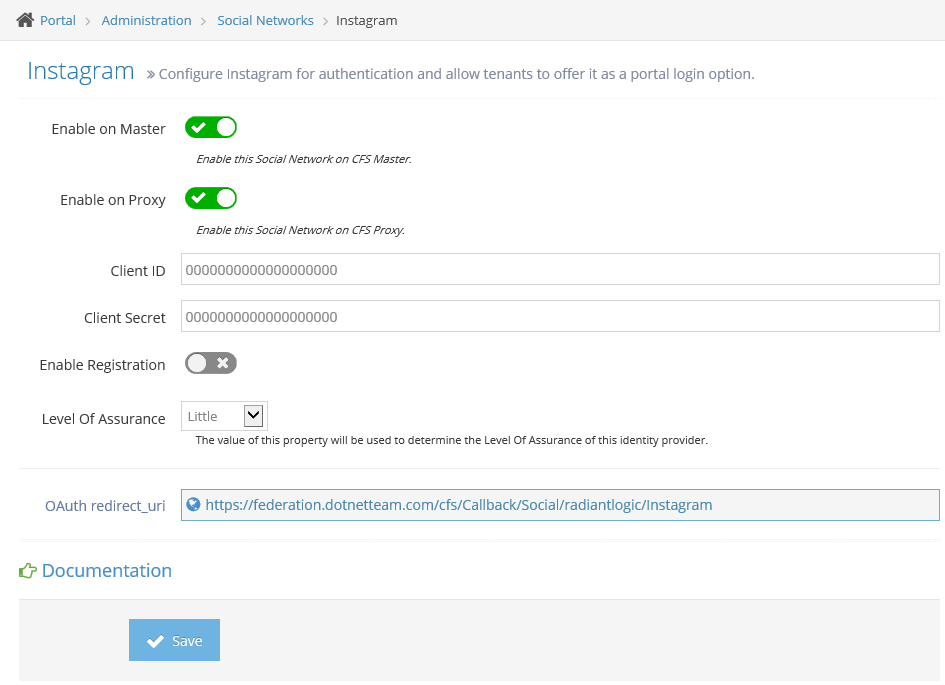

LinkedIn
========

Log in at: [https://developer.linkedin.com/](https://developer.linkedin.com/) and click **Create an App**.

All of the fields that appear in the next page are required. Fill them out accordingly. An example is shown below:

Click **Create App**.

Navigate to the _Auth_ tab, and click the pencil next to _Authorized redirect URLs for your app_.

Then, click + Add redirect URL and enter the value from the CFS webpage. To get this URL, login into CFS as a Tenant Administrator and navigate to Authentication -> Social Networks -> LinkedIn and get the OAuth 2.0 Redirect URL value.

Click Update.

Navigate to the _Products_ tab, and choose **Sign In with LinkedIn**.

Agree to the Terms of Service, and click **Add Product**.

Navigate back to the _Auth_ tab, and find the Client ID and Client Secret section.

Log into CFS as a Tenant Administrator and navigate to Authentication -> Social Networks -> LinkedIn.

Copy the Client ID and Client Secret from the LinkedIn configuration. Note - the values shown in the screen shot below are only examples and not valid.

Choose whether to enable on CFS Master, CFS Proxy, or both.

Click **Save**.

Microsoft
=========

>[!note] Only personal accounts can be used to login with Microsft. Accounts linked to specific Azure AD tenants are not able to authenticate using this Social Network Authentication mechanism.

Log in at: [https://portal.azure.com/#blade/Microsoft\_AAD\_IAM/ActiveDirectoryMenuBlade/RegisteredApps](https://portal.azure.com/#blade/Microsoft_AAD_IAM/ActiveDirectoryMenuBlade/RegisteredApps).

Click **\+ New Registration**.

In the window that follows after ensure the following are filled out:

*   _Name_ -- user friendly name for your application (i.e Cloud Federation Service)
*   _Redirect URI_ -- To get this URL, log into CFS as a Tenant Administrator and navigate to Authentication -> Social Networks -> Microsoft, and get the OAuth 2.0 Redirect URL value.

*   _Supported Account Types_ -- choose the **Personal Microsoft Accounts Only**

Click **Register**.

Navigate to the **Certificate and Secrets** blade on the left, and click _\+ New client secret_.

In the menu blade that appears after enter a name for your secret and the desired expiration time.

*   **Note:** you will have to update this secret in the CFS configuration page every time the secret expires.
*   Copy this secret somewhere that you can easily access for next steps.
    
    
    
Log in to CFS as a Tenant Administrator and navigate to Authentication -> Social Networks -> Microsoft.

Copy the Client ID and Client Secret values obtained previously. Note - the values shown in the screen shot below are only examples and not valid.

*   The App client ID can be found in the **Overview** section of the App Registration page.

Choose whether to enable on CFS Master, CFS Proxy, or both.

Click **Save**.

PayPal
======

Log in at: [https://developer.paypal.com/webapps/developer/applications/myapps](https://developer.paypal.com/webapps/developer/applications/myapps).

On the Dashboard tab navigate to **My apps & Credentials**.

Click _Create App_. In the form that appears:

*   For App Name enter a name (i.e. RadiantOne CFS) \*Keep the App Type as Merchant
*   Leave the Sandbox Business Account as is (unless you have a need for a different one)

Click _Create App_.

Enter the redirect URL.To get this URL, log into CFS as a Tenant Administrator and navigate to Authentication -> Social Networks -> PayPal, and get the OAuth 2.0 Redirect URL value.

*   From CFS Portal:

*   In PayPal Developer Page:

In the App feature options, ensure that only the Login with PayPal checkbox is checked.

In the list of options that appear after checking Login with PayPal check both boxes under Personal Profile. Leave the others unchecked.

Enter your company's privacy policy, and user agreement links.

Click Continue in the popup that follows.

Click Save.

>[!note] if you get an error saying couldn't save the app, try clearing the browser cache, and logging into PayPal again. Should see it correctly configured in the portal after logging in again.

Click Show under the Secret section in the API Credentials section.

Log into CFS as a Tenant Administrator and navigate to Authentication -> Social Networks -> PayPal.

Copy the Client ID and Secret from the PayPal web page. Note - the values shown in the screen shot below are only examples and not valid.

Choose whether to enable on CFS Master, CFS Proxy, or both.

Click **Save**. 

>[!note] in order for the app to be published live, it will have to be verified by PayPal which can take several days. If your app isn't live, you will not be able to use PayPal as a Social Network Identity Provider. You must have a PayPal Business account to be able to create Live apps.

Twitter
=======

Log in at: [https://developer.twitter.com/en/apps](https://developer.twitter.com/en/apps) and click "Create an app".

If you have not applied for a developer account previously, the following popup will appear, and you must click Apply.

*   Go through the process of applying for an account. (It takes 5 minutes or less)

After you apply for a developer account or after you log in (if have already prevously applied for a developer account), you will be redirected to the developer portal.

Click **Create Project**.

In the **1 Project Name** tab, enter something to identify your project (i.e. RadiantOne CFS).

Click Next.

In the **Use Case** tab, choose **Building Consumer Tools (professional)**.

Click Next.

In the **Project Description** explain the purpose of the project (i.e. "Allowing users to use Twitter to sign into an identity management platform").

Click Next.

In the **App Name** tab, enter a unique identifier for your app

Click Next.

The window that appears next is the API Key, API Key Secret, and Bearer Token. Copy these values to a safe place as it is the only time they will be displayed.

Click App Settings In the window that appears after, choose _Set Up_ under **User authentication Settings**.

Toggle the radio button next to Oauth 1.0a.

Under **OAuth 1.0A settings**, toggle the Request email from users button. Ensure that only the Read Permission radio button is chosen.

In the **Callback URI/Redirect URI** section, copy the value from the CFS web page for Twitter configuration.

For the Website URL, enter the homepage of your CFS instance.

For the Terms of Service and privacy policy URLs, enter your company's respective links.

Log into CFS as a Tenant Administrator and navigate to Authentication -> Social Networks -> Twitter.

Copy the API Key you saved from the original creation of the app, into the consumer Key field. Do the same thing the with API Key Secret, except paste it in the Consumer Secret field.

Choose whether to enable on CFS Master, CFS Proxy, or both.

Click **Save**.

WordPress
=========

Log in at: [https://developer.wordpress.com/apps](https://developer.wordpress.com/apps) and click "Create New Application".

In the form that follows, enter the following:

*   In the Name Field enter a unique name (i.e. RadiantOne - CFS)
*   Enter a description, if you feel it necessary
*   The website URL can just be your CFS homepage (i.e. [https://www.cfs.domain.com](https://www.cfs.domain.com) )
*   The Redirect URL can be obtained by logging into CFS as a Tenant Administrator and navigating to Authentication -> Social Networks -> WordPress, and getting the OAuth 2.0 Redirect URL value.
    
    
    
    Answer the Small math equation after JavaScript origins.
    
*   Ensure that the Type is _Web_

Click **Create**.

Log in to CFS as a Tenant Administrator and navigate to Authentication -> Social Networks -> WordPress.

Copy the generated Client ID and Client Secret in the WordPress developer page that appears under OAuth Information.

Choose whether to enable on CFS Master, CFS Proxy, or both.

Click **Save**.

Yahoo
=====

Log in at: [https://developer.yahoo.com/apps](https://developer.yahoo.com/apps) and click **Create an App**.

In the page that follows ensure the following are filled:

*   Application Name - a unique name for the CFS application
*   Description -- Description of the app
*   Redirect UI -- Enter the redirect URI under Adimistration > Authentication > Identity Providers > Yahoo in the CFS Web Portal when logged in as tenant administrator. 
*   Homepage -- Enter the CFS homepage
*   OAuth Client Type - Confidential Client
*   API permissions - Check OpenID Connect Permissions, and ensure email and profile are checked

Click **Create App**.

The page quickly refreshes and shows an App ID, Client ID (Consumer Key), and Client Secret (Consumer Secret) at the top of the page.

Log into CFS as a Tenant Administrator and navigate to Authentication -> Social Networks -> Yahoo.

Enter the API Key and API Secret you copied from the Yahoo configuration in the previous section. Note - the values shown in the screen shot below are only examples and not valid.

Choose wheter to enable on CFS Master, CFS Proxy, or both.

Click **Save**.

