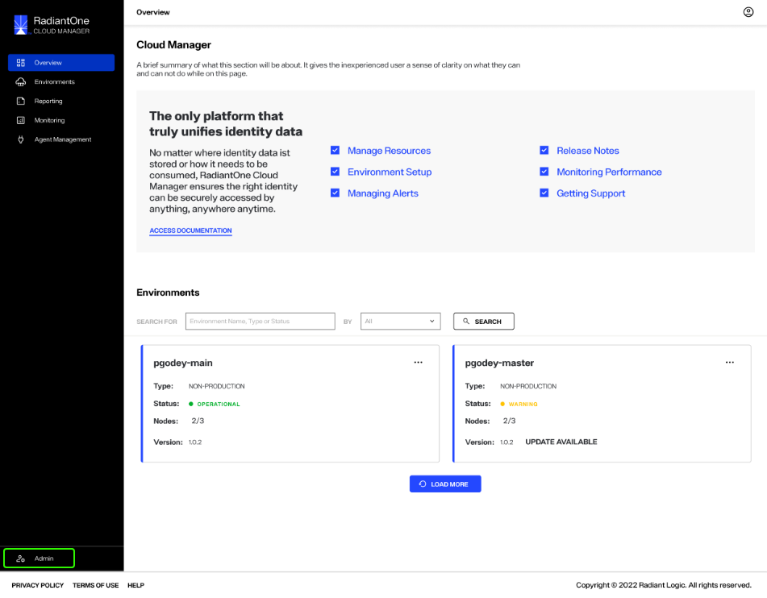
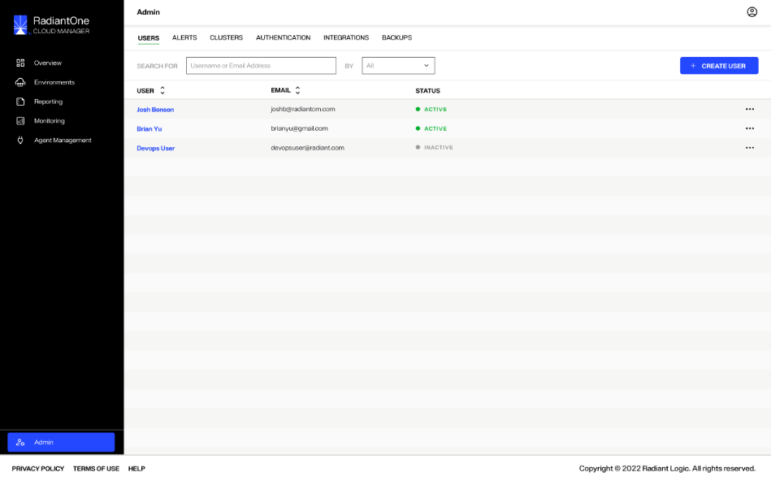
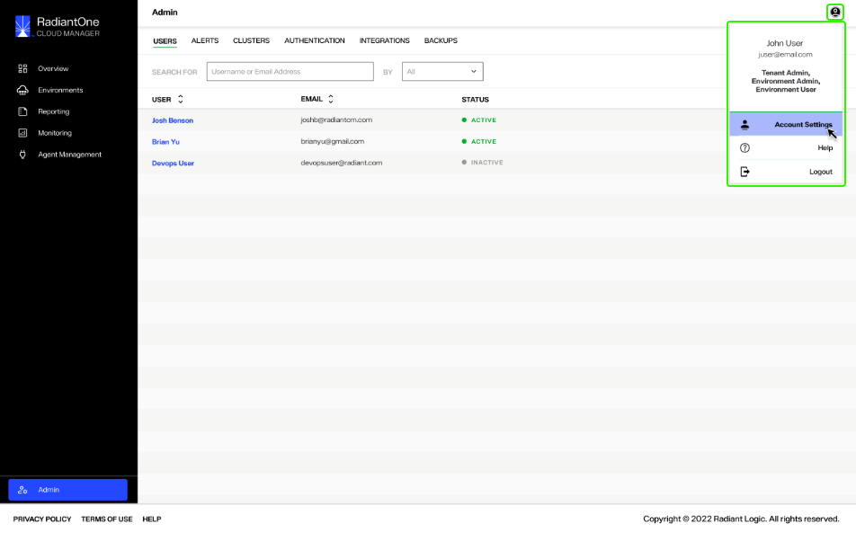
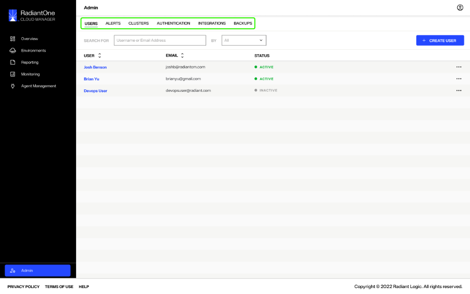
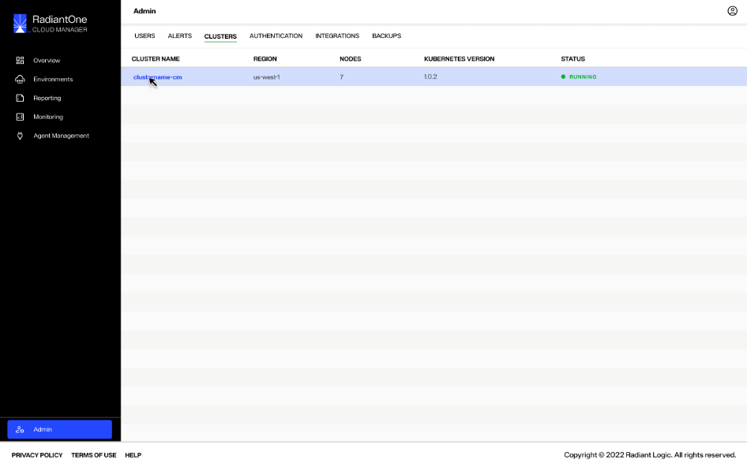
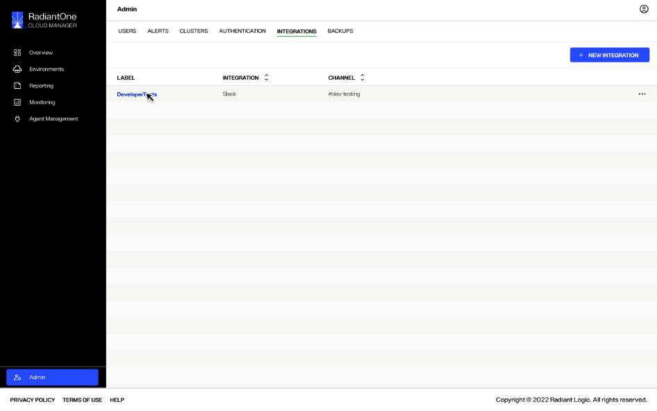
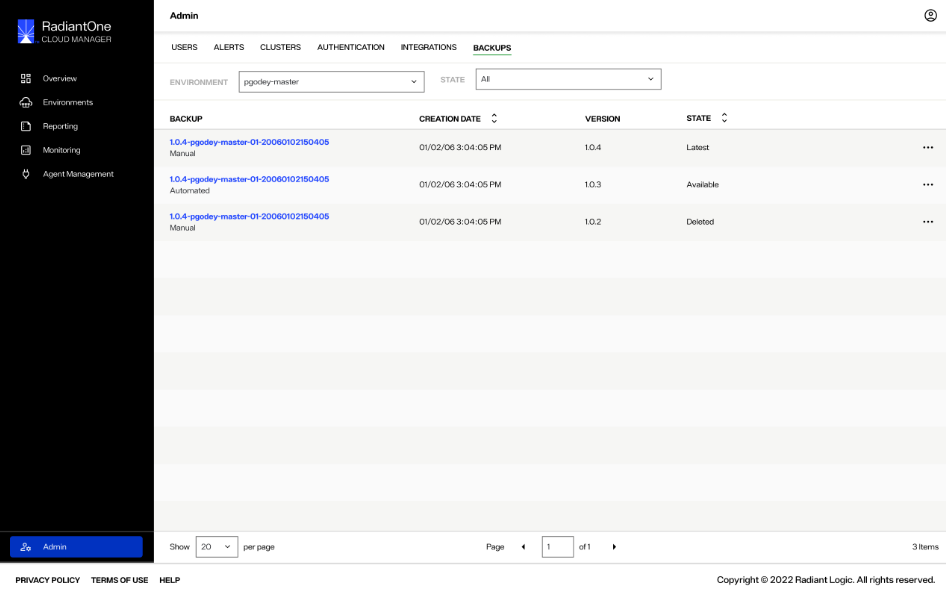

---
keywords:
title: Admin Overview
description: Overview of the Admin home screen user interface
---
# Admin Overview

This guide provides an overview of the *Admin* home screen and its features. From the *Admin* screen you can access tabs to manage your account settings, Environment Operation Center user's settings, environment alerts and integrations, and monitor cluster health.

## Getting started

To navigate to the *Admin* screen, select **Admin** () located at the bottom of the left navigation.

This brings you to the *Admin* home screen, which is the admin *Users* tab.

## Account management

A user avatar is located in the upper right corner of the *Admin* screen. Select the avatar () to expand your account dropdown menu. This displays your name, email, and permissions associated with the account. 

From the dropdown menu you can navigate to your **Account Settings** (), access the **Help** ()center, or **Logout** () of Environment Operations Center.

For information on managing your account settings, see the [account settings](...) guide.

## Top navigation

A navigation bar is located at the top of the *Admin* home screen and is visible from all tabs in the *Admin* view. The top navigation allows you to access several account and user management tools through the following tabs:

- Users
- Alerts
- Clusters
- Authentication
- Integrations
- Backups

### Users

The *Users* tab allows you to manage all users within your Environment Operation Center instance. From here you can view a user's name, email address, and status.

For details on managing Environment Operation Center users, including their roles and permissions, see the [user management](...) guide.

### Alerts

From the *Alerts* tab you can monitor and create alerts for your environments. The main *Alerts* screen displays all of your current alerts including their notification channel, a time and date stamp of the last update to the alert, and the severity status.

For more information on alert management, see the [alert management](...) guide.

### Clusters

The *Clusters* tab allows you to monitor cluster health. The *Clusters* screen displays your cluster, the region of that cluster, its number of nodes, Kubernetes version, and current status.

For details on monitoring clusters, see the guide on [cluster monitoring](...).

### Authentication

The *Authentication* tab allows you to manage Environment Operation Center authentication methods. From the main *Authentication* screen you can view current authentication providers, the provider type, and the status of the authentication method.

For details on managing authentication providers, see the [authentication](...) guide.

### Integrations

From the *Integrations* tab you can manage your connections to external applications to send alerts from Environment Operations Center (**confirming with RL if this is accurate or if any further functionality is missing**). The *Integrations* tab displays the integration "Label", indicating the integrations purpose, the "Integration", indicating the external application, and the "Channel" that is used within the external application integration.

For details on managing integrations, see the [managing integrations](...).

### Backups

The *Backups* tab provides extended environment backup management functionality compared to the environment *Backups* screen (**confirming details/use cases with RL**). The admin *Backups* tab allows you to filter backups by environment and state. It displays the backup name, creation date and time, version number, and state.

For details on managing environment backups from the *Admin* screen, see the [admin backup management](...) guide.

## Next steps

