---
keywords:
title: Alert Management
description: Alert management
---
# Alert Management

Custom alerts can be created in Environment Operations Center to help your teams monitor the health and operations of your environments. Once created, alerts are sent to your specified communication channels to keep you up to date on important changes, potential issues, or errors. This guide outlines the steps to create and manage alerts in Environment Operations Center.

[!note] An integration channel to receive the alert must be created prior to setting up the alert. For details on adding communication channel integrations, see the [integrations](../integrations/manage-integrations.md) guide.

## Getting started

Navigate to the *Alerts* tab in the *Admin* section of environment operations center. From this tab, you can add new environment monitoring alerts and manage existing alerts.

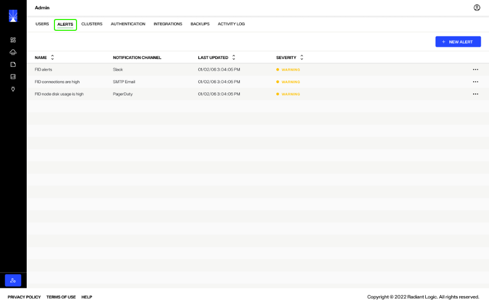

All existing alerts are listed on the *Alerts* tab including the alert name, notification channel, when it was last updated, and the severity of the alert.

## Add alerts

To add a new alert, select **New Alert**. This opens the *New Alert* dialog where you will add the alert information and metrics to create the new alert.

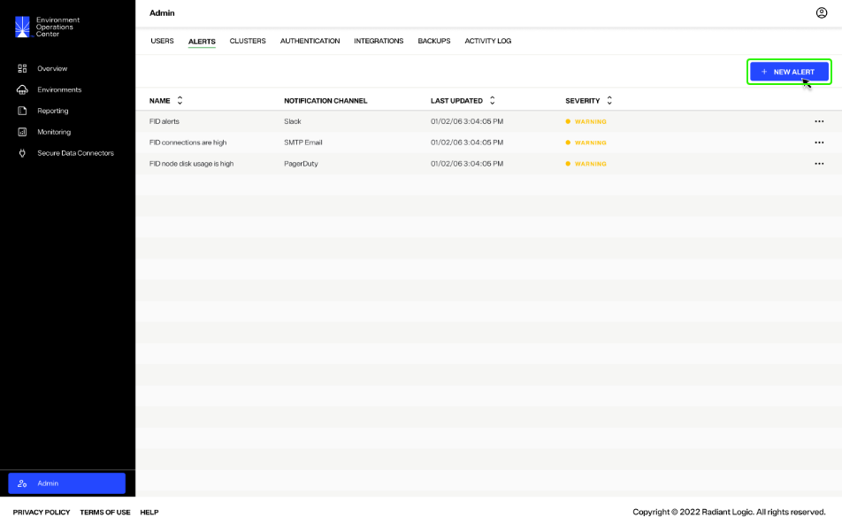

### Alert information

In the *Alert information* section of the *New Alert* dialog, enter the general details for the alert in the spaces provided. These include:

| Alert information | Description |
| ----------------- | ----------- |
| Alert name | A unique name to identify the alert. It is recommended to keep this relevant to the purpose of the alert. |
| Environments | Select one or more environments to be monitored and receive alerts for. More than one environment can be selected from the dropdown menu. |
| Notification channel | The notification channel to send the alert to. The dropdown will display all of the integration channels you have configured in you Environment Operations Center instance. |
| Severity | Select a severity rating to accompany the alert. Severity options include "Info", "Warning", and "Error". |
| Title | The title of the alert that will display in the selected channel if an alert is triggered. |
| Description | The description of the alert that will display in the selected channel if an alert is triggered. |

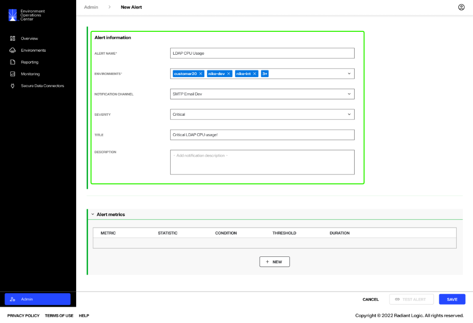

### Alert metrics

In the *Alert metrics* section of the *New Alert* dialog, enter the required information to create one or more alerts for your specified environment(s). The required information to create an alert includes the metric, statistic, condition, threshold, and duration. These fields are described in further detail below.

To add a new alert metric, select **New**. This displays the required fields to create the alert.

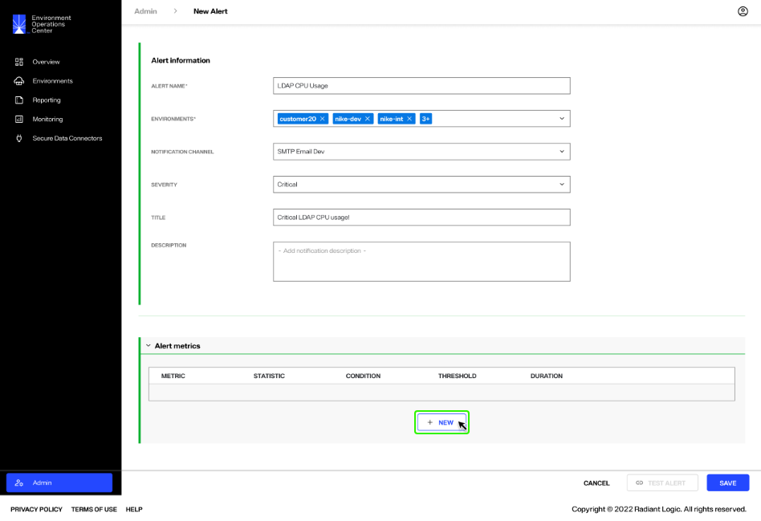

Under *Metric*, select the specific environment component to provide alerts for. To set the metric, select the downward arrow to expand the dropdown list. Select a component to monitor from the list.

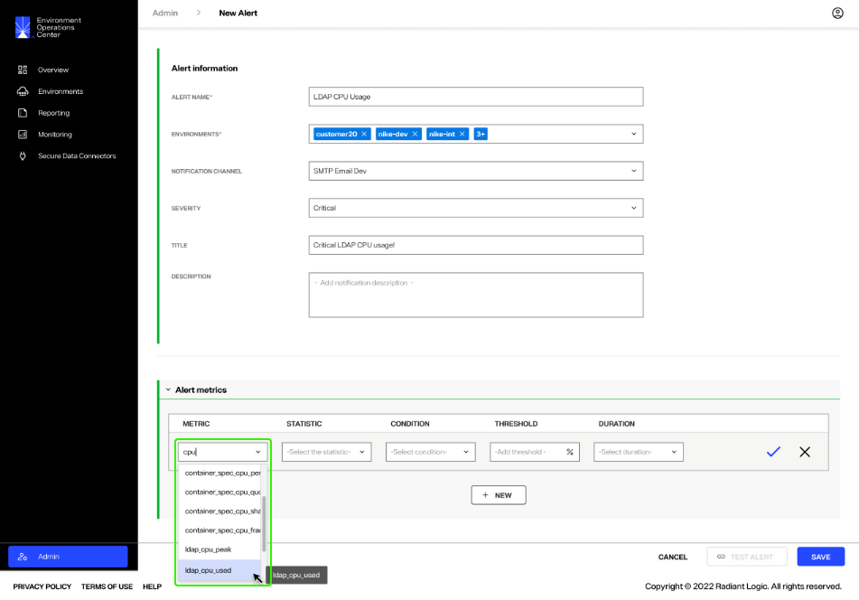

Under *Statistic*, define what value the alert is based on. To set the statistic, select the downward arrow to expand the dropdown list. Select a value from the list to measure for the metric.

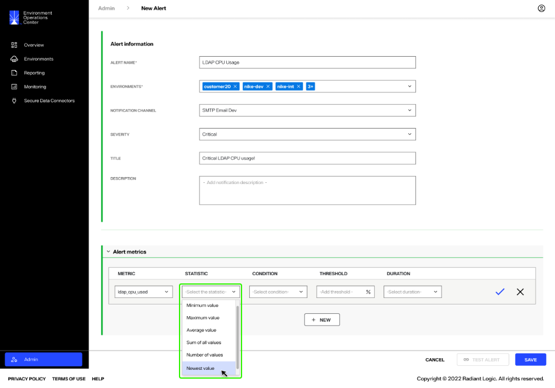

Under *Condition*, select the conditional expression to measure the metric against the threshold. To set the condition, select the downward arrow to expand the dropdown and select a conditional expression from the list.

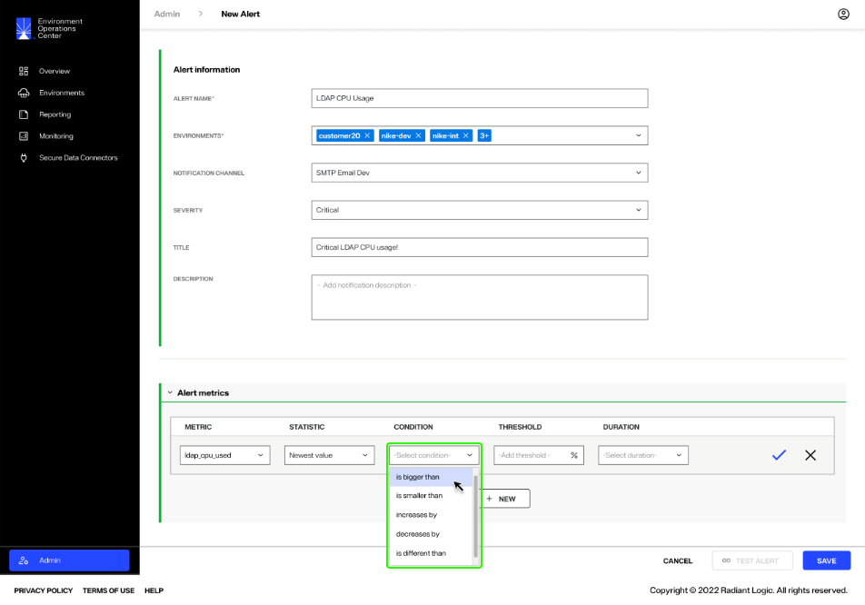

Under *Threshold*, select the percentage value that the condition is measured against. To set the threshold, enter a percentage in the space provided.

Under *Duration*, select the amount of time the condition must be met before the alert is sent. To set the duration, select the downward arrow to expand the dropdown and select a time from list.

Once you have completed all required fields, select the checkmark to add the alert metric.

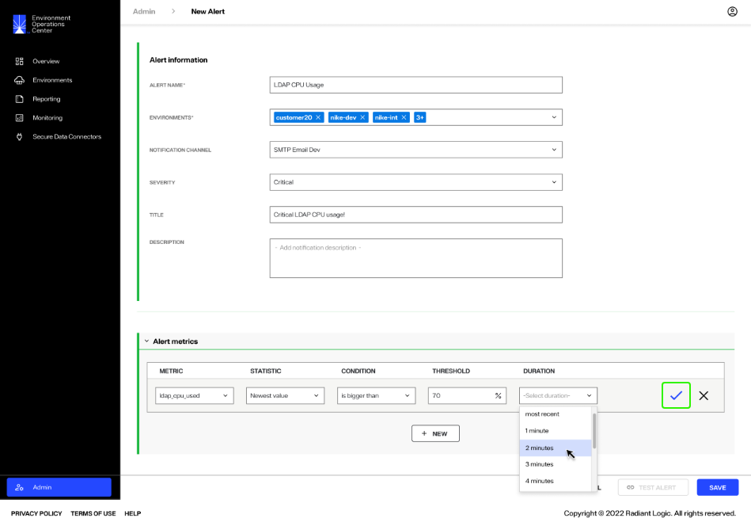

### Add multiple alert metrics

More than one alert metric can be set for the selected environment(s). After you have saved a newly created alert metric, select **New** to create an additional alert. 

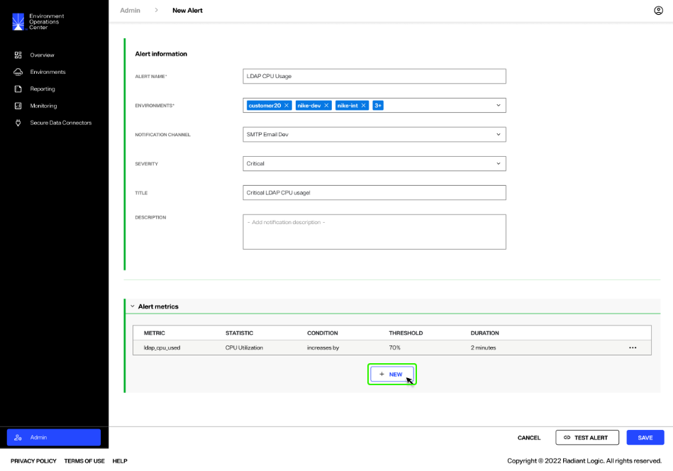

Follow the steps outlined above to complete the required alert metric details. You can continue adding as many metrics as are needed to help your team monitor the selected environment(s).

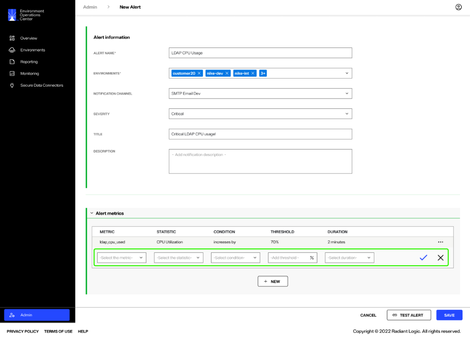

## Test alert

It is recommended to test alerts before saving, to ensure the assigned communication channel receives the alert message. To test an alert, select **Test Alert** after you have completed all required fields in the *New Alert* dialog.

You will receive notification that the test alert was successfully sent your selected channel. Verify in you your external communication channel that the alert was received.

### Save alert

Once you have completed the required fields in the *Alert information* and *Alert metrics* sections, select **Save** to create the new alert.

If the alert is successfully created, it will be added to the list of alerts on the *Alerts* tab.

## Manage alerts

Alerts are managed from the *Alerts* tab in the *Admin* section of Env Ops Center. Each alert listed on the *Alerts* tab has a corresponding **Options** (**...**) menu that provides the option to edit or delete the alert.

### Edit alerts

To edit an alert, select **Edit** from the **Options** (**...**) menu of the alert to edit.

This opens the *Edit Alert* dialog which contains the same sections and fields as the *New Alert* dialog. Edit the required fields in the *Alert information* and *Alert metrics* sections.

To edit a specific alert metric in the *Alert metrics* section, select the **Options** (**...**) menu associated with the alert metric. Select **Edit** to enable editing for all of the alert metric fields. Alternatively, you can select **Delete** to delete the alert metric.

Once you have updated the necessary fields, select **Test Alert** to ensure your specified notification channel receives the alert.

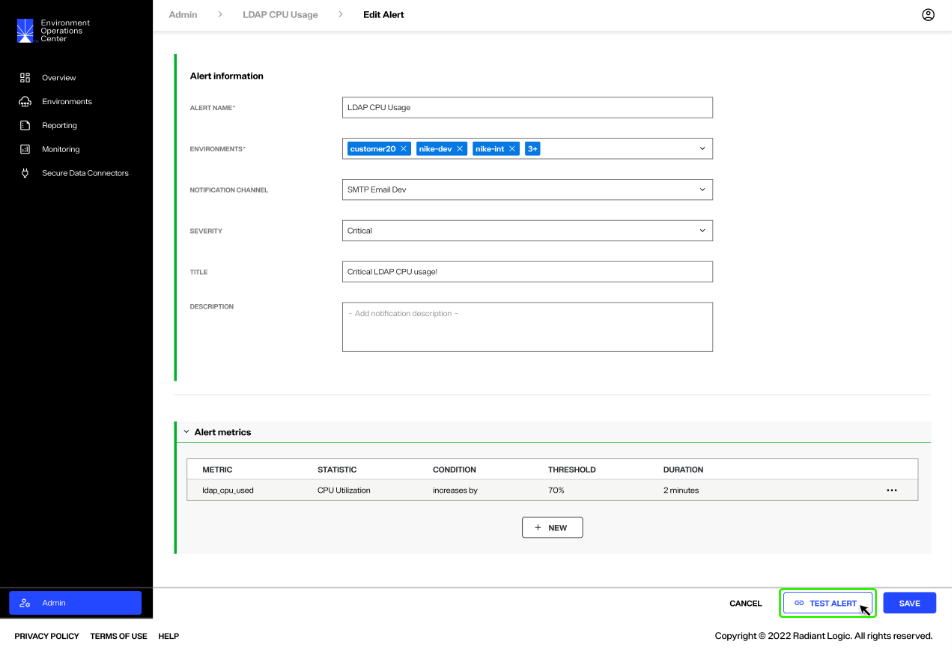

Once you have confirmed the specified communication channel received the test alert, select **Save** to save the updated alert.

### Delete alerts

To delete an alert, select **Delete** from the **Options** (**...**) menu of the alert to delete.

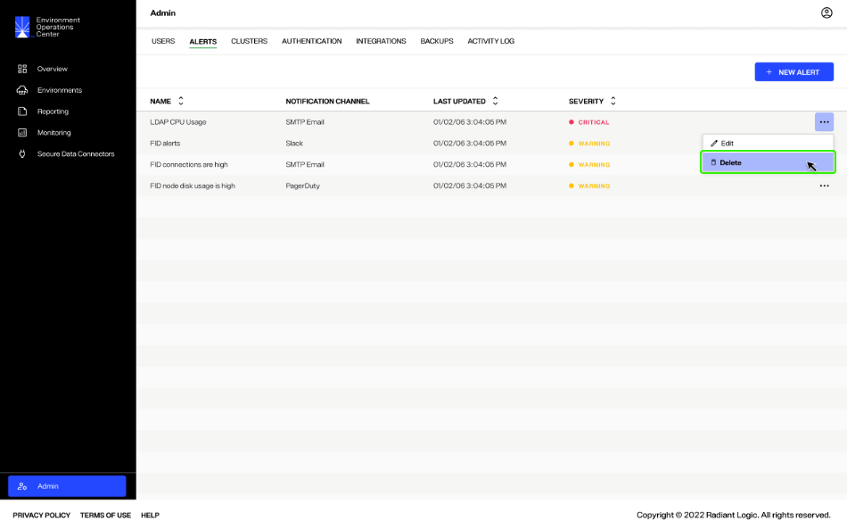

A notification will appear to confirm that you would like to delete the selected alert. Select **Delete** to proceed and delete the alert.

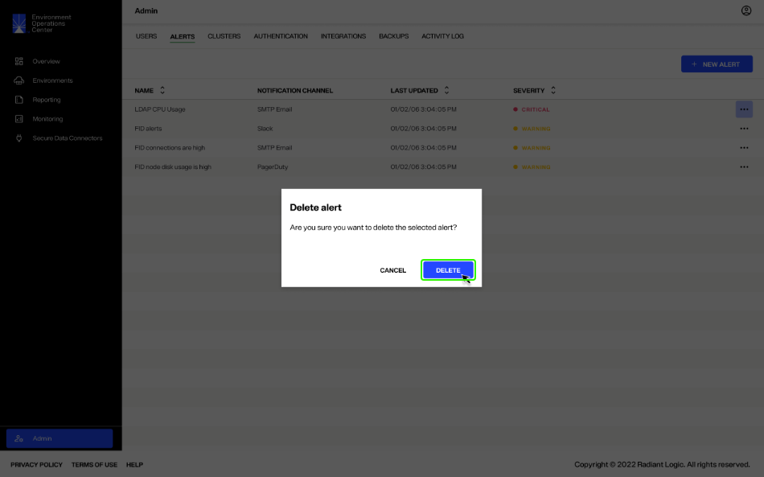

You'll receive a message confirming that the alert was successfully deleted and it will no longer be available in the list of alerts on the *Alerts* tab.

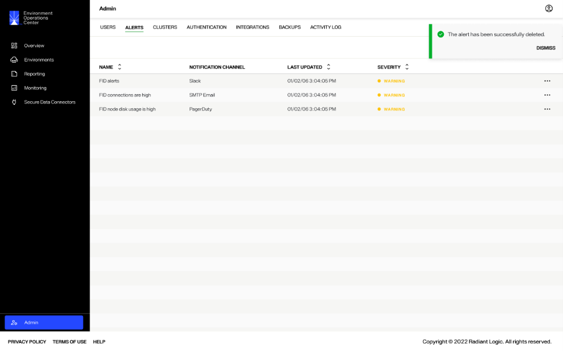

## Next steps

You should now have an understanding of the steps to create and manage alerts to help monitor your environments in Env Ops Center. To learn more about managing communication channels see the [manage integrations](../integrations/manage-integrations.md) guide.
