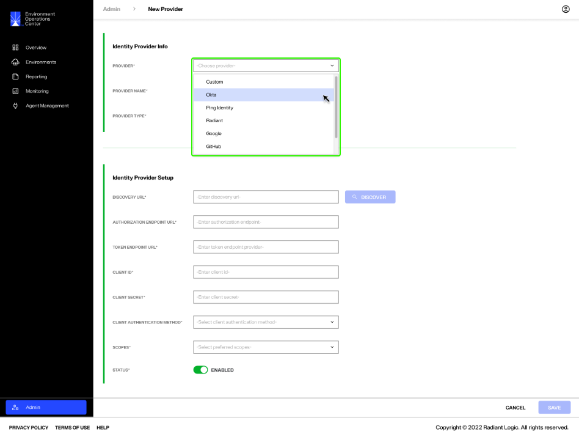
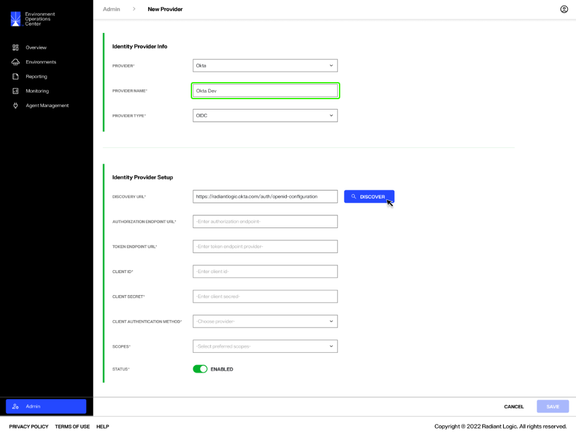
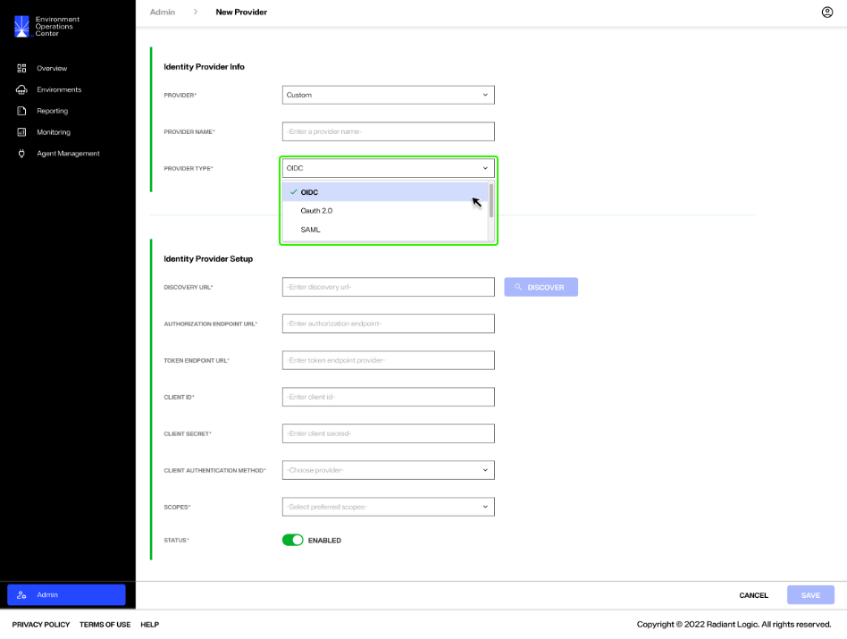
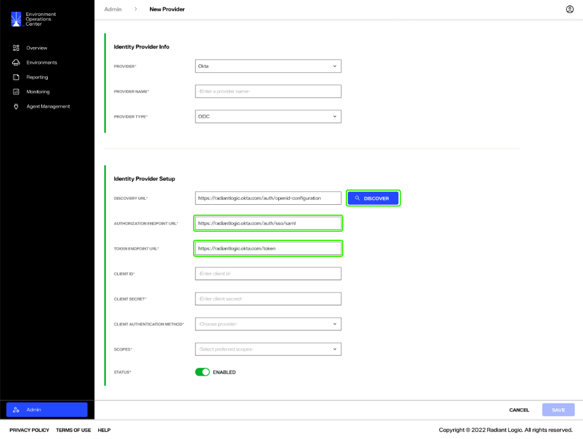
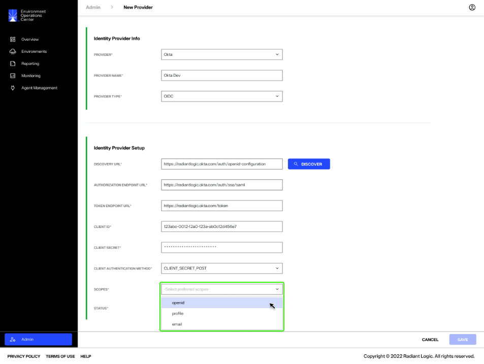
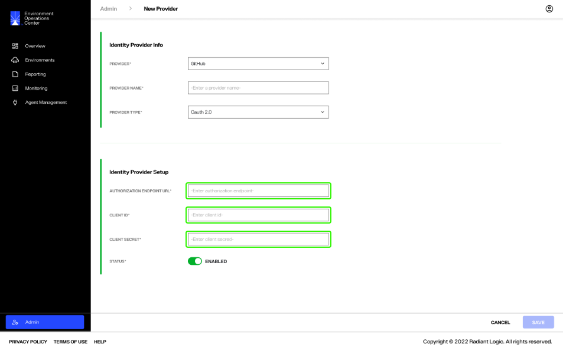
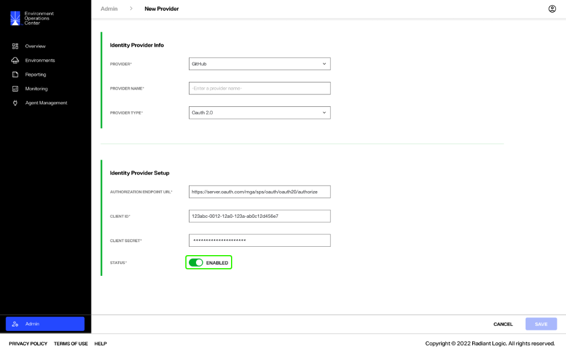
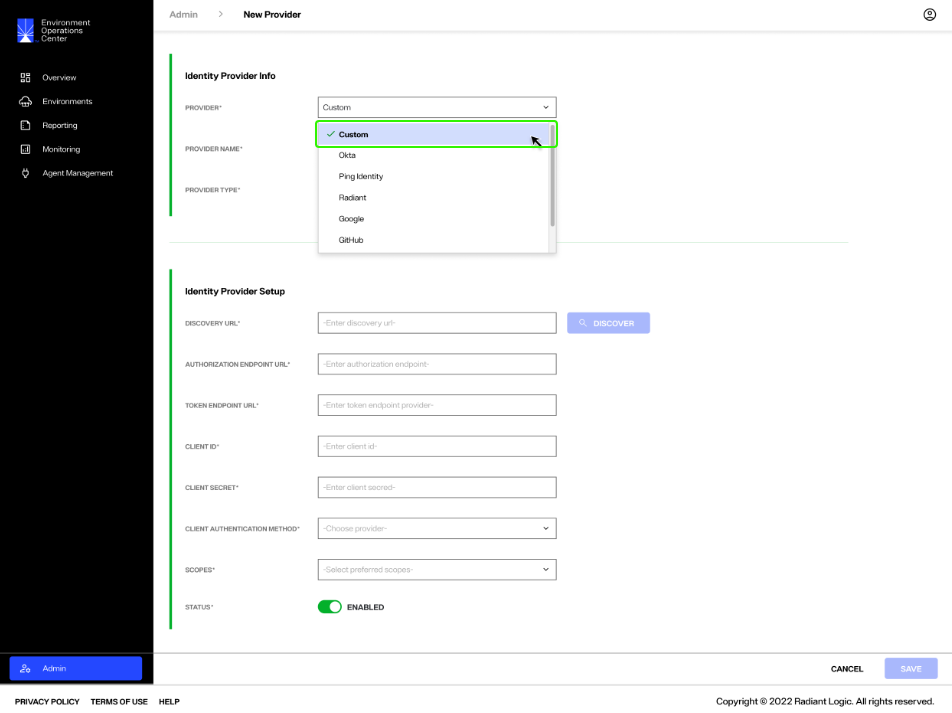
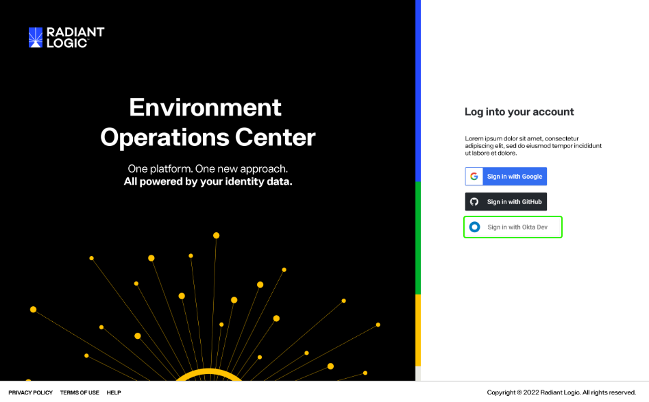

---
keywords:
title: Add an Identity Provider
description: Add a new identity provider
---
# Add an Identity Provider

This guide outlines the required steps to add a new authentication identity provider in Environment Operations Center.

> **Note:** You should already have configured your Env Ops Center instance with your chosen identity provider prior to following the steps outlined in this guide.

## Getting Started

To begin adding a new identity provider, select **New Provider** from the *Authentication* tab in the *Admin* section.

The *New Provider* form contains all required input fields to add a new identity provider. The following sections outline how to complete these fields.

## Identity provider info

The *Identity Provider Info* section contains three required fields, the provider, provider name, and provider type.

Select a provider from the **Provider** dropdown menu. You have the option to create a custom provider or to select from a list of accepted identity providers.

Enter a name for the new provider in the space next to **Provider Name**. This is the name that will display in the list of configured providers on the *Authentication* tab.

Depending on the selected provider, the **Provider Type** may or may not auto populate. For OIDC and OAuth providers, the **Provider Type** will automatically populate after you've selected the **Provider**. For all other provider types, you will need to select the **Provider Type** from the drop down menu.

## Identity provider setup

The required fields listed in the *Identity Provider Setup* section will differ depending on the type of provider selected. OAuth providers require a different set of authentication details than other provider types.

### General provider setup 

For most provider types, the required setup fields include:

- Discovery URL
- Authorization Endpoint URL
- Token Endpoint URL
- Client ID
- Client Secret
- Client Authentication Method
- Scopes
- Status

**confirming definitions with RL**

#### URL fields

For OIDC providers, the **Discovery URL** field automatically populates after the **Provider** is selected in the *Identity Provider Info* section. This also renders the **Discover** button active. 

Select **Discover** to populate the **Authorization Endpoint URL** and the **Token Endpoint URL**.

**confirming with RL workflow for other provider types**

#### Client details

Client details include client ID, secret, and authentication method. In the spaces provided, enter your **Client ID** and **Client Secret** that you received when you configured the provider.

Select the **Client Authentication Method** from the provided dropdown list.

#### Scope

Set the required scopes from the **Scope** dropdown menu. More than one entry can be selected. Select all scopes that are applicable to your login process.

#### Status

Adjust the **Status** toggle to "Active" to ensure the provider is activated after the form is saved.

### OAuth-specific provider setup

For OAuth providers, the required setup fields include:

- Authorization Endpoint URL
- Client ID
- Client Secret
- Status

**confirming definitions with RL**

Enter the **Authorization Endpoint URL**, **Client ID**, and **Client Secret** in the spaces provided.

Adjust the **Status** toggle to "Active" to ensure the provider is activated after the form is saved.

### Custom provider setup 

If a "Custom" **Provider** is selected, the *Identity Provider Setup* section will reload to display the setup fields that correspond with the chosen **Provider Type**. The general setup fields or the OAuth-specific fields will display in the *Identity Provider Setup* section. Follow the steps that correspond with the selected **Provider Type** to complete the required fields. (**confirming these details with RL**).

## Save new provider

Once you have completed all required fields in the *New Provider* form, select **Save** to add the new provider.

The new identity provider is added to the list of available providers in the *Authentication* tab with a status of "Enabled".

The new provider is also added to the Environment Operations Center login screen.

## Next steps

After reading this guide you should have an understanding of the steps required to add a new identity provider for user authentication. To learn how to edit, disable, or delete identity providers, see the [manage providers](manage-authentication-providers.md) guide.

