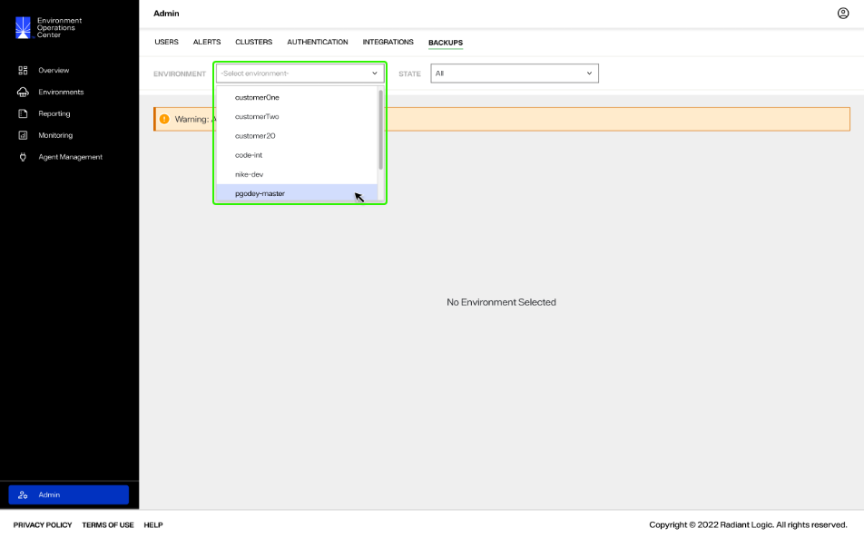
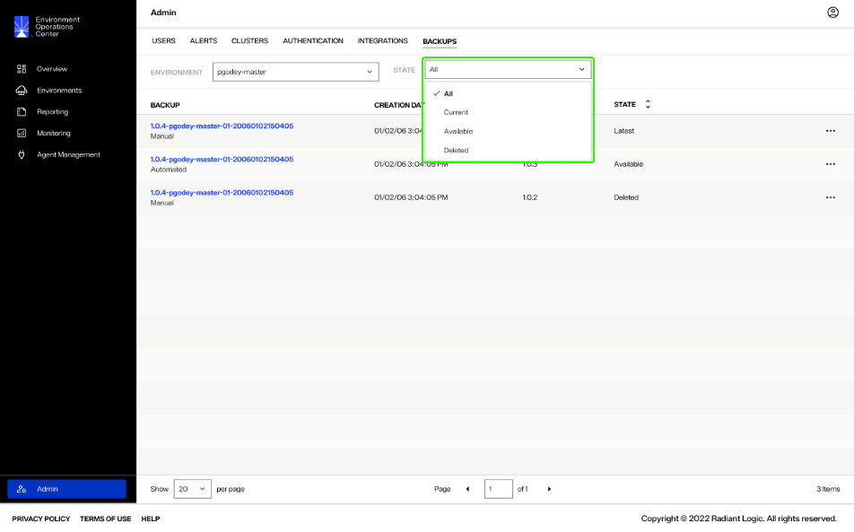

---
keywords:
title: Admin Backups Overview
description: Overview of the admin backups tab
---
# Admin Backups Overview

Environment backups can be managed from two locations in Environment Operations Center, from the *Admin* section, if you have an administrator role, or from the detailed view of an environment, for all users. The different backup operations that can be performed from each *Backups* tab are outlined below.

| Admin Backups | Environment Backups |
| ------------- | ------------------- |
| Recover       | Create or Schedule  |
| Delete        | Delete              |
| Restore       | Restore             |

The workflows to delete and restore environment backups are the same whether performed from the Admin *Backups* tab or an environment's *Backups* tab. To learn how to delete or restore an environment backup, review the [delete a backup](../../environments/backup-and-restore/delete-backup.md) or [restore a backup](../../environments/backup-and-restore/restore-backup.md) guide.

## Getting started

The *Backups* tab displays the backup name, creation date, version, and state for each backup.

From admin *Backups* you can filter backups by environment and state.

To review backups for a specific environment, select the environment from the **Environment** dropdown menu. 

To filter backups by state, select the **State** dropdown menu and select the state of backups to review. State options include:

- All: Review all backups.
- Current: Review the backup associated with the current environment.
- Available: Review the backups of the environment that are available to restore, but not currently in use.
- Delete: Review backups that have been deleted.

## Next steps

You should now be able to navigate the *Backups* tab in the *Admin* section and filter backups by environment and state. For details on recovering deleted backups, see the [recover a backup](recover-backups.md) guide.

