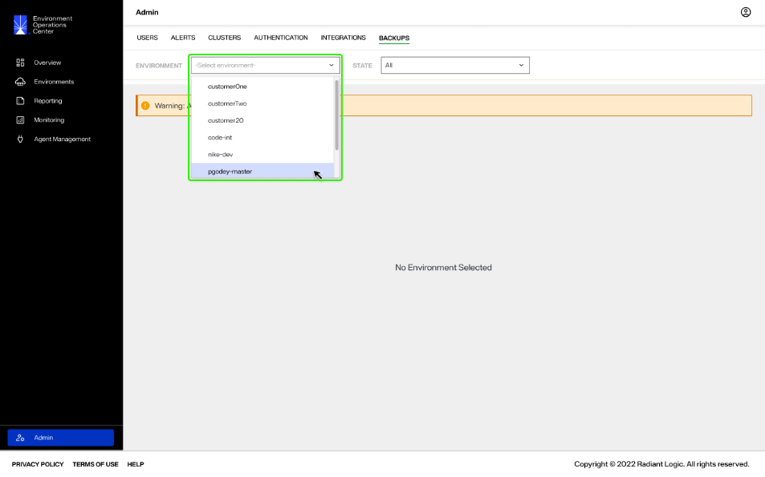
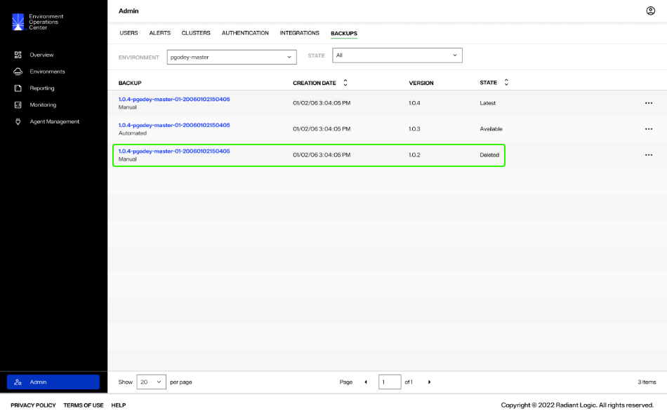
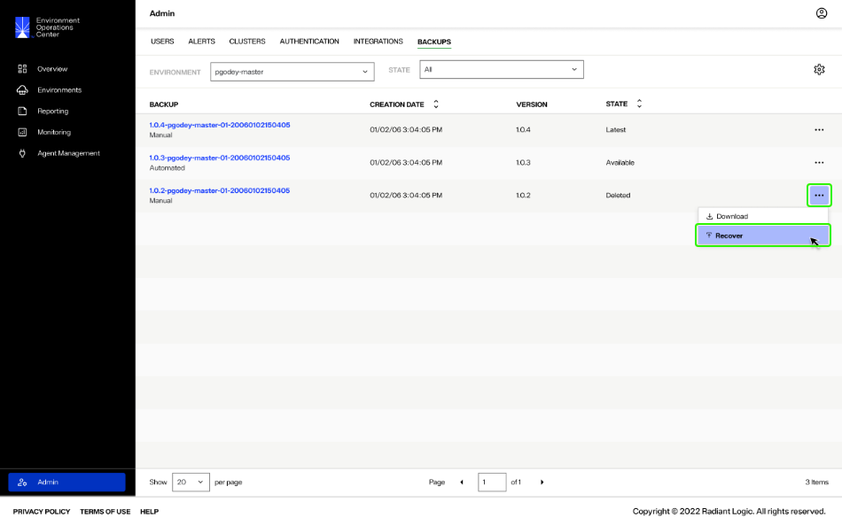
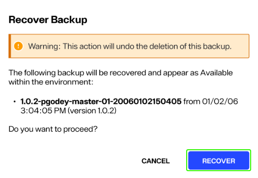
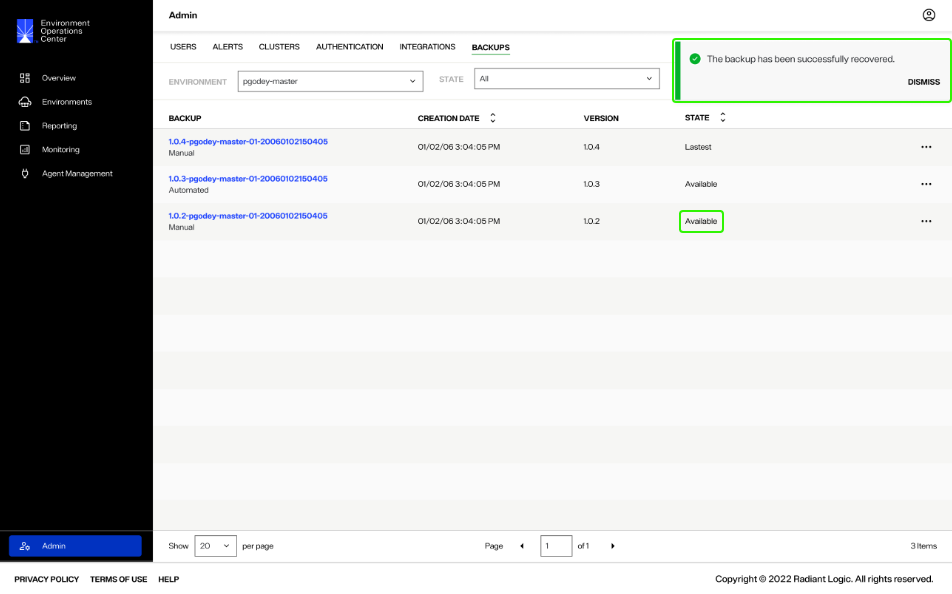

---
keywords:
title: Recover a Deleted Environment Backup
description: How to recover deleted environment backups
---
# Recover a Deleted Environment Backup

This guide outlines the steps to recover a deleted environment backup. Recovering a deleted backup makes it available in the list of backups for potential restoration. Deleted backups can only be recovered by an Environment Operations center Tenant Administrator (**confirming with RL**).

## Getting started

From the *Backups* tab, select the environment from the **Environment** dropdown menu to display all of its associated backups.

From the list of backups, locate the deleted backup to recover. You can use the **State** dropdown to filter by only deleted backups.

## Recover backup

To recover the deleted backup, select **Recover** from the corresponding **Options** (**...**) menu.

This opens the *Recover Backup* confirmation dialog that lists the name of the backup, its creation date, and version number.

Select **Recover** to make the backup available for use.

## Confirmation

If the backup recovery is successful, you will receive a confirmation message and the backup will appear in the backups list with a status of "Available".

## Next steps

You should know have an understanding of the steps required to recover a deleted environment backup to make it available for restoration. To learn how to restore an environment backup, see the [restore a backup](../../environments/backup-and-restore/backup-restore-overview.md) guide.
