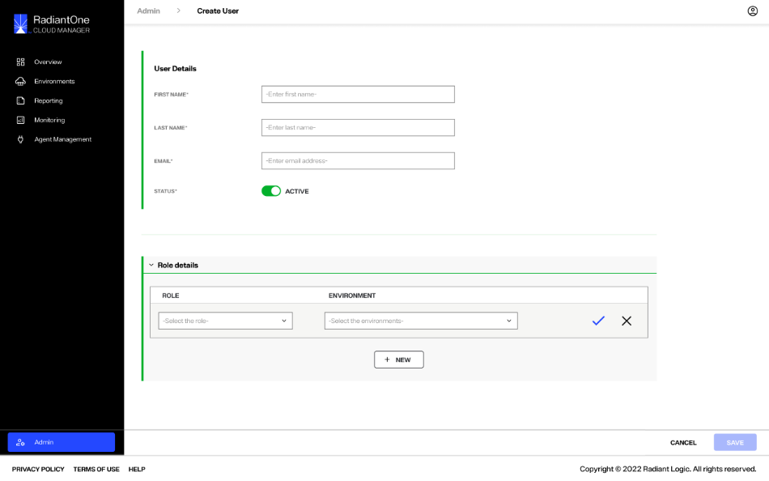
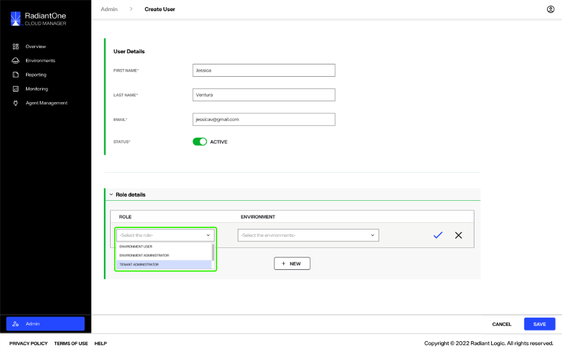
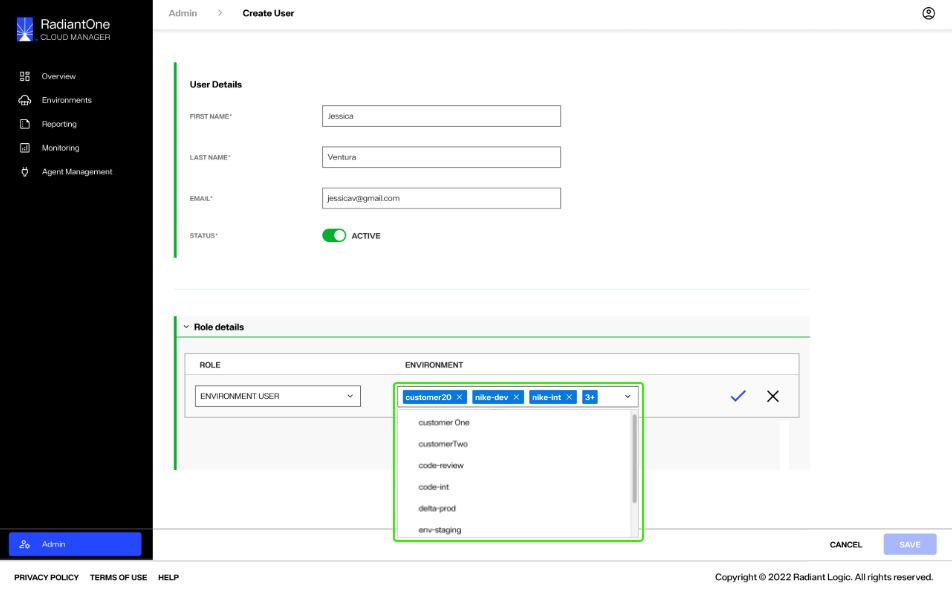
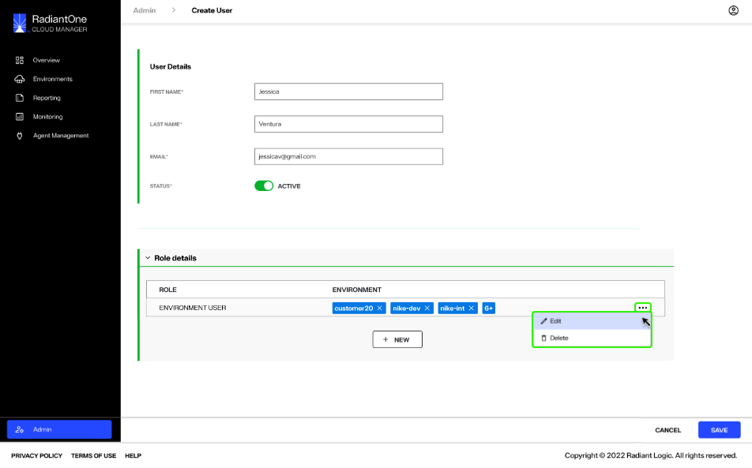
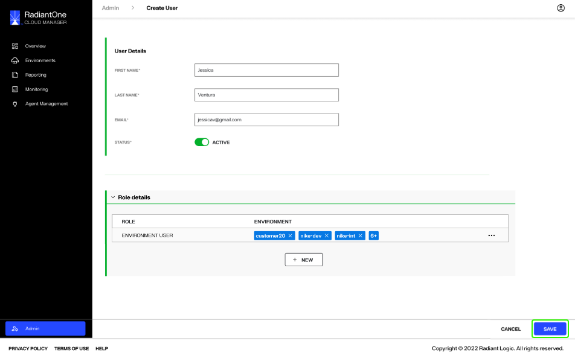
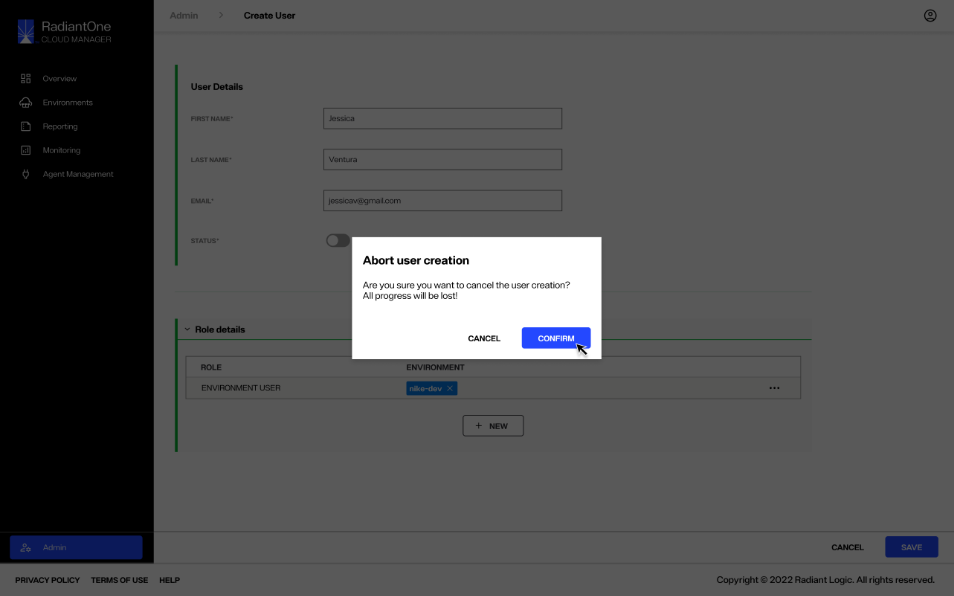
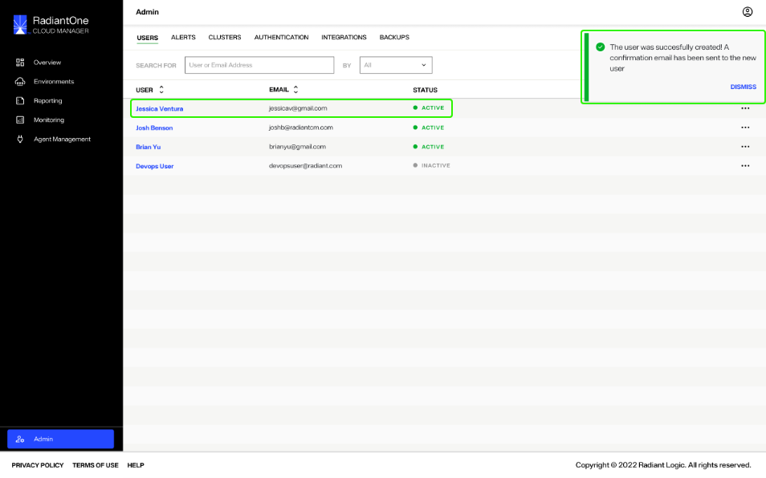

---
keywords:
title: Create a User
description: Create new users
---
# Create a User

This guide outlines the required steps to create new users and assign roles in Environment Operations Center. What a user can view and which actions they can perform are dependent on their assigned role. User roles include Tenant Administrator, Environment Administrator, and Environment User. For details on permissions for each role, see the [role based permissions](../role-based-permission/role-based-permissions.md) guide.

## Getting started

To create a new user, select the **Create User** button on the *Users* screen.

This takes you to the *Create User* form that contains all the required input fields to create a new user. Within the form you will provide the user's details and assign their role and environments.

## User details

In the *User Details* section you must provide the new user's first name, last name, and email in the corresponding fields. Set the user's status by adjusting the *Status* toggle to "Active".

All the fields in the *User Details* section are required and must be completed to submit the form. If a field is missing information, you will not be able to select the **Save** button. Hovering over the **Save** button will display a reminder that the form must be complete to create the user.

Once you have completed the *User Details* section, you can proceed to the *Role Details* section to assign the user a role and one or more environments.

## Role details

In the *Role Details* section you can assign roles and environments to the user. Only one role can be assigned per environment, but multiple environments can be associated with one role. See the [role based permission](../role-based-permission/role-based-permissions.md) guide for role definitions and permission details.

To assign the user a role, select the *Role* field to expand the role dropdown. From the list, select the role that is best suited for the user.

To assign an environment, select the *Environment* field to expand the environment dropdown. From the list of environments, select one or more environments to assign the user to.

A user can be assigned to multiple environments for their given role. Continue selecting environments from the dropdown list until you have assigned all required environments to the user. Select the arrow (arrow icon) in the *Environment* field to close the dropdown list. (**confirming dropdown multi-selection functionality**).

Once you have completed the *Role* and *Environment* fields, select the checkmark button to set the user's role and environment assignment. For details on assigning multiple roles and special cases concerning role assignments, see the [role based permissions](../role-based-permission/role-based-permissions.md) guide.

To edit the *Role Details* section after you have set the assignment, select the **Options** (**...**) button located next to the user's role and environment assignment. This will expand a dropdown menu listing the options to **Edit** or **Delete** the role and environment assignment.

Once you have completed the *User Details* and *Role Details* sections, select **Save** to create the new user. They will receive an email notification at the email address associated with their user account confirming their role has been created (**confirming with RL**).

To exit out of the *Create User* form without creating a new user, select **Cancel**.

You will receive a confirmation message notifying you that all the current form details will be lost. Select **Confirm** to continue and exit the *Create User* form without saving the current user details.

If you wish to return to the *Create User* form to continue creating the new user, select **Cancel**.

## Confirmation

After completing the *Create User* form and selecting **Save**, you will be directed to the *User* tab where you will receive a success message indicating the user has been successfully created and they will appear in the list of users.

If an error occurs and the user is not successfully created... (**following up with RL**).

**image of error message**

## Next Steps

