---
keywords:
title: Edit a User
description: Edit a user
---
# Edit a User

This guide outlines the required steps to edit the details, status, role, and environment assignments for a specific user in Environment Operations Center.

## Getting started

There are two ways to open the *Edit User* tab, either by selecting the user's name or by selecting the **Options** (**...**) menu associated with that user.

To access the *Edit User* tab by directly selecting the user, select the user name from the list of users on the *Admin* *User* tab.

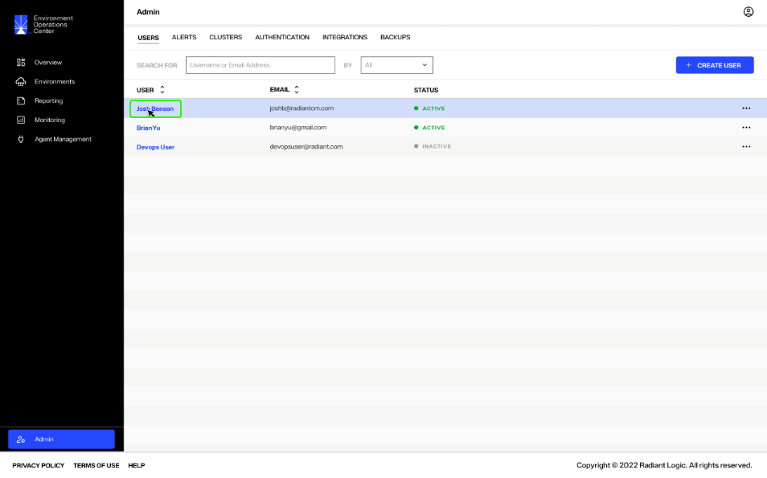

This brings you to the *Environment Access* tab in a detailed overview of the user. This view lists all the environments and associated roles assigned to the user. From the *Environment Access* tab, select the **Edit User** button to open the *Edit User* tab.

Alternatively, from the *User* tab you can select the **Options** (**...**) menu associated with the user. Select **Edit** from the dropdown menu to bypass the user detailed view and navigate directly to the *Edit User* tab.

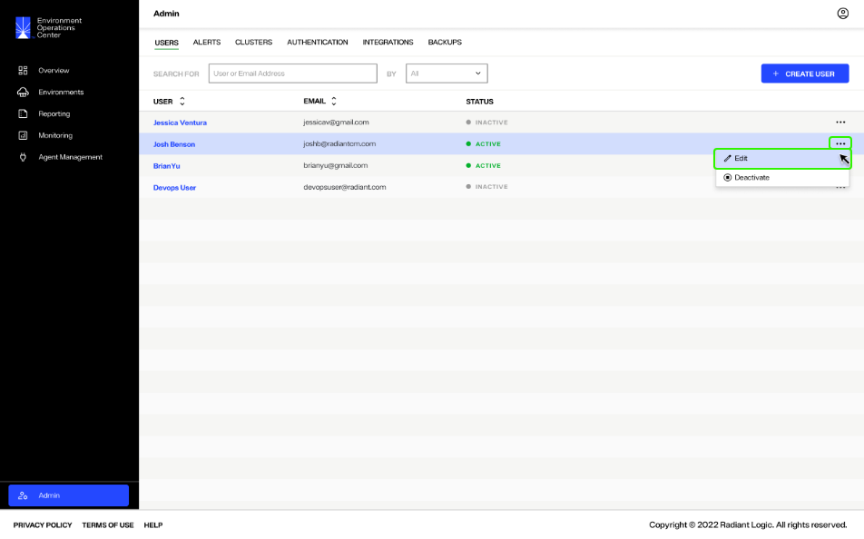

The *Edit User* tab contains all of the same categories and fields as the *Create User* tab. From here you can update the user's details, status, role, and environment assignments accordingly.

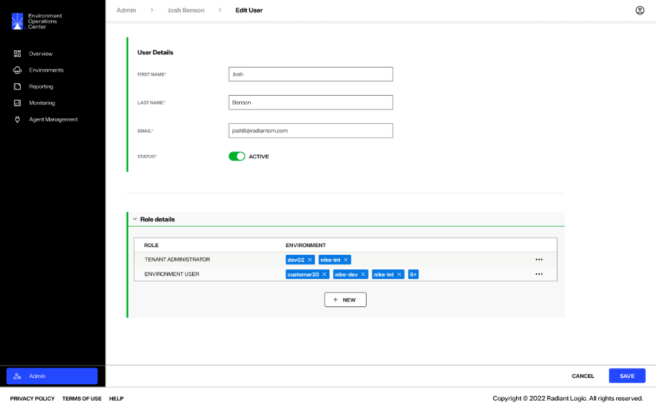

## Update user details

From the *Edit User* tab, you can update a user's first name, last name, and email address in the *User Details* section. Enter the updated information in the associated field provided and select **Save** to update the user's details.

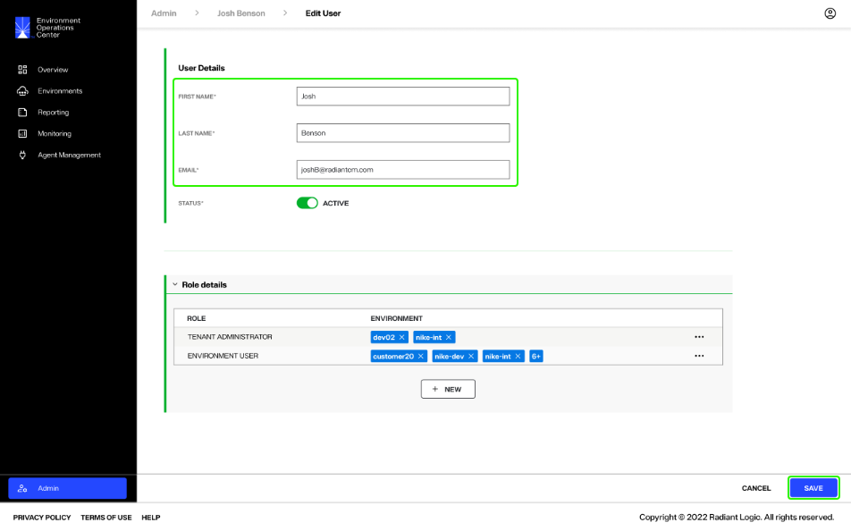

## Update user status

There are two ways to update the status of a user, either from the *Admin* *Users* tab or from the *Edit User* tab.

To update a user's status from the *Users* tab, select the **Options** (**...**) menu located next to the user who you would like to deactivate or activate.

From the **Options** (**...**) dropdown, select **Deactivate**.

You will receive a message requesting confirmation that you would like to deactivate the user. Select **Confirm** to continue and deactivate the user.

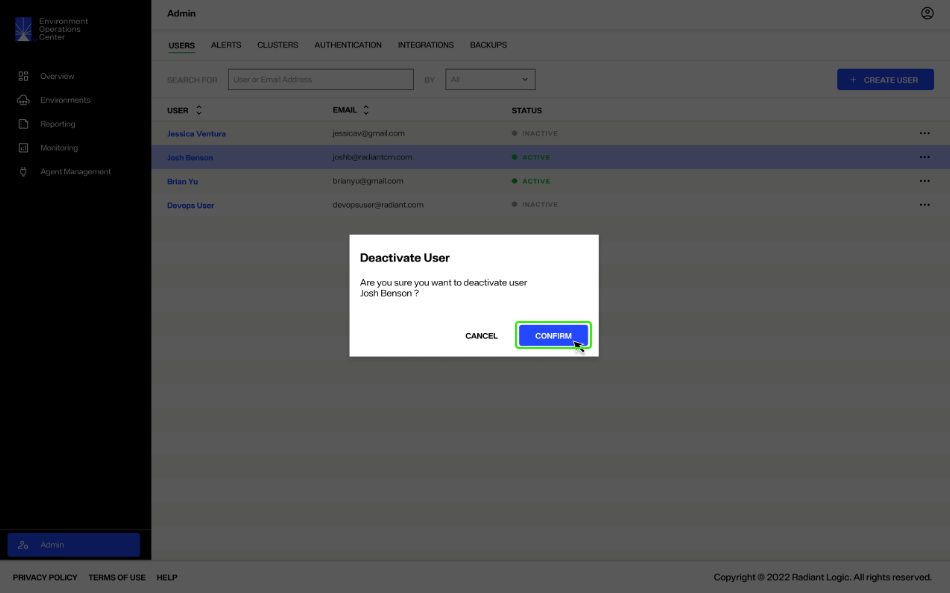

The user's status will change from "Active" to "Inactive"

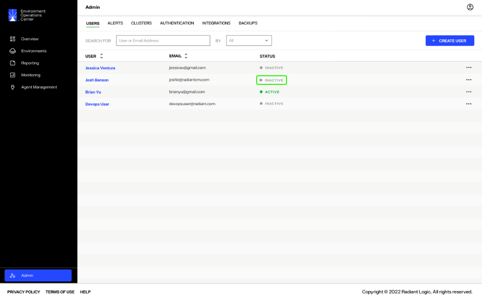

To update a user's status from the *Edit User* tab, adjust the *Status* toggle in the *User Details* section to the "Active" or "Inactive". Select *Save* to update the user's status.

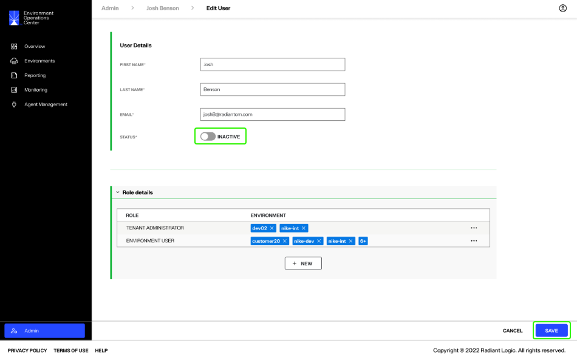

After selecting save, you will return to the *Users* tab where the user status will update accordingly to the status you selected.

## Update role details

To update the role or environment assignments of a user, select the **Options** (**...**) menu next to the role and environment pairing to be edited. Select **Edit** from the dropdown to enable editing for the role and environment fields.

### Update user role

To update the user role, select the down arrow located in the *Role* field to expand the dropdown menu.

From the list of roles, select the role to assign to the user.

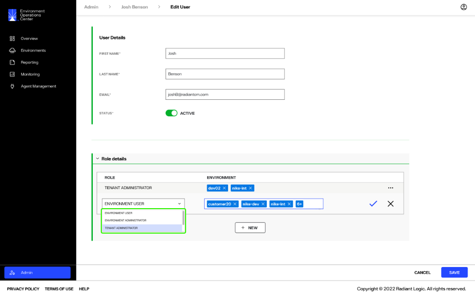

Select the checkmark icon (check mark icon) to set the new role.

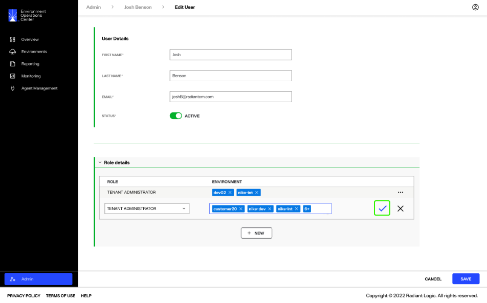

Select **Save** to update the new user role.

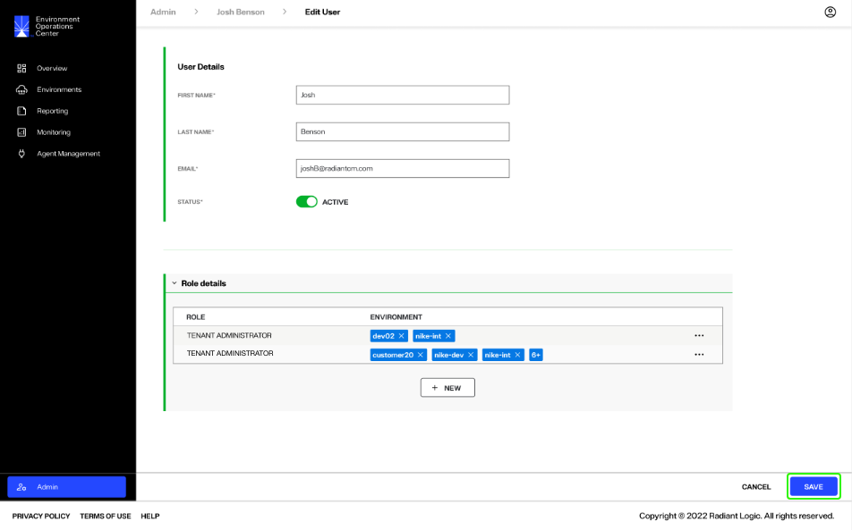

### Update environment assignments

To update environment assignments for a user, select the down arrow located in the *Environment* field to expand the dropdown menu.

To add new environments, select the environments from the dropdown menu. Multiple environments can be assigned to a user for a given role. After you have selected all of the required environment assignments, select the upward arrow in the *Environment* field to close the dropdown.

To remove assigned environments, select the **X** located next to the environment name.

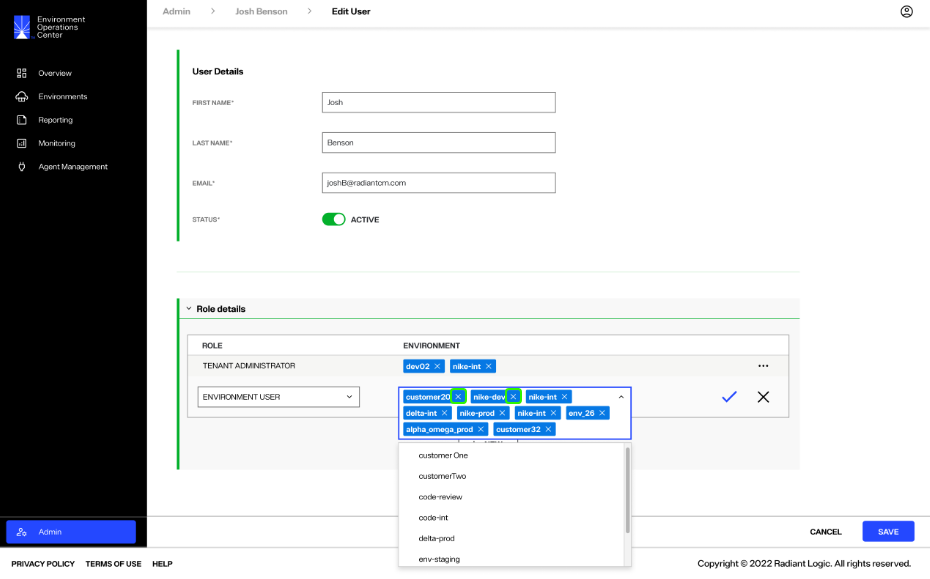

Once you have updated the user environment assignments, select the checkmark (checkmark icon) to set the new environment assignments.

Select **Save** to update the user environment assignments.

### Confirmation

You can review the role and environment assignments for a user from the *Environment Access* tab. From the *Users* tab, select the name of the user to review.

The *Environment Access* tab of a user lists the environments they have been assigned to and their role associated with a specific environment. Review this list to ensure all role and environment assignments reflect your updates.

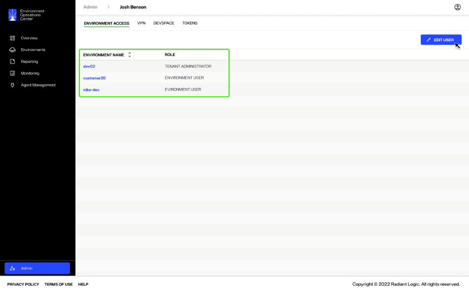

## Next steps

After reading this guide you should have an understanding of the steps required to edit an existing Environment Operations Center user, including their user details, status, role, and assigned environments.
