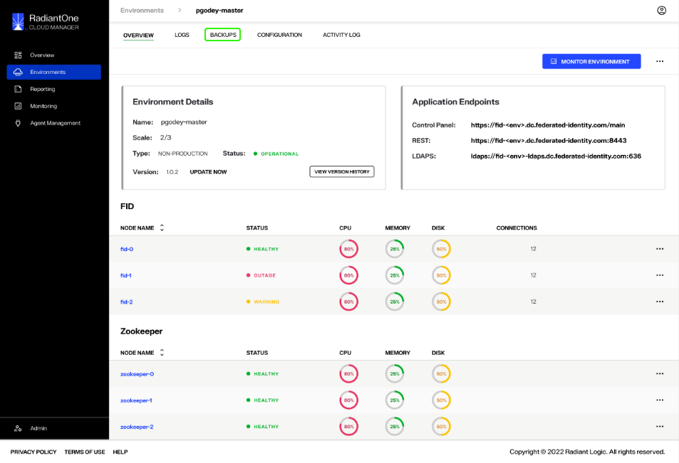
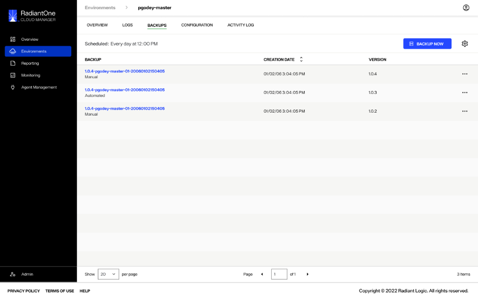
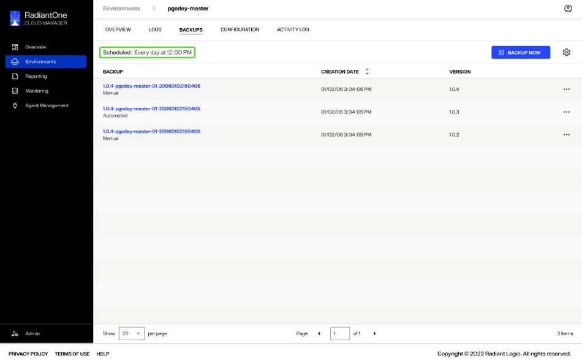
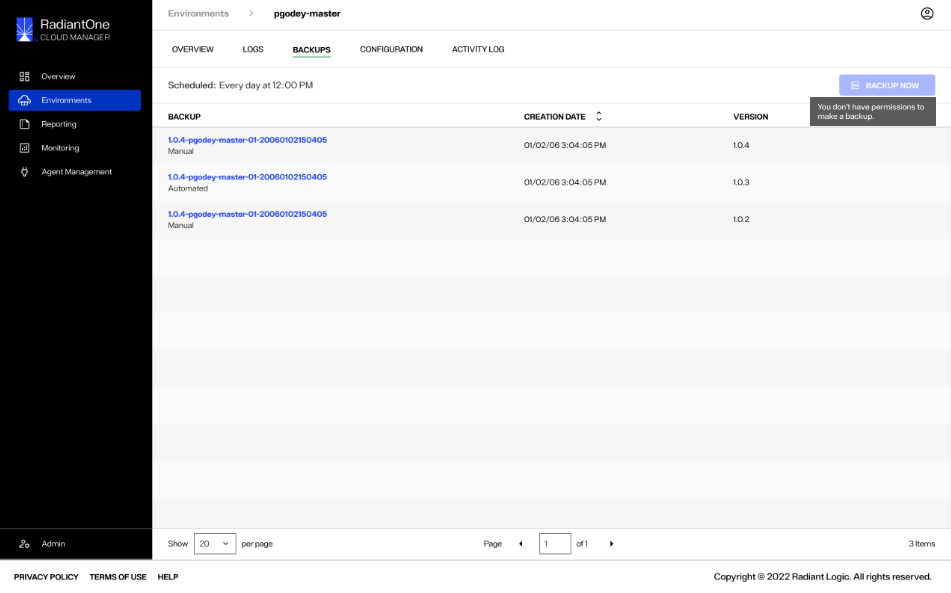

---
keywords:
title: Backup Overview
description: Overview of environment backups
---
# Backup Overview

You can create and restore backups of your environments in Environment Operations Center. Backups are managed within the detailed view of an environment, under the *Backups* tab. This guide provides an overview of the *Backups* tab and its features.

## Getting started

To navigate to the *Backups* tab for a specific environment, select **Backups** from the top navigation in the environment's detailed view.

This brings you to the *Backups* view that provides a chronological overview of all backups that have been performed on the environment.

## Review backups

From the *Backups* tab, you can review all backups that have been performed on the environment. For each backup, the backup name, creation date, and version are listed.

Each backup has an **Options** (**...**) menu that allows you to perform actions on the backup. Actions include **Download**, **Restore**, and **Delete**.

For more information on restoring or deleting environment backups, see the [restore a backup](restore-backup.md) guide or the [delete a backup](delete-backup.md) guide.

If you have set a scheduled backup for the environment, a "Scheduled" notification appears at the top of the workspace indicating the frequency and time of the scheduled backup.

For more information on scheduling environment backups, see the [schedule backups](schedule-backup.md) guide.

## Create backups

You can create backups manually or schedule an automated backup workflow. 

For details on creating manual environment backups, see the [create a backup](create-backup.md) guide. For details on scheduling automated environment backups, see the [schedule a backup](schedule-backup.md) guide.

## Read-only mode

If you have read-only access to the environment, you will still be able to view the list of backups that have been performed and the backup schedule if an automated backup has been created. You will not be able to create new backups or modify existing backups.

The **Backup Now** button will be deactivated, the **Backup Settings** icon will be hidden, and the **Options** (**...**) menu for each backup wil be hidden.

## Next steps

After reading this guide you should have an understanding of how to navigate the *Backups* tab and its main features. To begin creating an environment backup, review the documentation on [creating a backup](create-backup.md).
