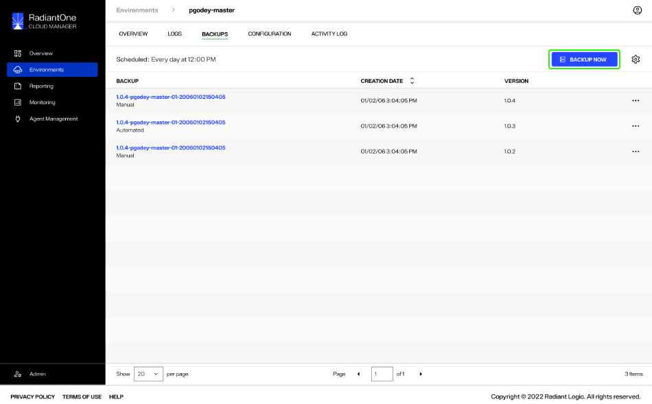
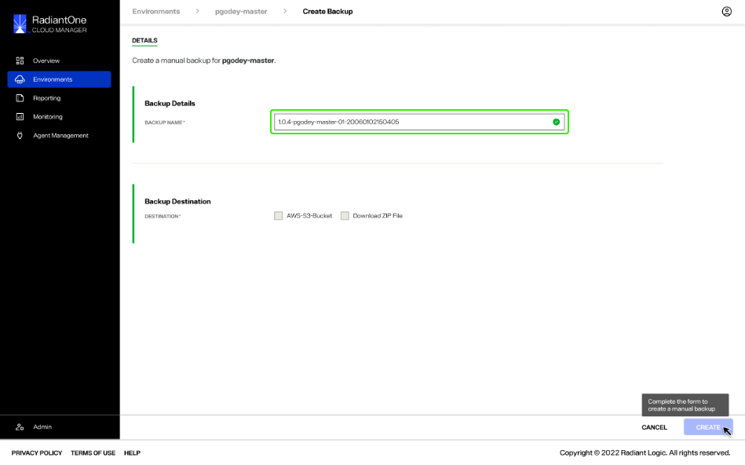
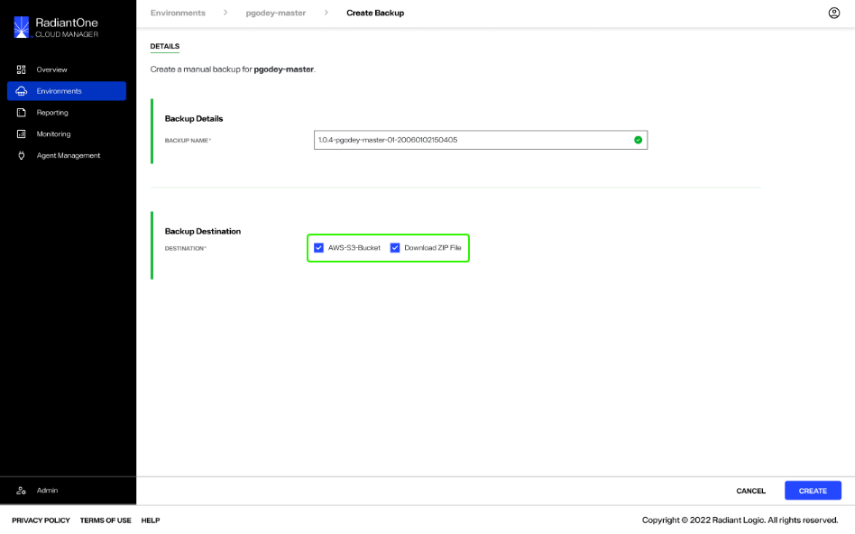
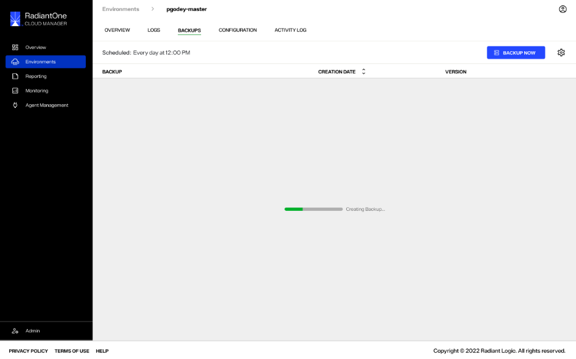
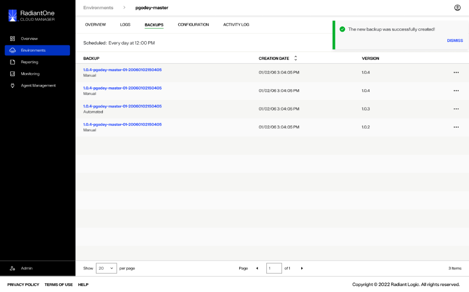
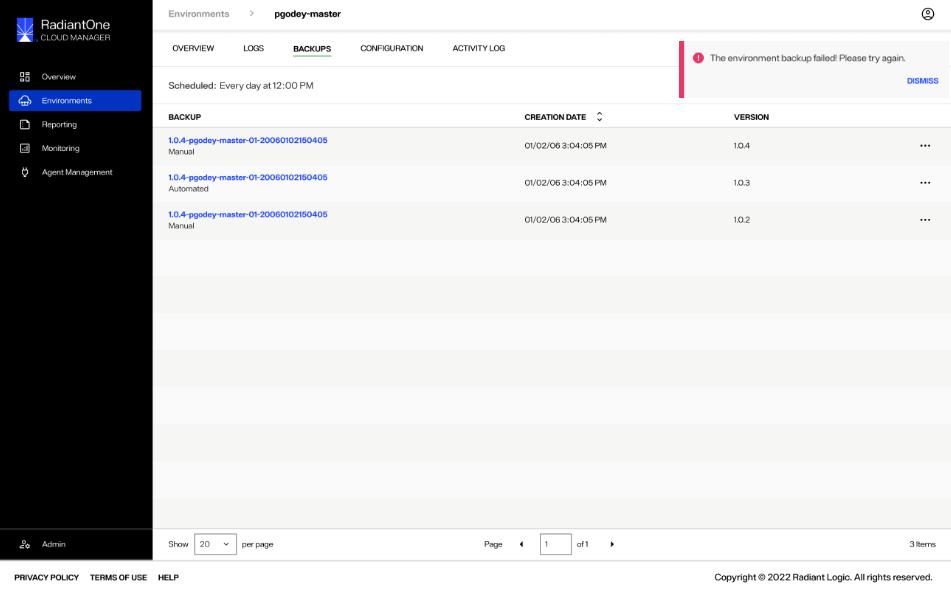

---
keywords:
title: Create an Environment Backup
description: Overview of environment backups
---
# Create an Environment Backup

This guide provides an overview of the steps required to create environment backups manually. For details on scheduling automatic environment backups, see the [schedule backups](schedule-backup.md) guide.

## Getting started

To begin creating a manual backup of an environment, select the **Backup Now** button.

This brings you to the backup *Details* screen where you will provide the required details to create the environment backup.

## Backup details

On the backup *Details* screen, the "Backup Details" and "Backup Destination" fields must be completed in order to submit the form to create a backup.

Under "Backup Details" a "Backup Name" will auto-populate for you in the space provided. If you wish to change the name, it must meet the following naming conventions... (**confirming with RL**).

> **Note:** Backup names must be unique. You will receive a warning if the backup name entered is already in use.

Next, set the backup destination by selecting the checkbox next to the desired storage location. Multiple destinations can be selected at the same time.

(**confirming with RL if other destinations will be available**)

Once you have completed all the required fields, select **Create** to begin creating the backup.

## Backup confirmation

While the backup is being created, you will return to the main *Backups* screen. A progress bar on the *Backups* screen indicates that a backup is being created.

If the backup was successfully created, you will receive a confirmation message and the new backup will be visible in the list of backups on the main *Backups* screen.

Select **Dismiss** to close the message.

If the backup could not be successfully created, you will receive an error message indicating that the backup creation failed.

Select **Dismiss** to close the message and proceed to try creating the backup again.

## Next steps

After reading this guide you should have an understanding of the steps required to create an environment backup. To learn how to schedule automatic environment backups, review the guide on [scheduling backups](schedule-backup.md).
