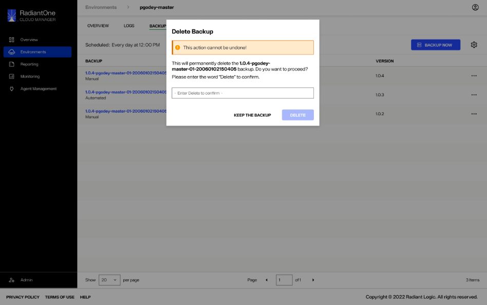

---
keywords:
title: Delete an Environment Backup
description: How to delete an environment backup
---
# Delete an Environment Backup

This guide provides an overview of the steps required to delete an environment backup.

> **Note:** Deleting an environment backup is a permanent action that cannot be undone. Ensure you have selected the correct backup before deleting.

## Getting started

To delete an environment backup, navigate to the **Backups** tab under the detailed view of an environment. Select the **Options** (**...**) menu located next to the environment backup you want to delete. From the **Options** dropdown menu, select **Delete**.

This opens the confirmation dialog where you will enter the required information to proceed with deleting the backup.

## Confirm backup deletion

The confirmation dialog to delete an environment backup displays the name of the backup you are about to delete and confirmation message verifying that you would like to proceed with this action.

Enter "Delete" in the space provided to confirm that you would like to delete the selected environment backup and select the **Delete** button.

If the wrong word is entered in the provided space, or "Delete" is spelled incorrectly, you will receive an error message and won't be able to select **Delete**. Review your entry in the text box and check for any spelling errors.

If the backup is successfully deleted you will receive a confirmation message and the backup will no longer be available in the list of backups.

Select **Dismiss** to close the confirmation message.

If an error occurs and the backup cannot be deleted, you wil receive an error message notifying you that the backup deletion failed. The backup will still be listed in the *Backups* view.

Select **Dismiss** to close the error message and continue on to try deleting the environment backup again.

## Next steps

After reading this guide you should have an understanding of the steps required to delete an environment backup.
