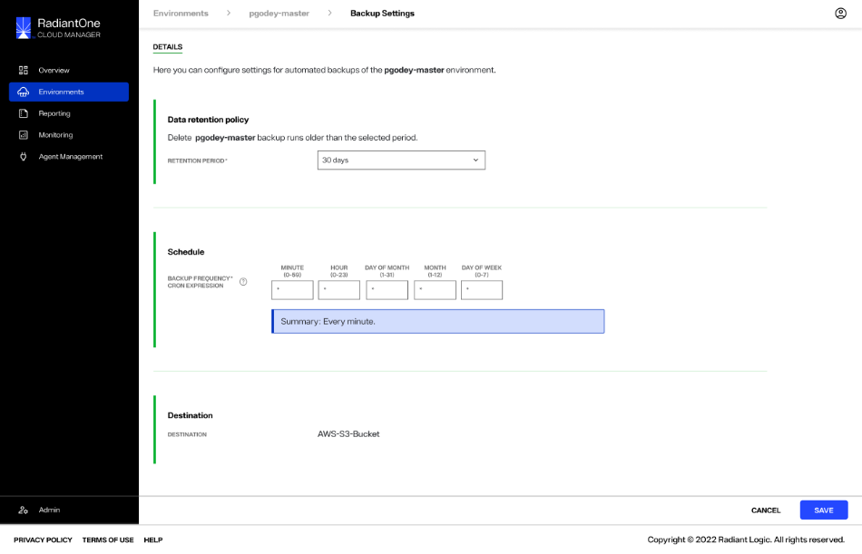
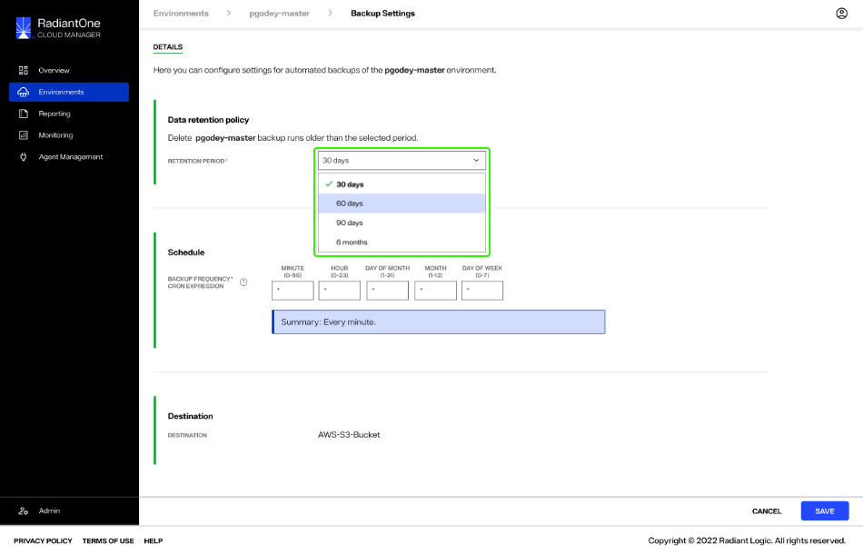
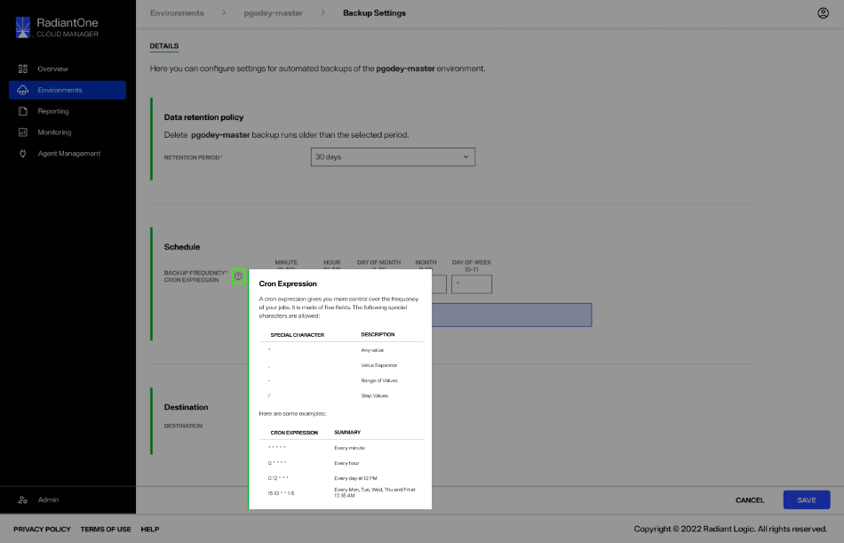
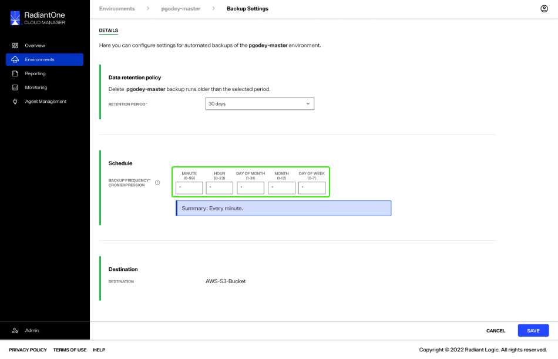
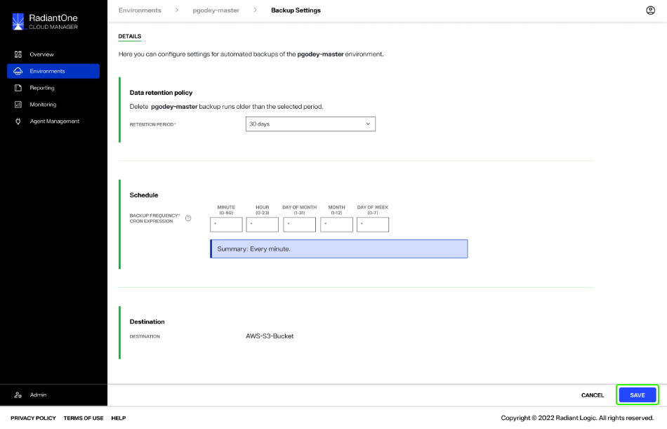
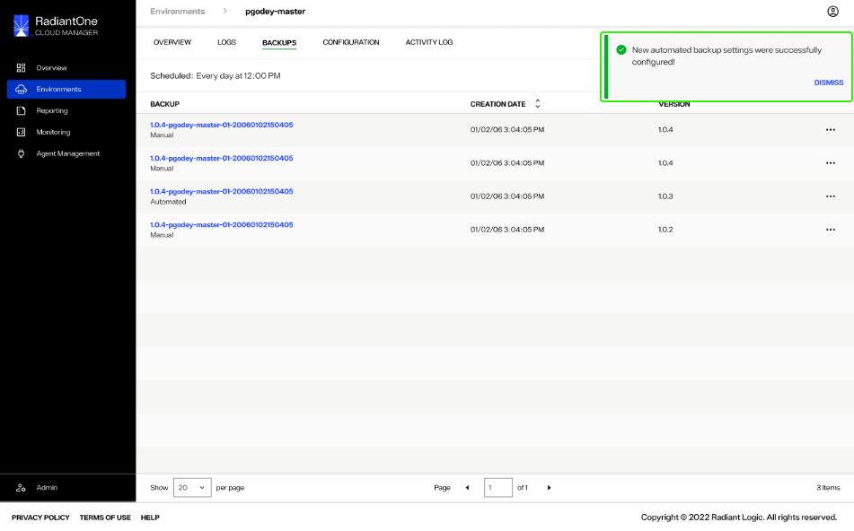
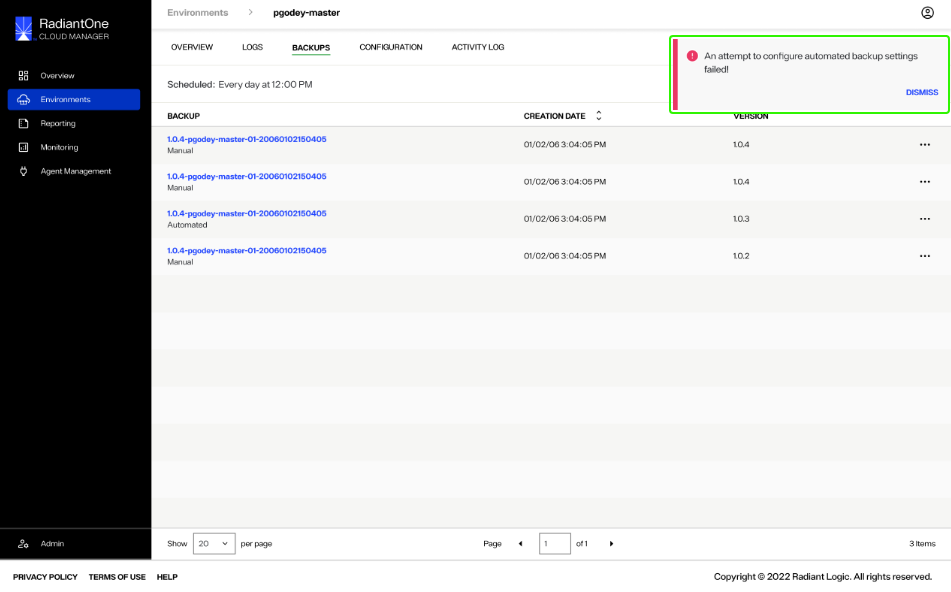

---
keywords:
title: Schedule Automated Environment Backups
description: How to schedule environment backups
---
# Schedule Automated Environment Backups

This guide provides an overview of the steps required to schedule automated backups for a specific environment.

## Getting started

From the *Backups* screen, select the **Backup Settings** icon () to navigate to the *Backup Settings* screen.

The *Backup Settings* view contains all of the fields required to create a scheduled backup.

## Backup settings

To create a scheduled backup, you must complete the sections outlined on the *Backup Settings* screen. This includes, "Data retention policy", "Schedule", and "Destination".

### Data retention policy

The data retention policy specifies when to delete previously created backups. To set the retention period for your scheduled backups, select a time period from the dropdown menu.

The maximum retention period... (**requested from RL**).

### Schedule

In the "Schedule" section you will set the frequency of backups. For example, a backup could be created every minute, every hour, every day, once a week, and so on.

The backup frequency is set using Cron Expression. If you are unfamiliar with Cron Expression, hover over the question mark icon () to reveal an info box outlining the specifications for Cron Expression and a few examples.

To set the backup frequency, use the appropriate Cron Expression syntax in the spaces provided to set the frequency for the environment backup to run.

### Destination

In the "Destination" section, select the location where you would like to store the environment backup.

(**confirming w/RL if there will be multiple storage options or just S3**)

Once you have complete all required sections, select **Save** to to create the scheduled environment backup.

## Confirmation

Once you have saved the environment backup settings, you will return to the backups screen. If the scheduled backup was successfully create you will receive a confirmation message.

Select **Dismiss** to close the confirmation message.

If the scheduled backup could not be create, you will receive an error message indicating that creating the scheduled backup failed.

Select **Dismiss to close the error message and proceed to try creating the scheduled backup again.

## Next steps

After reading this guide you should have an understanding of the steps required to schedule automated environment backups. To learn how to restore an environment to a previously backed up version, review the guide on [restoring an environment backup](restore-backup.md).
