---
keywords:
title: Environment Details
description: Components and navigation for an environment's detailed view
---

# Environment Details

Each environment has a detailed view where you can see further information about the environment, monitor its status, and perform various operations on the environment. This guide outlines the features of a specific environment's *Overview* screen and how to navigate the detailed view of the environment. For an overview of the *Environments* screen that lists all available environments, see the [environments overview guide](../environment-overview/environments-overview.md).

## Getting started

To navigate to the detailed view of an environment, select the environment name from the list of environments displayed on the *Environments* screen.

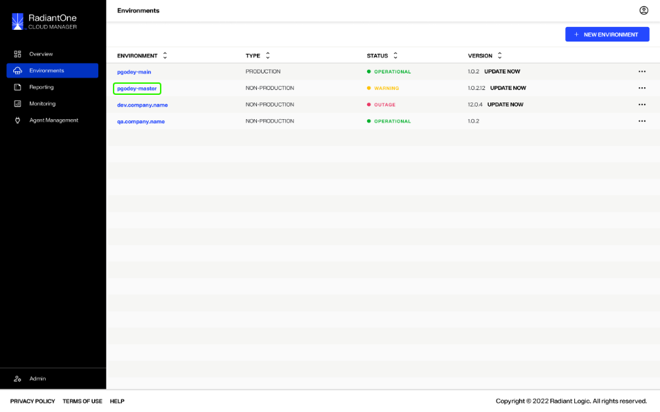

This brings you to the environment's *Overview* screen that displays a summary of the environment details and operation statuses. Further monitoring and updating tools for the environment are accessible from the navigation bar located at the top of the page.

## Top navigation

A navigation bar is located at the top of the *Overview* screen and is visible from all tabs in the environment details view. The top navigation allows you to access several monitoring and updating tools through the following tabs:

- Overview
- Logs 
- Backups
- Configuration
- Activity Log

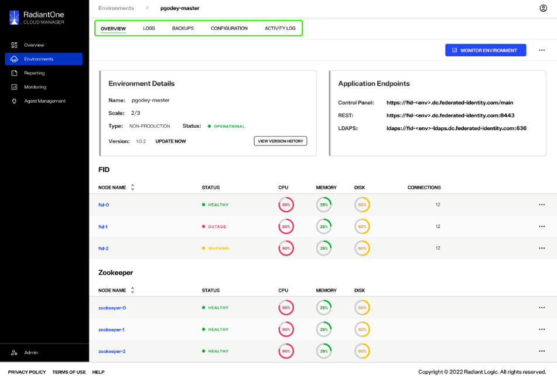

### Logs

The *Log* screen allows you to view an environment's log details, imported from Elastic.

> **Note:** For further details on reviewing environment logs, see the [Environment Logs](../logging/environment-logs.md) guide.

### Backups

From the *Backups* tab, you can save a backup of the current environment configuration and view previous backups.

> **Note:** For information on managing your environment backups, refer to the [backup and restore documentation](../backup-and-restore/backup-restore-overview.md).

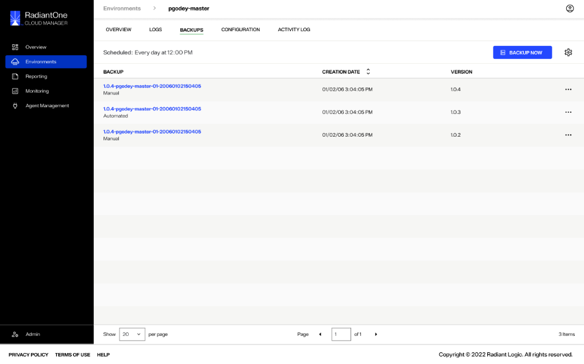

### Configuration

From the *Configuration* tab, you can view a chronological list of the configuration file import and export history for an environment. Configuration file import or export workflows can also be launched from this screen.

> **Note:** To learn how to import a configuration file, review the [import a configuration file](../environment-overview/import-configuration-file.md) guide. Or, for details on exporting a configuration file, review the [export a configuration file](export-configuration-file.md) guide.

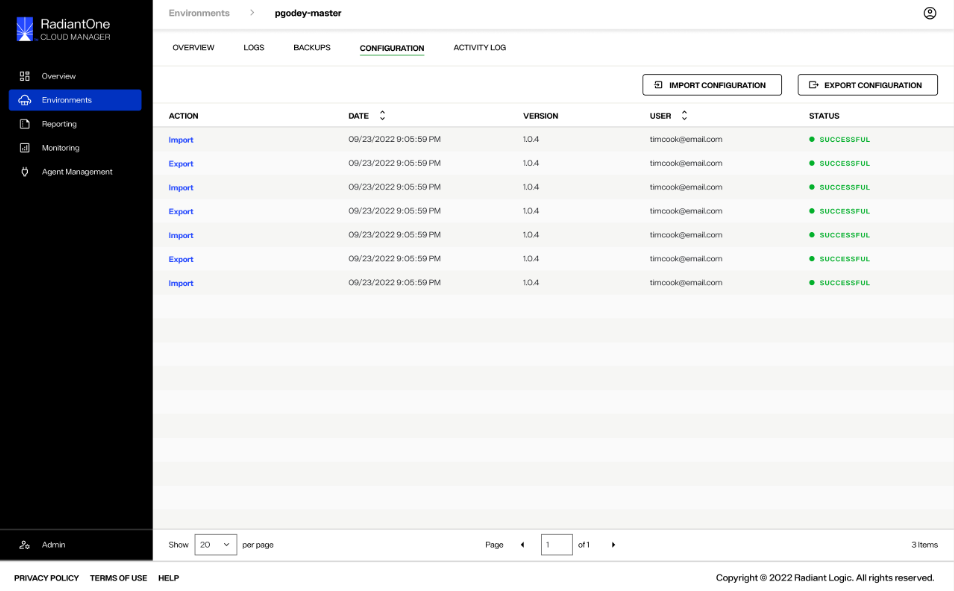

### Activity log

Under the *Activity Log*, you can view a list of all actions performed on an environment. Each action has a corresponding time and date stamp of when it was performed and the user who performed the action is also listed.

**Confirming with Prashanth if titles are static or can be used for navigation/actions**

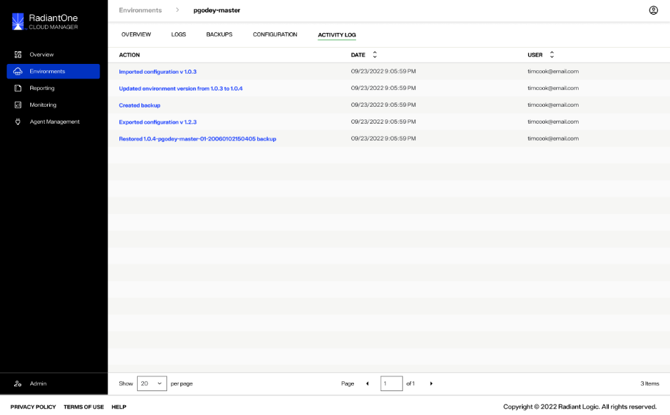

## Monitor environment

A **Monitor Environment** button is located near the top of the *Overview* screen. Select **Monitor Environment** to... **Workflow needs clarification (included in question doc)**.

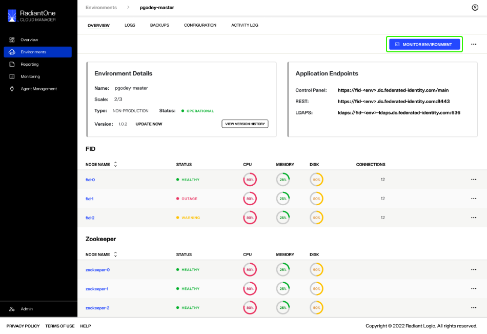

## Environment options

An expandable **Options** (**...**) menu is located next to the **Monitor Environment** button. Selecting the **Options** (**...**) dropdown menu displays the options to **Update** or **Delete** the environment.

> **Note:** To learn how to delete the environment, review the [delete environment](delete-environment.md) guide. For details on updating the environment, review the [update environment](update-environment.md) guide.

## Environment details

The *Environment Details* section outlines the environment name, scale, type, status and version number.

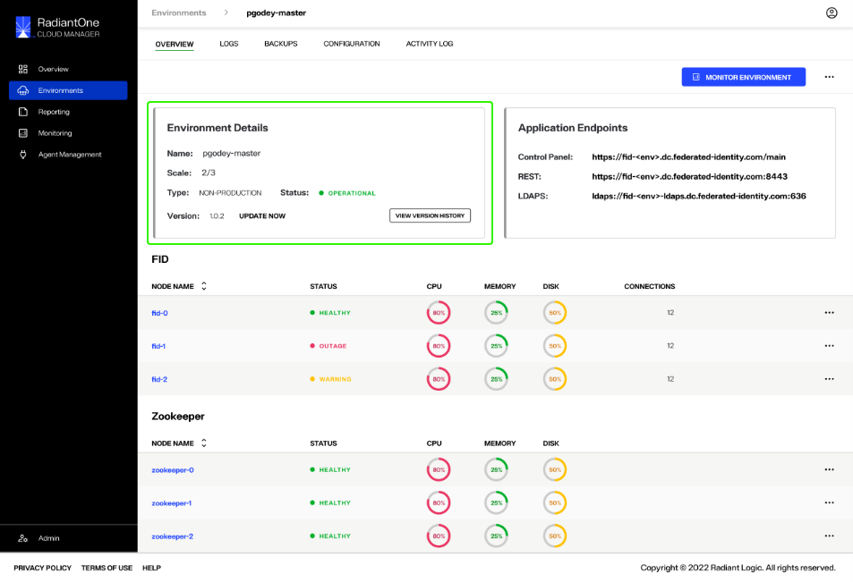

### Status

The environment status will change depending on the state of the environment. Statuses include (**clarifying with Prashanth**):

- Operational:
- Warning??
- Outage??

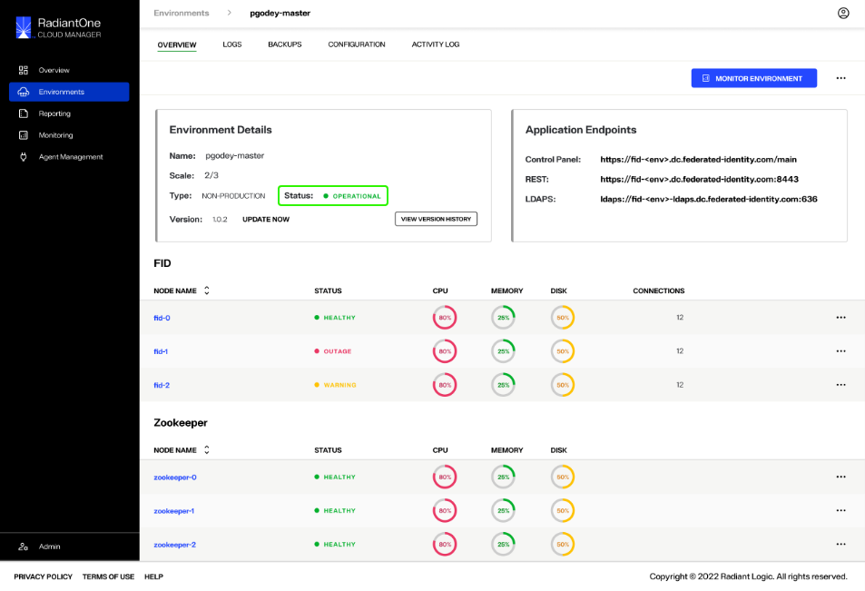

### Version

If the environment version is out of date, an "Update Now" message appears next to the version number. 

> **Note:** For details on updating the environment, review the [update environment](update-environment.md) guide.

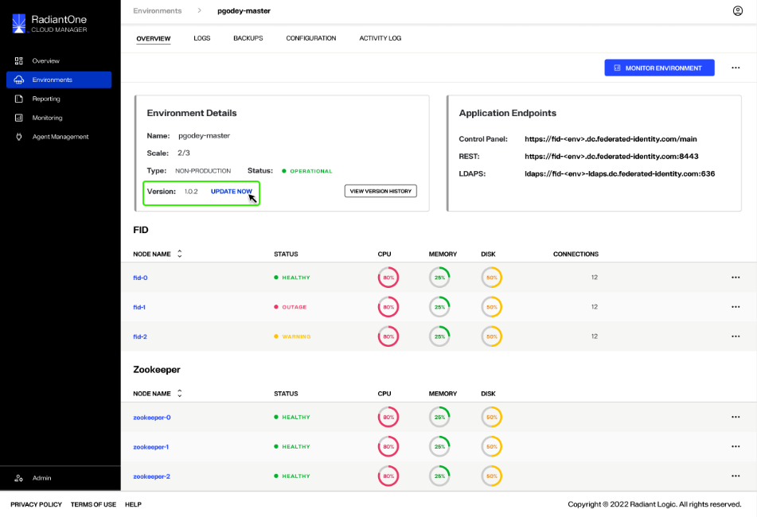

You can view the environment's version history by selecting the **View Version History** button in the lower right corner of the *Environment Details* box. 

> **Note:** See the guide on [version history](version-history.md) for further details on reviewing and restoring an environment's previous versions.

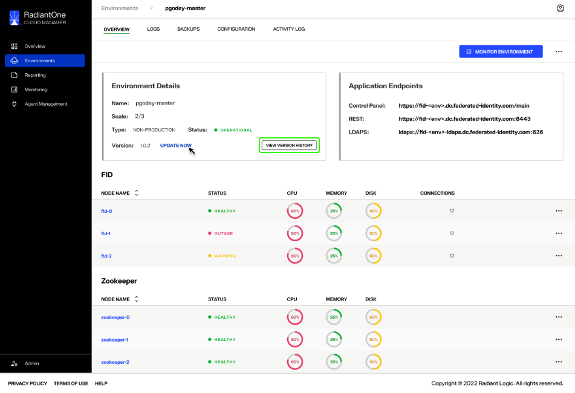

## Endpoints

The *Application Endpoints* section lists all of the environment endpoints.

(**Waiting on further info from Prashanth for endpoint details**).

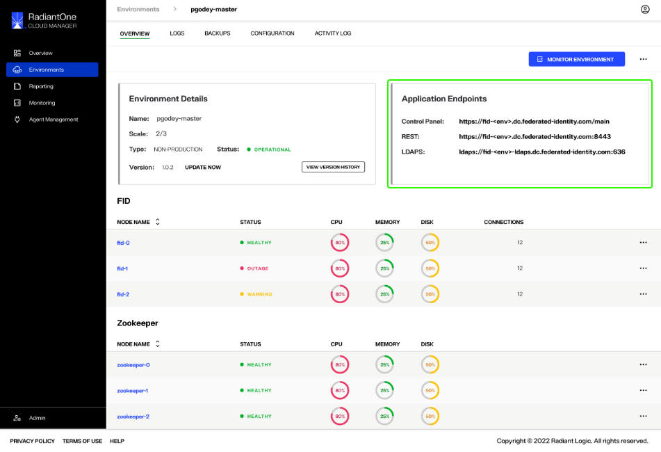

## Node monitoring

The lower section of the *Overview* page displays monitoring sections for the FID and Zookeeper nodes of an environment. For both FID and Zookeeper nodes, the status, CPU, memory, and disk space are provided for each node. The number of connections are listed for all FID nodes.

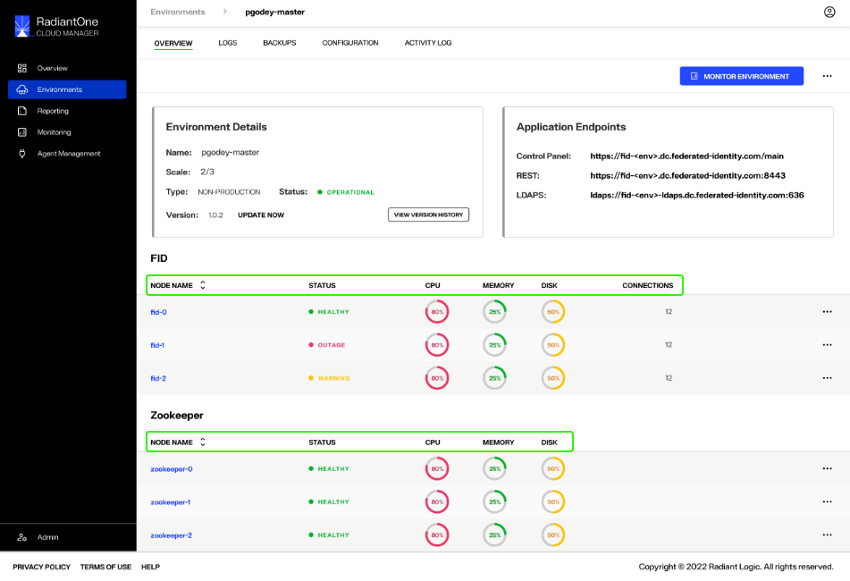

Node status will be listed as "Healthy", "Warning, or "Outage".

(**note what each status means**)

CPU, memory, and disk are all displayed as color-coded percentages to indicate their health.

(**outline what the different health indicators mean**)

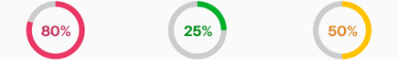

An expandable **Options** (**...**) menu is available for each node. Selecting the **Options** dropdown menu displays the options to **View Details** or **View Logs** for the selected node. 

> **Note:** For further details on reviewing nodes details, see the [node details](node-details.md) guide.

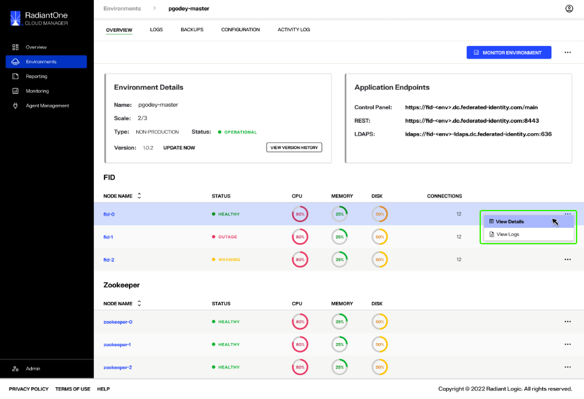

## Alerts

(**Requested further info on alerts: what triggers them, definitions/messaging, etc.**)

## Next steps

After reading this guide you should be able to navigate the *Overview* screen of an environment and understand its main features including the top navigation, Environment Details, Application Endpoints, and Node Monitoring. For details on updating the environment, review the guide to [update an environment](update-environment.md).
