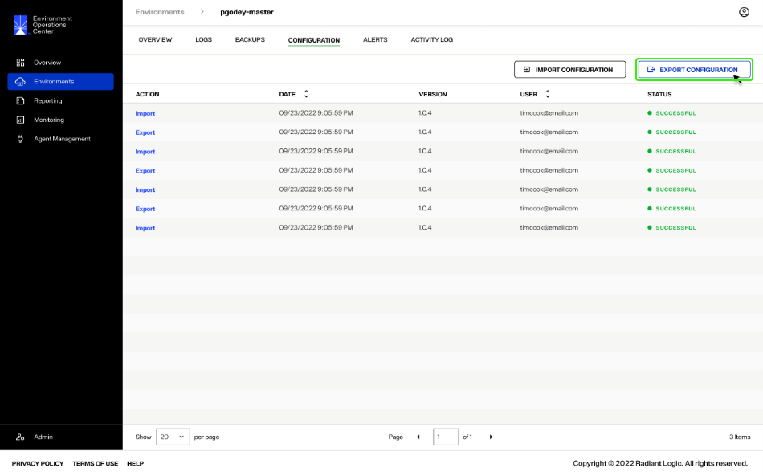
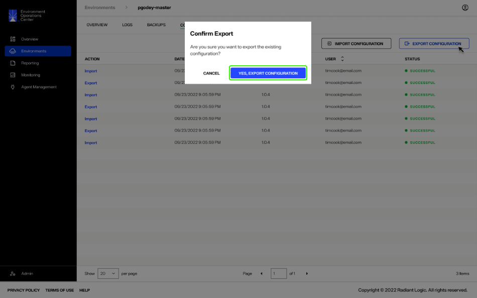
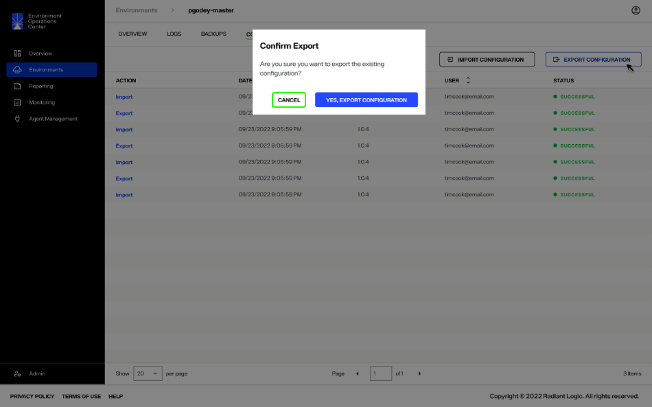

---
keywords:
title: Export a Configuration File From an Environment
description: Guide to export a configuration file from an existing environment
---
# Export a Configuration File From an Environment

This guide outlines the steps required to export an environment configuration ZIP file in Environment Operations Center.

## Getting started

To begin the workflow to export a configuration ZIP file of the current environment, select **Export Configuration** on the *Configuration* tab.

## Confirmation

After selecting **Export Configuration**, you will receive a message confirming that you would like to export the existing configuration. Select **Yes, Export Configuration** to continue.

If you would prefer to quit the workflow and not export a configuration of the current environment, select **Cancel**.

If the export is successful, you will receive a confirmation message on the *Configuration* tab and the export will be added to the list of configuration activity. Select **Dismiss** to close the message.

The environment configuration ZIP file will download directly to your system.

If the export is not successful, you will receive an error message.... (**need RL to confirm error codes and resolutions**)

**image of export error**

## Next steps

After reading this guide you should have an understanding of the steps required to export an environment configuration ZIP file. For details on importing configuration files, see the [import a configuration file](../environment-overview/import-configuration-file.md) guide.
