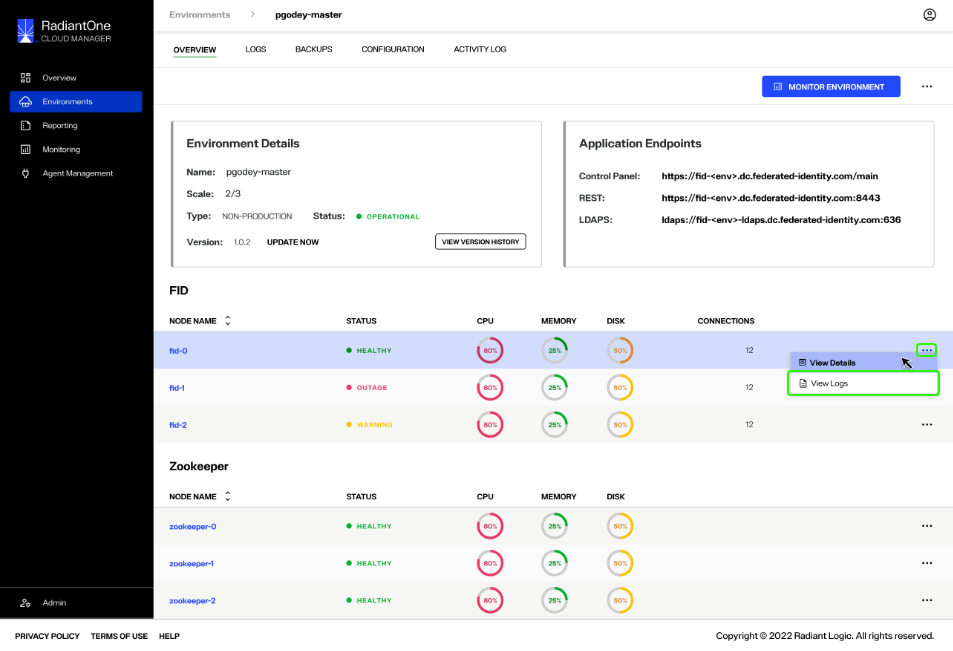

---
keywords:
title: Monitor Node Health of an Environment
description: Guide to review and monitor node status
---
# Monitor Node Health of an Environment

This guide outlines the steps required to monitor the status details for a specific node. The *Overview* tab provides a high-level view of all FID and Zookeeper node statuses for quick monitoring of cluster health. Each individual node has a detailed view that provides further information on the status and health of a given node. The details provided for FID nodes versus Zookeeper nodes are slightly different and are outlined within this guide.

## View node details

There are two ways to access the status details for a specific node: select the node name to open node details or select the **Options**(**...**) menu.

You can select the node name to open the node details dialog.

Alternatively, you can select the **Options** (**...**) menu located in the node row to expand the dropdown menu. From the **Options** menu select **View Details** to open the the node details dialog.

### FID node details

The FID node details dialog provides the following information for the selected node:

> **(RL Question: Definitions required for Cloud ID, Version (is there something appended to the version number?), Disk Latency, Up Time, Services (are these the same as endpoints?))**

- Name: The name assigned to the specific FID node.
- Status: Indicates if the node is operational, experiencing a partial outage, or experiencing a full outage. Displays as "Healthy", "Warning", or "Outage".
- Cloud ID:
- Version: 
- Health: The status of the CPU and quantity used of memory and disk space.
- Disk Latency:
- Up Time:
- Services/Endpoints??

### Zookeeper node details

The Zookeeper node details dialog provides the following information for the selected node:

> **(RL Question: Services (are these the same as endpoints?))**

- Name: The name assigned to the specific Zookeeper node.
- Status: Indicates if the node is operational, experiencing a partial outage, or experiencing a full outage. Displays as "Healthy", "Warning", or "Outage".
- Health: The status of the CPU and quantity used of memory and disk space.
- Services/Endpoints??

## View node logs

Each node has associated log files that contain further information about the node's health and status alerts. The log files for a specific node can be accessed from the node details dialog or from the **Options** (**...**) dropdown of a node.

To access log files from a node's details dialog, select **View Logs** in the dialog. The **View Logs** button is available in the details dialog for both FID and Zookeeper nodes.

Select **Close** to exit the node details dialog.

Alternatively, the log files of a node can be accessed by selecting **View Logs** from the associated **Options** (**menu**).

## Next steps

After reviewing this guide, you should have an understanding of how to review the status and health of specific FID and Zookeeper nodes. For information on reviewing environment logs, see [environment logs](../logging/environment-logs.md).
