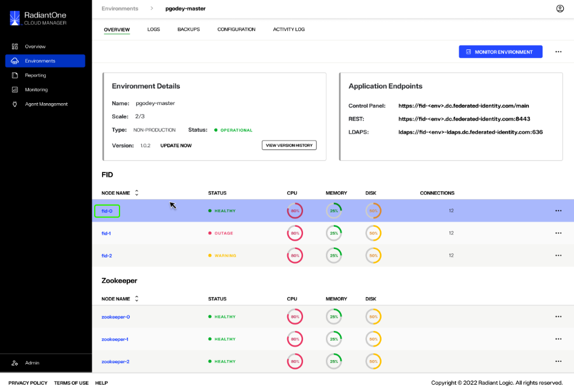
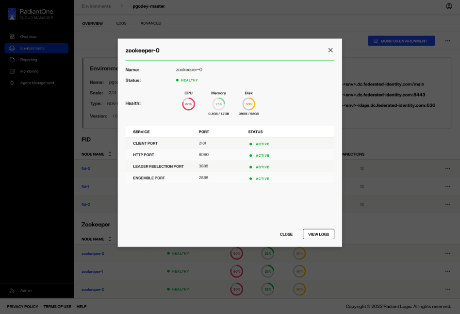
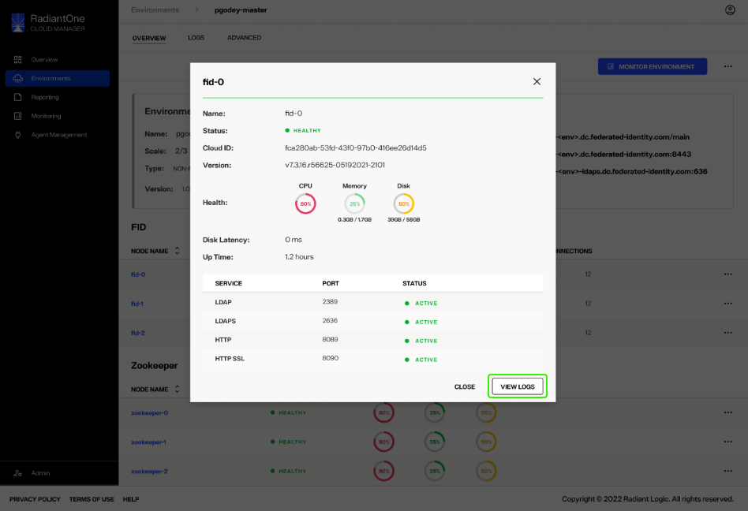
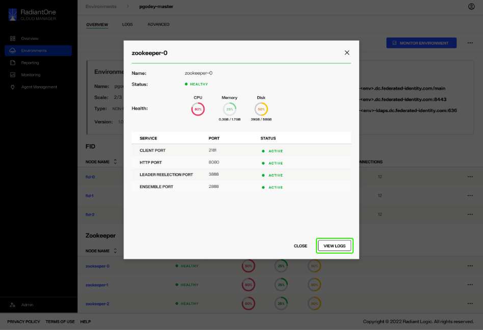

---
keywords:
title: Monitor Node Health of an Environment
description: Guide to review and monitor node status
---
# Monitor Node Health of an Environment

This guide outlines the steps required to monitor the status details for a specific node. The *Overview* tab provides a high-level view of all FID and Zookeeper node statuses for quick monitoring of cluster health. Each individual node also has a detailed view that provides further information on the status and health of a given node. The details provided for FID nodes versus Zookeeper nodes are slightly different and are outlined within this guide.

## View node details

There are two ways to access the status details for a specific node: select the node name to open node details or select the **Options**(**...**) menu.

You can select the node name to open the node details dialog.

Alternatively, you can select the **Options** (**...**) menu located in the node row to expand the dropdown menu. From the **Options** menu select **View Details** to open the the node details dialog.

### FID node details

The FID node details dialog provides the following information for the selected node (**waiting for definitions from RL**):

- Name:
- Status:
- Cloud ID:
- Version
- Health:
- Disk Latency:
- Up Time
- Connections??

To view the log details of the chosen node, select **View Logs**. This takes you to.... (**waiting for confirmation from RL**).

Select **Close** to exit the node details dialog.

### Zookeeper node details

The Zookeeper node details dialog provides the following information for the selected node (**waiting for definitions from RL**):

- Name:
- Status:
- Health:
- Connections??

To view the log details of the chosen node, select **View Logs**. This takes you to.... (**waiting for confirmation from RL**).

Select **Close** to exit the node details dialog.

## Next steps

After reviewing this guide, you should have an understanding of how to review the status and health of specific FID and Zookeeper nodes. For information on reviewing environment logs, see [environment logs](../logging/environment-logs.md).
