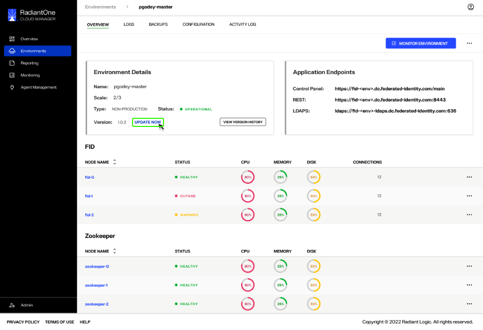
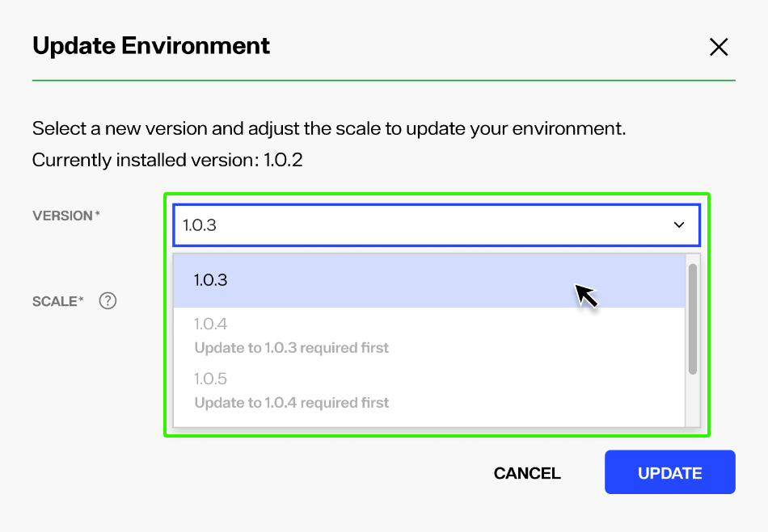
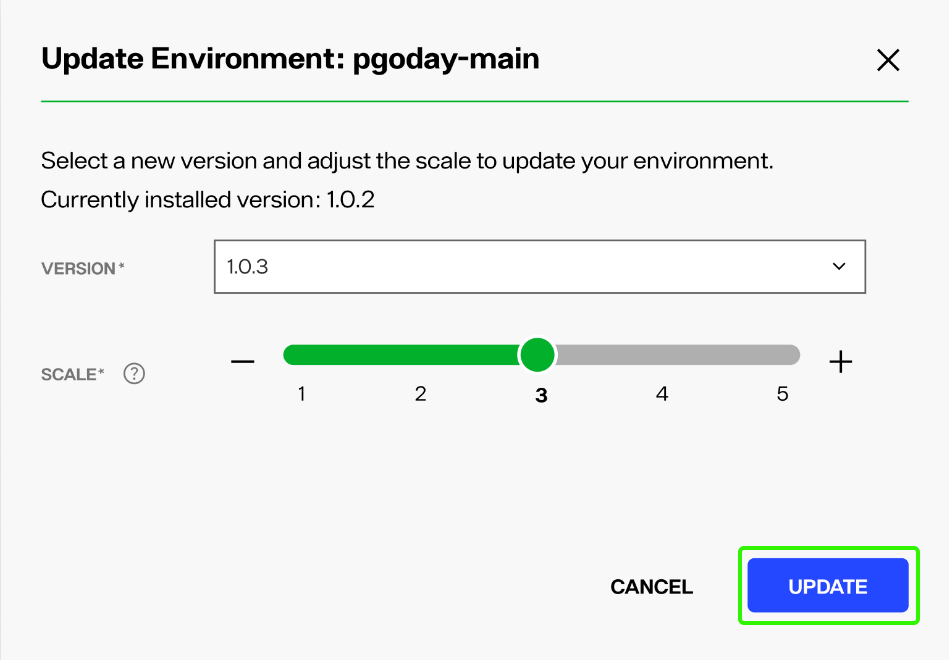
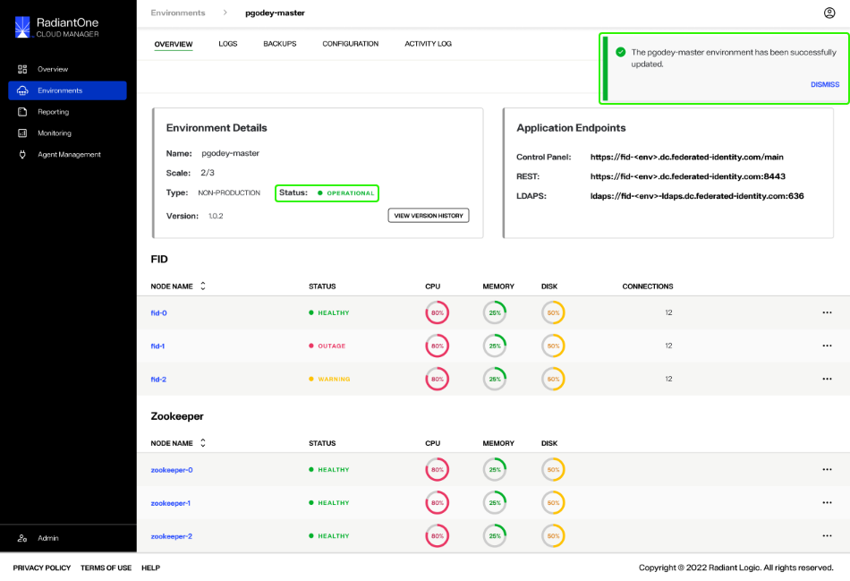
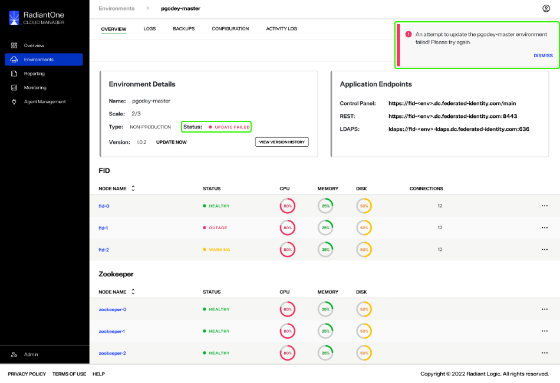
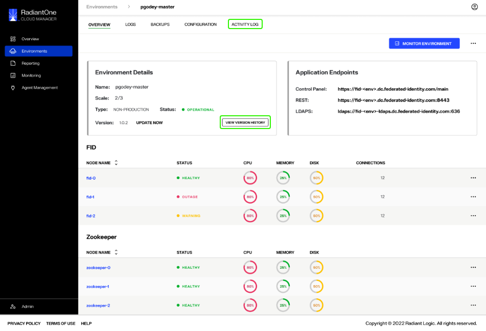

---
keywords:
title: Update an Environment from its Detailed View
description: Guide to update an environment from its details view
---
# Update an Environment from its Detailed View

When version updates are applied to your Environment Operations Center instance, your environments are not updated automatically. There are two ways that you can manually update the version of individual environments: From the *Environments* home screen or the *Overview* screen of the environment that you wish to update. This guide outlines the steps required to update an environment from its *Overview* screen. For details on updating an environment from the *Environments* home screen, review the overview guide on [updating an environment](../environment-overview/update-an-environment.md).

> **Note:** Before getting started, make sure you know the current version of Environment Operations Center and the required number of FID nodes to display for each environment that requires updating.

## Managing environment updates

When an environment requires updating, an **Update Now** message appears next to the environment version number under "Environment Details".

### Begin update

There are two ways to begin the environment update workflow from the *Overview* screen, either from the **Options** menu (**...**) or by selecting the **Update Now** message.

To update using the **Options** menu, select the ellipsis (**...**) located next to the **Monitor Environment** button to display the environment's **Options** menu. From the dropdown menu, select **Update** to open the *Update Environment* dialog box.

Alternatively, you can select the **Update Now** message located next to the environment's version number. This will also open the *Update Environment* dialog box.

### Update version number and nodes

Once you have started the environment update workflow, a dialog box appears containing the fields required to update the environment version and number of FID nodes. To update your environment, you must provide the correct version number that corresponds with your current version number of Environment Operations Center and the number of FID nodes to display.

To update your version number, select the correct number from the **Version** drop down menu. Your currently installed version number is displayed just above the dropdown menu for reference.

To set the number of FID nodes to display for the environment, use the provided slider to increase or decrease the quantity. Alternatively, you can select either the minus (**-**) or plus (**+**) sign on either side of the slider to increase or decrease the number of FID nodes to display.

Once you have set the correct version number and number of FID nodes, select **Update** to begin updating the environment.

To quit the update and return to the environment *Overview* screen, select **Cancel**.

### Environment update confirmation

After selecting **Update** you will return to the *Overview* screen. An updating confirmation message displays notifying you that the update is in progress and could take up to 1 hour.

While the environment is updating its status will display as "Updating", the **Update Now** message will no longer be visible, and the **Options** (**...**) menu will be greyed out and unable to be selected.

If the environment updates successfully, you will receive a success notification and the environment status will change to "Operational".

Select **Dismiss** to close the notification.

If the environment update is unsuccessful, you will receive an error notification and the environment status will change to "Update Failed".

Select **Dismiss** to close the notification and proceed to retry updating the environment.

## Previous updates

You can view updates previously applied to an environment by selecting **Activity Log** from the top navigation or by selecting **View Version History** located in the *Environment Details* section.

From either, you can also begin the workflow to revert to a previous environment update.

> **Note:** For further details on reviewing version history and reverting to a previous environment version, review the [version history](version-history.md) guide.

## Next steps

After reading this guide you should have an understanding of the steps required to update an environment, including updating the version number and number of FID nodes to display, from the *Overview* screen of the environment. To learn how to review all updates applied to an individual environment, see the guide on monitoring environment [version history](version-history.md).
