---
keywords:
title: Create an Environment
description: Guide to create a new environment
---
# Create an Environment

This guide provides an overview of the steps required to create a new environment in Cloud Manager.

An environment is where a Radiant One product lives. Each environment is completely isolated and contains endpoints to access different applications.

## Getting Started

You will need to have the following before setting up your new environment:

- Your license key.
- Your Cloud Manager version number.
- If you are importing a configuration file, ensure you have the correct file type saved and ready to go.

The new environment setup requires you to define the environment type, details, and provides an optional step to upload a configuration file from another environment.

## New environment set up

To create a new environment, select the **New Environment** button on the *Environments* home screen.

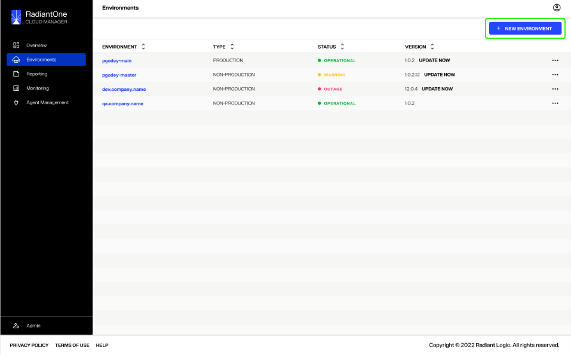

This takes you to the *New Environment* form that contains all the input fields for the information required to create a new environment. The following sections outline how to complete these required fields.

### Define Environment Type

Start by selecting the required **Environment Type** and **Environment Tier**.

#### Environment type

To set the **Environment Type**, use the radio buttons to select either **Non-production**, for development and testing, or **Production**, for production purposes.

> **Note:** Only one production environment can be created per Cloud Manager instance, per region.

 

If your organization already has a production environment configured, the production option will be greyed out and not able to be selected. Hovering over **Production** will display a confirmation message that your organization already has one production environment in use.

#### Environment tier

To set the **Environment Tier**, select either the Tier 1 or Tier 2 card.

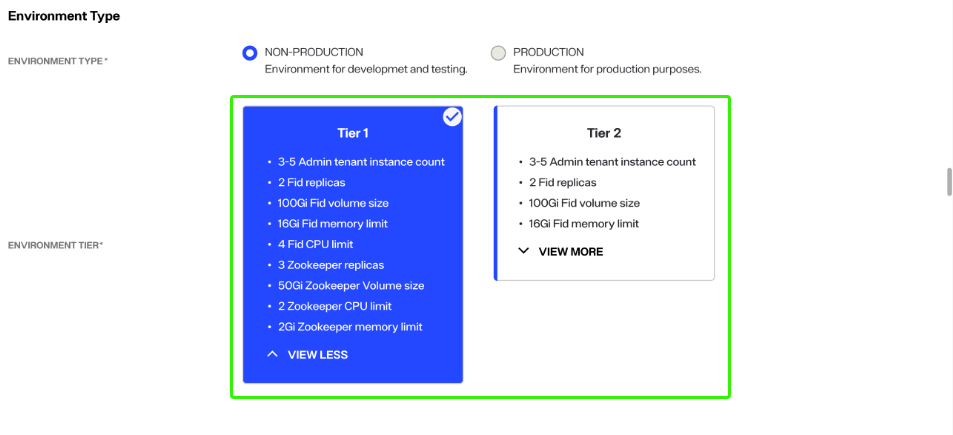

To view further details of a tier, select **View More** to expand the tier card. Select **View Less** to collapse the card **(Tier outlines require definitions from Prashanth)**.

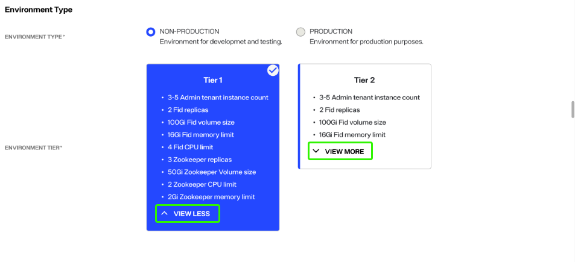

### Define environment details

Under the **Environment Details** section, set the environment name, version, password, and license key.

#### Environment name

To set the **Environment Name**, enter the required name in the space provided. Names must follow the naming convention **(which still needs to be defined)** and can contain 100 characters or less.

#### Version

To set the Environment **Version**, select the version drop down to display all available versions. Select the value that corresponds with your organization's version of Cloud Manager.

#### Password

Select a password by either entering your chosen password in the space provided, or by selecting the **Generate** button to have a password automatically generated for you. 

> **Note:** Passwords must be a minimum of 12 characters, contain at least 1 special character, contain lower and upper case letters, and contain at least 1 number.

Depending on the strength of your password, you will receive a notification that your password is **(requires definitions from Prashanth)**:

- Weak:
- Fair:
- Good:
- Strong:

Adjust your password accordingly to ensure you have entered a strong password before proceeding to the confirmation step.

To confirm your password, reenter or copy and paste your password in the confirmation space provided.

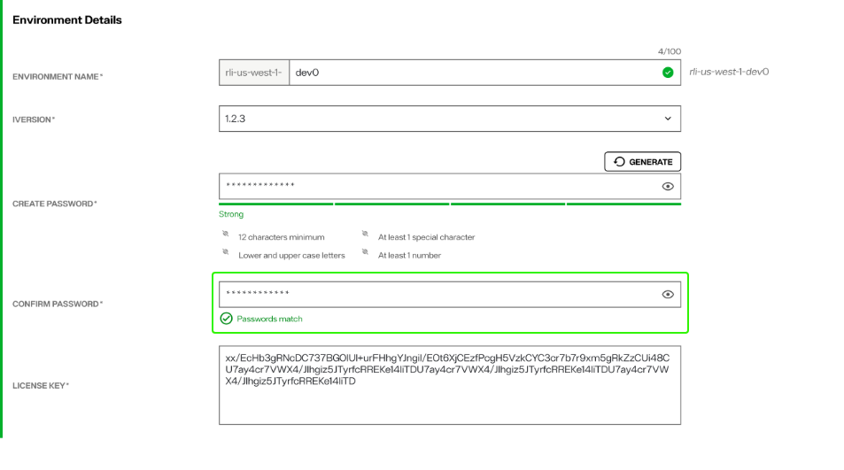

To reveal your original or confirmation password, select the eye icon () located within the text field you wish to view.

#### License key

Your license key is the same unique license key that was originally provided to unlock your instance of Cloud Manager. Enter your key in the space provided.

#### Save the new environment

Completing the steps outlined in the **Environment Type** and **Environment Details** sections are all that is required to set up your new environment. Once both sections are complete, select **Save** to create the new environment.

> **Note:** If you would like to upload a configuration file from an external environment, proceed to the Advanced Setup section.

### Advanced Setup

An optional advanced setup is available if you would like to upload a configuration ZIP file from another environment. Enable advanced setup by toggling on **Advanced Setup**.

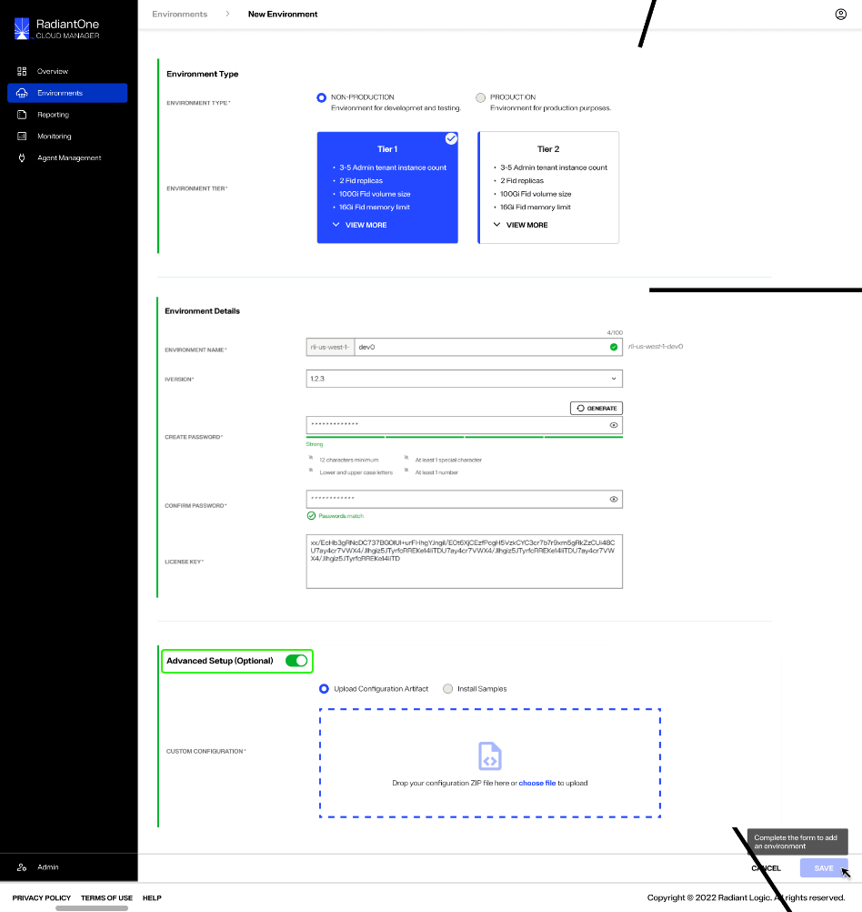

#### Upload type

Next, choose the type of configuration you would like to upload by selecting either **Upload Configuration Artifact** or **Install Samples**.

- The **Upload Configuration Artifact** option allows you to upload a configuration ZIP file from an external environment.

- The **Install Samples** option allows you to... **(this still needs to be defined)**

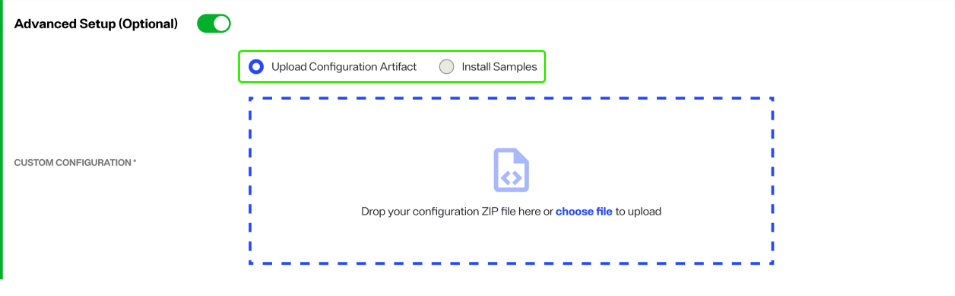

#### File upload

Next, select the configuration ZIP file to upload. You can locate the file on your system and drag and drop it into the provided space.

Alternatively, you can select **choose file** within the upload box to open your system's file manager and locate the file to upload.

While your file is uploading, an "Uploading" message will appear in the file upload box, along with a progress bar.

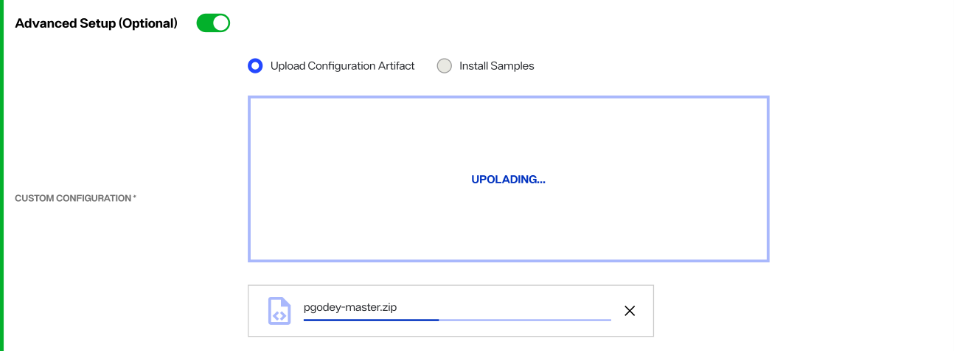

You can cancel the file upload while it is in progress by selecting the **X** located in the progress bar box.

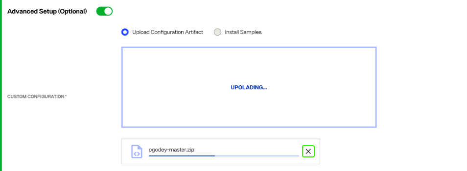

Once your configuration file has successfully loaded, the file name will appear in place of the file upload box. Select **Save** to create the new environment.

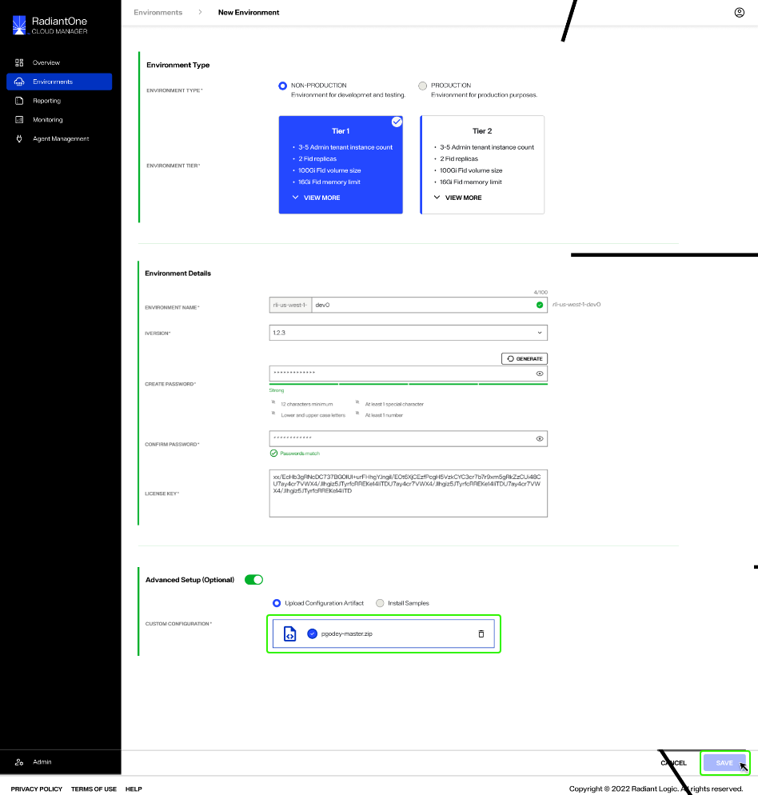

To delete the file and return to the file upload screen, select the trash can icon located in the same box as the successful file upload.

If the file upload is not successful, the configuration upload box displays with a red dashed outline and an error message appears just below. Review your file type to ensure you have selected the correct configuration file for upload and try again.

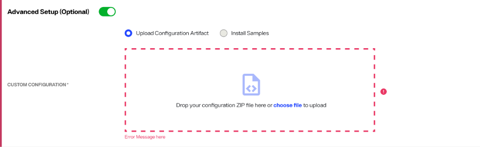

## New environment confirmation 

After saving the New Environment details form, you return to the *Environments* home screen. A confirmation message appears noting that your environment is being created and that the process can take up to 1 hour. The status of your new environment shows as "Creating". Select **Dismiss** to close the confirmation message.

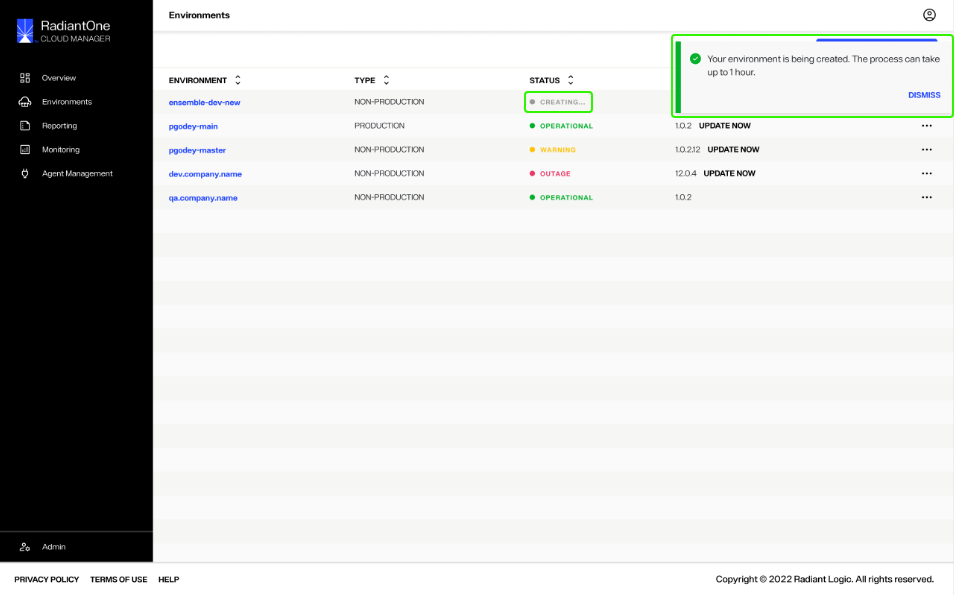

Once the environment has been successfully created, the environment's status will switch from "Creating" to "Operational".

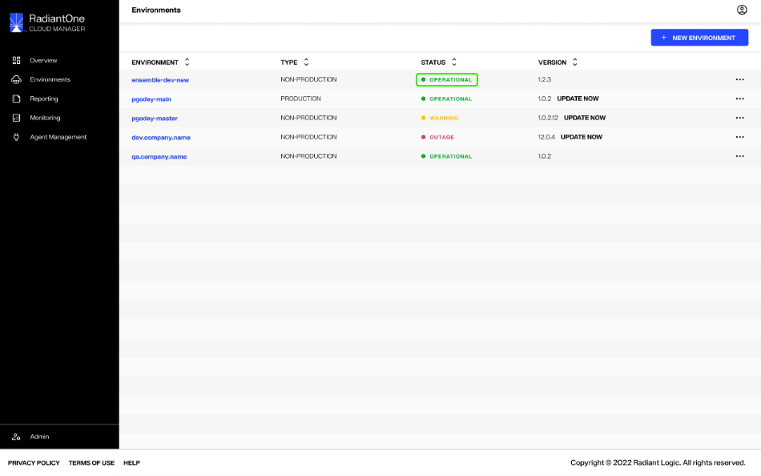

### Form submission failure

If there is an issue with the form submission, you will receive an error message that the new environment creation failed and the new environment will no longer be visible in the environment list on the *Environments* home screen. Select **Dismiss** to close the error message and proceed to restart the workflow to create a new environment.

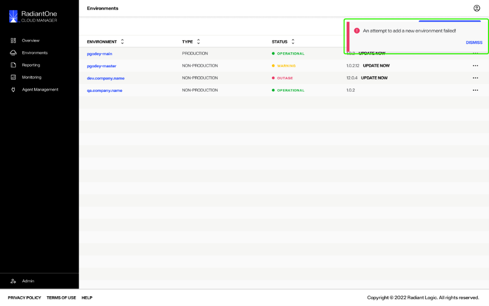

### Failure to create new environment

If there is an error and the environment cannot be created, the environment status will switch from "Creating" to "Creation Failed".

Select the ellipsis (**...**) in line with the environment to display a list of options. Options include:

- **Submit Again**: resubmit the same form without editing any of the fields.
- **View Logs**: troubleshoot where the error may have occurred while the form data was processing.
- **Delete**: if the environment hasn't been successfully created, delete the failed instance.

## Next Steps

After reading this guide you should have an understanding of the steps required to create a new environment and optionally how to upload a configuration file during new environment creation. To learn how to update an existing environment, review the guide on [updating an environment](update-an-environment.md).
