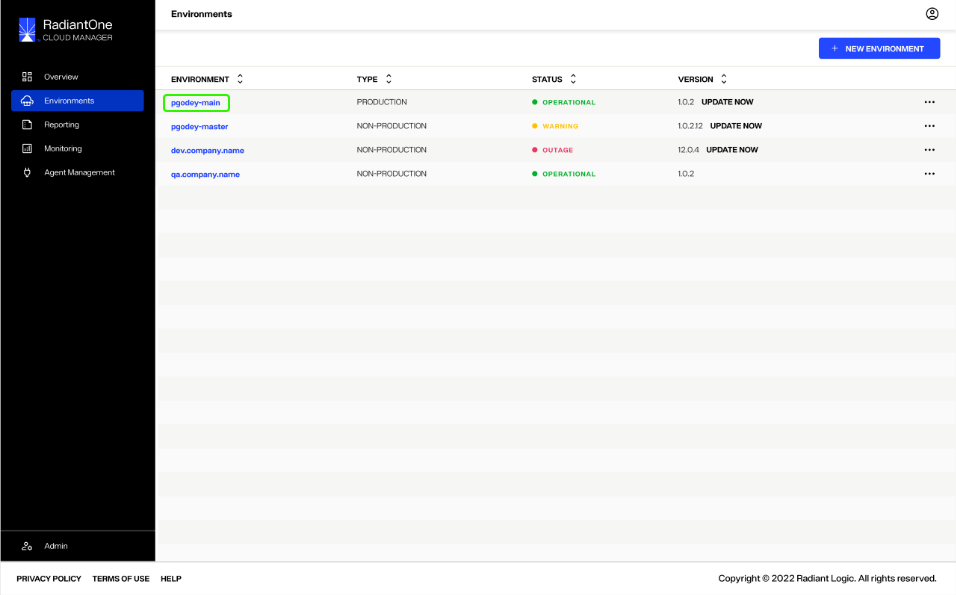
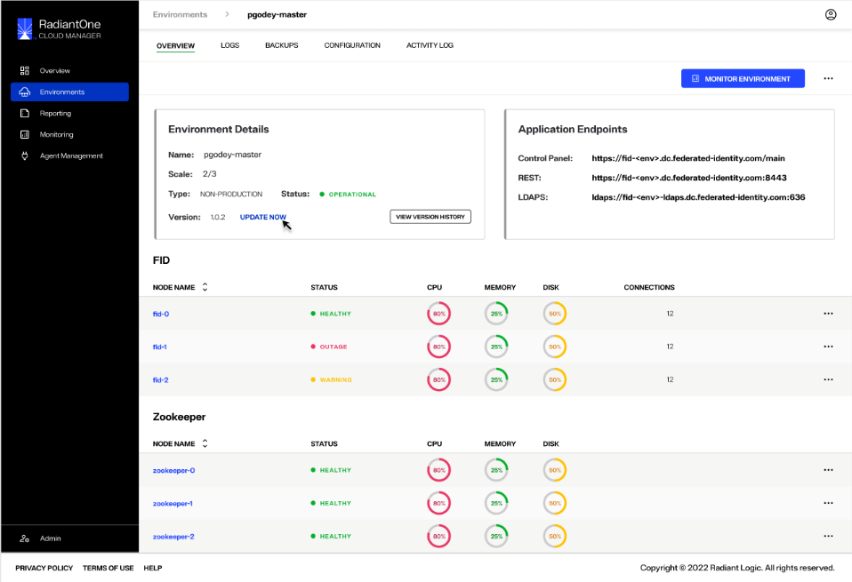

---
keywords:
title: Environments overview
description: Overview of the Environments home screen user interface
---
# Environments overview

This guide provides an overview of the *Environments* home screen and its features. To navigate to the *Environments* home screen, select **Environments** in the left navigation bar.

The *Environments* home screen provides an overview of all your organization's available environments. Each environment is listed by row, including its [name](#environment-details), [type](#environment-type), [status](#environment-status), and [version](#environment-version).

A quick start button is available to begin creating a [new environment](#new-environment) from the home screen. Each environment has it's own [options menu](#options-menu) (**...**) that allowing you to perform various operations on the selected environment.

## Environment details

To access further details about an environment, select the environment's name. 

This brings you to the [environment overview](../environment-details/environment-details-ui) screen, where you can view further information about a given environment, such as node status or connections, and perform monitoring and updating actions.

  
## Environment type

Type indicates whether the environment is configured as a production or non-production environment. Production environments are for production purposes, and non-production environments are for development and testing.

> **Note:** Each organization can only have one production environment per region.

## Environment status

Status indicates the current state of the environment and will automatically change to reflect an environment's state as operations are performed on an environment or if any operational errors have occurred. Statuses include (**these still need to be defined by Prashanth**):

- Operational:
- Warning:
- Outage:
- Update failed:
- Creation failed:
- Import failed:
- Updating:
- Creating:

## Environment version

Version indicates the current version of the environment. The version number is set by the administrator during [environment setup](create-an-environment.md). If the version number no longer matches the current version of Cloud Manager, an "Update Now" notification is displayed next to the version number prompting you to [update the environment](update-an-environment.md).

## Options Menu

To view a list of operations that can be performed on a given environment, select the ellipsis in the environment row (**...**) to expand the *Options* menu. Options include:

- View details:
- Update: [update the environment](update-an-environment.md)
- Import configuration: [import a configuration file](import-configuration-file.md)
- View logs:
- Delete: [delete an environment](delete-an-environment.md)

## New environment

The **New Environment** button allows you to quickly start creating a new environment from the home screen. For details on how to create a new environment, review the guide on [creating a new environment](create-an-environment.md).

## Next Steps

After reading this guide you should have an understanding of how to navigate the Environments home screen and its main features. To begin setting up a new environment, review the documentation on [creating a new environment](create-an-environment.md).

### Related documentation

- [Import a configuration file](import-configuration-file.md)
- [Update an environment](update-an-environment.md)
- [Delete an environment](delete-an-environment)
- Review environment details

