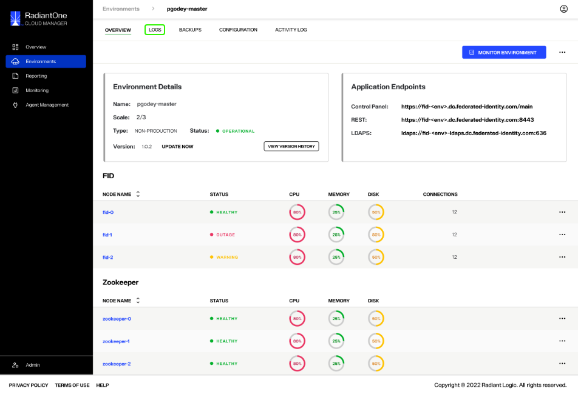
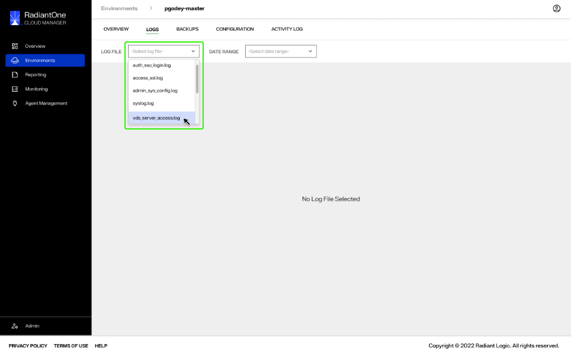
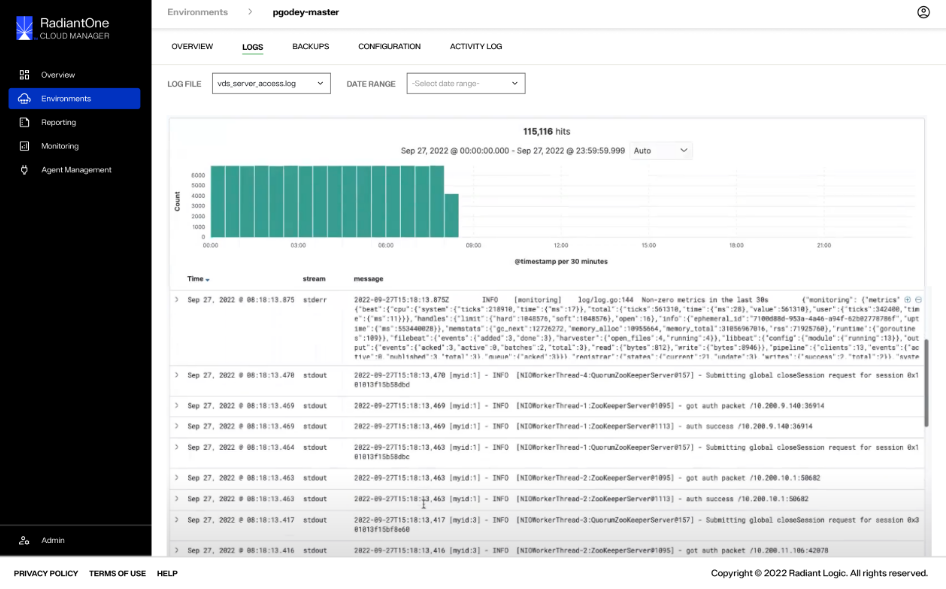
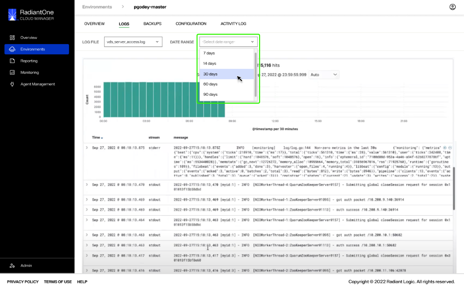

---
keywords:
title: Environment Logs
description: Reviewing environment logs
---
# Environment Logs

This guide outlines the steps to review logs for a specific environment. Environment Operations Center is connected to Elastic, allowing you to review environment logs directly in Env Ops Center without navigating away from the application.

## Getting started

To navigate to the *Logs* screen for a specific environment, select **Logs** from the top navigation in the environment's detailed view.

There are two dropdown menus located at the top of the *Logs* screen. The first is the **Log File** dropdown and the second is the **Date Range** dropdown.

> **Note:** A warning message will display on the *Logs* screen notifying you that a log file must be selected before any log data can be displayed.

## Review environment logs

To view a specific log for the environment, select the log file you would like to review from the **Log File** dropdown list.

This displays the log details that have been pulled in from Elastic for the selected log file.

You can refine the logs to only display log details for a period of time. To refine logs for a selected period of time, select a date range from the **Date Range** dropdown menu.

## Next steps

After reviewing this guide you should have an understanding of the steps required to review the log files of a specific environment. To learn more about backing up an environment, see the environment [backup and restore](../backup-and-restore/backup-restore-overview.md) documentation.
