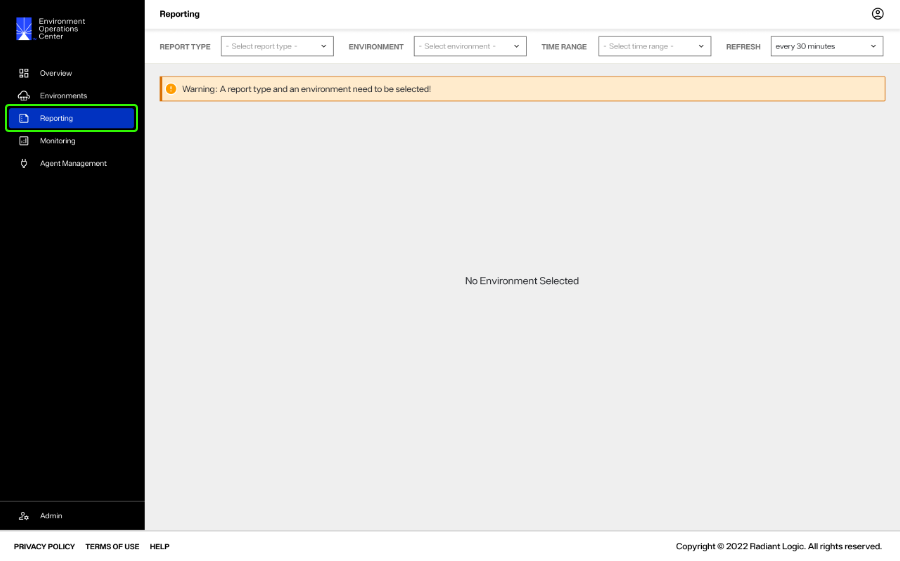
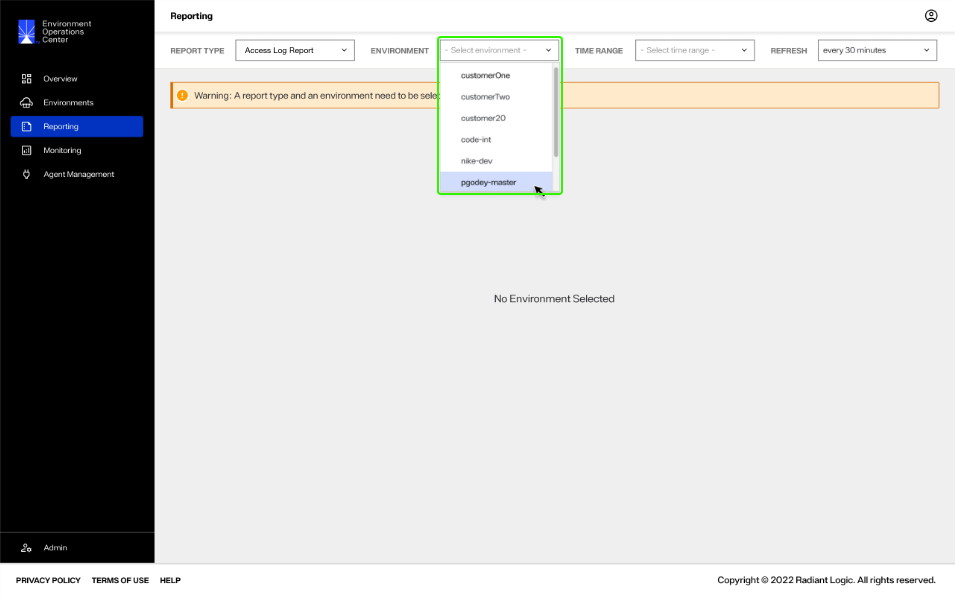
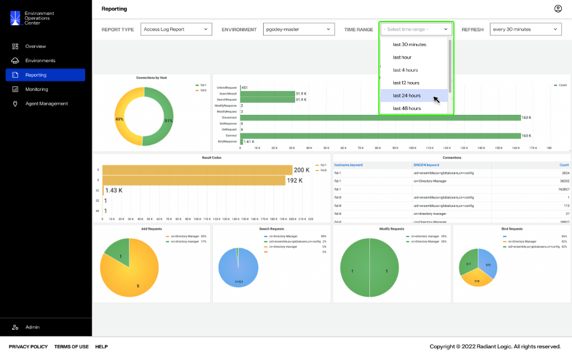
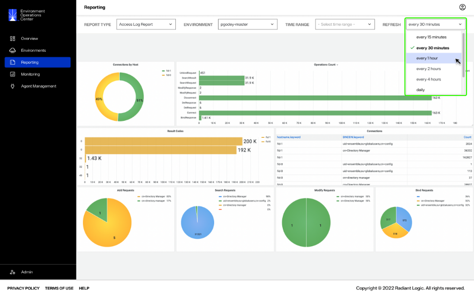

---
keywords:
title: Reporting Overview
description: Reporting overview
---
# Reporting Overview

From the *Reporting* screen, you can generate various reports to assist in monitoring performance and operations within your environments. This guide provides an overview of the *Reporting* section in Environment Operations Center, including its features and how to generate reports. 

> **Note:** Reports should be generated frequently to maintain a clear understanding of performance, load, configuration updates, and user activity.

## Getting started

To navigate to the *Reporting* screen, select **Reporting** () from the left navigation.

## Generate a report

To generate a report you must select the report type and the environment to generate the report for. 

From the **Report Type** dropdown, select the type of report. Report types include:

- Access Log Report: Provides details on various operations received by RadiantOne, including operation type, response times, and error codes.
- Audit Report: Provides details on user activity, including what operations are performed by specific users, time frame, and frequency.
- Group Audit Report: Provides similar details on user activity as the Audit Report for a specific group of users.

For further details on the components of each report, see the [report types](report-types.md) guide.

From the **Environment** dropdown, select the environment to generate the report for.

### Filter data by time range

You can filter the report data by time range, allowing you to narrow down the data to target a specific time frame.

To filter by time, select a range from the **Time Range** dropdown.

### Set report refresh

You can set the report to automatically refresh, providing updated data on the environment operations at a specific frequency.

To set the report to automatically update at a specific interval, select an interval from the **Refresh** dropdown.

**confirming with RL if reports run in the background after navigating away and if multiple reports can run at the same time**

## Next steps

After reading this guide you should have an understanding of how to generate various reports to review the operations and health of your environments. For details on reviewing detailed environment logs, see the [environment logs](../environments/logging/environment-logs.md) guide. To learn how to monitor RadiantOne components, see the [monitoring](../monitoring/monitoring-overview.md) guide.
