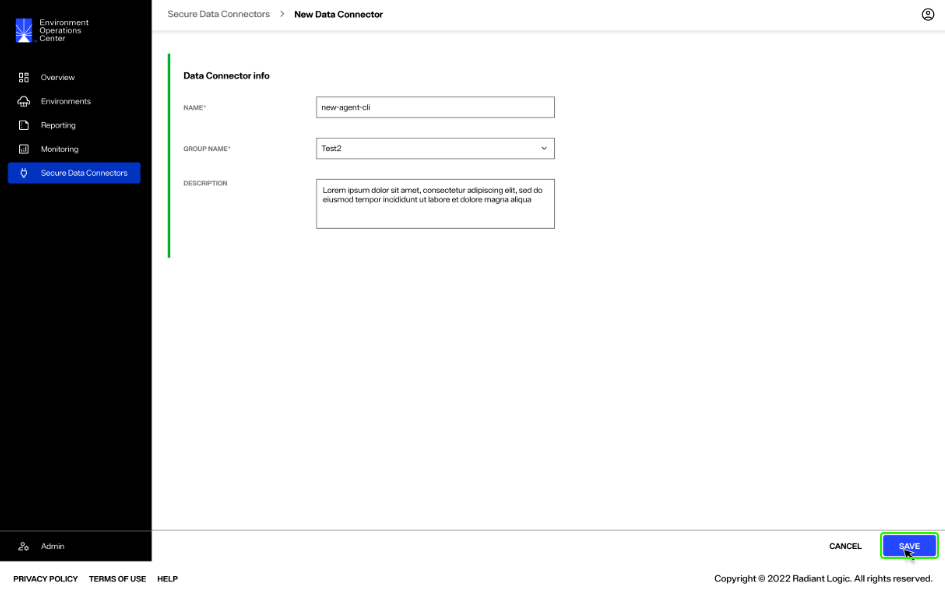
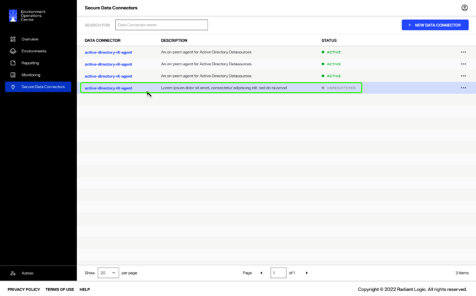
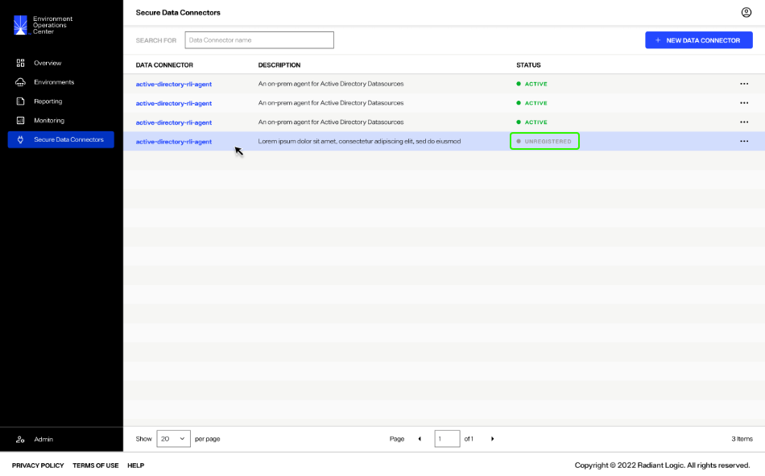
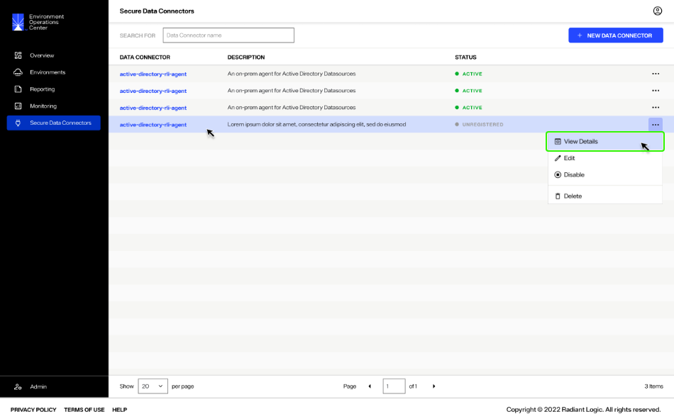
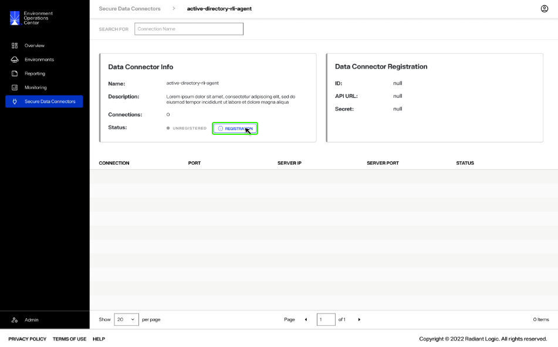
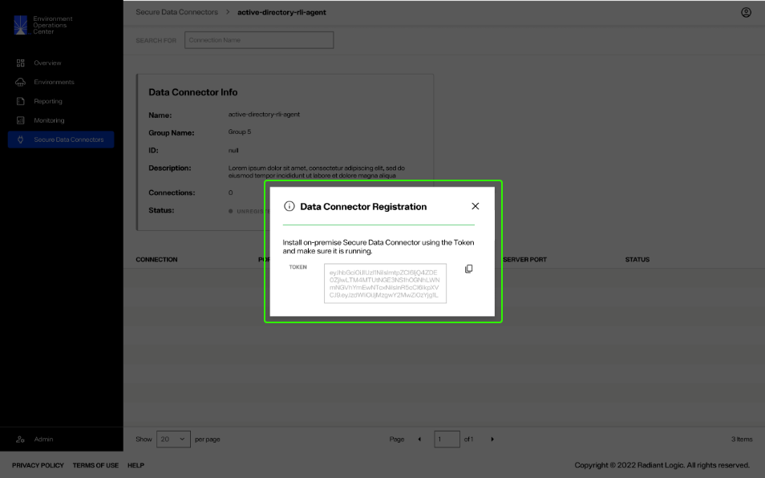
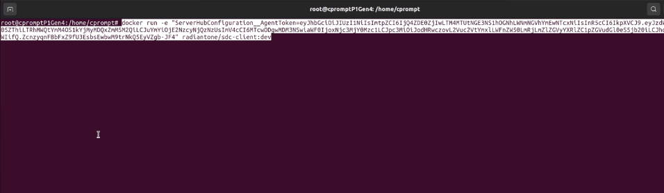
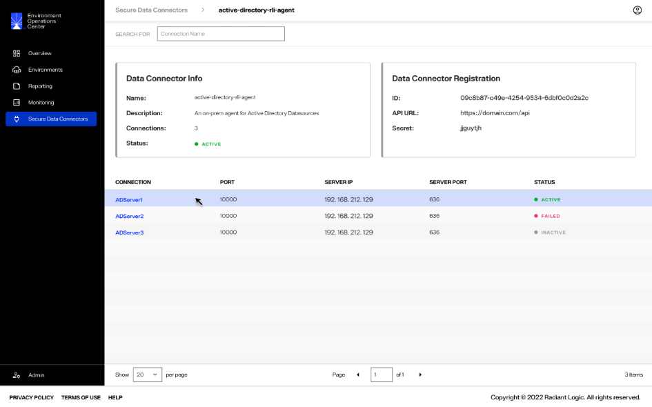

---
keywords:
title: Add a Data Connector
description: Add a data connector
---
# Add a Data Connector

The process to create a new secure data connector and configure it with data source requires the following high-level steps:

- The data connector must be created in Environment Operations Center.
- A connection must be established between the on-prem or cloud network and the Env Ops Center data connector.
- The data source must be defined in the FID Control Panel. 

This guide outlines the steps to add a new secure data connector in Environment Operations Center and to establish a connection with the on-prem network.

For details on configuring the application used to establish the connection between the network and data connector, see the [on-prem network configuration](...) guide.

For details on registering data sources in the FID Control Panel, see the [register a data source](...) guide.

## Getting started

To establish a connection between Env Ops Center and the on-prem network, a data connector must first be created in Env Ops Center. Then a connection must be established between the Env Ops Center data connector and the on-prem network using the provided token.

To add a new data connector, select **Add New Connector** from the *Secure Data Connectors* home screen.

## Add data connector info

In the *New Data Connector* dialog, enter the data connector information in the provided name, group, and description fields.

[!note] Name and Group are required fields and must be entered to create the connector.

| Data Connector Info | Description |
| ------------------- | ----------- |
| Name | Provide a name that is relevant to the network being connected to. |
| Group | A minimum of two data connectors should be created per network environment to form a group. Groups provide failover and load balancing for the network. The group field is an editable dropdown, so you can either select an existing group or add a new group. | 
| Description | The description field is optional but is recommended to provide any details that are relevant about the network. This helps with maintaining data connectors. |

Once you have completed the required fields in the *Data Connector Info* section, select **Save** to add the new connector.

If the data connector is successfully created, it will appear in the list of available data connectors on the *Secure Data Connectors* home screen.

## Establish a network connection

A connection needs to be established between a new data connector and the on-prem or cloud network for the connector to become active. The *Status* of a data connector indicates if the connector is "Active" or "Unregistered".

### Retrieve registration token

To activate a connector, select the connector name to open the connector details. Alternatively, you can also select **View Details** from the **Options** (**...**) dropdown menu to open the connector details.

In the *Data Connector Info* section the connector status will display as "Unregistered" and there will be no available connections. 

Next to the status in the *Data Connector Info* section select **Registration**.

This displays the steps and required token to establish the connection between the on-prem network and the data connector. Select the **Copy** () icon to copy the registration token.

[!note] Ensure the on-prem Docker container or standalone application have been configured before proceeding with the following steps. For details on configuration, see the [on-prem network configuration](...) guide.

### Register the connector on-prem

Open the command line of the data source to connect with the Env Ops Center secure data connector. Ensure the Docker container or standalone application run command with the token pasted into the appropriate location. Once you run the command it will take a moment for the on-prem network to connect with the data connector in Env Ops Center.

The following example demonstrates a Docker run command. 

Return to the **Secure Data Connectors** home page to confirm that the connection was made between the on-prem network and the data connector in Env Ops Center. If the connection was successfully established, the status of the data connector will update to "Active".

The connector details section will also display an "Active" status. The data connector is ready to accept data from on-prem data sources. For details on registering data sources in the FID control panel, see the [register a data source](...) guide.

## Next steps

You should now have an understanding of the steps to create a secure data connector in Environment Operations Center and establish a connection with an on-prem network. For details on managing data connectors, see the [manage data connectors](manage-data-connectors.md) guide. To learn how to register data sources to begin transferring data to the data connector, see the [register a data source](...) guide.
