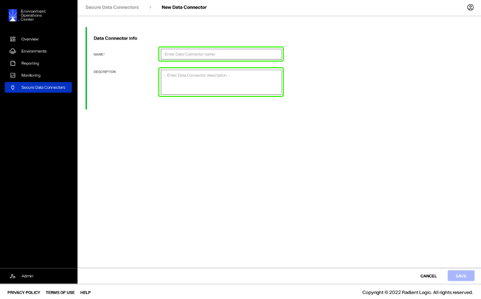
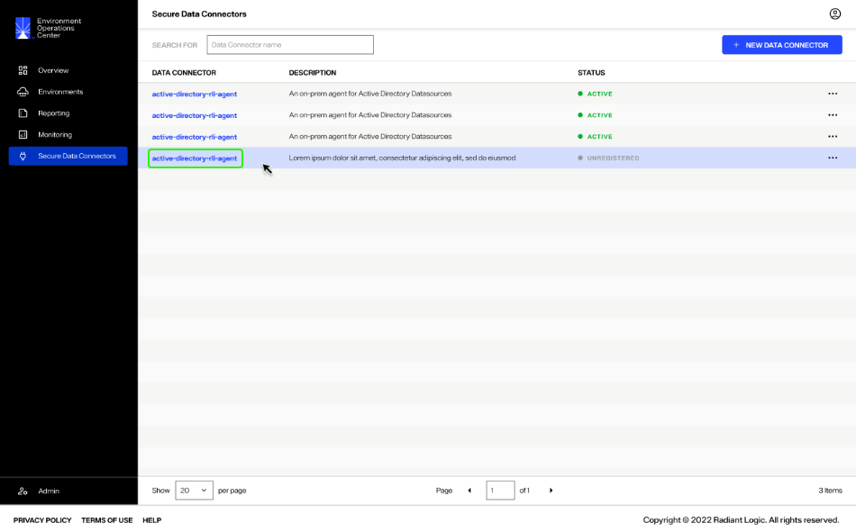

---
keywords:
title: Add a Data Connector
description: Add a data connector
---
# Add a Data Connector

This guide outlines the steps to add a new secure data connector in Environment Operations Center.

[!info] The steps outlined in this guide assume you have already configured the OPA client to establish the WebSocket tunnel between your on-prem environment and Env Ops Center. For details on how to configure the OPA client, see the [configure an OPA client](...) guide. **(update link when available)**

## Getting started

Adding a new data connector in Env Ops Center is broken out into two steps: Creating the data connector by providing its basic information and registering the data connector.

To add a new data connector, select **Add New Connector** from the *Secure Data Connectors* home screen.

## Add data connector info

In the *New Data Connector* dialog, enter the required data connector info in the provided name and a description fields.

> **RL QUESTION: waiting on confirmation re: name and description best practices**

Once you have completed the required fields in the *Data Connector Info* section, select **Save** to add the new connector.

If the data connector is successfully created, it will appear in the list of available data connectors on the *Secure Data Connectors* home screen.

## Data connector registration

A new data connector needs to be registered for it to become active. The status of a data connector indicates if the connector is "Active" or requires registration. A new connector that has not been registered will have an "Unregistered" status.

To register a connector, select the connector name to open the connector details.

Alternatively, you can also select **View Details** from the **Options** (**...**) dropdown menu to open the connector details.

In the *Data Connector Info** section the connector status will display as "Unregistered", the *Registration* details will display as "null", and there will be no available information for the connections. 

Next to the status in the *Data Connector Info* section select **Registration**.

This displays the steps and required token to register the data connector. Ensure the on-premise Secure Data Connector has been installed and is running. Register the connector using the provided URL and registration token. Both items can be copied manually, or a copy button is also provided next to each item.

Once you have completed the registration steps, the data connector status will update to "Active".

> **RL QUESTION: confirming details and time for registration/active status**

The connector details section will now display the registration and connections information for the data connection.

## Next steps

You should now have an understanding of the steps to add a secure data connector in Environment Operations Center. For details on managing data connectors, see the [manage data connectors](manage-data-connectors.md) guide.
