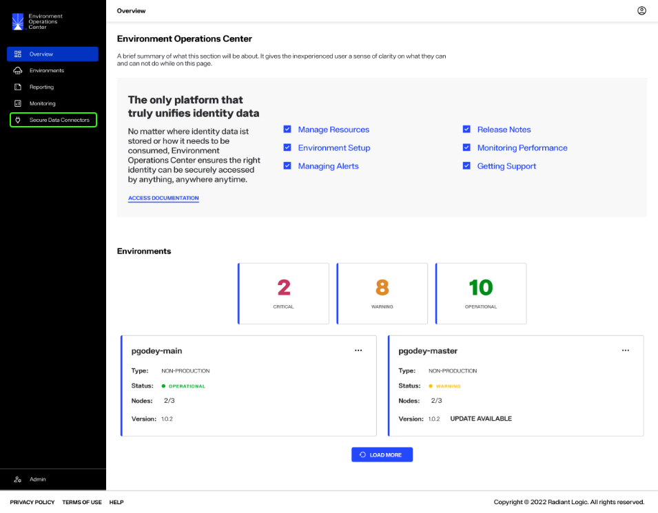
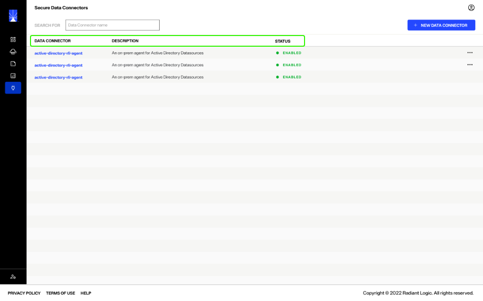
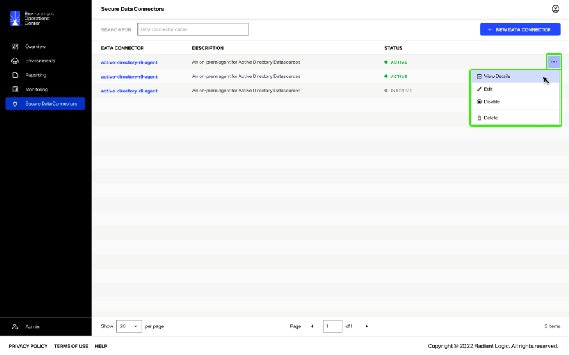
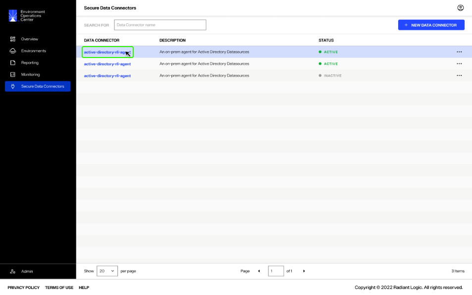
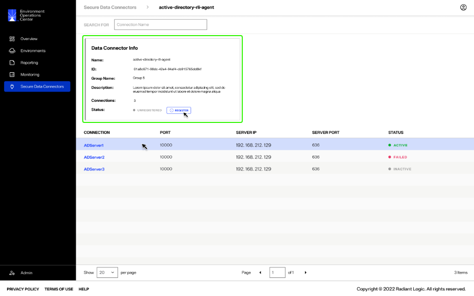
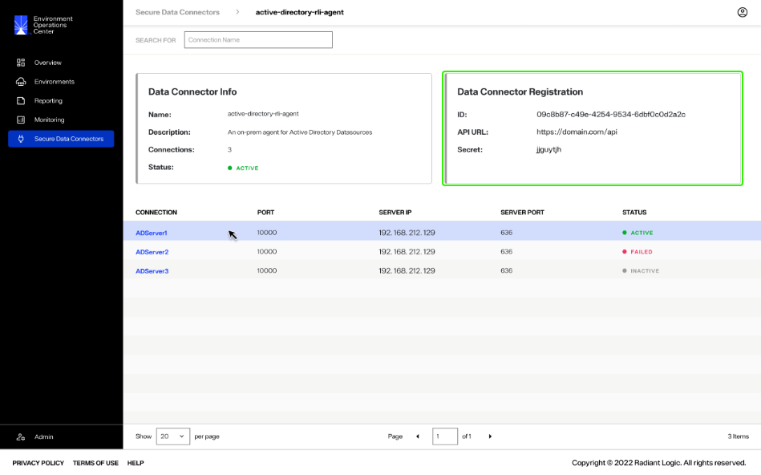
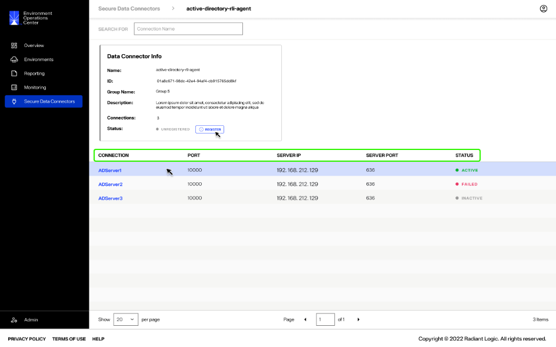

---
keywords:
title: Secure Data Connectors Overview
description: Secure data connectors overview
---
# Secure Data Connectors Overview

Secure data connectors are used to create secure connections between your RadiantOne on-premise control panels and Environment Operations Center. This allows Env Ops Center to register, configure, and monitor on-prem data connectors. This guide provides an overview of the *Secure Data Connectors* home screen and its features. 

## Getting started 

To navigate to the *Secure Data Connectors* home screen, select **Secure Data Connectors** () from the left navigation.

## Secure data connector screen

The *Secure Data Connector* home screen provides an overview of all your organization's configured data connectors and allows you to start the workflows to add and manage data connectors.

### New data connector

You can add data connectors from the *Secure Data Connector* tab by selecting the **New Data Connector** button. To learn how to add a data connector, see the [add a data connector](add-data-connector.md) guide.

### Review data connectors

All existing data connectors are listed on the *Secure Data Connector* home screen. The following information is included for each data connector:

> **RL QUESTION: waiting on best practices clarification from RL for the following**

- Data Connector:
- Description: 
- Status:

Each data connector has an **Options** (**...**) dropdown menu that allows you to manage the connector. For details on managing data connectors, see the [manage data connectors](manage-data-connectors.md) guide.

## Data connector details

A detailed view is available for all data connectors that provides further information including general details, registration, and connection statuses.

Data connector details can be accessed in two ways. You can select the data connector name.

Alternatively, you can select **View Details** from the **Options** (**...**) dropdown menu of the corresponding data connector.

### Data connector info

The *Data Connector Info* section in the data connector detailed view outlines the following information about the connector:

> **RL QUESTION: waiting on clarification from RL for the following**

- Name:
- Description:
- Connections:
- Status:

### Data connector registration

The *Data Connector Registration* section in the data connector detailed view outlines the following information about the connector:

> **RL QUESTION: waiting on clarification from RL for the following**

- ID:
- API URL:
- Secret: 

### Connection details

All of the connections made to the data connector are listed on the data connector details tab. The information listed for each connection includes:

> **RL QUESTION: waiting on clarification from RL for the following**

- Connection:
- Port:
- Server IP:
- Server Port:
- Status: 

## Next steps

After reading this guide you should be familiar with the features of the *Secure Data Connectors* screen. For details on adding a data connector, see the [add a data connector](add-data-connector.md) guide.

