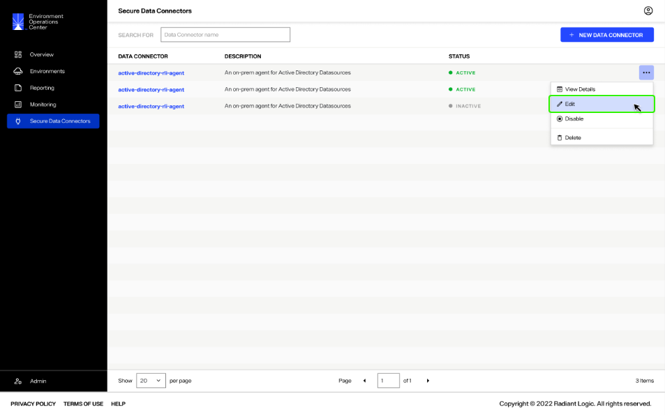
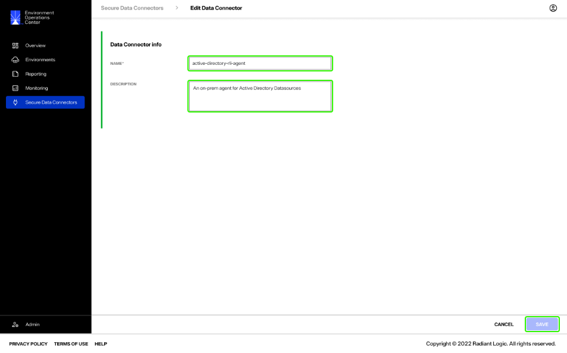
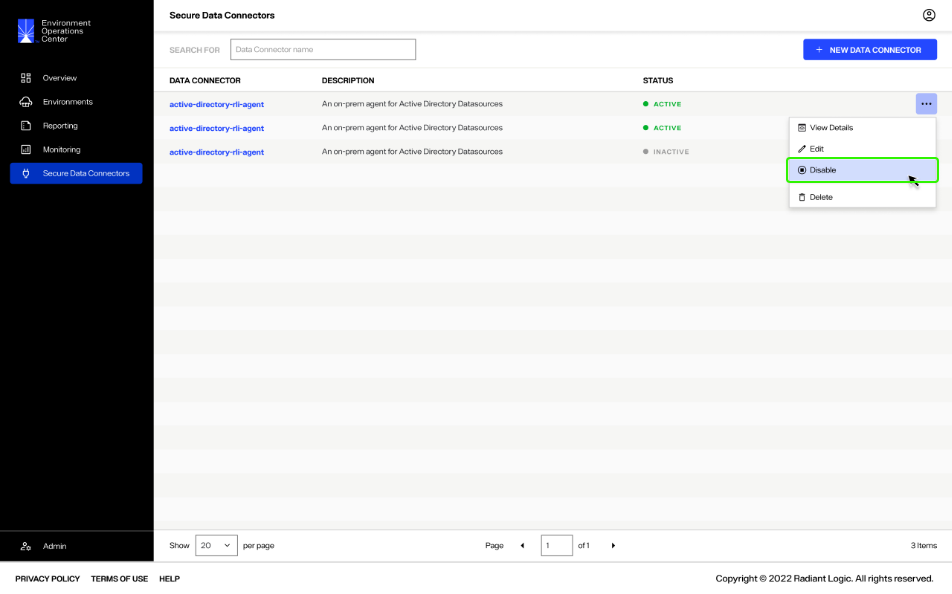
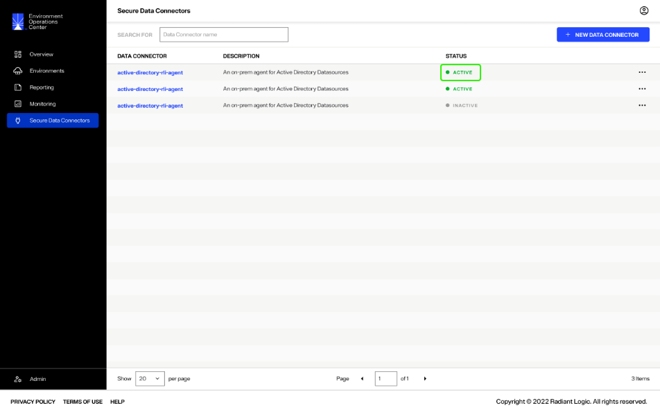
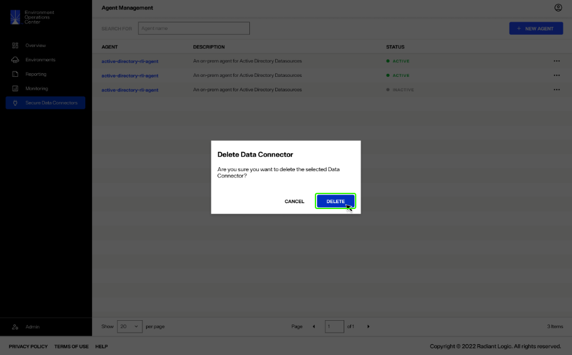
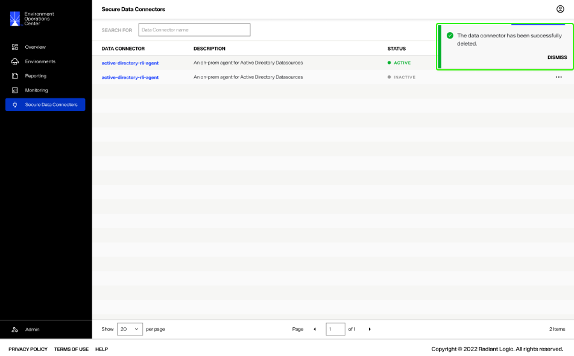

---
keywords:
title: Manage Data Connectors
description: Manage data connectors
---
# Manage Data Connectors

Secure data connectors can be managed from the *Secure Data Connectors* screen. From here, you can edit, enable or disable, and delete connectors. This guide outlines the steps to manage data connectors.

## Getting started

All of the operations to manage secure data connectors are available in the **Options** (**...**) dropdown for each connector. To begin managing a connector, select the **Options** (**...**) menu of specific connector you wish to modify.

**image**

## Edit a data connector

The name and description of a data connector can be updated. To edit connector details, select **Edit** from the associated **Options** (**...**) dropdown.

This opens the *Edit Data Connector** dialog. In the provided name and description fields, update the connector details as needed. Select **Save** to update the connector details.

The connector details will update on the *Secure Data Connectors* home screen and in the connector details section.

## Enable or disable a connector

To disable a data connector, select **Disable** from the **Options** (**...**) dropdown.

The connector status will update to "Inactive" and all associated connections will be disabled.

To reactivate a data connector, select **Enable** from the **Options** (**...**) dropdown.

The connector status will update to "Active" and all associated connections will be enabled.

## Delete a data connector

To delete a data connector, select **Delete** from the **Options** (**...**) dropdown.

[!warning] Deleting a data connector is a permanent action and cannot be undone.

A confirmation dialog will appear asking you to confirm that you would like to delete the selected data connector. Select **Delete** to proceed and delete the connector.

If you would like to keep the connector, select **Cancel** to exit out of the workflow to delete the connector.

If the connector is successfully delete, you will receive a confirmation message on the *Secure Data Connectors* home screen and the connector will no longer be available in the lits of connectors.

## Next steps

You should now have an understanding of the steps to edit, disable or enable, and delete secure data connectors from Environment Operations Center. For details on adding new data connectors, see the [add a new connector](add-data-connector.md) guide.
