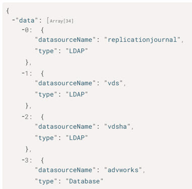

# Introduction

The tool used for configuring RadiantOne from command line is named vdsconfig.bat and located in <RLI_HOME>/bin on Windows (vdsconfig.sh in $RLI_HOME/bin on Linux). Each chapter explains the different commands along with their syntax.

## How this Manual is Organized

This guide is broken down into the following chapters:

[Introduction](01-introduction.md)
 This chapter offers a quick introduction to this guide in addition to how the manual is organized and how to contact Radiant Logic technical support.

[General Commands](02-general-commands.md)
 This chapter introduces the help and execfile commands.

[Global Configuration Commands](03-global-configuration-commands.md)
 This chapter explains how to display and set RadiantOne global configuration property values.

[Node Configuration Commands](04-node-configuration-commands.md)
 This chapter explains how to display and set RadiantOne cluster node configuration property values.

[Data Source Commands](05-data-source-commands.md)
 This chapter describes how to create and delete database and LDAP data sources. It also explains how to update and print data source information.

[Naming Context Commands](06-naming-context-commands.md)
 This chapter describes how to create persistent caches, naming contexts, proxy naming contexts, and backup images of Universal Directory (HDAP) stores. It also describes how to delete naming contexts and their caches.

[Tree Hierarchy Commands](07-tree-hierarchy-commands.md)
 This chapter explains how to manage node properties in a virtual tree.

[Object and Attribute Commands](08-object-and-attribute-commands.md)
 This chapter explains how to perform various object and attribute commands including joins and merged trees.

[Task Launch Commands](09-task-launch-commands.md)
 This chapter describes how to launch tasks to initialize a cache, a Universal Directory (HDAP) store from LDIF file, and export data from an LDAP data source to LDIF file.

[Naming Context Property Commands](10-naming-context-property-commands.md)
 This chapter explains how to display a list of accepted property names, and how to set, print, and remove the current value for a property.

[ACI Commands](11-aci-commands.md)
 This chapter describes access control commands and how to configure them.

[LDAP Schema Commands](12-ldap-schema-commands.md)
 This chapter covers publishing and removing an ORX’s schema from the RadiantOne LDAP schema.

[Password Policy Commands](13-password-policy-commands.md)
 This chapter explains how to add, update, and remove a password policy.

[Log Settings Commands](14-log-settings-commands.md)
 This chapter describes how to configure log settings.

[Monitoring and Alert Settings Commands](15-monitoring-and-alert-settings-commands.md)
 This chapter describes how to configure monitoring and alert settings.

[Migration Commands](16-migration-commands.md)
 This chapter explains how to migrate resources from an existing development/QA environment to an existing production environment.

[Security Commands](17-security-commands.md)
 This chapter explains how to define the attribute encryption cipher and key. Commands to add and remove client certificates and enable FIPS-mode are also discussed.

[ORX and DVX Commands](18-orx-and-dvx-commands.md)
 This chapter explains how to list existing orx and dvx files, and view and test the connection to the backend data source associated with the files.

[Search Commands](19-search-commands.md)
 This chapter explains how to search the RadiantOne namespace via command line.

[Real-time Persistent Cache Refresh Commands](20-real-time-persistent-cache-refresh-commands.md)
 This chapter explains how to configure real-time persistent cache refresh.

[Configuring Global Synchronization](21-global-sync-commands.md)
 This chapter explains how to configure the components used for global synchronization.

[Converting LDIF files to CSV](22-converting-ldif-files-to-csv.md)
 This chapter explains how to convert LDIF files to CSV.

## Configuring Command Output Format

Vdsconfig command output format is configured using operating system environment variables. These variables format command output (JSON, YAML, or tables), determine whether a command logs details of its progress, and limit log messages to a specific level. Create the environment variables and set each variable’s value as described in the table below.

>[!warning]
>To return legacy, plain-text command output, use vdsconfig72.bat (Windows), or vdsconfig72.sh (Linux). Vdsconfig72 is located in <RLI_HOME>/bin.   For information on formatting ADAP command responses, see the [Configuring ADAP Response Format section](#configuring-adap-response-format).

| Environment Variable | Allowable Values | Result
|---|---|---
RLI_CLI_FORMAT   Note – If this variable is not set, output displays in TABLE format (if supported). If the command does not support TABLE format, output defaults to JSON format. | JSON | Displays command output in JSON format.
| | YAML | Displays command output in YAML format.
RLI_CLI_VERBOSE | TRUE | The command log details of its progress. This is the default value.
| | FALSE | The command does not log details of its progress.
RLI_CLI_MIN_LOGLEVEL | - OFF  - FATAL  - ERROR  - WARN  - INFO  - DEBUG  - TRACE | Limits the log messages to messages above specified level. Defaults to INFO.   For more information on log levels, refer to the Logging and Troubleshooting Guide.

The following VDSConfig command categories do not currently support this configuration.

- Monitoring Alerts Configuration – these commands are a subset of the commands covered in [Security Commands](security-commands.md).
- [Migration Commands](migration-commands.md)
- [Security Commands](security-commands.md)

To return legacy plain text output for the commands, use vdsconfig72.bat (Windows), or vdsconfig72.sh (Linux). Vdsconfig72 is located in <RLI_HOME>/bin.

## Issuing Commands Through ADAP (RESTFul Web Service)

Most of the commands described in this guide can also be issued through the RadiantOne REST interface known as ADAP. The syntax of the URL is as follows.

`http://<hostname>:<port>/adap/util?action=vdsconfig&commandname=<commandname>&<
param>=<paramvalue>&<param>=<paramvalue>`

Results are returned in the response. A successful operation’s response contains an exit code value of 0 and a “systemOut” message. An unsuccessful operation’s response contains an exit code of 1 and a system error message. If a required parameter is missing from the URL, the response returns the following error.

`"SystemErr": "Parsing failed. Reason: Missing required option"`

Examples of ADAP requests follow the descriptions of the commands that support it in this guide.

## Configuring ADAP Response Format

By default, ADAP responses are formatted as shown below.

ADAP responses can be formatted as JSON, as shown below.

To format responses as shown above, set the RLI_CLI_FORMAT environment variable to JSON. Refer to the [Configuring Command Output Format](#configuring-command-output-format) section for more information. In the command, pass the outputmode argument with a value of JSON. An example is shown below.

`GET http://localhost:8089/adap/util?action=vdsconfig&commandname=list-properties&outputmode=json`

The following VDSConfig command categories do not currently support JSON formatting.

- Monitoring Alerts Configuration – these commands are a subset of the commands covered in [Monitoring and Alert Settings Commands](15-monitoring-and-alert-settings-commands.md).
- [Migration Commands](16-migration-commands.md)
- [Security Commands](17-security-commands.md)

### Basic Password Authentication

All REST (ADAP) operations require a header which is used to bind to the RadiantOne LDAP service. If this header is not populated, an HTTP status 403 results. The user that performs the bind must be a member of one of the following RadiantOne delegated admin groups:

- Directory Administrator
- Namespace Administrator
- Operator
- ICS Administrator

An example is shown below.

`Header name: Authorization`
 `Header value: Basic <username>:<password>`
 `Ex: Basic cn=directory manager:password`

>[!note] In the following image, the authentication header value is encoded.

## Expert Mode

Some settings in the Control Panel are accessible only in Expert Mode. To switch to Expert Mode, click the Logged in as, (username) drop-down menu and select Expert Mode.

>[!note] The Main Control Panel saves the last mode (Expert or Standard) it was in when you log out and returns to this mode automatically when you log back in. The mode is saved on a per-role basis.

## Require a UserID and Password to Execute Commands

By default, the commands available in the vdsconfig utility can be executed by anyone who can launch the utility and make the change, as tracked by Zookeeper, is logged as simply that the change was made from the command line utility. The only exception here is when the command is updating a property containing a password. In this context, the RadiantOne super user credentials are required. If you want to enforce that credentials are required to execute any command in the vdsconfig utility, add "enableVdsConfigAuth" : true to the vds_server.conf settings in Zookeeper. To change this setting:

1. From the Main Control Panel, switch to [Expert Mode](#expert-mode).
2. Go to the Zookeeper tab and navigate to /radiantone/<version>/<cluster_name>/config/vds_server.conf.
3. On the right, click **Edit Mode** and locate the enableVdsConfigAuth setting.
4. Change the value to true and click **Save**.
After enabling this setting, all commands require the -authuser flag and the -authpwdfile flag is
optional:

`- authuser (required)`

The userID (or DN) to execute the command. User must be assigned to one of the delegated administration roles that has privileges to perform the operation. For details on the delegated admin roles, see the System Administration Guide.

If the -authuser argument is used without the -authpwdfile argument, the command will interactively prompt the user to enter a bind password. If the -authuser argument is used with the -authpwdfile argument, the password will be retrieved from the file specified in -authpwdfile.

`- authpwdfile (optional)`

The password associated with the -authuser. Save the password for the userID used in the

- authuser flag into a text file (either in cleartext or encoded) and then pass the full path to this file in the -authpwdfile flag. To store the password encoded, use the <RLI_HOME>/bin/VDSUtility option #9 to get the encoded value of your password and then copy it into the file. On Linux platforms, the utility is located at:
$RLI_HOME/bin/advanced/runVDSUtility

### REST (ADAP) Example

In the following example, a request is made to display product information passing the command arguments described above.

`https://<rli_server_name>:8090/adap/util?action=vdsconfig&commandname=product-info&authuser=operator&authpwdfile=C:\radiantone\vds\password.txt`

>[!note] When passing the authuser and authpwdfile command arguments, basic password authentication is still required. See [Basic Password Authentication](#basic-password-authentication) for more information.

## Parsing Command Argument Strings

Some command arguments use quote marks as part of their value. For example, setting a computed expression value often requires double quotes. Most command line tools and Linux shells interpret quote marks as special characters. This can make setting command values challenging, and often requires the use of multiple escape characters.

To simplify this and avoid escape characters, you can use the special notations below when you want to include quote marks as part of any command argument value.

&quot; indicates double quotes. This can be useful, for example, when defining computed expressions. In the following example, the “ character is interpreted by the shell/command line and is not included as part of the value for the command argument.

The &quot; notation is replaced at runtime by a double quote character and is included as part of the actual value for the command argument. Note that the use of notated quote marks does not preclude the use of quote marks in the same command.

`add-ldap-primary-attr - name testattr -namingcontext o=companyprofiles -primaryobject inetOrgPerson -source Computed -computedexpr "testattr=&quot;this is a test attribute&quot;"`

`&apos;` indicates single quotes. In this example, both single and double quotes are notated.

`update-ldap-primary-attr -name testattr -namingcontext o=companyprofiles -primaryobject inetOrgPerson -source Computed -computedexpr "testattr=&quot;this is a &apos;testattribute&apos;&quot;"`

These special notations should be used only when indicating quotes as part of the value for your argument, and they also work when used as described in the [execfile](general-commands.md#execfile) command.

>[!note] These notations are not compatible with operations issued through a REST (ADAP) interface.

## Audit Log

Configuration commands issued using the vdsconfig utility can be logged. To enable logging of configuration requests, navigate to <RLI_HOME>/config/advanced and edit features.properties. Set vdsconfig.logging.enabled=true. Restart the RadiantOne service. If deployed in a cluster, restart it on all nodes. The log settings are initialized from <RLI_HOME>/config/logging/log4j2-vdsconfig.json

The default audit log is <RLI_HOME>/logs/vdsconfig.log.

>[!warning] If you want the admin name that issued the command logged, make sure you [Require a UserID and Password to Execute Commands](#require-a-userid-and-password-to-execute-commands).

## Technical Support

Before contacting Customer Support, please make sure you have the following information:

- Version of RadiantOne.
- Type of computer you are using including operating system.
- The license number for your software.
- A description of your problem including error numbers if appropriate.

Technical support can be reached using any of the following options:

- E-mail: support@radiantlogic.com
- Website: https://support.radiantlogic.com
