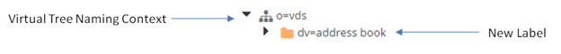
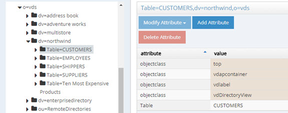

# Chapter 7: Tree Hierarchy Commands

This chapter explains how to manage node properties in a virtual tree using the <RLI_HOME>/bin/vdsconfig utility.

After creating a new virtual tree type of naming context, you can create “sub-containers” with the new-label command. After the new label is created, you can mount different types of backends at these labels (using the [naming context commands](06-naming-context-commands.md)). An example is shown below.



## new-label

This command creates a new label node in a virtual tree hierarchy.

**Usage:**
<br>`new-label -parentdn <parentdn> -rdn <rdn> [-instance <instance>] [-objectclass <objectclass>]`

Command Arguments:

**`- parentdn <parentdn>`**
<br>[required] The DN of the parent of the new label.

**`- rdn <rdn>`**
<br>[required] The RDN name and value of the new label. E.g. ou=Groups

**`- instance <instance>`**
<br>The name of the RadiantOne instance. If this is not specified, the default instance named vds_server is used.

**`- objectclass <objectclass>`**
<br>The objectclass for the new label. Use the # character as a separator for multiple objectclasses. Example: top # person # inetOrgPerson

**REST (ADAP) Example**
In the following example, a request is made to create a new label named ou=Groups under o=vds.

```
https://<rli_server_name>:8090/adap/util?action=vdsconfig&commandname=new-label&parentdn=o=vds&rdn=ou=Groups
```

## delete-label

This command deletes an existing label node in a virtual tree hierarchy.

**Usage:**
<br>`delete-label -dn <dn> [-instance <instance>]`

**Command Arguments:**

**`- dn <dn>`**
[required] The full DN of the existing label node to delete.

**`- instance <instance>`**
<br>The name of the RadiantOne instance. If this is not specified, the default instance named vds_server is used.

**REST (ADAP) Example**
In the following example, a request is made to delete the label ou=Groups (located under o=vds).

```
https://<rli_server_name>:8090/adap/util?action=vdsconfig&commandname=delete-
label&dn=ou=Groups,o=vds
```

## list-node-property

This command displays a list of all properties/values for the specified virtual node.

**Usage:**
<br> `list-node-property -dn <dn> [-instance <instance>]`

Command Arguments:

**`- dn <dn>`**
<br>[required argument] The DN of the node.

**`- instance <instance>`**
<br>The name of the RadiantOne instance. If this is not specified, the default instance named vds_server is used.

**REST (ADAP) Example**
In the following example, a request is made to display a list of all properties for ou=groups,o=vds.

```
https://<rli_server_name>:8090/adap/util?action=vdsconfig&commandname=list-node-property&dn=ou=Groups,o=vds
```

## get-node-property

This command displays the current value of a property of a specified node.

IMPORTANT NOTE – The value of -prop is case sensitive. You can use the list-node-property command to get a list of property values that you can pass in -prop. Use the exact case shown for the property (e.g. OutputColumns not outputcolumns).

**Usage:**
<br>`get-node-property -dn <dn> -prop <prop> [-instance <instance>]`

**Command Arguments:**

**`- dn <dn>`**
<br>[required argument] The DN of the node.

**`- prop <prop>`**
<br>[required argument] The name of the property to get. Use list-node-property to get the list of available property names to use. This value is case sensitive.

**`- instance <instance>`**
<br>The name of the RadiantOne instance. If this is not specified, the default instance named vds_server is used.

### Examples

Assume a virtual view named northwind2 (dv=northwind2) created in Context Builder has been mounted in the virtual namespace below o=vds. The output columns defined for the EMPLOYEES container can be seen in Context Builder on the Attributes tab as shown below.


To get these columns with the get-node-property command, you would use the following:

C:\radiantone\vds\bin>vdsconfig.bat get-node-property -dn employees,dv=northwind2,o=vds -prop OutputColumns

```
Using RLI home : C:\radiantone\vds
Using Java home : C:\radiantone\vds\jdk\jre
Loading module BASICS
2018 - 04 - 06 15:40:47 INFO c.r.s.s.LDAPServerParameter:2299 - ... Building MetaTree
2018 - 04 - 06 15:40:49 INFO c.r.s.s.LDAPServerParameter:2310 - ... MetaTree built
2018 - 04 - 06 15:40:53 INFO c.r.s.s.LDAPServerParameter:2294 - ... Re-building MetaTree
2018 - 04 - 06 15:40:54 INFO c.r.s.s.LDAPServerParameter:2310 - ... MetaTree built
OutputColumns=[EMPLOYEEID:INTEGER],[LASTNAME:VARCHAR(255)],[FIRSTNAME:V
ARCHAR(255)],[TITLE:VARCHAR(255)],[TITLEOFCOURTESY:VARCHAR(255)],[BIRTHDA
TE:TIMESTAMP],[HIREDATE:TIMESTAMP],[ADDRESS:VARCHAR(255)],[CITY:VARCHAR
(255)],[REGION:VARCHAR(255)],[POSTALCODE:VARCHAR(255)],[COUNTRY:VARCHAR
(255)],[HOMEPHONE:VARCHAR(255)],[EXTENSION:VARCHAR(255)],[PHOTO:BLOB(104
8576)],[NOTES:VARCHAR(255)],[REPORTSTO:INTEGER]
```
The objectclass defined for the EMPLOYEES container on the Advanced Settings tab as shown below.


To get this property with the get-node-property command, you would use the following:

C:\radiantone\vds\bin>vdsconfig.bat get-node-property -dn employees,dv=northwind2,o=vds -prop Class

```
Using RLI home : C:\radiantone\vds
Using Java home : C:\radiantone\vds\jdk\jre
Loading module BASICS
2018 - 04 - 06 15:43:34 INFO c.r.s.s.LDAPServerParameter:2299 - ... Building MetaTree
2018 - 04 - 06 15:43:35 INFO c.r.s.s.LDAPServerParameter:2310 - ... MetaTree built
2018 - 04 - 06 15:43:39 INFO c.r.s.s.LDAPServerParameter:2294 - ... Re-building MetaTree
2018 - 04 - 06 15:43:40 INFO c.r.s.s.LDAPServerParameter:2310 - ... MetaTree built
Class=vdAPPEMPLOYEES
```
REST (ADAP) Example
In the following example, a request is made to display the value for the Name property.

```
https://<rli_server_name>:8090/adap/util?action=vdsconfig&commandname=get-node-property&dn= employees,dv=northwind2,o=vds&prop=Name
```
The response is shown below. The \r\n in the SystemOut represents a carriage return/line feed. The value of the Name property is EMPLOYEES.

```sh
"result": {
"Exitcode": 0,
"SystemOut": "[Thursday, 25 Oct 2018 16:14:14 PDT]\r\nName=EMPLOYEES"
}
}
```

## set-node-property

This command sets the value of a given property of a specified node. Setting node property values with this command should be done with extreme caution as the syntax of the properties is very specific and editing them manually is prone to error. It is highly recommended that setting node properties in this manner is done only if advised and guided by the Radiant Logic support team.

><span style="color:red">**IMPORTANT NOTE – This command should not be used to modify RDNs. To modify an RDN, use the set-node-rdn command.**

**Usage:**
<br>`set-node-property -dn <dn> -prop <prop> -value <value> [-instance <instance>]`

Command Arguments:

**`- dn <dn>`**
<br>[required argument] The DN of the node.

**`- prop <prop>`**
<br>[required argument] The name of the property to set.

**`- value <value>`**
<br>[required argument] The value of the property to set.

**`- instance <instance>`**
<br>The name of the RadiantOne instance. If this is not specified, the default instance named vds_server is used.

## get-node-interception

This command gets the values configured for an interception script on a specified node (defined as a container or content).

An example of a virtual view configured for an interception script is shown below.


Based on the screen shot above, the command to get the configured interception is as follows (the address book virtual view is mounted in the virtual namespace below the o=vds root naming context):

```
C:\radiantone\vds\bin>vdsconfig.bat get-node-interception -dn "CN,dv=address book,o=vds"
```

The result is the following:

```
On Bind=true
On Search=false
On Modify=true
On Delete=false
On Add=true
On Search Result Entry Processing=false
On Compare=false
On Special Operations(invoke)=false
Script path=C:\radiantone\vds\vds_server\custom\src\com\rli\scripts\intercept\AddressBook.java (file currently exists)
```

**Usage:**
K<br>`get-node-interception -dn <dn> [-instance <instance>]`

**Command Arguments:**

**`- dn <dn>`**
<br>[required argument] The DN of the node. Be sure to use the syntax based on the model of the view, similar to the example shown above.

**`- instance <instance>`**
<br>The name of the RadiantOne instance. If this is not specified, the default instance named vds_server is used.

**REST (ADAP) Example**
In the following example, a request is made to display the values configured for an interception script.

```
https://<rli_server_name>:8090/adap/util?action=vdsconfig&commandname=get-node-interception&dn=CN,dv=address book,o=vds
```
## set-node-interception

This command sets the value for an interception script on a specified node (defined as a container or content). Setting node property values with this command should be done with extreme caution as the syntax of the properties is very specific and editing them manually is prone to error. It is highly recommended that setting node properties in this manner is done only if advised and guided by the Radiant Logic support team.

The first time you use set-node-interception, a default interception script matching your virtual view is generated in <RLI_HOME>\vds_server\custom\src\com\rli\scripts\intercept. You can always get the full path to the java file with get-node-interception.

After editing the Java file, the intercept.jar file must be rebuilt and the RadiantOne service must be restarted for the script to take effect. If deployed in a cluster, restart it on all nodes.

**Usage:**
`set-node-interception -dn <dn> [-add <true/false>] [-bind <true/false] [-search <true/false>]
[-modify <true/false>] [-delete <true/false>] [-srep <true/false>] [-instance <instance>]`

An example of setting interception is as follows:

```
C:\radiantone\vds\bin>vdsconfig.bat set-node-interception -dn "CN,dv=address book,o=vds -
search true -bind false -modify true -delete true -add true
```

**Command Arguments:**

**`- dn <dn>`**
<br>[required argument] The DN of the node.

**`- add <true/false>`**
<br>A value of true indicates interception on add (insert) operations is enabled. A value of false means it is not enabled.

**`- delete <true/false>`**
<br>A value of true indicates interception on delete operations is enabled. A value of false means it is not enabled.

**`- bind <true/false>`**
<br>A value of true indicates interception on bin (authentication) operations is enabled. A value of false means it is not enabled.

**`- search <true/false>`**
<br>A value of true indicates interception on search (select) operations is enabled. A value of false means it is not enabled.

**`- modify <true/false>`**
<br>A value of true indicates interception on modify (update) operations is enabled. A value of false
means it is not enabled.

**`- srep <true/false>`**
<br>A value of true indicates interception on search result entry processing (process result) operations is enabled. A value of false means it is not enabled.

**`- instance <instance>
<br>The name of the RadiantOne instance. If this is not specified, the default instance named vds_server is used.

**REST (ADAP) Example**

In the following example, a request is made to enable an interception script for search, modify, delete and add operations.

```
https://<rli_server_name>:8090/adap/util?action=vdsconfig&commandname=set-node-interception&dn=CN,dv=address book,o=vds&search=true&bind=false&modify=true&delete=true&add=true
```
## set-node-rdn

This command sets the RDN attribute name/value of the specified node.

**Usage:**
`set-node-rdn -dn <dn> [-rdn <rdn>] [-instance <instance>] [-value <value>]`

**Command Arguments:**

**`- dn <dn>`**
<br>[required argument] The DN of the node.

**`- rdn <rdn>`**
<br>The RDN attribute name for the node.

`**- instance <instance>`**
<br>The name of the RadiantOne instance. If this is not specified, the default instance named vds_server is used.

**`- value <value>`**
<br>The RDN attribute value for the node.

### Examples

#### Modifying an RDN Name Only

Assume a virtual view named hr (ou=hr) has been mounted in the virtual namespace below o=examples. The entries have an RDN of HR, as shown below.


The following example command changes the RDN of these entries to NEWHR.

```
vdsconfig.bat set-node-rdn -dn HR=*,ou=hr,o=examples -rdn NEWHR
```
The command processor displays the following at the end of successful completion of the
command.

```
2017 - 10 - 20 16:03:41 INFO c.r.s.s.LDAPServerParameter:2299 - ... Building MetaTree
2017 - 10 - 20 16:03:42 INFO c.r.s.s.LDAPServerParameter:2310 - ... MetaTree built
2017 - 10 - 20 16:03:44 INFO c.r.s.s.LDAPServerParameter:2294 - ... Re-building MetaTree
2017 - 10 - 20 16:03:45 INFO c.r.s.s.LDAPServerParameter:2310 - ... MetaTree built
2017 - 10 - 20 16:03:46 INFO c.r.c.b.ConfigVersioningService:151 - Saving up configuration
file /radiantone/v1/cluster/config/dvx/ou_hr_o_examples.dvx to /radiantone/v1/cluster/config-versioning/config/d
vx/ou_hr_o_examples.dvx/196/DATA
The RDN attribute name has been modified.
```


**REST (ADAP) Example**

In the following example, a request is made to set the RDN name of a node under o=examples.

```
https://<rli_server_name>:8090/adap/util?action=vdsconfig&commandname=set-node-rdn&dn=HR=*,ou=hr,o=examples&rdn=NEWHR
```

#### Modifying an RDN Name and Value

Assume a table called “CUSTOMERS” exists below dv=northwind,o=vds.



The following example command changes the RDN this table to ou=sales.

```
vdsconfig.bat set-node-rdn -dn Table=CUSTOMERS,dv=northwind,o=vds -rdn ou -value sales
```
The command processor displays the following at the end of successful completion of the command.

```
2018 - 05 - 07 16:35:41 INFO c.r.s.s.LDAPServerParameter:2274 - ... Building MetaTree
2018 - 05 - 07 16:35:41 INFO c.r.s.s.LDAPServerParameter:2285 - ... MetaTree built
2018 - 05 - 07 16:35:42 INFO c.r.s.s.LDAPServerParameter:2269 - ... Re-building MetaTree
2018 - 05 - 07 16:35:42 INFO c.r.s.s.LDAPServerParameter:2285 - ... MetaTree built
2018 - 05 - 07 16:35:43 INFO c.r.s.s.LDAPServerParameter:2269 - ... Re-building MetaTree
2018 - 05 - 07 16:35:43 INFO c.r.s.s.LDAPServerParameter:2285 - ... MetaTree built
The RDN has been modified for the label node.
```