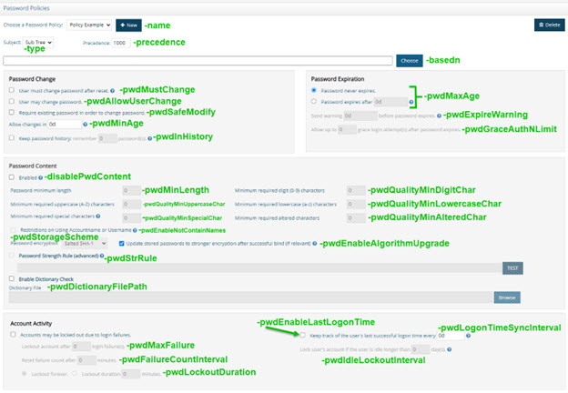

# Password Policy Commands

Password policies are managed from the Main Control Panel, Settings tab, Security section, Password Policies, and can also be managed from command line using the <RLI_HOME>/bin/vdsconfig utility.

This chapter explains how to add, update, and remove a password policy using the <RLI_HOME>/bin/vdsconfig utility instead of the GUI mentioned above.

## print-pwd-policy

This command prints the current settings for a given password policy.

**Usage:**
 `print-pwd-policy -name <name> [-instance <instance>]`

**Command Arguments:**

`- name <name>`
 [required] The password policy name. Use the value 'default' to refer to the default password policy.

`- instance <instance>`
 The name of the RadiantOne instance. If not specified, the default instance named vds_server is used.

**REST (ADAP) Example**
In the following example, a request is made to display the settings for the default password policy.

`https://<rli_server_name>:8090/adap/util?action=vdsconfig&commandname=print-pwd-policy&name=default`

## add-pwd-policy

This command adds a new custom password policy.

**Usage:**
 `add-pwd-policy -basedn <basedn> -name <name> -type <type> [-instance <instance>] [-precedence <precedence>] [-pwdAllowUserChange <pwdAllowUserChange>] [-pwdDictionaryFilePath <pwdDictionaryFilePath>] [-pwdEnableAlgorithmUpgrade <pwdEnableAlgorithmUpgrade>] [-pwdEnableLastLogonTime <pwdEnableLastLogonTime>] [-pwdEnableNotContainNames <pwdEnableNotContainNames>] [-pwdExpireWarning <pwdExpireWarning>] [-pwdFailureCountInterval <pwdFailureCountInterval>] [-pwdGraceAuthNLimit <pwdGraceAuthNLimit>] [-pwdIdleLockoutInterval <pwdIdleLockoutInterval>] [-pwdInHistory <pwdInHistory>] [-pwdLockoutDuration <pwdLockoutDuration>] [-pwdLogonTimeSyncInterval <pwdLogonTimeSyncInterval>] [-pwdMaxAge <pwdMaxAge>] [-pwdMaxFailure <pwdMaxFailure>] [-pwdMinAge <pwdMinAge>] [-pwdMinLength <pwdMinLength>] [-pwdMustChange <pwdMustChange>] [-pwdQualityMinAlteredChar <pwdQualityMinAlteredChar>] [-pwdQualityMinDigitChar <pwdQualityMinDigitChar>] [-pwdQualityMinLowercaseChar <pwdQualityMinLowercaseChar>] [-pwdQualityMinSpecialChar <pwdQualityMinSpecialChar>] [-pwdQualityMinUppercaseChar <pwdQualityMinUppercaseChar>] [-pwdSafeModify <pwdSafeModify>] [-pwdStorageScheme <pwdStorageScheme>] [pwdStrRule <pwdStrRule>]`

**Command Arguments:**

`- basedn <basedn>`
 [required] The base DN for the subject of the password policy.

`- name <name>`
 [required] The password policy name. Use the value 'default' to update the default password policy.

`- type <type>`
 [required] The type of subject. Accepted values are: group, subtree

`- instance <instance>`
 The name of the RadiantOne instance. If not specified, the default instance named vds_server is used.

`- precedence <precedence>`
 The precedence, used to resolve conflicts between password policies. A lower precedence value indicates a higher priority. The highest precedence is 1 and the lowest is 1000. The default value is 1000.

`- pwdAllowUserChange <pwdAllowUserChange>`
 Indicates whether users can change their own passwords. Accepted values: true, false. Default value is true.

`- pwdDictionaryFilePath <pwdDictionaryFilePath>`
 Indicates the path to the dictionary file that RadiantOne should use to verify user passwords don’t contain unallowed strings.

`- pwdEnableAlgorithmUpgrade <pwdEnableAlgorithmUpgrade>`
 If enabled, user accounts that contain a password encryption with a less secure method than the one set for the current password policy are automatically updated to the stronger encryption after a successful bind.

`- pwdEnableLastLogonTime <pwdEnableLastLogonTime>`
 Indicates if the policy should keep track of the user’s last successful logon time. Accepted values: true, false. Default value is false.

`- pwdEnableNotContainNames <pwdEnableNotContainNames>`
 The password must not contain the user's account name or parts of the user's full name.

`- pwdExpireWarning <pwdExpireWarning>`
 Used to send a warning, this argument allows a user to set the amount of time before the password expires to send a warning. Default is 0 (no warnings). You can indicate the length of time in any combination of days, hours and/or minutes using “d” for days (e.g. 1d), “h” for hours (e.g. 4h), and “m” for minutes (e.g. 5m).

`- pwdFailureCountInterval <pwdFailureCountInterval>`
 The number of minutes after which the failure count is reset. The default is 0.

`- pwdGraceAuthNLimit <pwdGraceAuthNLimit>`
 The number of grace login attempt(s) allowed after the password expires. Default is 0.

`- pwdIdleLockoutInterval <pwdIdleLockoutInterval>`
 The number of day(s) that a user is allowed to be idle before his account is locked. Default value is 0. Note: the -pwdEnableLastLogonTime option must have been set to true for this parameter to be taken into account.

`- pwdInHistory <pwdInHistory>`
 The maximum number of used passwords to keep in the 'pwdHistory' attribute. Default is 0.

`- pwdLockoutDuration <pwdLockoutDuration>`
 The number of minutes that an account is locked out for. 0 indicates permanent lockout. The default is 0.

`- pwdLogonTimeSyncInterval <pwdLogonTimeSyncInterval>`
 The frequency at which the time of the last successful authentication is recorded.

`- pwdMaxAge <pwdMaxAge>`
 The amount of time after which the password expires. Default is 0 (password never expires). You can indicate the length of time in any combination of days, hours and/or minutes using “d” for days (e.g. 1d), “h” for hours (e.g. 4h), and “m” for minutes (e.g. 5m). A value of 1d would indicate a maximum password age of 1 day.

`- pwdMaxFailure <pwdMaxFailure>`
 The maximum number of login failures to allow, before lockout occurs. The default is 0.

`- pwdMinAge <pwdMinAge>`
 The amount of time that must elapse between modifications to the password. Default is 0 (meaning no limit is enforced). You can indicate the length of time in any combination of days, hours and/or minutes using “d” for days (e.g. 1d), “h” for hours (e.g. 4h), and “m” for minutes (e.g. 5m).

`- pwdMinLength <pwdMinLength>`
 The minimum number of characters that must be used in a password. Default is 0.

`- pwdMustChange <pwdMustChange>`
 Indicates if users must change their passwords when they first bind to the directory after their password has been reset by an administrator. Accepted values: true, false. Default value is false.

`[-pwdQualityMinAlteredChar <pwdQualityMinAlteredChar>]`
 The minimum number of characters that must be changed when a new password is set.

`- pwdQualityMinDigitChar <pwdQualityMinDigitChar>`
 The minimum number of numerical characters required in passwords. Default is 0.

`- pwdQualityMinLowercaseChar <pwdQualityMinLowercaseChar>`
 The minimum number of lower-case characters (a-z) required in passwords. Default is 0.

`- pwdQualityMinSpecialChar <pwdQualityMinSpecialChar>`
 The minimum number of special characters (non-alphanumeric 7 - bit ASCII) required in passwords. Default is 0.

`- pwdQualityMinUppercaseChar <pwdQualityMinUppercaseChar>`
 The minimum number of upper-case characters (A-Z) required in passwords. Default is 0.

`- pwdSafeModify <pwdSafeModify>`
 Indicates whether the existing password must be sent along with the new password when being changed. Accepted values: true, false. Default value is false.

`- pwdStorageScheme <pwdStorageScheme>`
 The method of password encryption. Accepted values are integers from 1-7. The following is the list of accepted encryption methods:
> 1. Clear
> 2. MD4
> 3. PBKDF2AD
> 4. Salted SHA-1
> 5. Salted SHA-256
> 6. Salted SHA-384
> 7. Salted SHA-512

`- pwdStrRule <pwdStrRule>`
 The rule for the password strength, expressed as a regular expression pattern. If there is a value for this property and you want to disable it, set the value to an empty string: “”

**REST (ADAP) Example**

In the following example, a request is made to create a password policy for o=companyprofiles.

`https://<rli_server_name>:8090/adap/util?action=vdsconfig&commandname=add-pwd-policy&basedn=o=companyprofiles&type=subtree&pwdAllowUserChange=true&pwdMaxAge=5d&pwdExpireWarning=2d12h&pwdMinLength=8&pwdMustChange=true&name=companyprofilesPwdPolicy`

## update-pwd-policy

This command updates an existing password policy.

**Usage:**
 `update-pwd-policy -name <name> [-basedn <basedn>] [-disablePwdContent] [-instance <instance>] [-precedence <precedence>] [-pwdAllowUserChange <pwdAllowUserChange>] [-pwdDictionaryFilePath <pwdDictionaryFilePath>] [-pwdEnableAlgorithmUpgrade <pwdEnableAlgorithmUpgrade>] [-pwdEnableLastLogonTime <pwdEnableLastLogonTime>] [-pwdEnableNotContainNames <pwdEnableNotContainNames>] [-pwdExpireWarning <pwdExpireWarning>] [-pwdFailureCountInterval <pwdFailureCountInterval>] [-pwdGraceAuthNLimit <pwdGraceAuthNLimit>] [-pwdIdleLockoutInterval <pwdIdleLockoutInterval>] [-pwdInHistory <pwdInHistory>] [-pwdLockoutDuration <pwdLockoutDuration>] [-pwdLogonTimeSyncInterval <pwdLogonTimeSyncInterval>] [-pwdMaxAge <pwdMaxAge>] [-pwdMaxFailure <pwdMaxFailure>] [-pwdMinAge <pwdMinAge>] [-pwdMinLength <pwdMinLength>] [-pwdMustChange <pwdMustChange>] [-pwdQualityMinAlteredChar <pwdQualityMinAlteredChar>] [-pwdQualityMinDigitChar <pwdQualityMinDigitChar>] [-pwdQualityMinLowercaseChar <pwdQualityMinLowercaseChar>] [-pwdQualityMinSpecialChar <pwdQualityMinSpecialChar>] [-pwdQualityMinUppercaseChar <pwdQualityMinUppercaseChar>] [-pwdSafeModify <pwdSafeModify>] [-pwdStorageScheme <pwdStorageScheme>] [pwdStrRule <pwdStrRule>] [-type <type>]`

**Command Arguments:**

`- name <name>`
 [required] The password policy name. Use the value 'default' to update the default password policy.

`- basedn <basedn>`
 The base DN for the subject of the password policy.

`- disablePwdContent`
 If this option is specified, all fields related to the 'Password Content' section will be disabled from the current policy.

`- instance <instance>`
 The name of the RadiantOne instance. If not specified, the default instance named vds_server is used.

`- precedence <precedence>`
 The precedence, used to resolve conflicts between password policies. A lower precedence value indicates a higher priority. The highest precedence is 1 and the lowest is 1000. The default value is 1000.

`- pwdAllowUserChange <pwdAllowUserChange>`
 Indicates whether users can change their own passwords. Accepted values: true, false. Default value is true.

`- pwdDictionaryFilePath <pwdDictionaryFilePath>`
 Indicates the path to the dictionary file that RadiantOne should use to verify user passwords don’t contain unallowed strings.

`- pwdEnableAlgorithmUpgrade <pwdEnableAlgorithmUpgrade>`
 If enabled, user accounts that contain a password encryption with a less secure method than the one set for the current password policy are automatically updated to the stronger encryption after a successful bind.

`- pwdEnableLastLogonTime <pwdEnableLastLogonTime>`
 Indicates if the policy should keep track of the user’s last successful logon time. Accepted values: true, false. Default value is false.

`- pwdEnableNotContainNames <pwdEnableNotContainNames>`
 The password must not contain the user's account name or parts of the user's full name.

`- pwdExpireWarning <pwdExpireWarning>`
 Used to send a warning, this argument allows a user to set the number of day(s) before the password expires to send a warning. Default is 0 (no warnings).

`- pwdFailureCountInterval <pwdFailureCountInterval>``
 The number of minutes after which the failure count is reset. The default is 0.

`- pwdGraceAuthNLimit <pwdGraceAuthNLimit>`
 The number of grace login attempt(s) allowed after the password expires. Default is 0.

`- pwdIdleLockoutInterval <pwdIdleLockoutInterval>`
 The number of day(s) that a user is allowed to be idle before his account is locked. Default value is 0. Note: the -pwdEnableLastLogonTime option must have been set to true for this parameter to be taken into account.

`- pwdInHistory <pwdInHistory>`
 The maximum number of used passwords to keep in the 'pwdHistory' attribute. Default is 0.

- pwdLockoutDuration <pwdLockoutDuration>`
 The number of minutes that an account is locked out for. 0 indicates permanent lockout. The default is 0.

`- pwdLogonTimeSyncInterval <pwdLogonTimeSyncInterval>`
 The frequency at which the time of the last successful authentication is recorded.

`- pwdMaxAge <pwdMaxAge>`
 The number of days after which the password expires. Default is 0 (password never expires).

`- pwdMaxFailure <pwdMaxFailure>`
 The maximum number of login failures to allow, before lockout occurs. The default is 0.

`- pwdMinAge <pwdMinAge>`
 The number of day(s) that must elapse between modifications to the password. Default is 0.

`- pwdMinLength <pwdMinLength>`
 The minimum number of characters that must be used in a password. Default is 0.

`- pwdMustChange <pwdMustChange>`
 Indicates if users must change their passwords when they first bind to the directory after their password has been reset by an administrator. Accepted values: true, false. Default value is false.

`[-pwdQualityMinAlteredChar <pwdQualityMinAlteredChar>]`
 The minimum number of characters that must be changed when a new password is set.

`- pwdQualityMinDigitChar <pwdQualityMinDigitChar>`
 The minimum number of numerical characters required in passwords. Default is 0.

`- pwdQualityMinLowercaseChar <pwdQualityMinLowercaseChar>`
 The minimum number of lower-case characters (a-z) required in passwords. Default is 0.

`- pwdQualityMinSpecialChar <pwdQualityMinSpecialChar>`
 The minimum number of special characters (non-alphanumeric 7-bit ASCII) required in passwords. Default is 0.

`- pwdQualityMinUppercaseChar <pwdQualityMinUppercaseChar>`
 The minimum number of upper-case characters (A-Z) required in passwords. Default is 0.

`- pwdSafeModify <pwdSafeModify>`
 Indicates whether the existing password must be sent along with the new password when being changed. Accepted values: true, false. Default value is false.

`- pwdStorageScheme <pwdStorageScheme>`
 The method of password hashing. Accepted values are integers from 1-7. The following is the list of accepted methods:

>1. Clear
>2. MD4
>3. PBKDF2AD
>4. Salted SHA- 1
>5. Salted SHA- 256
>6. Salted SHA- 384
>7. Salted SHA- 512

`- pwdStrRule <pwdStrRule>`
 The rule for the password strength, expressed as a regular expression pattern. If there is a value for this property and you want to disable it, set the value to an empty string: “”

`- type <type>`
 The type of subject. Accepted values are: group, subtree

**REST (ADAP) Example**

In the following example, a request is made to update a password policy for o=companyprofiles.

`https://<rli_server_name>:8090/adap/util?action=vdsconfig&commandname=update-pwd-policy&basedn=o=companyprofiles&type=subtree&pwdAllowUserChange=true&pwdExpireWarning=5d12h30m&pwdMinLength=9&pwdMustChange=true&name=companyprofilesPwdPolicy&pwdGraceAuthNLimit=3&pwdLockoutDuration=15`

## delete-pwd-policy

This command removes an existing password policy.

**Usage:**
 `delete-pwd-policy -name <name> [-instance <instance>]`

**Command Arguments:**

`- name <name>`
 [required] The password policy name. Use the value 'default' to update the default password policy.

`- instance <instance>`
 The name of the RadiantOne instance. If not specified, the default instance named vds_server is used.

**REST (ADAP) Example**

In the following example, a request is made to delete a password policy named companyprofilesPwdPolicy.

`https://<rli_server_name>:8090/adap/util?action=vdsconfig&commandname=delete-pwd-policy&name=companyprofilesPwdPolicy`
