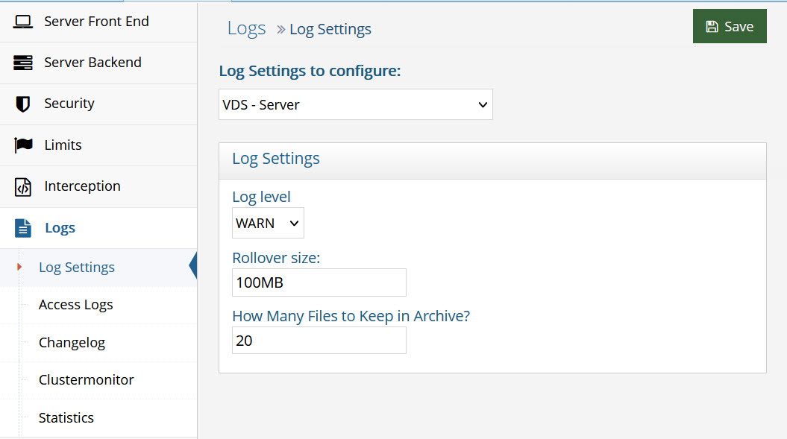

# Log Settings Commands

Log settings are managed from the Main Control Panel > Settings tab > Logs section > Log Settings, and can also be managed from command line using the <RLI_HOME>/bin/vdsconfig
utility.

Details of the logging property keys and paths to the configuration can be seen from the ZooKeeper tab.

This chapter explains how to display and update log settings using commands instead of the GUI mentioned above.

## get-logging-property

This command displays a logging configuration property.

**Usage:**
 `get-logging-property -key <key> -path <path> [-instance <instance>]`

**Command Arguments:**

` - key <key>`
 [required] The logging property key. Examples of logging property keys for RadiantOne are: server.log.level, server.log.file, and server.log.file.archive. The logging property key names can be seen from the ZooKeeper tab in the Main Control Panel as described above.

`- path <path>`
 [required] The path to the logging configuration. Examples of the path to the logging configuration are:

For RadiantOne: zk:log4j2-vds.json

For Control Panel: zk:log4j2-control-panel.json

The path to the logging configurations can be seen from the Zookeeper tab in the Main Control Panel as described above.

`- instance <instance>`
 The name of the RadiantOne instance. If not specified, the default instance named vds_server is used.

**REST (ADAP) Example**

In the following example, a request is made to display the value for the maximum size of the access log file.

`https://<rli_server_name>:8090/adap/util?action=vdsconfig&commandname=get-logging-property&key=access.log.file.maxSize&path=zk:log4j2-vds.json`

## set-logging-property

This command updates a logging configuration.

Usage:
set-logging-property -key <key> -path <path> [-instance <instance>] [-value <value>]

Command Arguments:

`- key <key>`
 [required] The logging property key. Examples of logging property keys for RadiantOne are: server.log.level, server.log.file, and server.log.file.archive. The logging property key names can be seen from the ZooKeeper tab in the Main Control Panel as described above.

`- path <path>`
 [required] The path to the logging configuration. Examples of the path to the logging configuration are:
For RadiantOne: zk:log4j2-vds.json
For Control Panel: zk:log4j2-control-panel.json

The path to the logging configurations can be seen from the ZooKeeper tab in the Main Control Panel as described above.

`- instance <instance>`
 The name of the RadiantOne instance. If not specified, the default instance named vds_server is used.

`- value <value>`
 The logging property value.

**REST (ADAP) Example**

In the following example, a request is made to set the maximum access log size to 300MB.

`https://<rli_server_name>:8090/adap/util?action=vdsconfig&commandname=set-logging-property&key=access.log.file.maxSize&path=zk:log4j2-vds.json&value=300MB`

## merge-logging-conf

This command performs a merge of two logging configurations.

**Usage:**
 `merge-logging-conf -mergepath <mergepath> - path <path> [-instance <instance>]`

**Command Arguments:**

`- mergepath <mergepath>`
 [required] The path of the JSON-formatted logging configuration to merge with.

>[!note] The value for this argument should specify the location of a logging configuration in either the file system (i.e. file:c/tmp/mylogger.json) or in Zookeeper (i.e. zk:log4j2-vds.json).

`- path <path>`
 [required] The path of the JSON-formatted logging configuration. The result of the merge operation is stored in the location specified by this argument.

>[!note] The value for this argument should specify the location of a logging configuration in either the file system (i.e. file:c/tmp/mylogger.json) or in Zookeeper (i.e. zk:log4j2-vds.json).

`- instance <instance>`
 The name of the RadiantOne instance. If not specified, the default instance named vds_server is used.

**REST (ADAP) Example**

In the following example, a request is made to merge two logging configurations.

`https://<rli_server_name>:8090/adap/util?action=vdsconfig&commandname=merge-logging-conf&mergepath=file:c:/radiantone/vds/config/logging/mylogger.json&path=zk:log4j2-vds.json`
